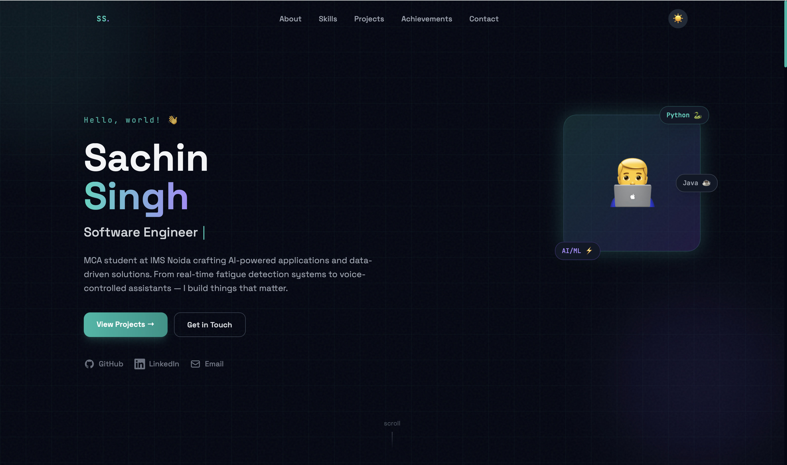
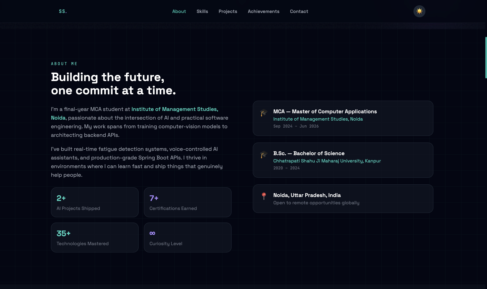
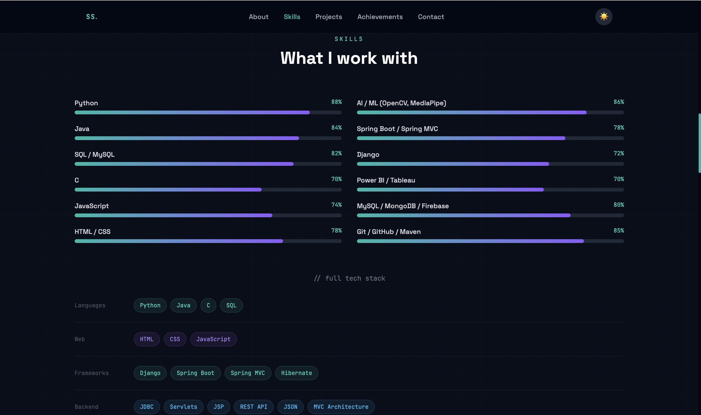
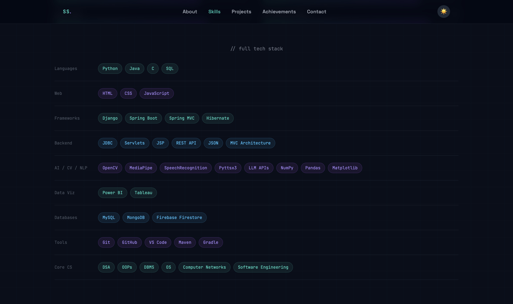
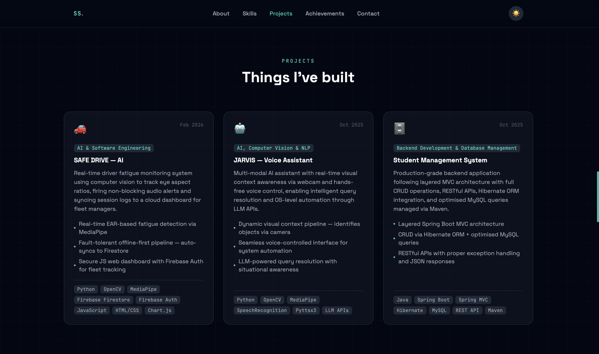
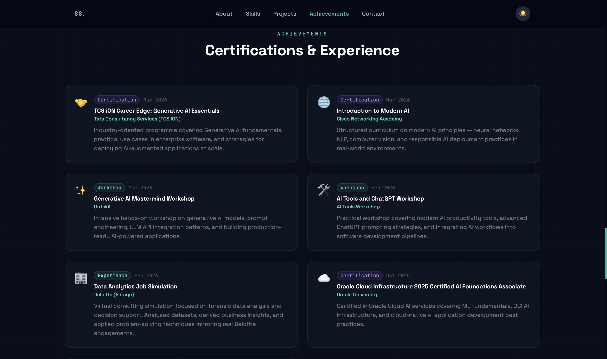
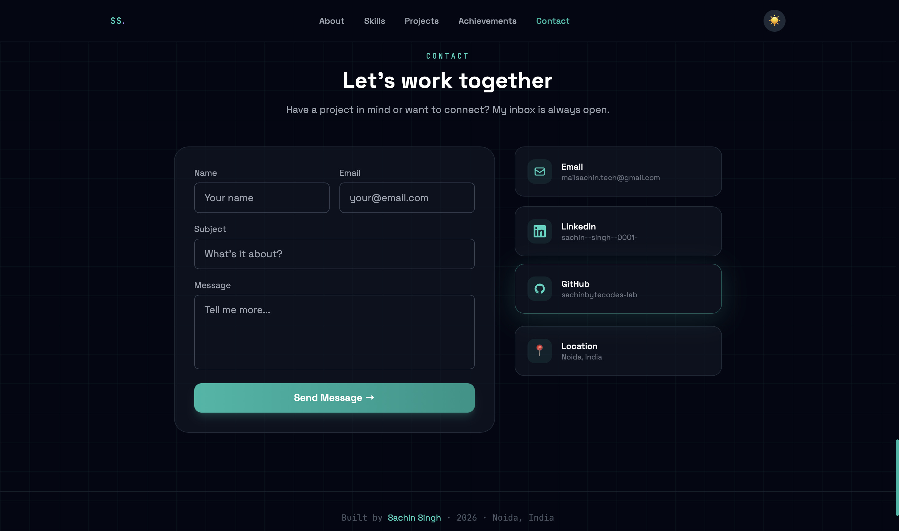

# 🚀 Day 10 - Personal Portfolio Website

# 👨‍💻 Personal Portfolio Website

A modern, responsive, and visually appealing portfolio website designed to showcase my skills, projects, certifications, and achievements.

**Developer:** Sachin Singh  
**Program:** MCA  
**Tech Stack:** HTML5 • CSS3 • JavaScript

---

## 📖 Project Overview

This project is a fully responsive portfolio website built to establish a professional online presence. It highlights my educational background, technical skills, projects, certifications, and contact information through an elegant dark-themed user interface.

---

## ✨ Features

- 🎨 Modern Dark UI Design
- 📱 Fully Responsive Layout
- 👨‍💻 Professional Hero Section
- 📚 About & Education Section
- ⚡ Technical Skills Dashboard
- 🚀 Project Showcase
- 🏆 Certifications & Achievements
- 📬 Contact Form
- 🔗 Social Media Integration

---

## 🛠️ Technologies Used

| Category | Technologies |
|-----------|-------------|
| Frontend | HTML5, CSS3, JavaScript |
| Styling | CSS Grid, Flexbox, Responsive Design |
| Version Control | Git, GitHub |
| Development Tools | VS Code |

---

# 📸 Portfolio Gallery

| Home Page | About Section |
|------------|------------|
|  |  |

| Skills Section | Full Tech Stack |
|------------|------------|
|  |  |

| Projects Section | Achievements Section |
|------------|------------|
|  |  |

| Contact Section |
|------------|
|  |

---

## 🎯 Website Sections

### 👋 Hero Section
- Personal Introduction
- Social Media Links
- Contact Buttons

### 👨‍🎓 About Section
- Educational Background
- Professional Summary
- Career Objectives

### ⚡ Skills Section
- Programming Languages
- Frameworks & Libraries
- Databases
- AI/ML Technologies
- Development Tools

### 🚀 Projects Section

#### SAFE DRIVE – AI
A real-time driver fatigue detection system using Computer Vision and MediaPipe.

#### JARVIS – Voice Assistant
An AI-powered voice-controlled assistant with real-time visual awareness.

#### Student Management System
A Spring Boot backend application featuring REST APIs and database management.

### 🏆 Achievements Section
- Oracle AI Foundations Associate
- Cisco Introduction to Modern AI
- TCS iON Generative AI Essentials
- Deloitte Data Analytics Job Simulation
- AI Workshops & Certifications

### 📬 Contact Section
- Contact Form
- Email Address
- LinkedIn Profile
- GitHub Profile
- Location Information

---

## 📚 Learning Outcomes

Through this project, I learned:

- Building responsive portfolio websites
- Creating modern UI/UX designs
- Using CSS Grid and Flexbox effectively
- Organizing project structure professionally
- Managing projects using Git and GitHub
- Implementing reusable website components

---

## 🚀 Future Enhancements

- Add advanced animations
- Integrate backend email services
- Add downloadable resume
- Deploy on GitHub Pages
- Include blog section

---

## ✅ Project Outcome

Successfully designed and developed a professional portfolio website showcasing technical skills, projects, certifications, and achievements.

---

### ⭐ Thank You For Visiting ⭐

Made with ❤️ by **Sachin Singh**

