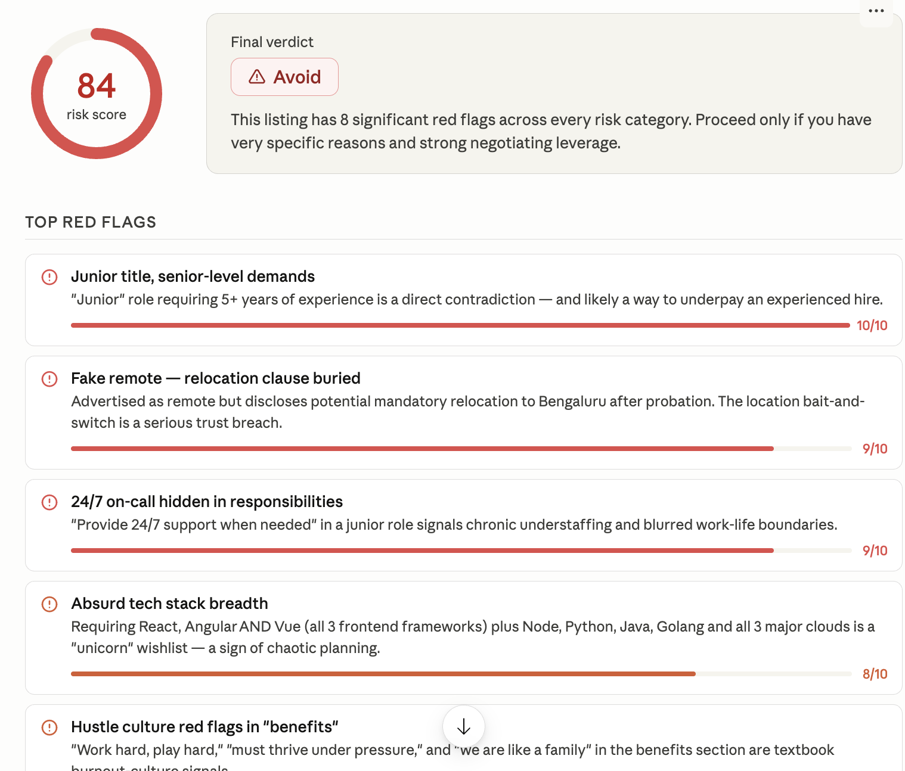
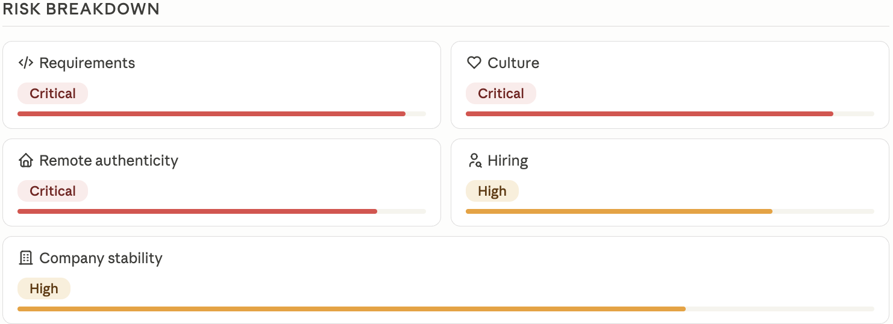
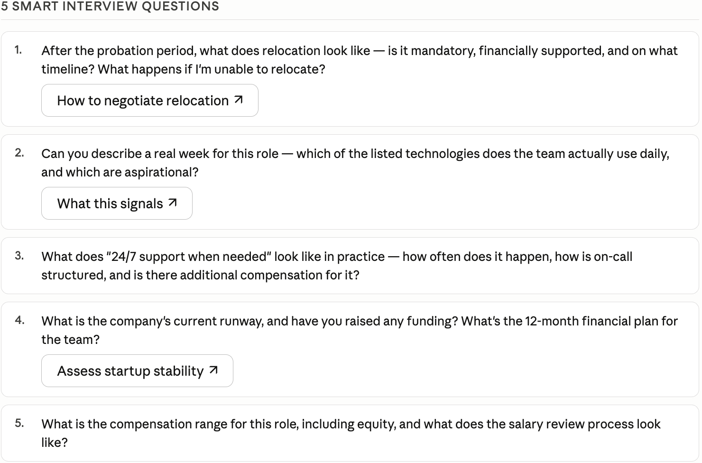
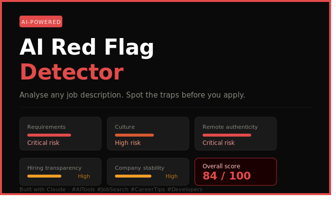

# 🚩 AI Red Flag Detector for Job Seekers

> **An AI-powered career safety tool that analyzes job descriptions and company information to uncover hidden risks before you apply.**


---

## 🌟 Overview

Finding a great job is hard.

Finding out a company is hiding unrealistic expectations, toxic culture, misleading remote policies, or unstable business practices **after** you apply is even worse.

The **AI Red Flag Detector** helps job seekers identify warning signs hidden inside job postings and company information before investing time in applications and interviews.

Simply provide:

* Job Description
* Company Information
* Employee Reviews (optional)
* Funding Details (optional)

The AI generates a detailed risk assessment report containing:

✅ Overall Risk Score

✅ Red Flag Analysis

✅ Positive Signals

✅ Category-wise Risk Breakdown

✅ Hiring Risk Assessment

✅ Interview Questions

✅ Final Recommendation

---

# 🎯 Problem Statement

Many job descriptions contain subtle warning signs that candidates often miss:

* Junior roles demanding senior-level experience
* Unrealistic technology requirements
* Hidden relocation requirements
* Excessive workload expectations
* Lack of salary transparency
* Toxic workplace culture indicators

These signals are often buried within long job descriptions and become visible only after joining.

This project automates the detection process using AI.

---

# 💡 Solution

The AI Red Flag Detector acts as a career due-diligence assistant.

It evaluates job opportunities across five critical dimensions:

| Category            | Purpose                          |
| ------------------- | -------------------------------- |
| Requirements        | Detect unrealistic expectations  |
| Culture             | Identify toxic workplace signals |
| Remote Authenticity | Verify remote work claims        |
| Hiring Transparency | Evaluate hiring process risks    |
| Company Stability   | Assess business risk indicators  |

The result is a structured report that helps candidates make informed decisions.

---

# 🏗️ System Architecture

```text
Job Description
      │
      ▼
Company Information
      │
      ▼
────────────────────────────
 AI Analysis Engine
────────────────────────────

1. Requirements Analysis
2. Culture Analysis
3. Remote Verification
4. Hiring Transparency
5. Company Stability

      │
      ▼

Risk Scoring Engine

      │
      ▼

Structured Risk Report

      ├── Risk Score
      ├── Red Flags
      ├── Positive Signals
      ├── Risk Breakdown
      ├── Final Verdict
      └── Interview Questions
```

---

# ✨ Features

| Feature                  | Description                                   |
| ------------------------ | --------------------------------------------- |
| 🎯 Risk Score            | Calculates overall job risk (0–100)           |
| 🚩 Red Flag Detection    | Identifies warning signs and assigns severity |
| ✅ Positive Signals       | Highlights genuine strengths                  |
| 📊 Risk Breakdown        | Category-wise risk analysis                   |
| ⚖ Balanced Evaluation    | Provides both positives and negatives         |
| 💬 Interview Questions   | Generates smart questions for recruiters      |
| 🖥 Interactive Dashboard | Color-coded visual report                     |
| 📈 Actionable Insights   | Helps candidates avoid risky opportunities    |

---

# 🔍 Analysis Categories

## 1. Requirements Analysis

Detects:

* Junior role requiring senior experience
* Excessive technology requirements
* Contradictory expectations
* Multiple roles merged into one position

### Example

❌ Junior Developer

Required Experience: 5+ Years

Severity: 10/10

---

## 2. Culture Analysis

Detects common toxic workplace signals:

* "Work hard, play hard"
* "Must thrive under pressure"
* "Rockstar Developer"
* "Ninja Engineer"
* "Wear many hats"
* "We are like a family"

---

## 3. Remote Authenticity

Detects:

* Hidden relocation requirements
* Hybrid policies disguised as remote
* Time-zone restrictions
* Office attendance clauses

---

## 4. Hiring Transparency

Detects:

* Missing salary range
* Vague responsibilities
* Inconsistent requirements
* Chaotic hiring signals

---

## 5. Company Stability

Analyzes:

* Company age
* Team size
* Funding information
* Employee reviews
* Growth patterns
* Layoff history indicators

---

# 📊 Risk Score Guide

| Score  | Risk Level    | Recommendation       |
| ------ | ------------- | -------------------- |
| 0–20   | Very Low Risk | ✅ Strong Apply       |
| 21–40  | Low Risk      | ✅ Apply              |
| 41–60  | Moderate Risk | ⚠ Apply with Caution |
| 61–80  | High Risk     | ⚠ Review Carefully   |
| 81–100 | Critical Risk | ❌ Avoid              |

---

# 🧪 Sample Input

## Job Description

```text
We are looking for a passionate Junior Full Stack Developer with 5+ years of experience.

Requirements:

• React, Angular, Vue
• Node.js, Python, Java, Golang
• AWS, Azure, GCP
• Docker, Kubernetes
• AI/ML experience preferred

Responsibilities:

• Build web applications
• Manage cloud infrastructure
• Design architecture
• Lead client meetings
• Mentor junior developers
• Provide 24/7 support when needed

Benefits:

• Work hard, play hard culture
• Fast-paced startup environment
• Must thrive under pressure
• We are like a family

Location: Remote (Relocation may be required)
```

## Company Information

```text
Startup founded 8 months ago

Team Size: 12

No public funding information

Recent employee reviews mention:
- Long working hours
- High workload

Salary range not disclosed

Rapid hiring phase
```

---

# 📈 Sample Output

## Overall Risk Score

84 / 100

### Final Verdict

❌ AVOID

### Top Red Flags

| Red Flag                              | Severity |
| ------------------------------------- | -------- |
| Junior title with senior expectations | 10/10    |
| Excessive technology stack            | 9/10     |
| Hidden relocation requirement         | 8/10     |
| Work hard play hard culture           | 8/10     |
| 24/7 support expectation              | 9/10     |
| Missing salary transparency           | 7/10     |

### Positive Signals

* Modern technology stack
* Remote flexibility offered
* Fast-growing company

### Critical Risk Categories

* Requirements
* Culture
* Remote Authenticity

---

# 🎤 Smart Interview Questions

The AI automatically generates questions such as:

1. What does a typical work week look like?
2. How often is after-hours support required?
3. Is relocation mandatory after probation?
4. How is success measured in this role?
5. What is the expected work-life balance?

---

# 🎓 Key Learnings

### Prompt Structure Matters

Breaking analysis into dedicated categories significantly improves consistency and quality.

### Risk Scoring Improves Decision Making

Prioritized severity ratings help users focus on the most important issues first.

### Balanced Reports Build Trust

Highlighting positive signals makes recommendations more credible.

### Visual Presentation Increases Value

Interactive dashboards improve readability and user engagement.

### Interview Questions Create Action

Insights become more useful when transformed into concrete next steps.

---

# 🚀 Future Roadmap

## Version 2

* Glassdoor review analysis
* LinkedIn company profile analysis
* Salary transparency scoring
* Resume-job matching

## Version 3

* Browser Extension
* LinkedIn Job Scanner
* One-click Risk Reports
* Job Alert Integration

## Version 4

* Personalized Career Advisor
* Offer Letter Analysis
* Company Reputation Tracking
* AI Career Coach

---

# ⚠ Limitations

* Accuracy depends on available information.
* Hidden company practices cannot always be detected.
* Risk scores are advisory, not definitive.
* Human judgment should always be used alongside AI analysis.

---

# 💼 Potential Impact

### For Job Seekers

* Avoid problematic companies
* Save application time
* Improve interview preparation

### For Career Coaches

* Faster candidate guidance
* Structured opportunity evaluation

### For Universities

* Better placement support
* Improved career readiness

---
## 📸 Screenshots

<table>
  <tr>
    <td align="center">
      <a href="./red-flags.png">
        
      </a><br>
      <b>Risk Dashboard</b>
    </td>
    <td align="center">
      <a href="./breakdown.png">
        
      </a><br>
      <b>Risk Breakdown</b>
    </td>
  </tr>
  <tr>
    <td align="center">
      <a href="./interview-questions.png">
        
      </a><br>
      <b>Interview Questions</b>
    </td>
    <td align="center">
      <a href="./linkedin-banner.jpg">
        
      </a><br>
      <b>LinkedIn Banner</b>
    </td>
  </tr>
</table>

---

# 🛠 Tech Stack

* Claude Sonnet 4.6
* Prompt Engineering
* HTML Dashboard
* CSS Styling
* SVG Banner Generation
* Structured Risk Scoring Framework

---

# 🚀 How to Use

### Step 1

Paste the system prompt into Claude.

### Step 2

Provide:

* Job Description
* Company Information

### Step 3

Review:

* Risk Score
* Red Flags
* Positive Signals
* Final Verdict
* Interview Questions

---

# 🏆 Project Highlights

✔ AI-Powered Job Analysis

✔ Career Risk Assessment

✔ Structured Scoring Framework

✔ Actionable Recommendations

✔ Interview Preparation Assistant

✔ Visual Dashboard Experience

✔ Prompt Engineering Project

✔ Portfolio-Ready AI Tool

---

## 👨‍💻 Built As Part of a 60-Day AI Challenge

**Day 14 — AI Red Flag Detector for Job Seekers**

#AITools #PromptEngineering #CareerTech #JobSearch #ArtificialIntelligence #ClaudeAI
