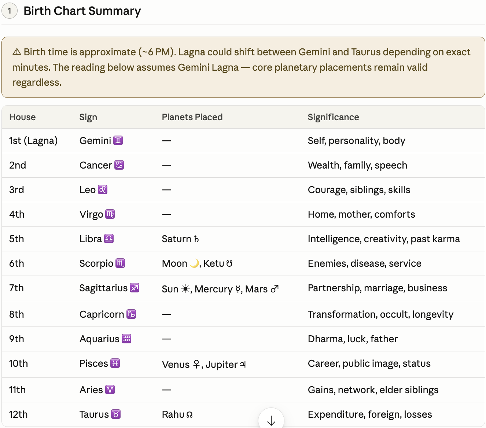
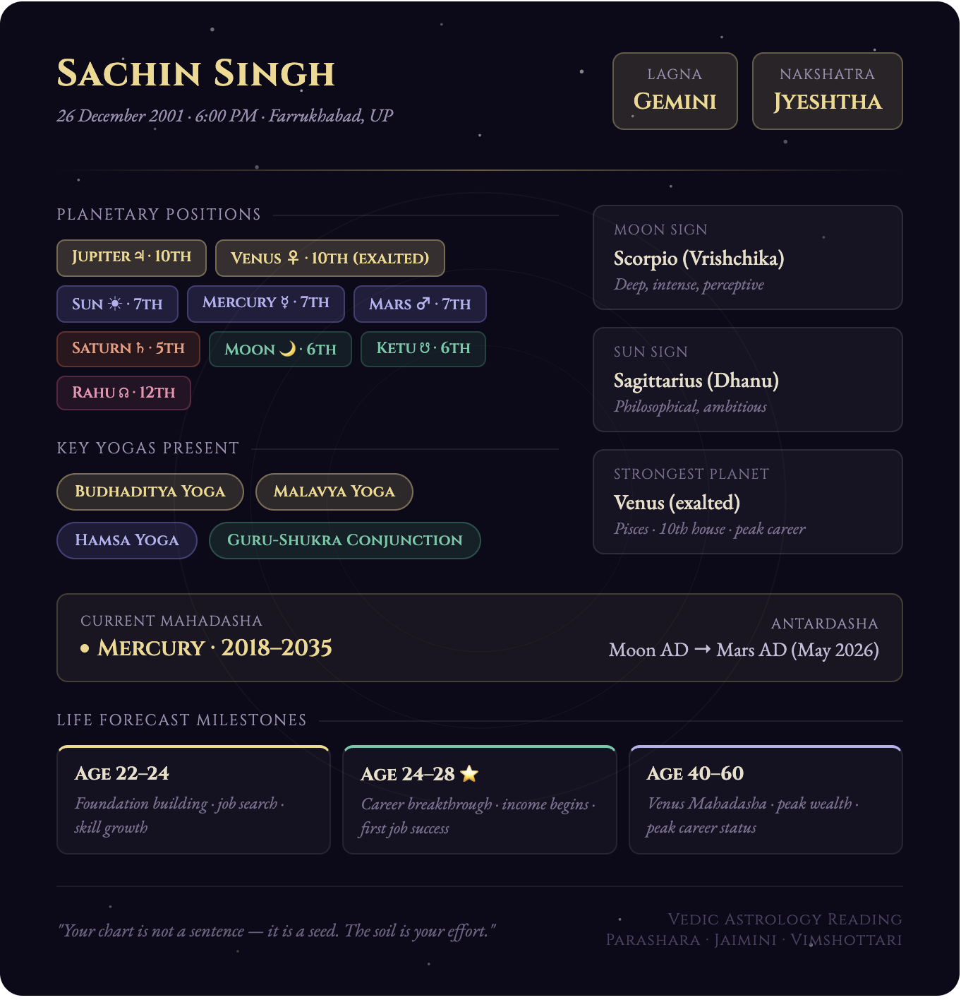
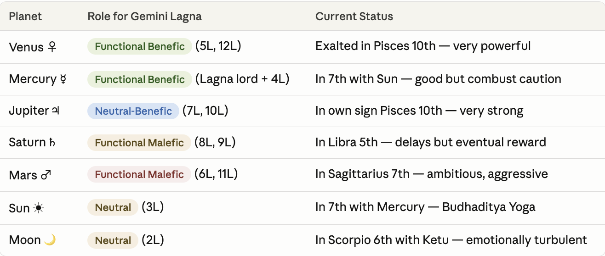
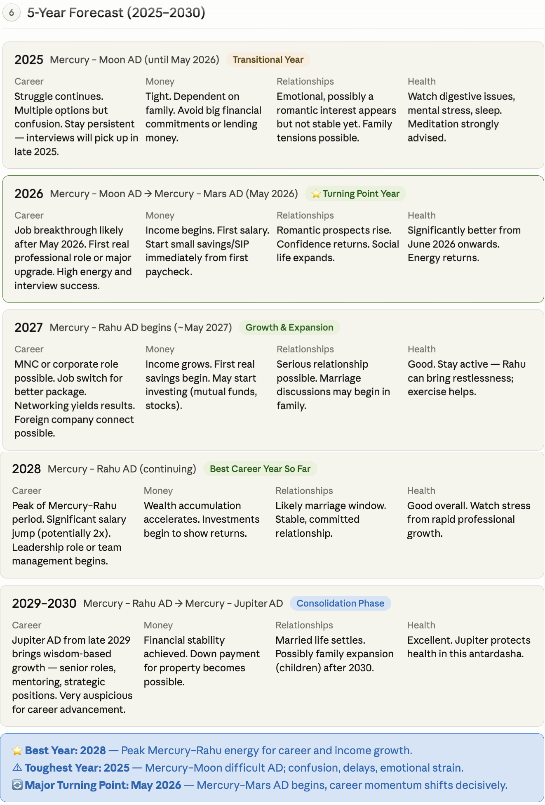
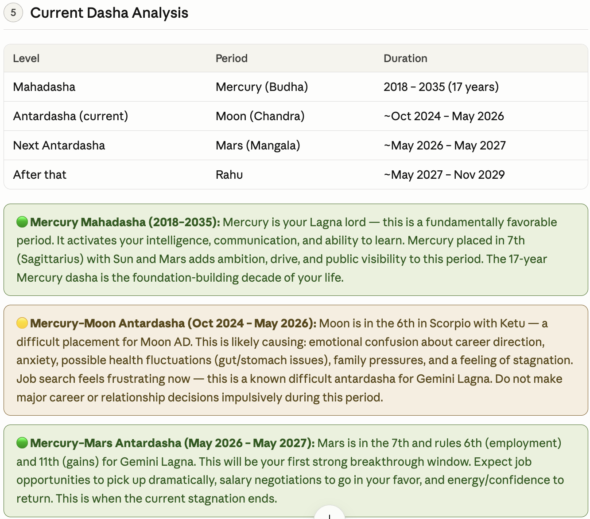

# 🔱 Vedic Astrology Birth Chart Analysis 

> A complete AI-powered Vedic astrology reading using Parashara, Jaimini, Nakshatra, Vimshottari Dasha, and Transit Analysis.

---

## 📋 Table of Contents

- [About This Project](#about-this-project)
- [Birth Details](#birth-details)
- [Screenshots](#screenshots)
- [Key Learnings](#key-learnings)
- [Astrological Highlights](#astrological-highlights)
- [Tools & Methods Used](#tools--methods-used)
- [Disclaimer](#disclaimer)

---

## About This Project

This repository documents a detailed Vedic astrology birth chart analysis conducted for **Sachin Singh**, covering career guidance, financial outlook, relationship timing, dasha analysis, and a 5-year forecast. The reading was generated using classical Vedic astrology principles and AI-assisted interpretation.

**Top Concerns Addressed:**
- Career & Education
- Financial Stability
- Family & Relationships

---

## Birth Details

| Parameter | Details |
|-----------|---------|
| **Full Name** | Sachin Singh |
| **Gender** | Male |
| **Date of Birth** | 26 December 2001 |
| **Birth Time** | 6:00 PM (Approximate) |
| **Place of Birth** | Farrukhabad, Uttar Pradesh, India |
| **Current City** | Meerut, Uttar Pradesh |
| **Relationship Status** | Single |
| **Profession** | Job Seeker |

---

## Screenshots


### Birth Chart Summary



### LinkedIn Astrology Card



### Planetary Positions Table



### 5-Year Forecast Table



### Dasha Analysis




---

## Key Learnings

### 1. Vedic vs Western Astrology
Vedic (Jyotish) astrology uses the **sidereal zodiac** (fixed stars) while Western astrology uses the tropical zodiac. This creates roughly a 23-degree difference — meaning Sun signs can differ between the two systems. Vedic astrology places greater emphasis on the **Moon sign (Rashi)** and **rising sign (Lagna)** over the Sun sign.

### 2. The Lagna (Ascendant) Is the Foundation
The Lagna defines the entire house system. For **Gemini Lagna**, Mercury becomes the chart ruler — making Mercury's strength and position critically important in every life prediction. Every planetary interpretation is filtered through the Lagna lord's condition.

### 3. Functional Benefics and Malefics Differ by Lagna
In Vedic astrology, a planet's role (benefic or malefic) depends on **which houses it rules for your specific Lagna** — not its natural quality alone. For Gemini Lagna:
- **Venus** is a functional benefic (rules 5th and 12th)
- **Mars** is a functional malefic (rules 6th and 11th)
- **Saturn** is a functional malefic (rules 8th and 9th)

This is different from natural benefics/malefics and changes the entire interpretation.

### 4. Yogas Are Powerful Combinations
Yogas are specific planetary combinations that amplify certain life outcomes. Key yogas identified in this chart:

| Yoga | Combination | Effect |
|------|-------------|--------|
| **Budhaditya Yoga** | Sun + Mercury in same house | Intelligence, communication fame |
| **Malavya Yoga** | Venus in exaltation in a Kendra | Career elegance, creative wealth |
| **Hamsa Yoga** | Jupiter in Pisces (own sign) in 10th | Wisdom, ethical career success |
| **Guru-Shukra** | Jupiter + Venus conjunction | Dual blessing in career and finances |

### 5. Vimshottari Dasha Is the Timing System
The **120-year Vimshottari Dasha** cycle is what makes Vedic astrology exceptionally precise for timing. Each planet rules a Mahadasha (major period), which is subdivided into Antardashas (sub-periods). The current **Mercury Mahadasha (2018–2035)** means Mercury's placement, strength, and lordship directly colors all life events for 17 years.

### 6. The 6th, 8th, and 12th Houses Are "Dusthanas" (Difficult Houses)
Moon + Ketu in the 6th house creates emotional turbulence, anxiety, and irregular health. However, the 6th house also governs employment and service — so it's not entirely negative. Planets in dusthanas can still produce results, just with more effort and delay.

### 7. Birth Time Accuracy Is Critical
Even a 10–15 minute difference in birth time can shift the Lagna by one sign entirely, changing house lords and all predictions. An **approximate birth time** introduces uncertainty in Lagna-specific readings. The Moon sign and nakshatra remain reliable regardless of minor time variations.

### 8. Nakshatra Provides Deeper Personality Detail
The **Jyeshtha Nakshatra** (ruled by Mercury, deity Indra) reveals:
- Natural desire for leadership and authority
- Protective instinct toward family
- Competitive, sometimes overcritical nature
- Strong career ambition with late-blooming pattern

### 9. Late Bloomer Pattern Is Chart-Specific, Not a Life Sentence
**Saturn in the 5th house** creates a classic late-bloomer signature — slow early career, delayed education success, gradual financial growth. But Saturn also rewards patience. The chart shows career acceleration between ages 27–35 and peak wealth in the 40s–50s during the Venus Mahadasha.

### 10. Remedies Work Through Psychology and Discipline
Vedic remedies (mantras, donations, gemstones) function as structured **behavioral anchors**. Chanting a Mercury mantra on Wednesday creates consistent focus and mental discipline. Donation of Moon-associated items (white rice, milk) cultivates generosity and reduces anxiety. Gemstones are the most cautious remedy and should only be used when clearly supported by the chart.

---

## Astrological Highlights

### Chart Snapshot

| Element | Placement |
|---------|-----------|
| Lagna (Ascendant) | Gemini (Mithuna) |
| Moon Sign | Scorpio (Vrishchika) |
| Sun Sign | Sagittarius (Dhanu) |
| Nakshatra | Jyeshtha, Pada 2 |
| Strongest Planet | Venus (exalted in Pisces, 10th house) |
| Weakest Placement | Moon in 6th with Ketu |

### Career Timeline

```
Age 22–24  →  Foundation & preparation (current phase)
Age 24–28  →  First breakthrough (Mercury–Mars AD, May 2026)
Age 27–32  →  Wealth growth (Mercury–Rahu AD)
Age 40–60  →  Peak career & wealth (Venus Mahadasha)
```

### Best Periods at a Glance

| Period | Age | Dasha | Theme |
|--------|-----|-------|-------|
| ⭐ Turning point | 24–25 | Mercury–Mars | First real job / career launch |
| 💰 Wealth growth | 27–32 | Mercury–Rahu | MNC / high income |
| 🏆 Life peak | 40–60 | Venus MD | Status, wealth, recognition |

### Current Phase (2025–2026)
- **Mahadasha:** Mercury (2018–2035)
- **Antardasha:** Moon (difficult — 6th house Scorpio + Ketu)
- **Outlook:** Challenging job search period ending ~May 2026 when Mars AD begins
- **Action:** Prepare, skill-build, network — breakthrough is close

---

## Tools & Methods Used

| Tool / Method | Purpose |
|---------------|---------|
| Parashara Hora Shastra | Core chart interpretation |
| Jaimini Astrology | Secondary career and spouse analysis |
| Vimshottari Dasha system | Life event timing |
| Nakshatra analysis | Personality depth and karma |
| Transit analysis | Short-term predictions |
| Claude AI (Anthropic) | Synthesis and report generation |
| Custom SVG | LinkedIn visual card creation |
| Lahiri Ayanamsa | Sidereal zodiac calculation standard |

---

## Recommended Remedies (Summary)

| Remedy | Details | Day |
|--------|---------|-----|
| **Mercury Mantra** | Om Budhaaya Namah (108x) | Wednesday |
| **Moon Mantra** | Om Som Somaaya Namah (108x) | Monday |
| **Hanuman Chalisa** | Daily recitation | Daily |
| **Emerald (Panna)** | 4–5 ratti, little finger, gold/silver | Wednesday |
| **Green Mung Dal donation** | Donate to temple or poor | Wednesday |
| **White rice / milk donation** | Moon pacification | Monday |

---

## Disclaimer

> This reading is based on Vedic astrology principles and is intended for **educational and reflective purposes only**. Astrological predictions are probabilistic, not deterministic. All major life decisions should be made based on personal judgment, professional advice, and practical circumstances. Free will remains the most powerful force shaping any life.


---

*Generated with AI-assisted Vedic astrology interpretation · June 2026*
