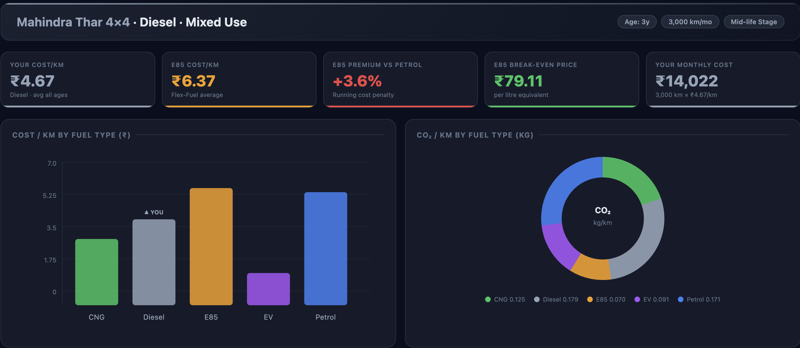
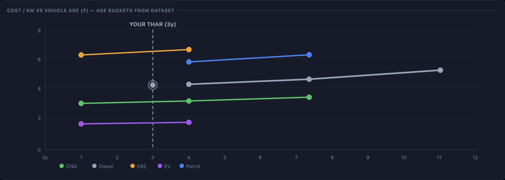
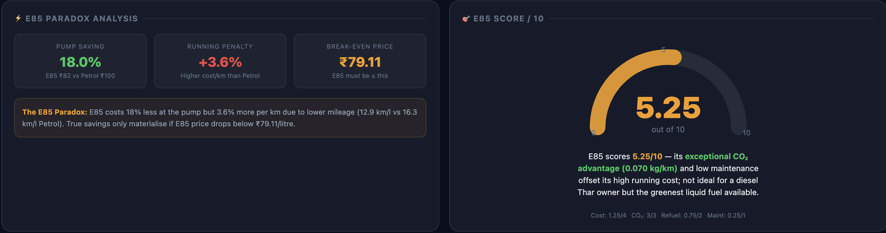
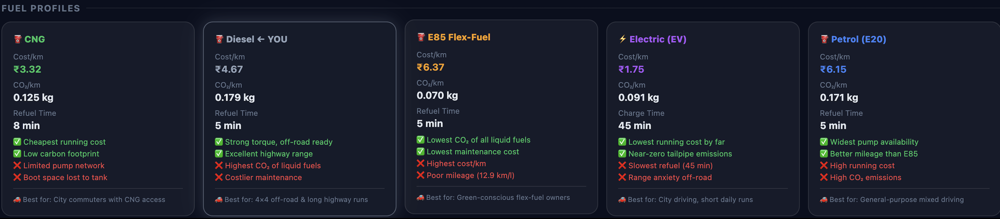

# Day 17 - Vehicle Cost Intelligence Dashboard (E85 Economics Analysis)

## 📌 Overview
Built an interactive Vehicle Cost Intelligence Dashboard using HTML, CSS, SVG, and JavaScript to compare multiple fuel types (Diesel, Petrol, E85, CNG, and EV) for a Mahindra Thar 4×4. The dashboard analyzes running costs, fuel economics, maintenance impact, CO₂ emissions, and E85 break-even scenarios.

---

## 🎯 Objectives

- Review KPI cards and vehicle operating costs.
- Compare fuel types based on cost and environmental impact.
- Analyze E85 fuel economics and break-even pricing.
- Visualize insights using SVG charts and gauges.
- Generate actionable recommendations for vehicle owners.

---

## 🛠 Technologies Used

- HTML5
- CSS3
- JavaScript
- SVG Charts
- Data Analytics
- Dashboard Design

---

## 📊 Dashboard Components

### 1. KPI Cards Analysis

Key metrics generated from dataset analysis:

| Metric | Value |
|----------|----------|
| Diesel Cost/km | ₹4.67 |
| E85 Cost/km | ₹6.37 |
| E85 vs Petrol | +3.6% Cost Penalty |
| E85 Break-even Price | ₹79.11/L |
| Monthly Running Cost | ₹14,022 |

### Key Finding

Although E85 is cheaper at the fuel station, its lower mileage results in a higher running cost per kilometer.

---

### 2. Fuel Comparison Analysis

| Fuel | Cost/km | CO₂/km |
|--------|---------|---------|
| EV | ₹1.75 | 0.091 kg |
| CNG | ₹3.32 | 0.125 kg |
| Diesel | ₹4.67 | 0.179 kg |
| Petrol | ₹6.15 | 0.171 kg |
| E85 | ₹6.37 | 0.070 kg |

### Insights

✅ EV offers the lowest operating cost.

✅ CNG provides a balance between economy and emissions.

✅ Diesel remains suitable for long-distance and off-road usage.

✅ E85 delivers the lowest liquid-fuel CO₂ emissions.

---

## 🌱 Environmental Impact Analysis

### CO₂ Emissions Ranking

1. E85 → 0.070 kg/km
2. EV → 0.091 kg/km
3. CNG → 0.125 kg/km
4. Petrol → 0.171 kg/km
5. Diesel → 0.179 kg/km

### Observation

E85 emerged as the greenest liquid fuel option despite its higher running cost.

---

## ⚡ E85 Economics Analysis

### Pump Price Advantage

- Petrol Price: ₹100/L
- E85 Price: ₹82/L

### Savings at Pump

18% cheaper than Petrol

### Running Cost Reality

- Petrol Cost/km: ₹6.15
- E85 Cost/km: ₹6.37

E85 costs approximately 3.6% more per kilometer.

### Break-even Calculation

E85 becomes economically viable only when:

**E85 Price ≤ ₹79.11/L**

Current market price remains above this threshold.

---

## 🎯 E85 Score Analysis

### Final Score

**5.25 / 10**

### Scoring Factors

| Category | Score |
|-----------|---------|
| Cost Efficiency | 1.25 / 4 |
| CO₂ Impact | 3 / 3 |
| Refueling Convenience | 0.75 / 2 |
| Maintenance | 0.25 / 1 |

### Verdict

E85 provides excellent environmental benefits but currently struggles to compete with Diesel and CNG on operating cost.

---

## 📈 SVG Chart Review

Implemented:

- Cost per Kilometer Bar Chart
- CO₂ Emission Doughnut Chart
- Vehicle Age vs Cost Trend Line Chart
- E85 Performance Gauge
- Interactive Hover Tooltips

### Learning

SVG enables lightweight, scalable, and responsive visualizations without external charting libraries.

---

## 🚗 Fuel Recommendations

### Best Overall Economy
- Electric Vehicle (EV)

### Best Balanced Option
- CNG

### Best for Off-road & Highway Driving
- Diesel

### Best Eco-friendly Liquid Fuel
- E85

### Best General Purpose Fuel
- Petrol

---

## 📚 Key Learnings

- Lower fuel price does not guarantee lower operating cost.
- Fuel efficiency significantly impacts cost/km calculations.
- Break-even analysis is essential before switching fuels.
- Environmental metrics can alter fuel selection decisions.
- SVG is powerful for creating responsive dashboards.
- Data visualization improves decision-making and insight generation.

---

## 📂 Project Deliverables

✔ Generated HTML Dashboard

✔ Dataset Analysis

✔ KPI Review

✔ Fuel Comparison Study

✔ E85 Break-even Analysis

✔ Environmental Impact Assessment

✔ SVG Charts & Gauge Visualizations

✔ Dashboard Screenshots

---

## 📸 Output Screenshots

### Dashboard Overview

### Fuel Cost Comparison

### E85 Economics Analysis

### Fuel Profile Cards

---

## 🚀 Outcome

Successfully developed a comprehensive Vehicle Cost Intelligence Dashboard that transforms raw fuel data into actionable insights. The project demonstrates data analysis, visualization, dashboard design, economic modeling, and environmental impact assessment skills through an interactive real-world use case.
