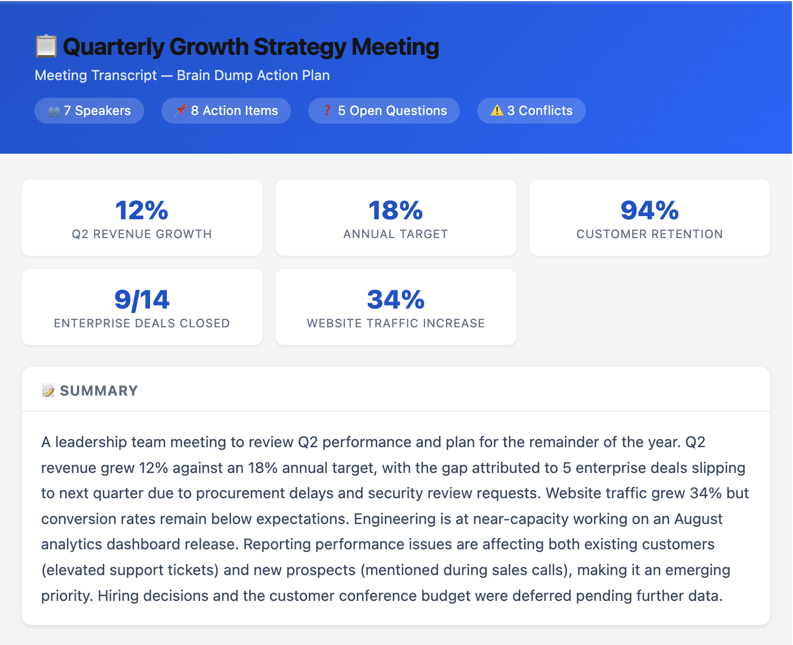
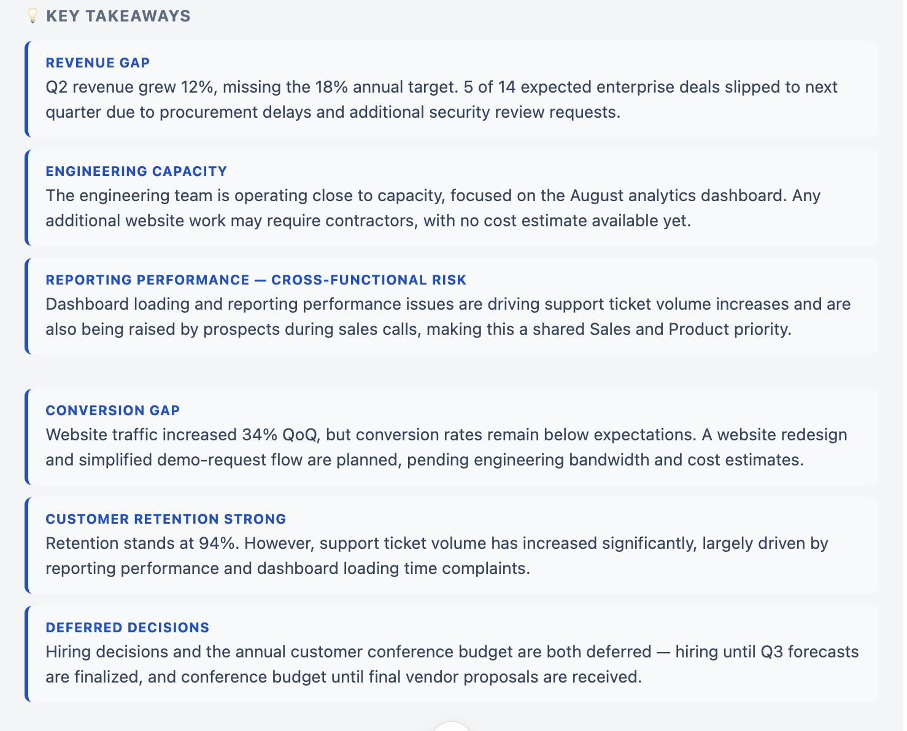
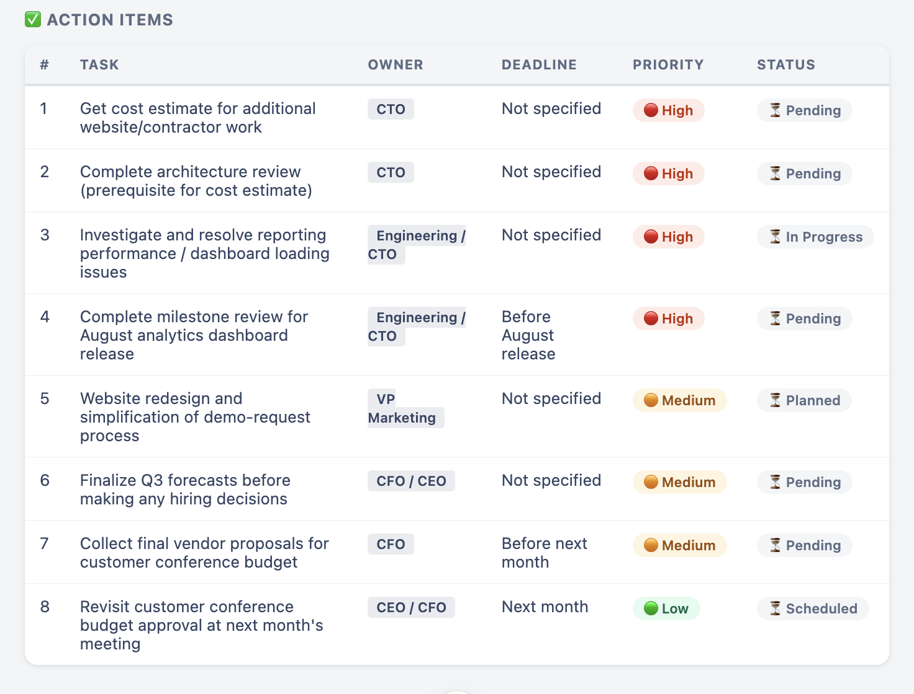
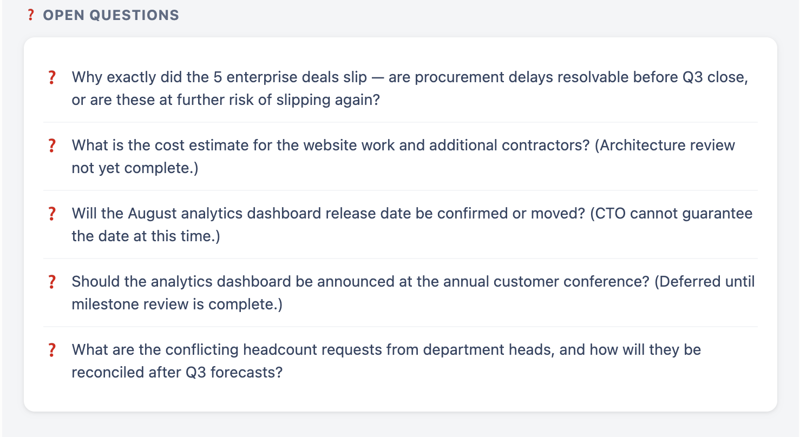
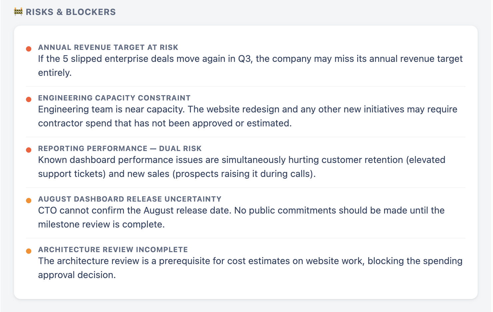
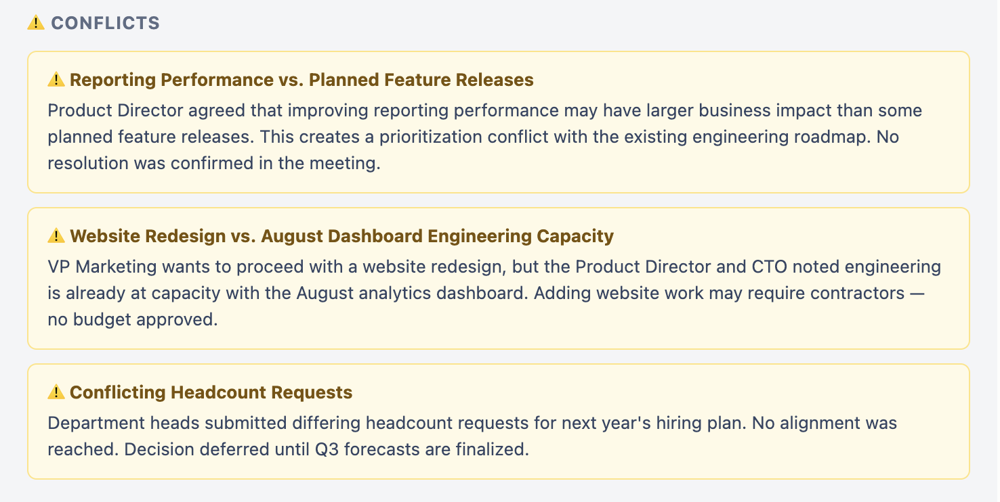
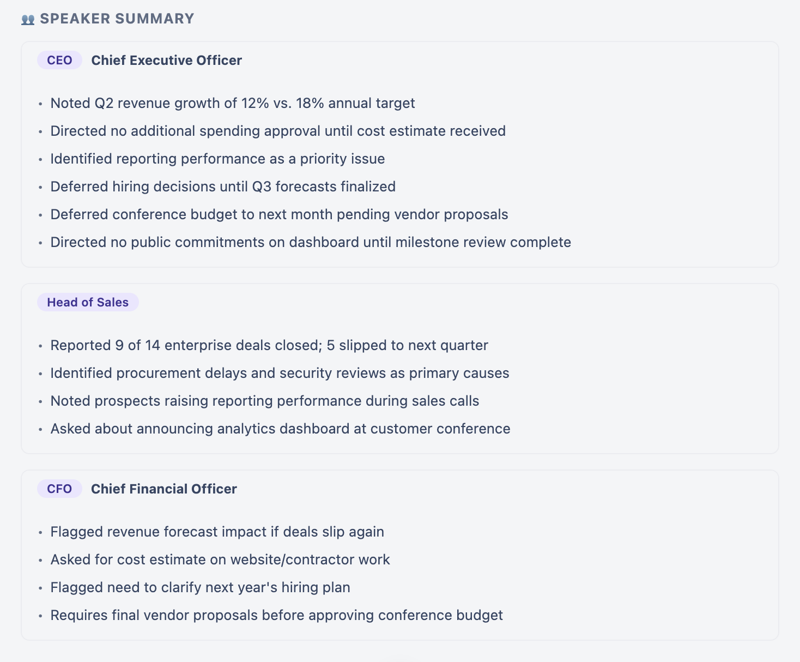

# 🧠 Brain Dump Action Planner

Transform messy notes, meeting transcripts, brainstorming sessions, voice memos, and unstructured thoughts into a professional, interactive project dashboard with summaries, action plans, risks, blockers, conflicts, and decision tracking.

Built as part of the **AB Talks 60 Days Challenge** using **Claude Custom Skills**.

---

## 🚀 Overview

Brain Dump Action Planner converts raw information into a structured dashboard without inventing or assuming missing details.

The skill analyzes:

- Meeting transcripts
- Brainstorming notes
- Voice memo transcripts
- Team discussions
- Project planning sessions
- Stream-of-consciousness notes

And generates a modern dashboard containing:

✅ Executive Summary  
✅ Key Takeaways  
✅ Action Items  
✅ Open Questions  
✅ Risks & Blockers  
✅ Conflicts  
✅ Speaker Analysis  
✅ Decision Tracking

---

## ✨ Features

### 📋 Structured Summary

Automatically generates a concise overview of the entire discussion.

---

### 💡 Key Takeaways

Highlights the most important findings, decisions, and business insights.

---

### ✅ Action Item Tracking

Creates a task management table with:

| Field | Description |
|---------|-------------|
| Task | Work to be completed |
| Owner | Responsible person |
| Deadline | Due date |
| Priority | High / Medium / Low |
| Status | Pending / In Progress / Completed |

---

### ❓ Open Questions

Captures unresolved topics and pending decisions.

---

### 🚧 Risks & Blockers

Identifies:

- Dependencies
- Operational risks
- Delivery blockers
- Business concerns

---

### ⚠️ Conflict Detection

Highlights conflicting:

- Priorities
- Deadlines
- Ownership
- Resource allocations
- Decisions

---

### 🎤 Speaker Analysis

For transcript-based meetings:

- Speaker summaries
- Decisions by speaker
- Action items by speaker
- Attribution notes

---

### 📱 Responsive Dashboard

Designed to feel like:

- Notion
- ClickUp
- Linear
- Asana
- Airtable

Features:

- Modern cards
- Status badges
- Responsive layouts
- Interactive sections
- Clean visual hierarchy

---

## 🛠 Skill Configuration

### Skill Name

```text
brain-dump-action-planner
```

### Description

```text
Transform messy notes, meeting transcripts, voice memos, brainstorming sessions, and stream-of-consciousness thoughts into structured summaries, action plans, decisions, open questions, and task lists.

Organize information clearly without inventing, assuming, or filling gaps.

Preserve all names, dates, numbers, and terminology exactly as provided.
```

---

# 📸 Screenshots

## Dashboard Overview

Displays:

- Meeting Metrics
- Growth Indicators
- Summary Section



---

## Key Takeaways

Highlights major discussion outcomes and business insights.



---

## Action Items

Interactive task tracking table with ownership and priorities.



---

## Open Questions

Lists unresolved decisions and pending discussions.



---

## Risks & Blockers

Displays operational and business risks affecting execution.



---

## Conflicts

Identifies conflicts across priorities, resources, and timelines.



---

## Speaker Summary

Provides speaker-wise breakdown of discussions and decisions.



---

# 🧪 Test Scenario

### Input

Quarterly Growth Strategy Meeting Transcript

Included:

- Revenue discussions
- Sales updates
- Engineering capacity concerns
- Budget decisions
- Hiring plans
- Customer retention metrics

---

### Generated Output

Produced:

- Executive Summary
- Key Takeaways
- 8 Action Items
- 5 Open Questions
- 5 Risks & Blockers
- 3 Business Conflicts
- Speaker Analysis

All information remained directly traceable to the original transcript.

No assumptions were introduced.

---

# 📚 Key Learnings

### 1. Structured Extraction Improves Clarity

Large transcripts become significantly easier to understand when transformed into categorized sections.

---

### 2. Action Ownership Matters

Tasks become more actionable when ownership and status are clearly identified.

---

### 3. Conflict Visibility Prevents Execution Issues

Surfacing conflicting priorities early helps teams avoid project delays.

---

### 4. Speaker Attribution Adds Accountability

Tracking decisions by speaker improves follow-up and accountability.

---

### 5. Zero-Assumption Processing Builds Trust

Preserving source information without inventing missing details produces more reliable outputs.

---

# 🎯 Use Cases

- Executive Meetings
- Product Planning
- Sprint Retrospectives
- Client Calls
- Team Standups
- Brainstorming Sessions
- Voice Memo Analysis
- Research Notes
- Project Kickoffs
- Strategy Reviews

---

# 🔒 Core Principle

> Never invent values.
>
> Never fill missing information.
>
> Never resolve conflicts automatically.
>
> Everything displayed must originate from the provided notes.

---

# 🏆 Outcome

Successfully created a reusable Claude Custom Skill capable of converting unstructured information into a professional project-management dashboard, enabling faster decision-making, better accountability, and improved meeting execution.

---
