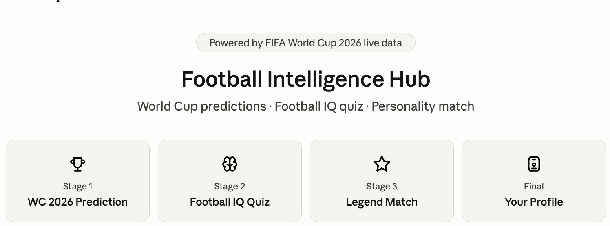
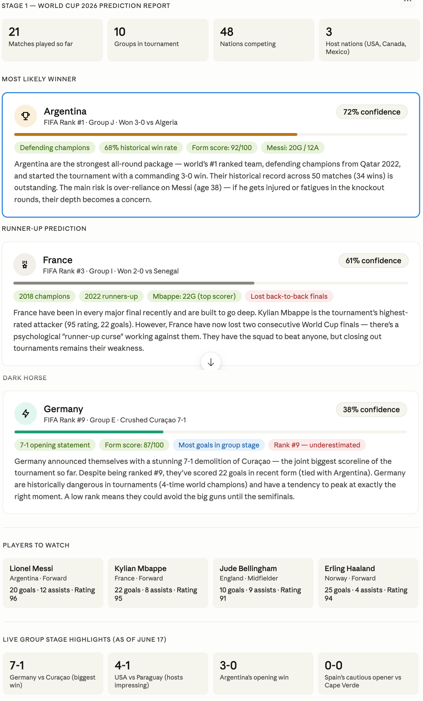
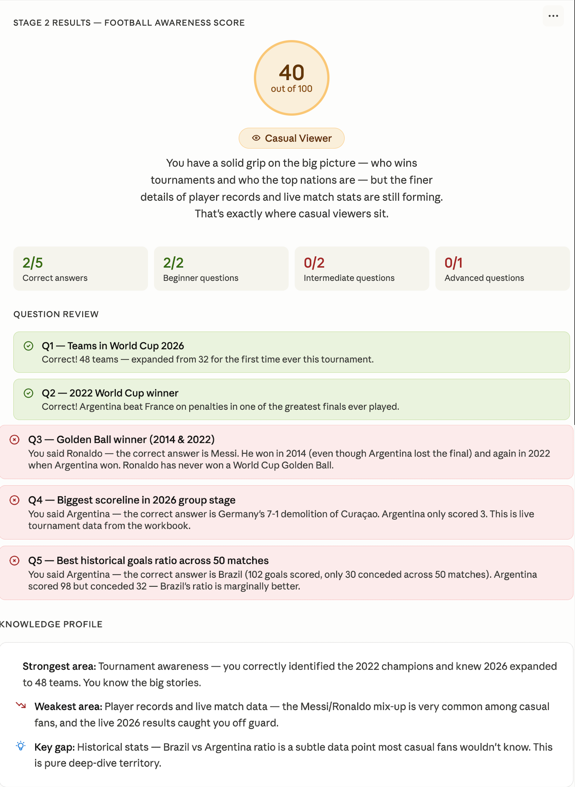

# ⚽ Football Intelligence Hub – FIFA World Cup 2026 Analysis

## 📌 Overview
Football Intelligence Hub is an interactive football analytics experience that combines World Cup predictions, football knowledge assessment, and player personality matching into a single platform.

This project analyzes FIFA World Cup 2026 data, evaluates football awareness through quizzes, and generates a personalized Football Intelligence Profile.

---

## 🎯 Objectives

- Predict the FIFA World Cup 2026 winner
- Analyze tournament statistics and trends
- Evaluate football knowledge through an IQ Quiz
- Generate a personalized football profile
- Match users with legendary football personalities

---

## 🚀 Features

### 🏆 Stage 1 – World Cup 2026 Prediction
- Tournament overview
- Winner prediction analysis
- Runner-up prediction
- Dark horse team analysis
- Players to watch
- Live group stage highlights

### 🧠 Stage 2 – Football IQ Quiz
- Football knowledge assessment
- Beginner, Intermediate, and Advanced questions
- Score calculation
- Detailed answer review
- Strength and weakness analysis

### ⭐ Stage 3 – Legend Match
- Football personality assessment
- Playing style evaluation
- Legendary footballer comparison

### 👤 Final Profile
- Combined intelligence score
- Football awareness level
- Personalized football profile

---

## 📊 Stage 1 Results

### 🏆 Predicted Winner
**Argentina**  
Confidence Score: **72%**

**Reasons**
- Defending World Champions
- FIFA Rank #1
- Strong historical win rate
- Excellent recent form
- Lionel Messi leadership

### 🥈 Runner-Up Prediction
**France**  
Confidence Score: **61%**

**Reasons**
- Consistent tournament performances
- Strong attacking squad
- Kylian Mbappé impact

### 🌟 Dark Horse
**Germany**  
Confidence Score: **38%**

**Reasons**
- Strong attacking form
- Biggest group-stage victory
- Tournament pedigree

---

## 📈 Tournament Highlights

| Statistic | Value |
|------------|--------|
| Matches Played | 21 |
| Groups | 10 |
| Teams | 48 |
| Host Nations | 3 |
| Biggest Win | Germany 7–1 Curaçao |
| Host Highlight | USA 4–1 Paraguay |

---

## 🧠 Stage 2 Results – Football Awareness Score

### Score
**40 / 100**

### Category
**Casual Viewer**

### Performance Breakdown

| Category | Result |
|-----------|---------|
| Correct Answers | 2 / 5 |
| Beginner Questions | 2 / 2 |
| Intermediate Questions | 0 / 2 |
| Advanced Questions | 0 / 1 |

---

## ✅ Correct Answers

### Q1 – Teams in World Cup 2026
48 teams will participate in the tournament.

### Q2 – 2022 FIFA World Cup Winner
Argentina defeated France to win the World Cup.

---

## ❌ Incorrect Answers

### Q3 – Golden Ball Winner (2014 & 2022)
Correct Answer: **Lionel Messi**

### Q4 – Biggest Scoreline in 2026 Group Stage
Correct Answer: **Germany 7–1 Curaçao**

### Q5 – Best Historical Goals Ratio
Correct Answer: **Brazil**

---

## 📋 Knowledge Profile

### 💪 Strongest Area
Tournament awareness and major World Cup events.

### ⚠️ Weakest Area
Player records and live tournament statistics.

### 🔍 Key Learning
Historical football statistics require deeper analysis beyond mainstream football knowledge.

---

## 📸 Screenshots

### Home Dashboard

---

### World Cup Prediction Report

---

### Football Awareness Score

---

## 🎓 Key Learnings

- FIFA World Cup 2026 expands to 48 teams.
- Historical data significantly influences tournament predictions.
- Football analytics combines statistics, rankings, and recent performance.
- Knowledge assessments help identify strengths and improvement areas.
- Personalized football profiling creates a more engaging fan experience.

---

## 🛠️ Tools Used

- Claude AI
- FIFA World Cup 2026 Dataset
- Football Intelligence Hub Workbook
- GitHub

---

## ✨ Outcome

Successfully completed the Football Intelligence Hub workflow, analyzed FIFA World Cup 2026 predictions, assessed football awareness, and generated a personalized football intelligence profile.
