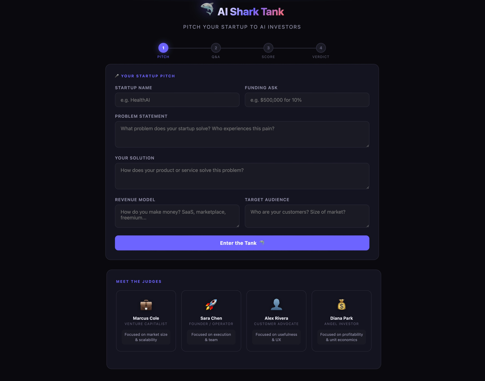
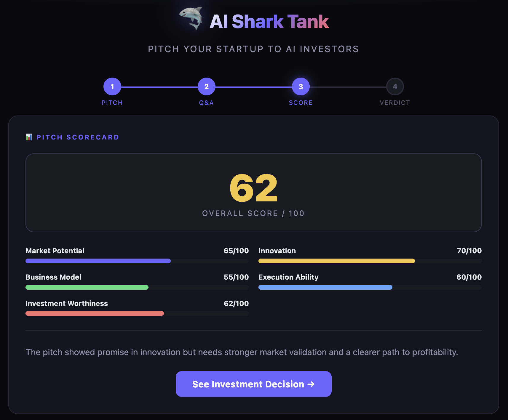
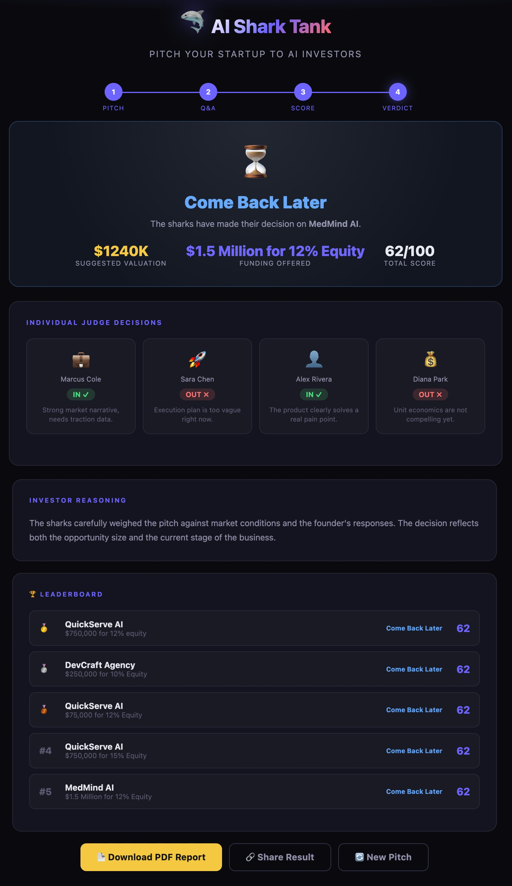

# 🦈 AI Shark Tank Simulator

> **Day 25 - AB Talks 60 Days Challenge**

An interactive AI-powered **Shark Tank Simulator** where entrepreneurs can pitch their startup ideas, answer investor questions, receive AI-generated feedback, investment scores, funding recommendations, and download a professional pitch report.

---

## 📌 Project Overview

The AI Shark Tank Simulator recreates a realistic startup investment experience.

Users can:

- 🚀 Pitch their startup
- 🤖 Face AI investor questions
- 💬 Answer live Q&A sessions
- 📊 Receive a detailed scorecard
- 💰 Get funding recommendations
- 📄 Download a professional PDF report
- 🏆 Compare results on a leaderboard

---

# ✨ Features

- Interactive startup pitch form
- AI-powered investor panel
- Multi-round investor Q&A
- Real-time scoring system
- Startup evaluation dashboard
- Investment verdict generation
- Suggested startup valuation
- Funding recommendation
- Individual investor decisions
- Leaderboard system
- PDF report generation
- Responsive UI
- Modern dark theme

---

# 🛠 Tech Stack

| Technology | Usage |
|------------|-------|
| HTML5 | Structure |
| CSS3 | Styling |
| JavaScript (ES6) | Application Logic |
| Claude AI API | AI Investor Responses |
| jsPDF | PDF Report Generation |
| LocalStorage | Leaderboard |

---

# 💡 Startup Used

## Startup Name

**MedMind AI**

### Problem

Healthcare professionals spend significant time on documentation and administrative work, reducing patient care efficiency.

### Solution

An AI-powered clinical assistant that automates:

- Clinical documentation
- Patient history summarization
- Diagnosis suggestions
- Drug interaction detection
- EHR integration

### Revenue Model

- SaaS Subscription
- Enterprise Licensing
- API Access
- AI Analytics
- Premium Modules

### Funding Ask

**$1.5 Million for 12% Equity**

---

# 📊 AI Evaluation Results

| Category | Score |
|----------|------:|
| Market Potential | 65/100 |
| Innovation | 70/100 |
| Business Model | 55/100 |
| Execution Ability | 60/100 |
| Investment Worthiness | 62/100 |

## ⭐ Overall Score

# **62 / 100**

---

# 💰 Investment Decision

**Verdict**

> ⏳ Come Back Later

### Suggested Valuation

**$1.24 Million**

### Funding Requested

**$1.5 Million for 12% Equity**

---

# 👨‍⚖️ Individual Judge Decisions

| Judge | Decision |
|-------|----------|
| Marcus Cole | ✅ IN |
| Sara Chen | ❌ OUT |
| Alex Rivera | ✅ IN |
| Diana Park | ❌ OUT |

---

# 📄 Generated Report

The simulator automatically generates a professional PDF report containing:

- Startup Summary
- Problem Statement
- Solution
- Revenue Model
- Target Audience
- Funding Ask
- AI Scorecard
- Investment Verdict
- Valuation
- Funding Recommendation

---

# 🖼 Screenshots

---

## 🚀 Startup Pitch

---

## 📊 Pitch Scorecard

---

## 🦈 Final Verdict

---
# 🎯 Key Learnings

During this project I learned:

- Building single-page applications using Vanilla JavaScript
- Managing application state
- Dynamic DOM manipulation
- AI prompt engineering
- Working with Claude AI APIs
- JSON parsing and validation
- Interactive chat interfaces
- Score calculation systems
- PDF generation using jsPDF
- LocalStorage for persistent data
- Responsive UI design
- User experience improvements
- Component-based architecture
- Error handling and fallback responses

---

# 🚀 Future Improvements

- Voice pitch support
- Authentication system
- Database integration
- Startup history
- Investor profiles
- Pitch analytics dashboard
- Charts & graphs
- Startup comparison
- Team collaboration
- Export reports in multiple formats
- Cloud deployment
- Real-time AI streaming

---

# 📚 Challenge Information

**Challenge**

AB Talks — 60 Days Challenge

**Day**

25

**Project**

AI Shark Tank Simulator

---

# ⭐ If you like this project

Give this repository a ⭐ on GitHub.
