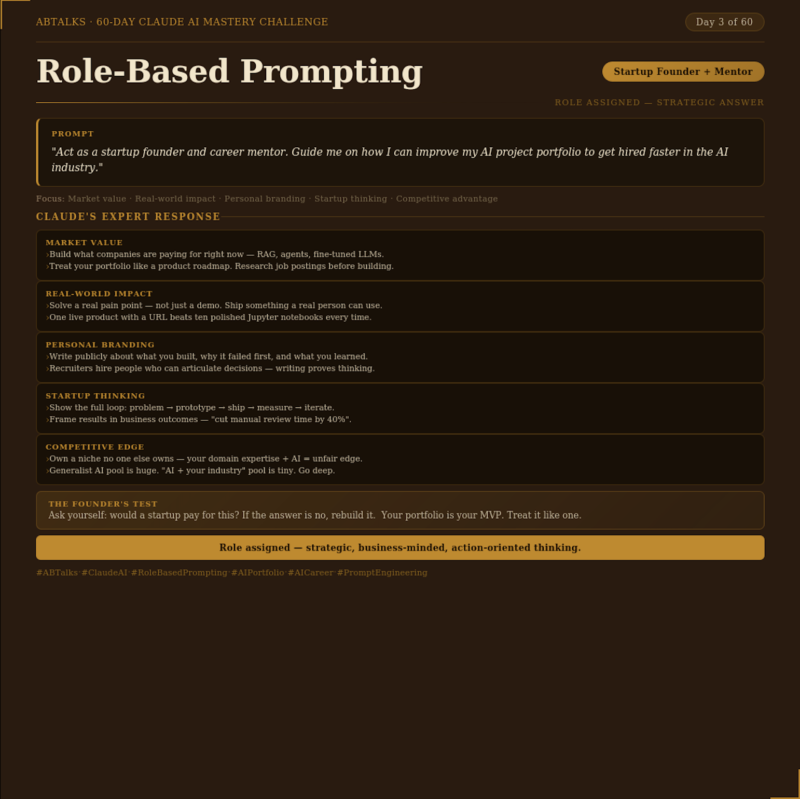
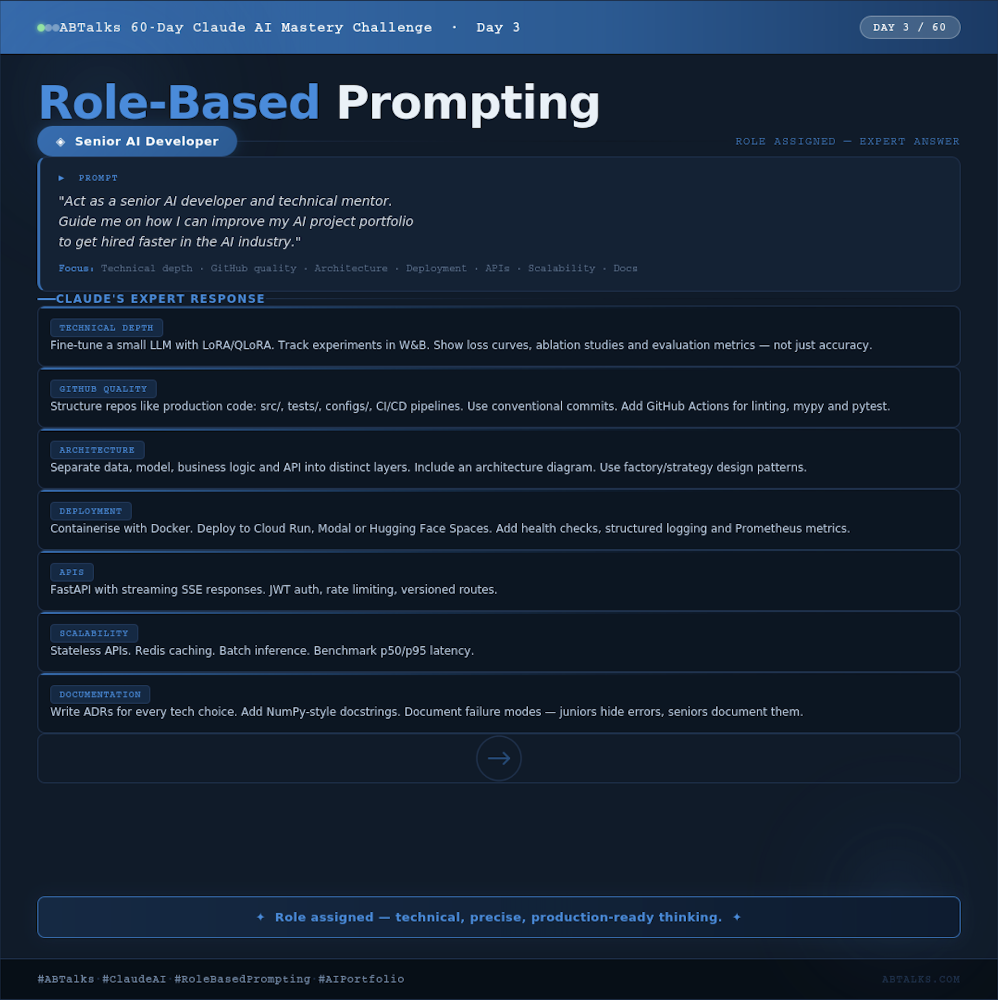

# 🎭 Day 3 — Role-Based Prompting

## 🎯 Objective

Learn how **Role-Based Prompting** improves AI-generated responses by assigning a specific persona or role to the AI.

---

## 🤔 What is Role-Based Prompting?

Role-Based Prompting is a prompt engineering technique where you **assign a role (persona) to the AI** before asking a question.

### Example

| | Prompt |
|---|---|
| ❌ **Without Role** | *"How can I improve my AI project portfolio to get hired faster?"* |
| ✅ **With Role** | *"Act as a Senior AI Developer and technical mentor. Guide me on how I can improve my AI project portfolio to get hired faster in the AI industry."* |

> The AI then responds from the **perspective of that role**, providing more focused, relevant, and professional answers.

---

## ✅ Benefits of Role-Based Prompting

1. ⚡ Faster and more relevant answers
2. 🗣️ Uses domain-specific vocabulary
3. 🧠 Produces expert-level insights
4. ✂️ Reduces the need for manual editing
5. 🔁 Creates reusable prompt templates

---

## 🔄 Prompt Comparison

### Prompt 1 — No Role

```
How can I improve my AI project portfolio to get hired faster?
```

**Output Summary:**
- Add more GitHub projects
- Use popular frameworks
- Improve README files
- Network on LinkedIn
- Apply for relevant jobs

> 🔍 **Observation:** The answer was **generic and surface-level**.

---

### Prompt 2 — Senior AI Developer Role

```
Act as a senior AI developer and technical mentor. Guide me on how I can
improve my AI project portfolio to get hired faster in the AI industry.
```

**Output Summary:**
- Fine-tune small LLMs using LoRA/QLoRA
- Structure repositories professionally
- Implement CI/CD pipelines
- Use Docker for deployment
- Build APIs with FastAPI
- Focus on scalability and documentation

> 🔍 **Observation:** The answer was **technical, specific, and industry-focused**.

---

## 💡 Key Learning

> The **quality of AI output depends heavily on the role assigned** in the prompt.
>
> A generic prompt produces broad advice, while a role-based prompt generates **expert-level guidance** tailored to a specific domain.

---

## 🔑 Biggest Observation

Using a persona **transforms AI from a general assistant into a domain expert**.

The same question can generate **significantly different outputs** depending on the assigned role.

---

# Screenshots

## Role-Based Prompting Overview


## No Role Prompt Output


## Founder Persona Output


## Developer Persona Output


---

## 📝 Conclusion

Role-Based Prompting is one of the **simplest and most effective prompt engineering techniques**.

Assigning a role helps generate **precise, contextual, and actionable responses** that align with the expertise of the chosen persona.

---

<div align="center">
  <sub>📅 Day 3 of Prompt Engineering Series</sub>
</div>
