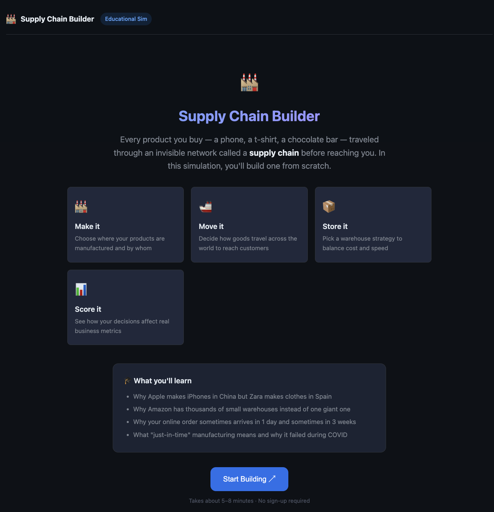
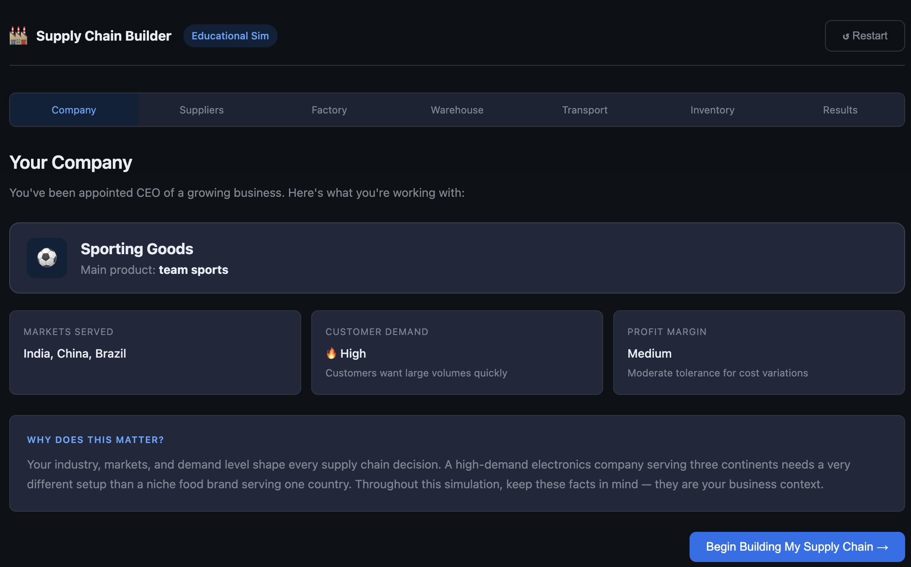
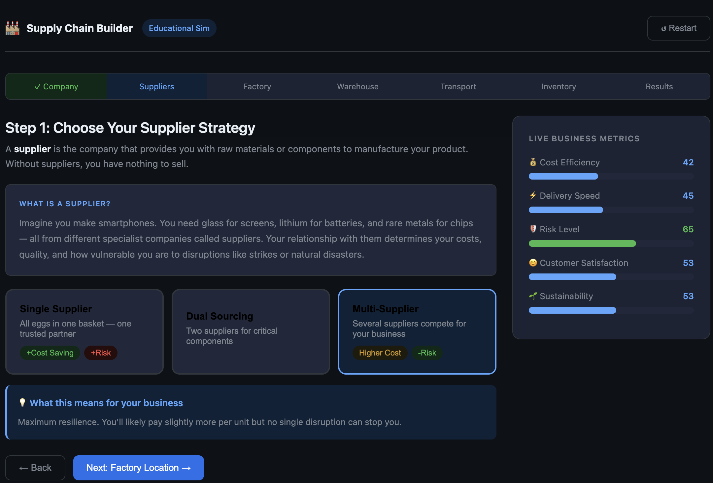
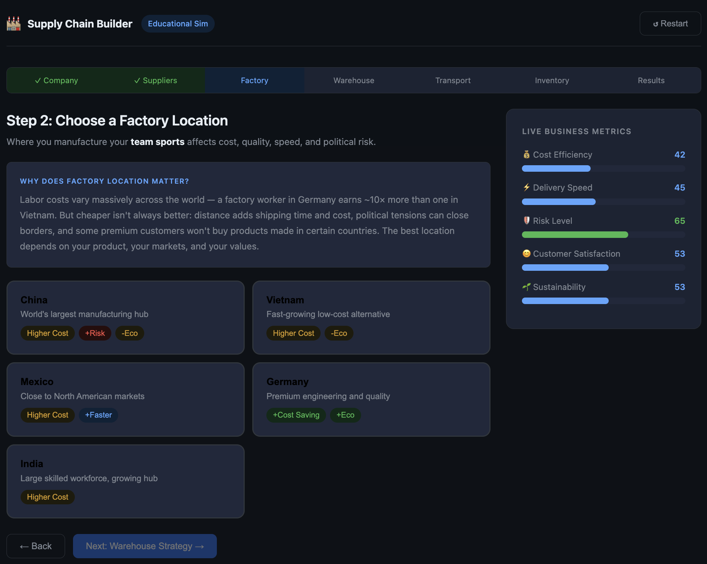
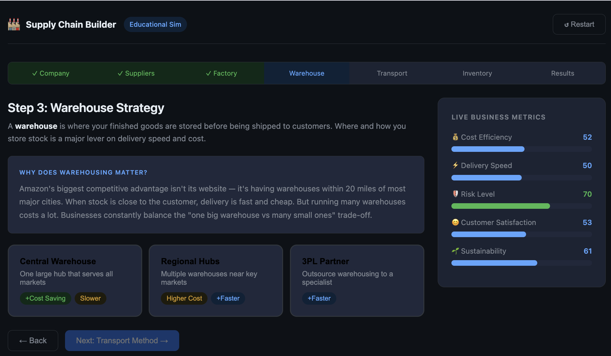
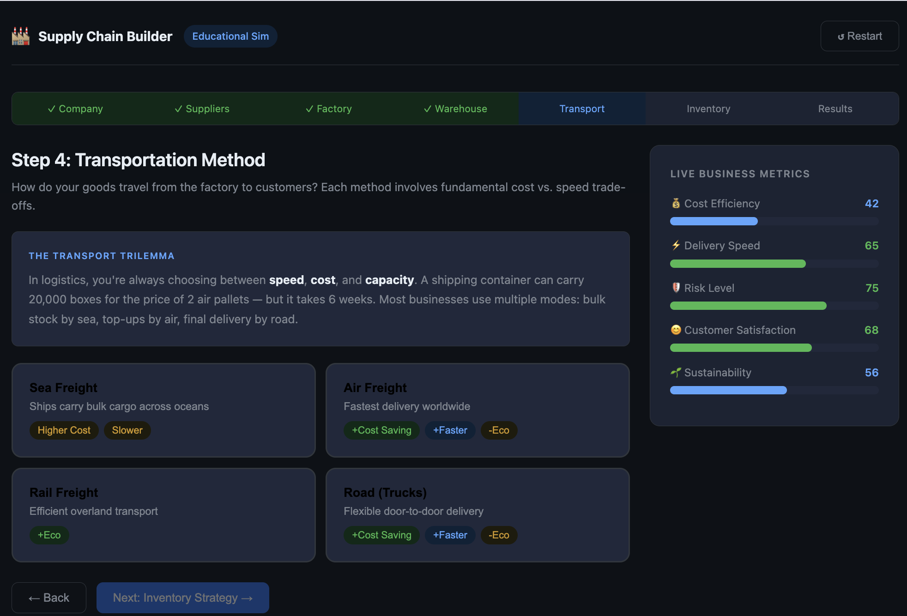
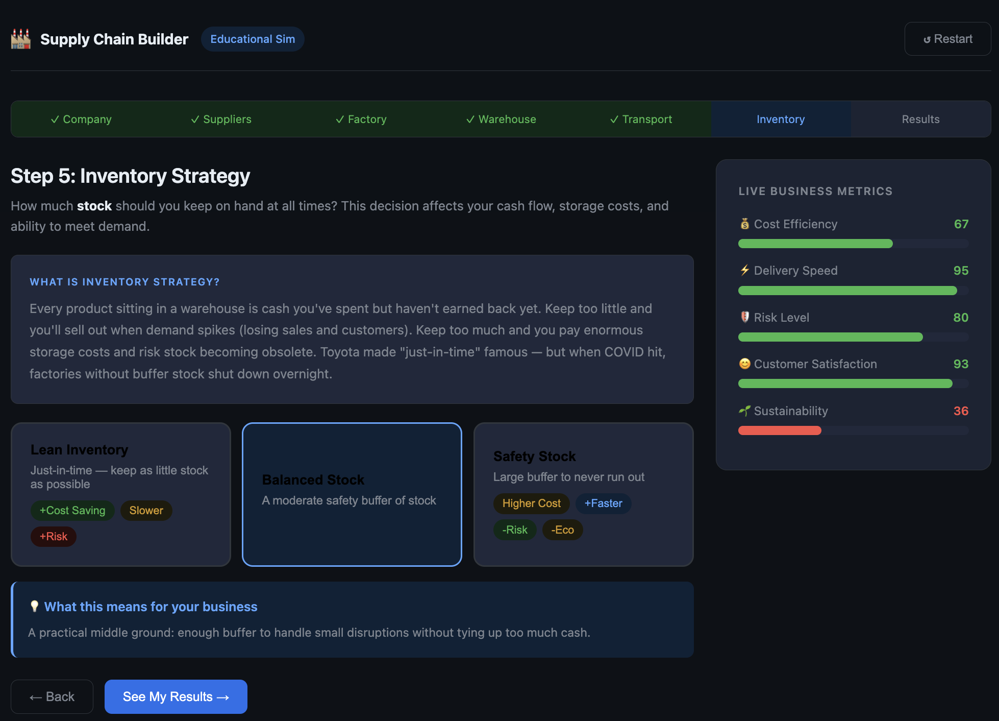
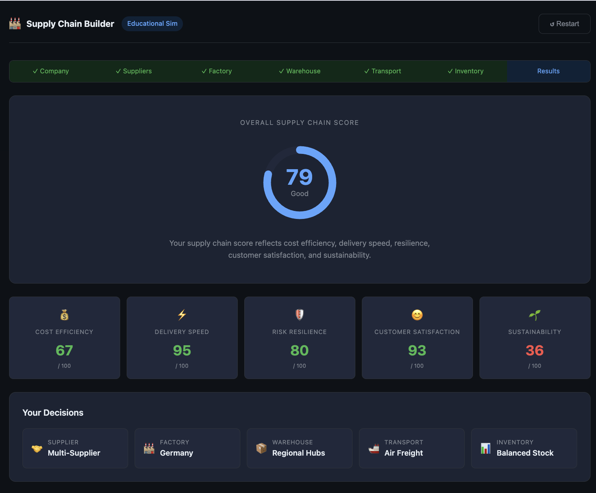
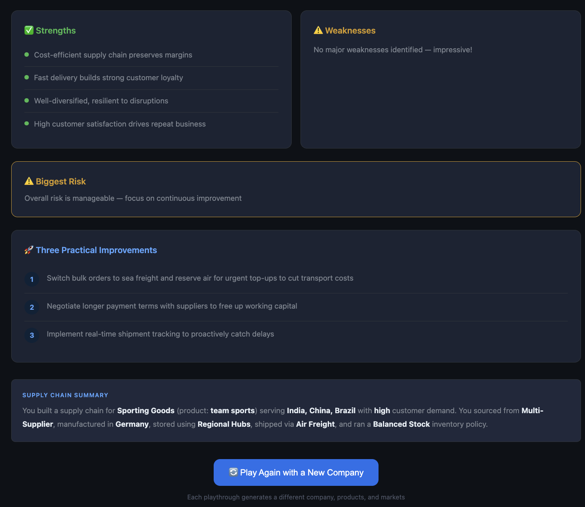

# 🏭 Supply Chain Builder

> An interactive educational simulation that teaches the fundamentals of Supply Chain Management through a beginner-friendly decision-making game.


---

# 📖 About The Project

**Supply Chain Builder** is a fully interactive educational simulation that explains how modern supply chains work.

Instead of reading theory, users **learn by making real business decisions** while building a company's complete supply chain from scratch.

Every decision immediately affects important business metrics such as:

- 💰 Cost Efficiency
- ⚡ Delivery Speed
- 🛡 Risk
- 😊 Customer Satisfaction
- 🌱 Sustainability

The application is designed so that even someone with **zero knowledge of supply chains** can understand the complete process in a fun and interactive way.

---

# 🎯 Challenge Objective

This project was built as part of an AI-powered frontend challenge.

The objective was to generate a **complete offline educational simulation** using only prompt engineering.

The AI was instructed to generate:

- Complete UI
- Business logic
- Interactive gameplay
- Educational explanations
- Premium dashboard
- Responsive layout

without using any backend.

---

# 📌 Original Task

The AI was instructed to build:

- Complete Single File HTML Application
- React via CDN
- Babel JSX
- Pure HTML
- CSS
- JavaScript
- Offline support
- Responsive UI
- Dark Theme
- Premium Dashboard
- Reusable React Components
- State Management using React Hooks
- Random Company Generator
- Live Business Metrics
- Animated Progress Bars
- Supply Chain Score
- Practical Business Recommendations
- Replay Functionality

---

# 🚀 Features

## 🏭 Interactive Supply Chain Simulation

Build a company's supply chain step-by-step.

---

## 🎲 Random Company Generator

Each playthrough creates a completely new company including:

- Industry
- Product
- Markets
- Customer Demand
- Business Context

---

## 📚 Educational Experience

Before every decision the simulator explains:

- What the concept means
- Why it matters
- Real business examples
- Advantages
- Disadvantages
- Trade-offs

Making the project beginner friendly.

---

## ⚙ Supply Chain Decisions

Players choose:

- Supplier Strategy
- Factory Location
- Warehouse Strategy
- Transportation Method
- Inventory Strategy

Every decision updates the business metrics instantly.

---

## 📊 Live Business Dashboard

Real-time metrics include:

- Cost Efficiency
- Delivery Speed
- Risk Level
- Customer Satisfaction
- Sustainability

---

## 📈 Final Performance Dashboard

At the end of the simulation the application generates:

- Overall Supply Chain Score
- Performance Rating
- Strengths
- Weaknesses
- Biggest Risk
- Three Practical Improvements
- Complete Decision Summary

---

## 🎨 Premium UI

Features include:

- Dark Theme
- Responsive Design
- Enterprise Dashboard Style
- Smooth Animations
- Animated Progress Bars
- Interactive Cards
- Hover Effects
- Rounded Components

---

# 🛠 Technologies Used

- HTML5
- CSS3
- JavaScript (ES6)
- React 18 (CDN)
- ReactDOM
- Babel JSX

No backend.

No npm.

No APIs.

Runs completely offline.

---


# 📸 Screenshots

## 🏠 Welcome Screen



---

## 🏢 Company Profile



---

## 🤝 Supplier Strategy



---

## 🏭 Factory Location



---

## 📦 Warehouse Strategy



---

## 🚢 Transportation Method



---

## 📊 Inventory Strategy



---
## 🏆 Final Results Dashboard



---

## 💡 Strengths, Weaknesses & Recommendations



---


# 🎮 Gameplay Flow

```
Welcome

↓

Random Company

↓

Choose Suppliers

↓

Choose Factory

↓

Choose Warehouse

↓

Choose Transport

↓

Choose Inventory

↓

Live Metrics Update

↓

Final Business Dashboard

↓

Replay
```

---

# 📚 Key Learnings

Through this project I learned:

- Prompt Engineering
- AI-assisted Frontend Development
- React Component Design
- React State Management
- Interactive Dashboard Design
- Business Simulation Design
- Supply Chain Fundamentals
- UX Design for Educational Products
- Building Offline Web Applications
- Enterprise Dashboard UI Design
- Decision-based Game Mechanics

---

# 💡 Supply Chain Concepts Covered

- Supplier Management
- Manufacturing
- Factory Location Strategy
- Warehousing
- Logistics
- Transportation
- Inventory Planning
- Cost Optimization
- Risk Management
- Customer Satisfaction
- Sustainability
- Supply Chain Trade-offs

---

# 🎯 Challenge Deliverables

- ✅ Prompt Created
- ✅ AI Generated HTML
- ✅ Single File Application
- ✅ Responsive Interface
- ✅ Offline Support
- ✅ Screenshots Captured
- ✅ GitHub Repository Created
- ✅ Documentation Written

---

# 📄 Generated HTML

The application was generated as a **single standalone HTML file** that contains:

- HTML
- CSS
- JavaScript
- React Components
- Business Logic
- UI Design

Everything exists in **one file** for easy distribution and offline execution. :contentReference[oaicite:0]{index=0}

---

# 🌟 Project Highlights

- Beginner Friendly
- Educational Simulation
- Modern UI
- Offline Ready
- Interactive Dashboard
- Randomized Gameplay
- Business-Oriented Decisions
- Real-Time Metrics
- Professional Documentation

---

# 📬 Feedback

Suggestions, improvements, and contributions are always welcome.

If you found this project useful, consider giving it a ⭐ on GitHub.

---
