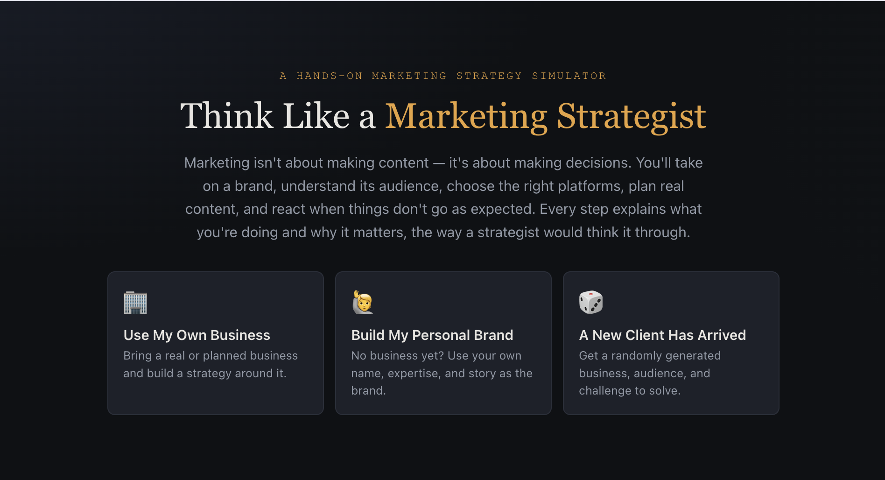
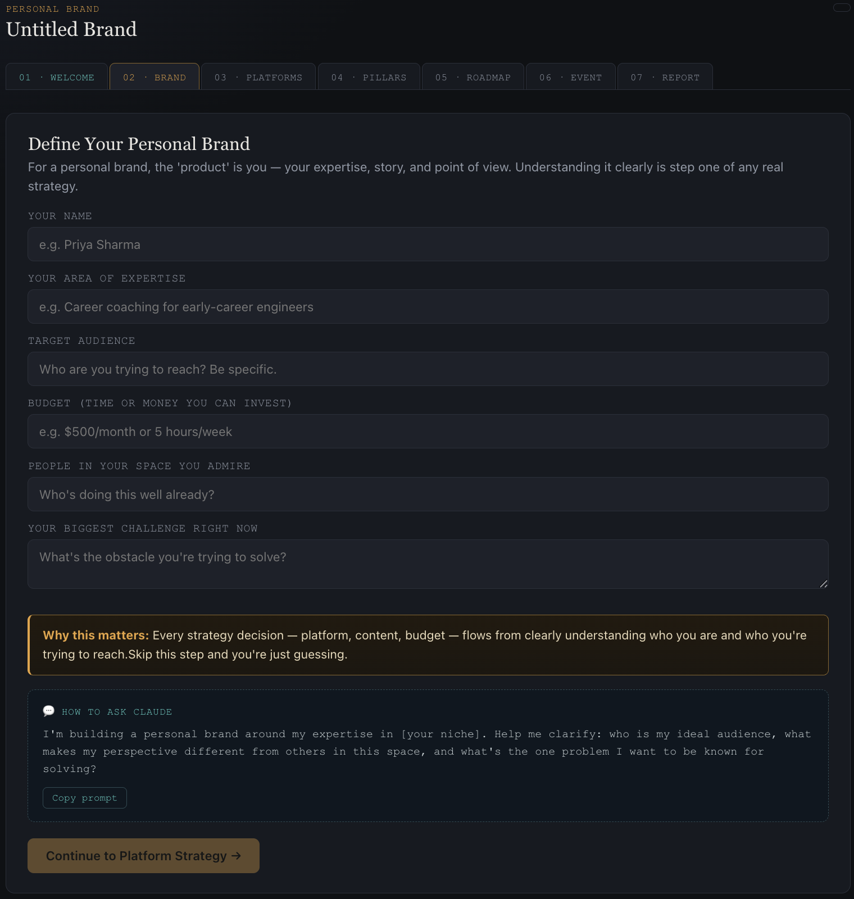
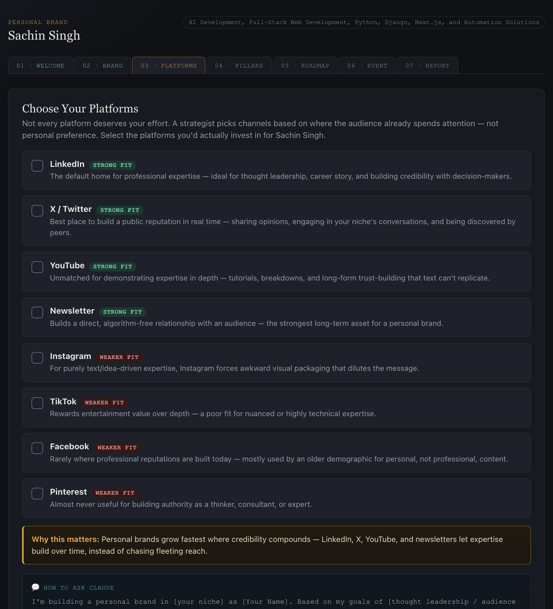
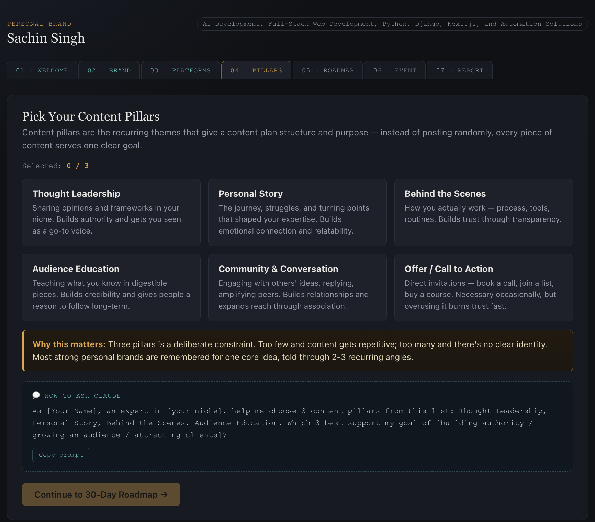
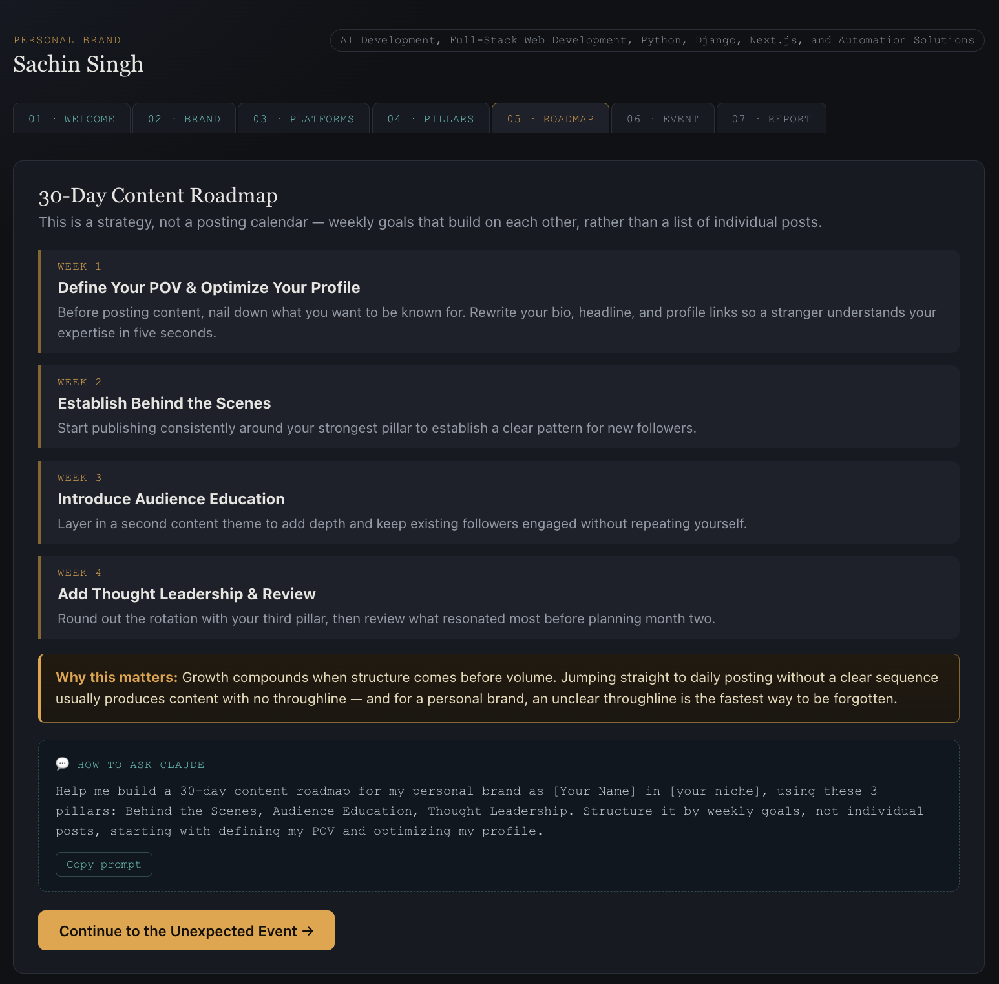
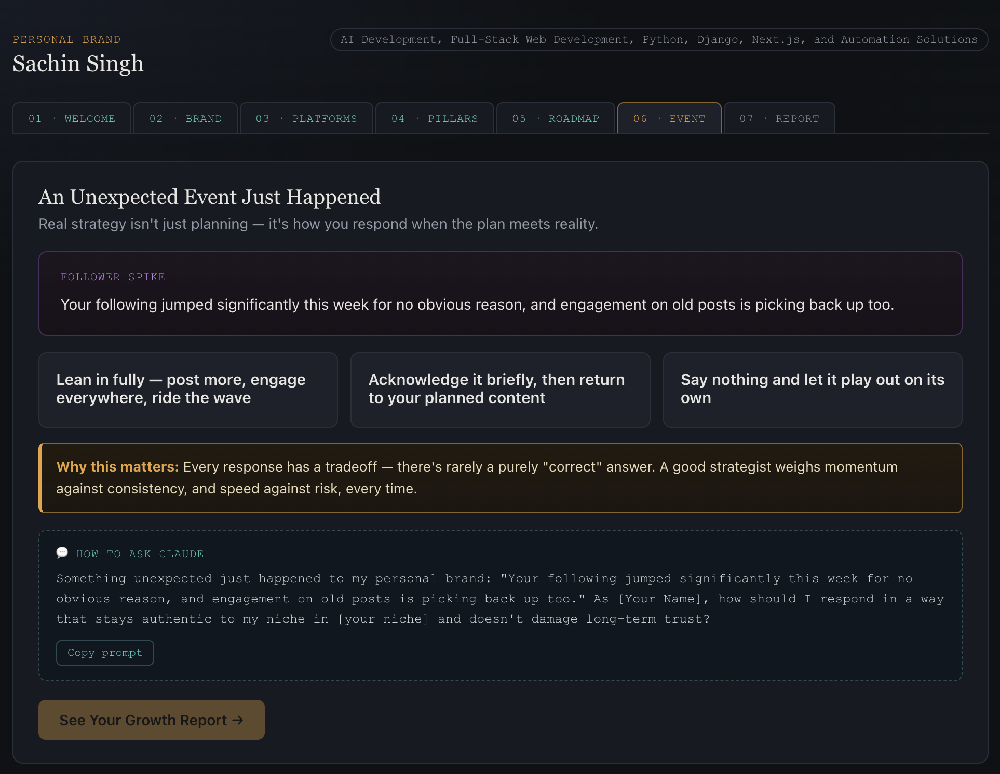
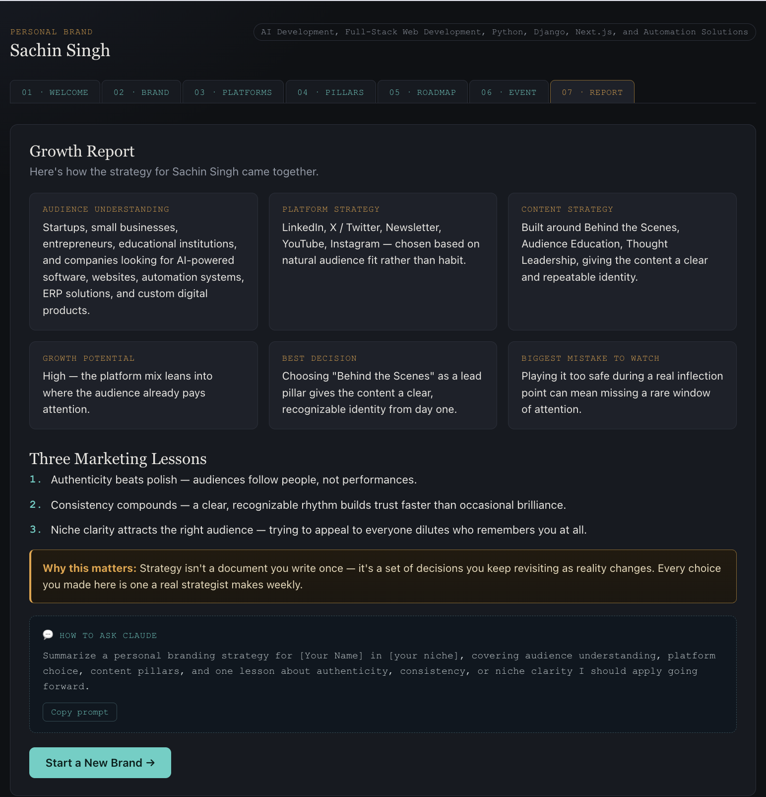

# 🚀 Think Like a Marketing Strategist
### Grow This Brand – Interactive Marketing Strategy Simulator

---

## 📖 About The Project

**Think Like a Marketing Strategist** is an interactive learning application built as part of the **AB Talks 60 Days Challenge (Day 32)**.

Instead of generating marketing content, this application teaches users **how real marketers think**.

Users make strategic decisions step-by-step while learning:

- Understanding target audiences
- Choosing the right marketing platforms
- Building content strategies
- Planning a 30-day roadmap
- Responding to unexpected marketing situations
- Reviewing a complete Growth Report

The application focuses on **decision-making**, not content generation.

---

# 🎯 Challenge Objective

Build a **single-file HTML application** that:

- teaches marketing strategy
- works completely offline
- uses React via CDN
- contains reusable React components
- explains *What* and *Why* after every step
- supports multiple business scenarios
- includes prompt engineering examples

---

# ✨ Features

## 🏢 Multiple Brand Modes

Users can choose between:

- 🏢 Use My Own Business
- 🙋 Build My Personal Brand
- 🎲 Random Business Generator

---

## 📚 Step-by-Step Learning Flow

### 1️⃣ Welcome Screen

Introduces marketing strategy and explains how marketers think before creating content.

---

### 2️⃣ Brand Definition

Users define:

- Business / Personal Brand
- Industry
- Target Audience
- Budget
- Competitors
- Marketing Challenges

Personal Brand mode replaces competitors with:

> "People you admire in your niche"

---

### 3️⃣ Platform Strategy

Users evaluate different platforms including:

- LinkedIn
- X (Twitter)
- YouTube
- Newsletter
- Instagram
- Facebook
- Pinterest
- TikTok

Each platform explains:

- Why it is a strong fit
- Why it may not be suitable

---

### 4️⃣ Content Pillars

Users choose exactly **3 content pillars**.

Examples:

- Thought Leadership
- Personal Story
- Behind The Scenes
- Audience Education
- Community
- Offers

---

### 5️⃣ 30-Day Content Roadmap

Generates a strategic weekly roadmap instead of individual posts.

Week-by-week planning helps users understand:

- positioning
- consistency
- growth

---

### 6️⃣ Unexpected Marketing Event

The simulator generates random scenarios like:

- Viral post
- Podcast invitation
- Public disagreement
- Content copied
- Sudden follower spike

Users choose a response and immediately see the strategic consequences.

---

### 7️⃣ Growth Report

The final report summarizes:

- Audience Understanding
- Platform Strategy
- Content Strategy
- Growth Potential
- Best Decision
- Biggest Mistake
- Three Marketing Lessons

---

### 💬 Prompt Engineering

Every section includes a reusable:

> **"How to Ask Claude"**

card that teaches users how to write better prompts while learning marketing strategy.

---

# 🛠️ Technologies Used

- HTML5
- CSS3
- JavaScript (ES6)
- React 18 (CDN)
- Babel JSX

No backend

No database

No APIs

No npm

No Tailwind CSS

Runs completely offline.

---

# 🎨 UI Highlights

- Modern Dark Theme
- Responsive Layout
- Animated Cards
- Progress Navigation
- Reusable React Components
- Smooth Transitions
- Interactive Decision Flow
- Replayable Random Scenarios

---

# 📸 Application Screenshots

## 🏠 Welcome Screen

---

## 🏢 Brand Setup

---

## 🌐 Platform Strategy

---

## 📚 Content Pillars

---

## 🗓️ 30-Day Roadmap

---

## ⚡ Unexpected Event

---

## 📊 Growth Report

---

# 💡 Key Learnings

This challenge helped me understand:

### Marketing Strategy

- Marketing is about decisions, not content.
- Audience research comes before promotion.
- Every platform serves a different purpose.
- Content pillars create consistency.
- Long-term strategy beats short-term trends.
- Marketing requires adapting to unexpected situations.

---

### React

- React via CDN
- Component-based architecture
- State management using useState
- Conditional rendering
- Dynamic UI generation
- Reusable components

---

### Frontend Development

- Responsive design
- UI/UX improvements
- CSS animations
- Flexbox
- Grid Layout
- Interactive forms
- Component reusability

---

### Prompt Engineering

One of the biggest learnings was how prompts can become reusable learning tools.

Instead of simply generating answers, the application teaches users **how to ask better AI questions**.

---

# 📜 Original Challenge Prompt

The application was generated using the following prompt:

> **Think Like a Marketing Strategist: Grow This Brand**
>
> Build a complete single-file HTML app called **"Think Like a Marketing Strategist: Grow This Brand"**
>
> Requirements:
>
> - Single HTML file
> - React via CDN + Babel JSX
> - HTML/CSS/JavaScript only
> - Offline support
> - Responsive UI
> - Dark modern interface
> - Multiple business modes
> - Platform strategy
> - Content pillars
> - 30-Day roadmap
> - Random marketing events
> - Growth Report
> - Reusable React components
> - Prompt Engineering cards after every section

*(The complete prompt used for development can be found in the project documentation or challenge submission.)*

---

# 🎯 Future Improvements

- Export Growth Report as PDF
- Save strategy locally
- More business templates
- More marketing events
- Better animations
- Theme customization
- Analytics dashboard
- Progress saving
- AI-powered strategy suggestions

---

# 🙌 Acknowledgements

Special thanks to **AB Talks 60 Days Challenge** for creating practical, real-world development tasks that combine software engineering with problem-solving and AI-assisted learning.

---

# ⭐ If you like this project

Give it a ⭐ on GitHub!

It motivates me to build more real-world interactive applications.

