# 🕵️ Marketing Detective
### Day 34 — ABTalks 60 Days Challenge

> **A detective-themed interactive marketing investigation game generated using AI Prompt Engineering.**

---

# 📖 Overview

**Marketing Detective** is a premium single-page detective simulation where players investigate fictional marketing campaigns, analyze evidence, identify strategic mistakes, and solve marketing cases.

This project was **generated through advanced AI Prompt Engineering**, where a carefully crafted prompt instructed the AI to build a complete interactive application.

Instead of creating a traditional dashboard, the application delivers an immersive detective experience using storytelling, investigation mechanics, draggable evidence cards, animated transitions, and learning reports.

The goal was to explore **how detailed prompt engineering can generate production-quality frontend applications from natural language instructions.**

---

# 🎯 Challenge Objective

The task was to:

- Design an interactive marketing investigation simulator
- Create everything inside **one standalone HTML file**
- Use only frontend technologies
- Build an engaging detective-style experience
- Include multiple randomized fictional marketing cases
- Teach marketing concepts through gameplay

---

# 📝 Prompt Used

The application was generated using a detailed AI prompt that instructed the model to create:

- Detective-themed UI
- Premium dark aesthetic
- Multiple fictional marketing cases
- Interactive investigation flow
- Drag-and-drop evidence system
- Learning report
- Random case generation
- Responsive design
- Standalone HTML file

The prompt also requested:

- Beautiful animations
- Progress tracking
- Smooth transitions
- Detective atmosphere
- Marketing education through gameplay

---

# 🚀 Features

## 🕵️ Detective Experience

- Case Assignment
- Investigation Board
- Deep Investigation
- Solve the Case
- Case Closed Animation
- Learning Report

---

## 📂 Marketing Cases

The application contains multiple randomized fictional cases.

Each case includes:

- Company Name
- Industry
- Campaign Objective
- Target Audience
- Marketing Channels
- Budget Allocation
- Campaign Metrics
- Customer Comments
- Social Media Performance
- Supporting Clues
- Primary Marketing Mistake
- Expert Explanation
- Suggested Improvements

Every replay loads a different investigation.

---

## 🎮 Interactive Gameplay

- Detective-style interface
- Investigation board
- Draggable evidence cards
- Interactive clues
- Animated progress indicators
- Case solving
- Randomized replay
- Educational feedback

---

## 🎨 UI / UX Highlights

- Premium dark detective theme
- Corkboard investigation board
- Sticky notes
- Paper folders
- Push pins
- Animated charts
- Folder-style reports
- Smooth page transitions
- Responsive layout
- Modern typography
- Hover effects
- Detective atmosphere

---

# 🛠 Technologies Used

- HTML5
- CSS3
- Vanilla JavaScript (ES6)

The AI automatically switched from React to Vanilla JavaScript to ensure the application works as a **fully standalone HTML file without external dependencies.**

---

# 📸 Screenshots

## 🗂 Case Assignment

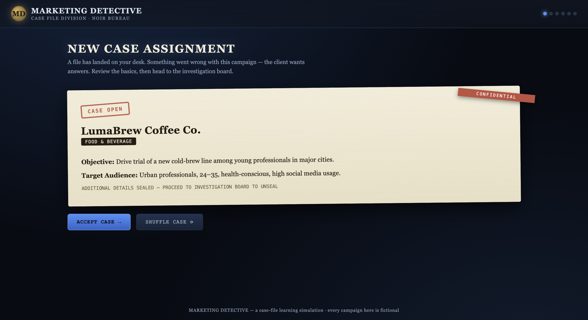

---

## 🕵️ Investigation Board

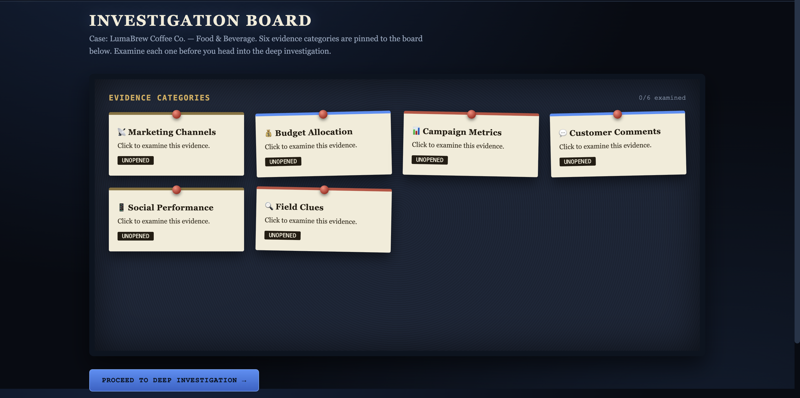

---

## 📡 Marketing Channels

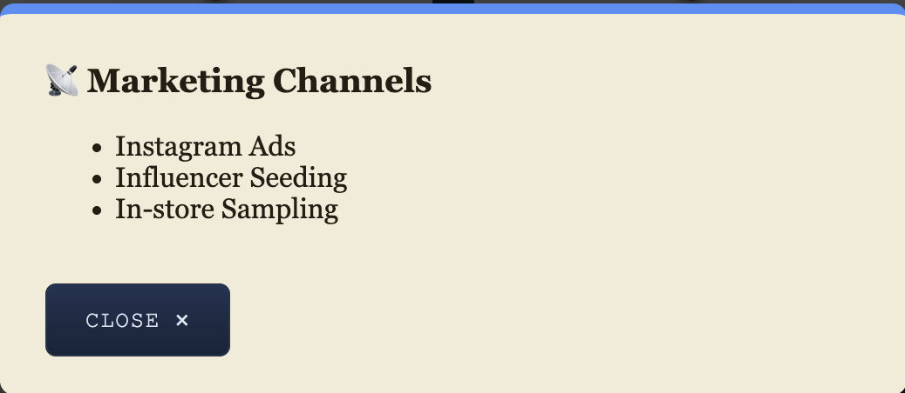

---

## 💰 Budget Allocation

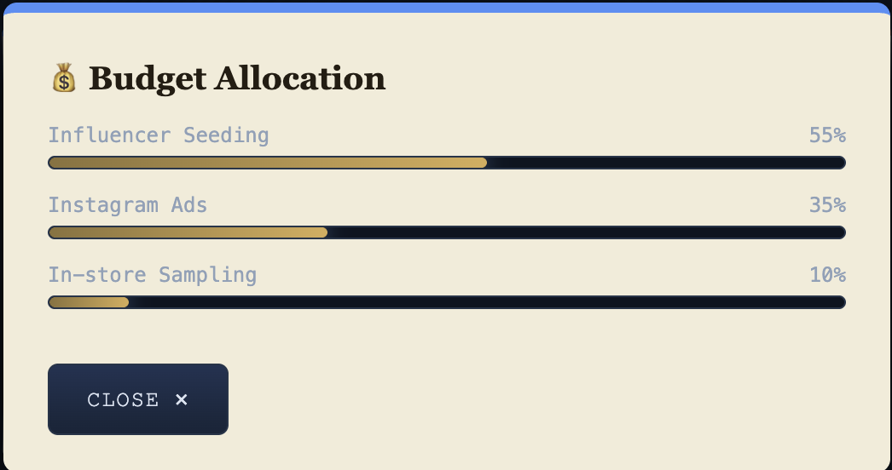

---

## 📊 Campaign Metrics

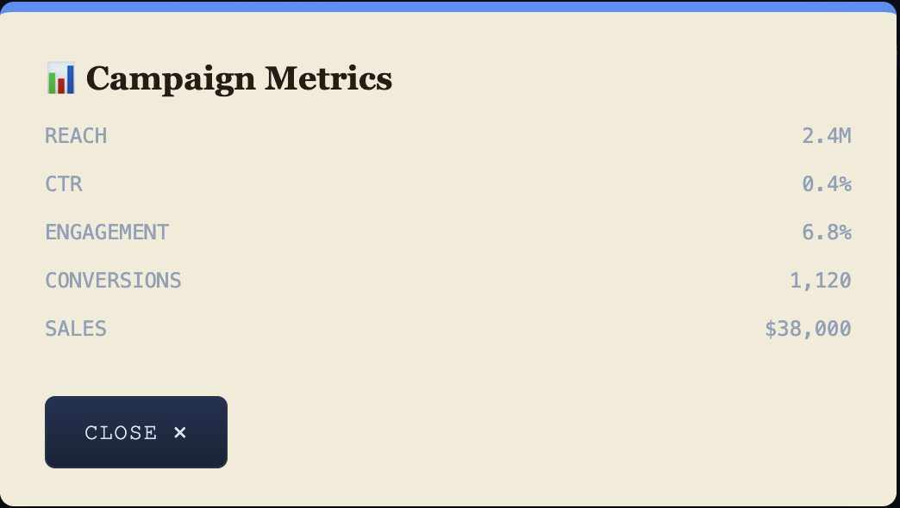

---

## 💬 Customer Comments

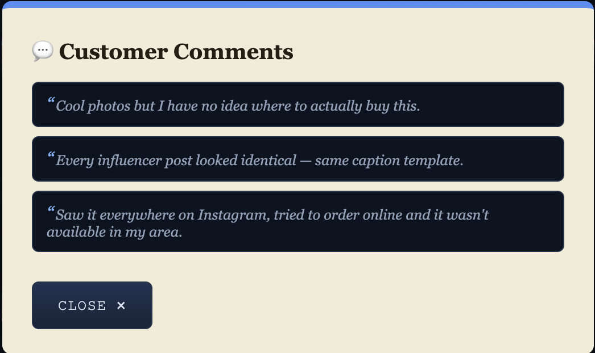

---

## 📱 Social Performance

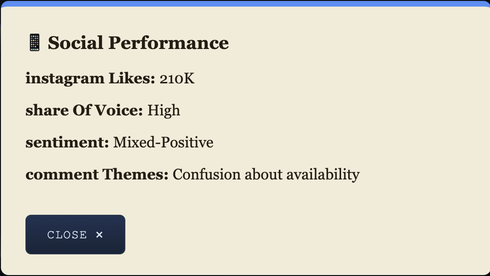

---

## 🔍 Field Clues

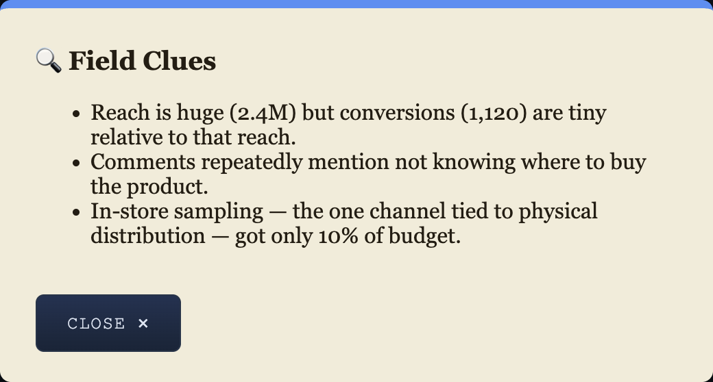

---

## 🧩 Deep Investigation

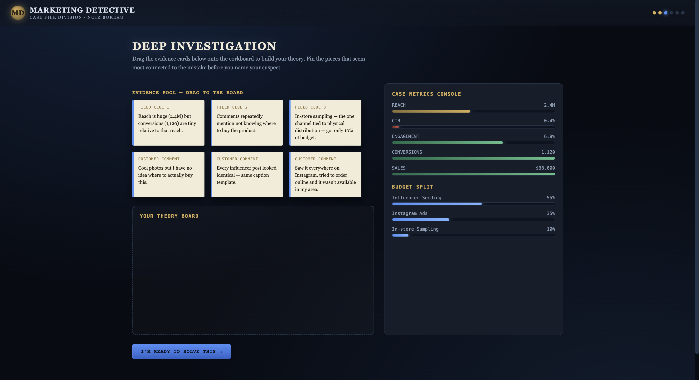

---

## ✅ Solve the Case

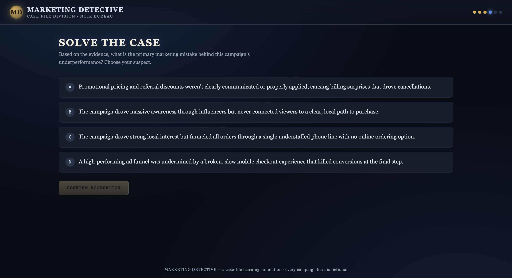

---

## 🎉 Case Closed

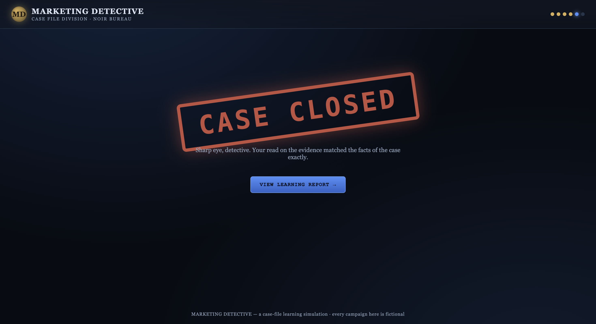

---

## 📚 Learning Report

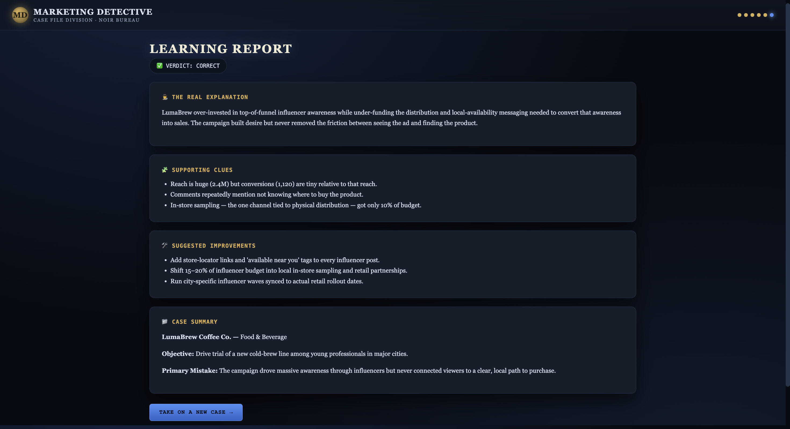

---

# 💡 Key Learnings

Through this challenge I learned:

### Prompt Engineering

- Writing structured AI prompts
- Controlling AI-generated frontend output
- Improving prompt specificity
- Designing AI workflows

---

### Frontend Design

- UI hierarchy
- Interactive storytelling
- Responsive layouts
- Animation design
- Visual consistency

---

### UX Design

- Progressive disclosure
- Gamification
- Detective-style user flow
- User engagement techniques
- Interactive learning experiences

---

### Marketing Concepts

- Marketing funnels
- Customer journey analysis
- Campaign performance metrics
- Budget allocation
- Conversion optimization
- Marketing diagnostics

---

### AI Development

- AI-assisted application generation
- Debugging generated code
- Improving generated UI
- Prompt iteration
- Evaluating AI output quality

---

# 🌟 What Makes This Project Unique?

Instead of building a standard dashboard, this project transforms marketing analysis into an engaging detective game.

Users don't just view analytics—they investigate evidence, connect clues, identify campaign mistakes, and learn strategic marketing concepts through immersive gameplay.

It demonstrates how prompt engineering can generate rich, interactive educational applications with minimal manual coding.

---

# 🎯 Challenge Outcome

✔ Successfully generated a complete standalone application

✔ Interactive detective gameplay

✔ Multiple randomized marketing cases

✔ Drag-and-drop investigation

✔ Premium UI/UX

✔ Responsive design

✔ AI-generated frontend application

✔ Educational marketing simulator

---

# 🚀 Future Improvements

Potential enhancements include:

- 50+ marketing cases
- Difficulty levels
- Timer mode
- Detective score system
- Achievement badges
- Sound effects
- Save progress
- Leaderboard
- Theme customization
- Additional investigation mechanics

---

# 🙌 Acknowledgements

This project was completed as part of the **ABTalks 60 Days Challenge**.

Special thanks to the AI tools that helped transform a detailed prompt into an interactive frontend application, demonstrating the power of Prompt Engineering and AI-assisted development.

---

⭐ *If you enjoyed this project, consider giving it a star!*
