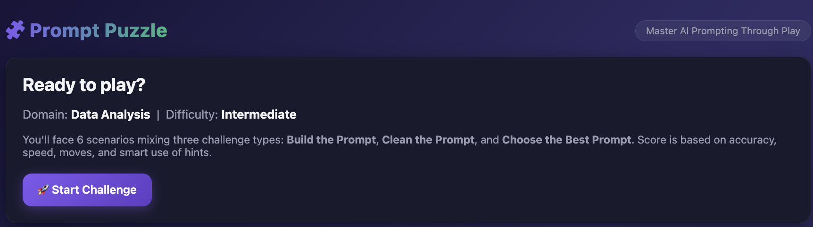
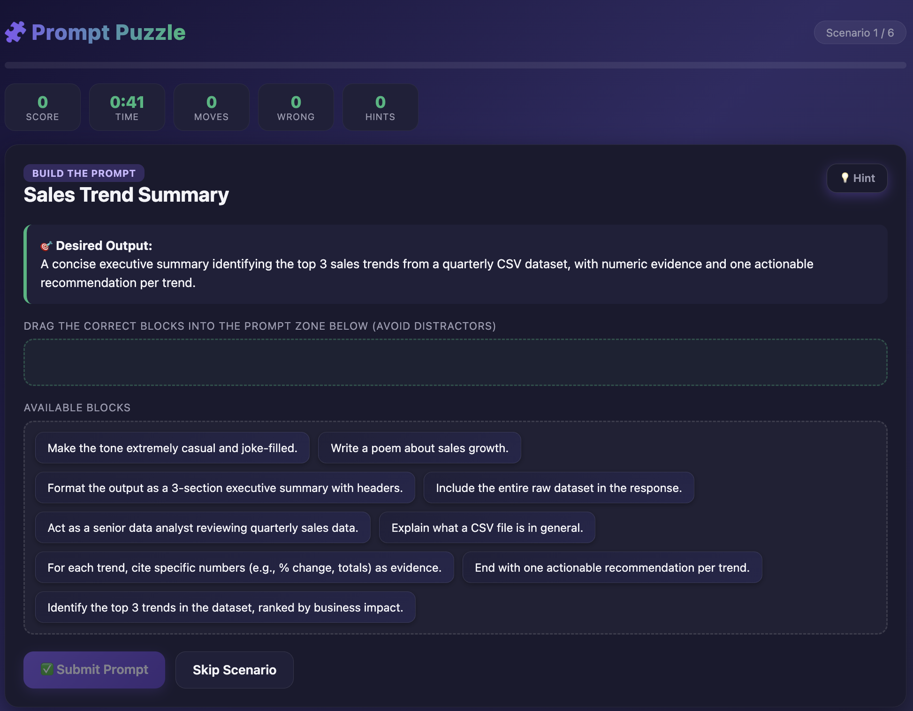
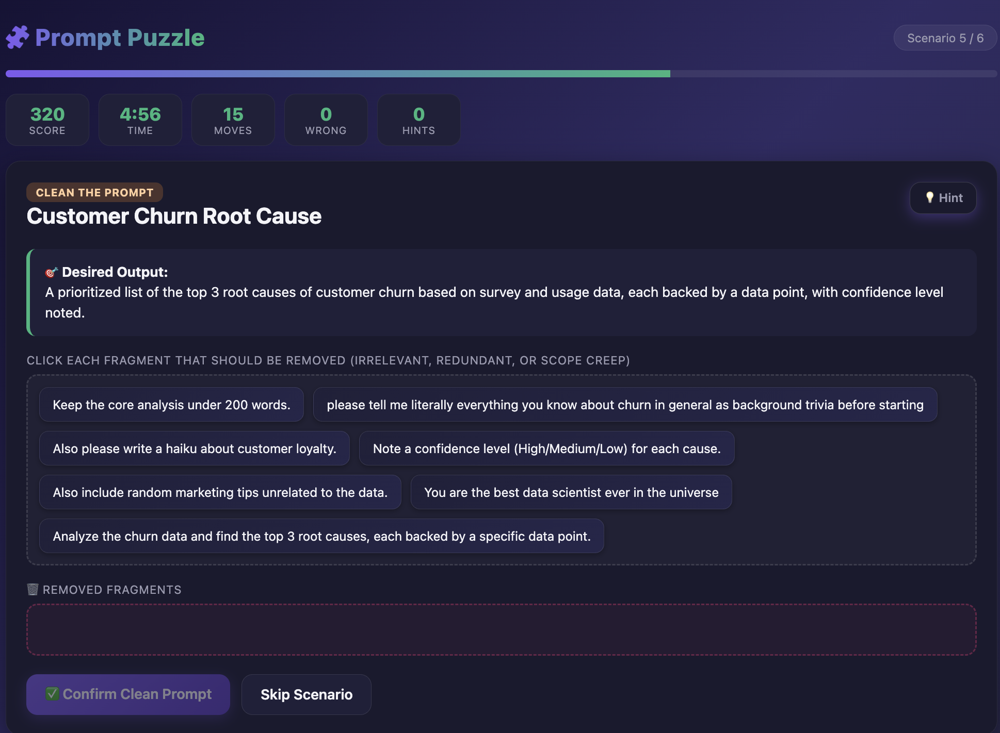
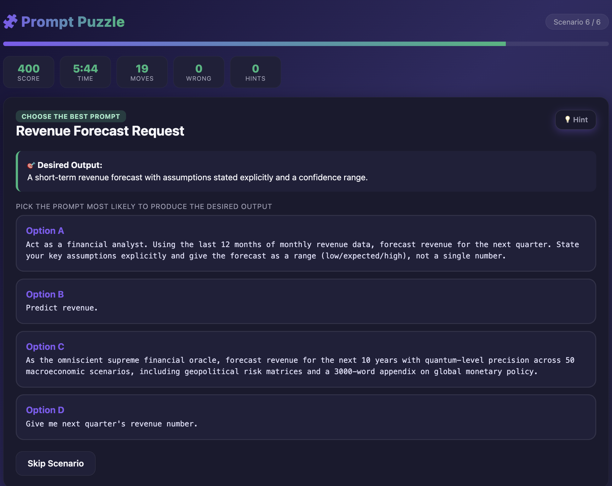
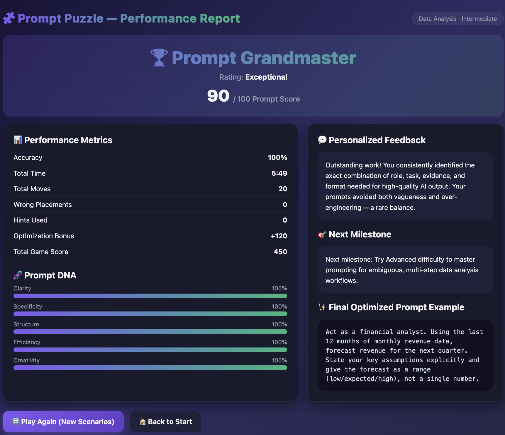

# 🧩 Prompt Puzzle — Master AI Prompting Through Play

> **An interactive, offline-first educational game that teaches prompt engineering through hands-on gameplay.**
>
> Instead of reading theory, players learn how to write high-quality AI prompts by solving real-world prompt puzzles.

<p align="center">


</p>

---

# 📖 About the Project

**Prompt Puzzle** is a browser-based educational game designed to help users **master AI Prompt Engineering through play**.

The project transforms prompt writing into an engaging puzzle experience where players build, optimize, clean, and evaluate prompts using realistic AI scenarios.

Unlike traditional tutorials, Prompt Puzzle provides an **interactive learning environment** with instant feedback, scoring, performance analytics, and personalized recommendations.

The entire application runs inside **one standalone HTML file**, making it portable, lightweight, and completely offline.

---

# 🎯 Objective

The primary goal of this project is to teach users how to write **clear, structured, optimized AI prompts** using modern Prompt Engineering principles.

Players learn how to:

- Write better prompts
- Remove unnecessary prompt clutter
- Avoid over-engineering
- Compare prompt quality
- Improve AI output
- Think like an AI Prompt Engineer

---

# 🧠 Learning Outcomes

After completing the game, users understand:

- ✅ Role Prompting
- ✅ Task Definition
- ✅ Constraints
- ✅ Output Formatting
- ✅ Context Engineering
- ✅ Evidence Requirements
- ✅ Scope Control
- ✅ Prompt Optimization
- ✅ Weak vs Strong Prompts
- ✅ Prompt Evaluation

---

# 🎮 Gameplay

The application generates **6–8 randomized scenarios** depending on the selected domain and difficulty.

Each scenario teaches one Prompt Engineering concept through gameplay.

Three challenge types are included:

---

## 🧩 1. Build the Prompt

Players receive:

- Desired Output
- Correct Prompt Blocks
- Distractor Blocks

The objective is to drag only the correct prompt components into the prompt builder.

Learns:

- Role definition
- Context
- Constraints
- Formatting
- Specificity

---

## 🧹 2. Clean the Prompt

Players receive a messy prompt containing:

- Redundant information
- Scope creep
- Fluff
- Irrelevant requests

The goal is to remove everything that doesn't improve AI output.

Learns:

- Prompt simplification
- Removing noise
- Avoiding over-engineering

---

## ✅ 3. Choose the Best Prompt

Players compare multiple prompts:

- Weak Prompt
- Optimized Prompt
- Over-engineered Prompt

The challenge is selecting the prompt most likely to produce the desired AI output.

Learns:

- Prompt comparison
- Prompt quality evaluation
- Best practices

---

# 📊 Performance Evaluation

Every action affects the player's score.

The application tracks:

- 🎯 Accuracy
- ⏱ Time Taken
- 🎮 Moves
- ❌ Wrong Placements
- 💡 Hints Used
- ⭐ Optimization Bonus

---

# 🧬 Prompt Performance Report

At the end of the game, a detailed report is generated containing:

- Prompt Score
- Player Rank
- Prompt Rating
- Performance Metrics
- Prompt DNA Visualization
- Personalized Feedback
- Next Learning Milestone
- Final Optimized Prompt Example

---

# 🎨 Features

## ✨ Premium UI

- Modern Glassmorphism
- Dark Theme
- Gradient Effects
- Responsive Layout
- Smooth Animations
- Hover Effects
- Progress Indicators
- Micro-interactions
- Floating Notifications
- Score Animations

---

## 🎲 Smart Randomization

Every playthrough generates different combinations of:

- Scenarios
- Prompt Blocks
- Challenge Order

This makes replay meaningful.

---

## 📚 Educational Design

Each scenario contains:

- Desired Output
- Weak Prompt
- Optimized Prompt
- Over-engineered Prompt
- Weak AI Output
- Optimized AI Output
- Prompt Principle

Players don't just answer questions—they understand **why** one prompt is better than another.

---

## 💾 Offline Ready

The application works by simply opening:

```
prompt-puzzle.html
```

No installation.

No server.

No internet.

No dependencies.

---

# 🛠 Technologies Used

- HTML5
- CSS3
- Vanilla JavaScript (ES6)
- Drag & Drop API
- Local Game State Management

---

# 🖼 Screenshots

## Home Screen



---

## Build the Prompt



---

## Clean the Prompt



---

## Choose the Best Prompt



---

## Performance Report



---

# 💡 Prompt Engineering Concepts Covered

- Role Prompting
- Context Engineering
- Constraints
- Specificity
- Output Formatting
- Scope Control
- Prompt Optimization
- Evidence-based Prompting
- Prompt Evaluation
- Removing Prompt Noise

---

# 🎯 Key Learnings

Building this project strengthened my understanding of:

### Frontend Development

- Interactive UI Design
- Drag & Drop Mechanics
- DOM Manipulation
- State Management
- Responsive Design
- CSS Animations

### Prompt Engineering

- Prompt Structure
- Prompt Optimization
- Context Design
- AI Instruction Design
- Avoiding Prompt Over-engineering
- AI Output Quality Improvement

### UX Design

- Educational Gamification
- User Feedback Systems
- Progress Tracking
- Interactive Learning Experiences
- Score Visualization

### JavaScript

- Dynamic Rendering
- Object-based Data Models
- Event Handling
- Game Logic
- Randomization
- Performance Metrics

---

# 🌟 Highlights

- ✅ Offline First
- ✅ Single HTML File
- ✅ Zero Dependencies
- ✅ Responsive Design
- ✅ Reusable Scenario Engine
- ✅ Gamified Learning
- ✅ Premium Modern UI
- ✅ Educational Feedback System
- ✅ Replay Support
- ✅ Performance Analytics

---

# 📌 Future Improvements

- More Prompt Engineering Domains
- Advanced Difficulty
- Multiplayer Mode
- AI-generated Dynamic Scenarios
- Leaderboard
- Sound Effects
- Achievement Badges
- Certificate Generation
- Local Storage Progress Saving
- Theme Customization

---


# ⭐ If you like this project...

Give this repository a ⭐ on GitHub!

It motivates me to build more educational AI projects.

