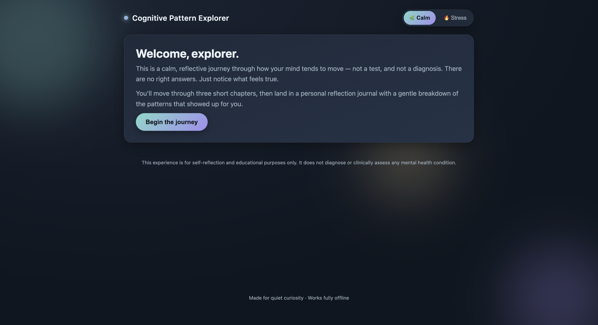
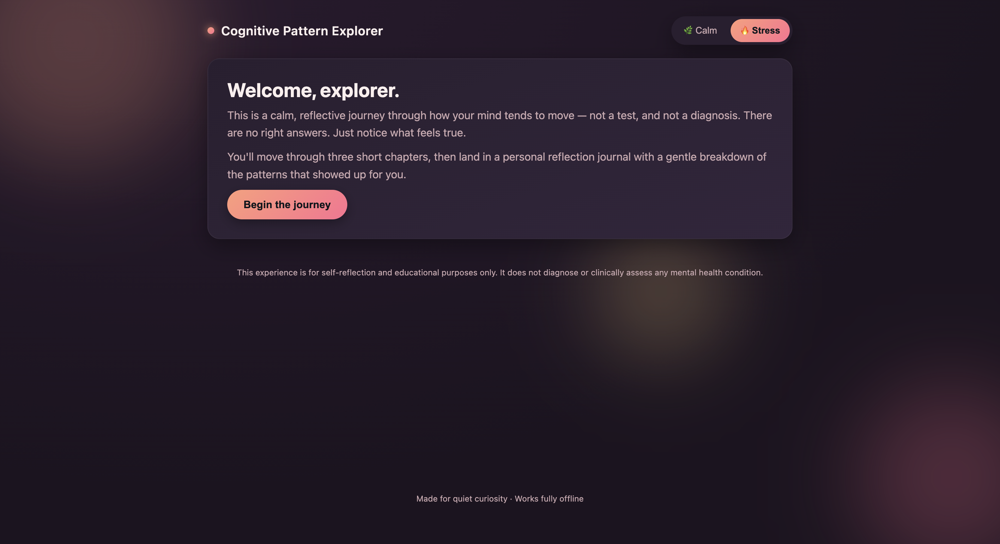
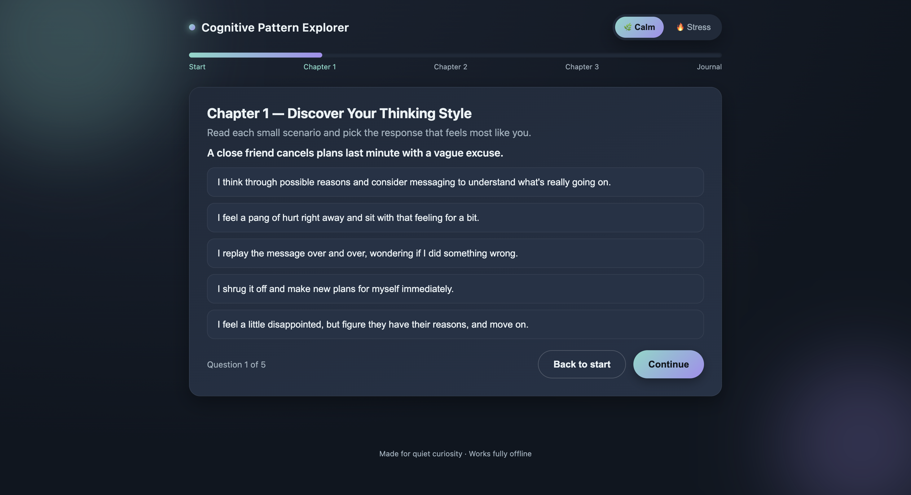
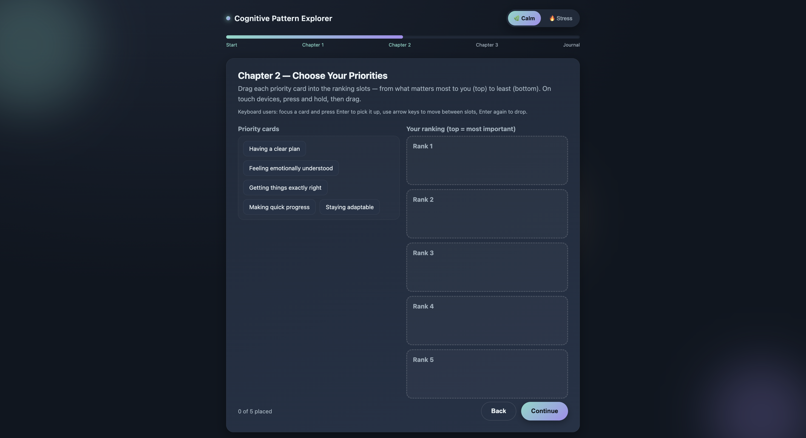
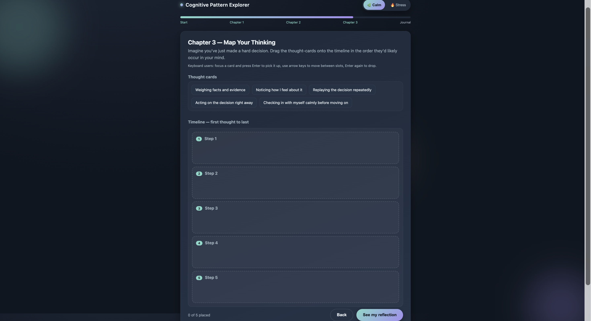
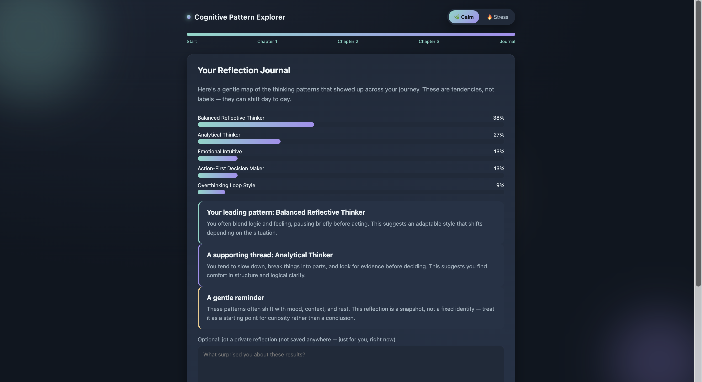

# 🧠 Cognitive Pattern Explorer

> **A fully offline, single-file psychology-inspired self-reflection web application built using only HTML, CSS, and Vanilla JavaScript.**

---

## 📌 Project Overview

**Cognitive Pattern Explorer** is an interactive self-reflection experience designed to help users explore their thinking tendencies through engaging scenarios and drag-and-drop activities.

Unlike traditional personality quizzes, this application focuses on **reflection rather than evaluation**.

It uses calm language, smooth interactions, and personalized insights while intentionally avoiding diagnoses or clinical assessment.

> ⚠️ **Educational Purpose Only**
>
> This project is designed purely for self-reflection and learning.
> It does **not** diagnose or assess any mental health condition.

---

# 🎯 Project Objective

The objective of this task was to build a completely **offline**, **single HTML file** application that:

- feels like an interactive journey instead of a quiz
- contains multiple chapters
- includes scoring logic
- generates personalized reflections
- works without any internet connection
- uses only HTML, CSS and Vanilla JavaScript

---

# 📖 Challenge Statement

Create a responsive web application named **Cognitive Pattern Explorer** that explores different cognitive thinking tendencies through interactive experiences.

The application must include:

- Welcome screen
- Multiple chapters
- Interactive scenarios
- Drag & Drop exercises
- Progress tracking
- Personalized journal
- Offline support
- Accessibility
- Responsive UI
- Smooth animations

---

# 🛠️ Technologies Used

- HTML5
- CSS3
- Vanilla JavaScript (ES6)
- Native Drag & Drop API
- Touch Event API
- CSS Animations
- CSS Variables
- Flexbox
- CSS Grid

---

# ✨ Features

## 🌿 Calm & Stress Modes

- Dynamic UI themes
- Smooth theme switching
- Ambient background effects

---

## 📚 Multi-Step Reflection Journey

### Start Screen

- Introduction
- Educational disclaimer
- Theme selector

---

### Chapter 1 — Discover Your Thinking Style

Users answer multiple reflective scenarios.

Instead of right or wrong answers, each option contributes toward different thinking tendencies.

---

### Chapter 2 — Choose Your Priorities

Interactive Drag & Drop ranking exercise where users arrange priorities based on what matters most.

Features:

- Native Drag & Drop
- Touch support
- Keyboard accessibility

---

### Chapter 3 — Map Your Thinking

Users organize thought cards into a timeline showing how their thoughts typically unfold after making a difficult decision.

---

### Reflection Journal

Personalized report including:

- Percentage breakdown
- Leading thinking tendency
- Supporting tendency
- Gentle reflection
- Optional private journal

---

# 🧠 Thinking Tendencies

The application explores five thinking styles:

- Analytical Thinker
- Emotional Intuitive
- Overthinking Loop Style
- Action-First Decision Maker
- Balanced Reflective Thinker

---

# 🎨 UI Highlights

- Modern dark interface
- Glassmorphism-inspired cards
- Ambient animated background
- Gradient buttons
- Responsive layouts
- Smooth transitions
- Progress indicators
- Calm color palette
- Stress color palette

---

# ♿ Accessibility Features

- Keyboard navigation
- Screen reader friendly
- Focus indicators
- ARIA labels
- Reduced motion support
- Touch device compatibility

---

# ⚙️ Technical Highlights

✅ Single HTML file

✅ No frameworks

✅ No external libraries

✅ Native JavaScript

✅ Offline functionality

✅ Reusable Drag & Drop system

✅ JavaScript object-based scenarios

✅ Responsive layout

✅ Progress tracking

✅ Dynamic scoring engine

---
# 📸 Screenshots

## 🏠 Home Screen

  

---

## 🌿 Calm Theme

  

---

## 🔥 Stress Theme

  

---

## 📖 Chapter 1 – Discover Your Thinking Style

  

---

## 🎯 Chapter 2 – Choose Your Priorities

  

---

## 🧩 Chapter 3 – Map Your Thinking

  

---

## 📊 Reflection Journal

  

---

# 🧩 Scoring Logic

Each interaction contributes toward one or more thinking tendencies.

The final reflection is generated by combining scores from:

- Scenario selections
- Priority rankings
- Timeline ordering

The results are then converted into percentage distributions and summarized using reflective language.

---

# 💡 Key Learnings

Through this project, I learned:

### Frontend Development

- Building large applications using only Vanilla JavaScript
- Writing modular JavaScript without frameworks
- Creating reusable UI components
- Managing application state

---

### Drag & Drop

- Native HTML Drag & Drop API
- Touch event implementation
- Keyboard-accessible interactions
- Reusable drag-and-drop architecture

---

### CSS

- Responsive layouts
- CSS Grid
- Flexbox
- CSS Variables
- Gradient design
- Animations
- Transitions
- Glassmorphism-inspired UI

---

### JavaScript

- DOM manipulation
- Event handling
- Dynamic rendering
- Object-based data management
- State management
- Progress tracking
- Score calculation
- Personalized content generation

---

### Accessibility

- ARIA roles
- Keyboard navigation
- Screen reader support
- Reduced motion preferences

---

### UI/UX

- Designing reflection-based experiences
- Educational disclaimer integration
- Calm visual design
- Smooth user flow
- User-centered interaction design

---

# 🎯 Assignment Summary

✔ Designed a psychology-inspired reflection experience

✔ Built a complete offline web application

✔ Used only HTML, CSS, and Vanilla JavaScript

✔ Implemented responsive layouts

✔ Added reusable Drag & Drop functionality

✔ Built a personalized scoring engine

✔ Generated reflective journal insights

✔ Ensured accessibility and offline compatibility

---

# 🌟 Future Improvements

- Export reflection as PDF
- Save progress locally
- Multiple reflection journeys
- More thinking scenarios
- Custom themes
- Analytics dashboard
- Voice guidance
- Internationalization (i18n)
- Optional dark/light modes

---

# 🙏 Acknowledgements

This project was developed as part of a frontend development learning task focused on:

- Vanilla JavaScript
- Interactive UI Design
- Accessibility
- Offline-first Web Applications
- Responsive Design
- Psychology-inspired User Experiences

---

### ⭐ If you found this project interesting, consider giving it a star!

**Built with HTML • CSS • Vanilla JavaScript**

