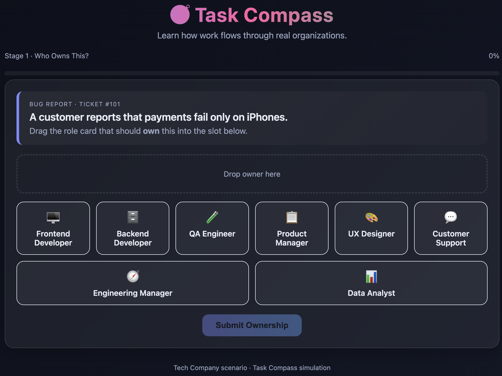
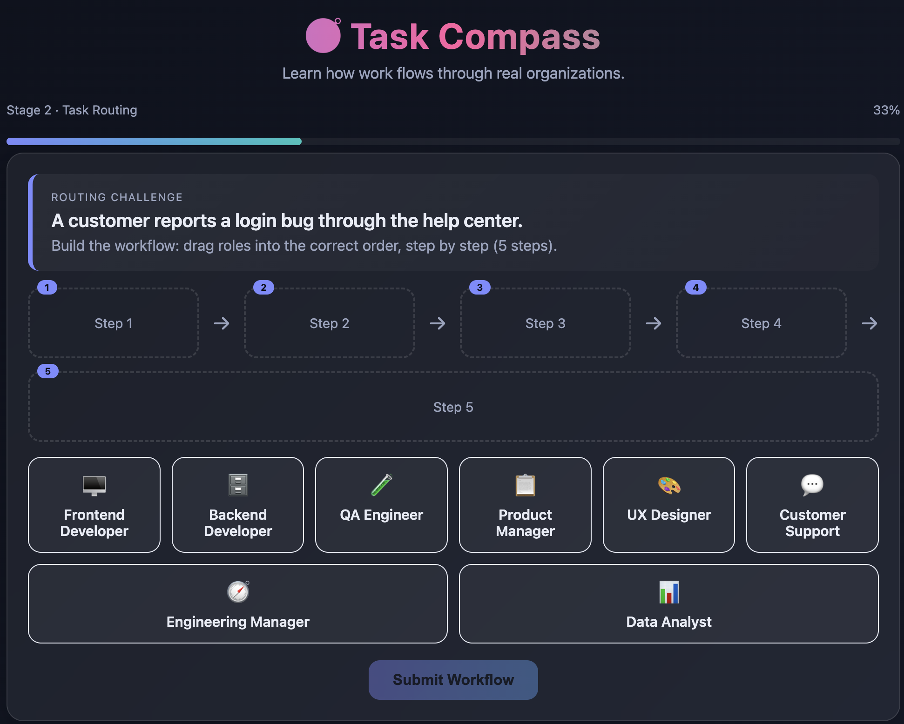
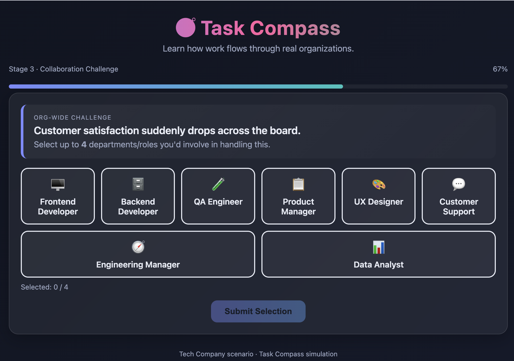
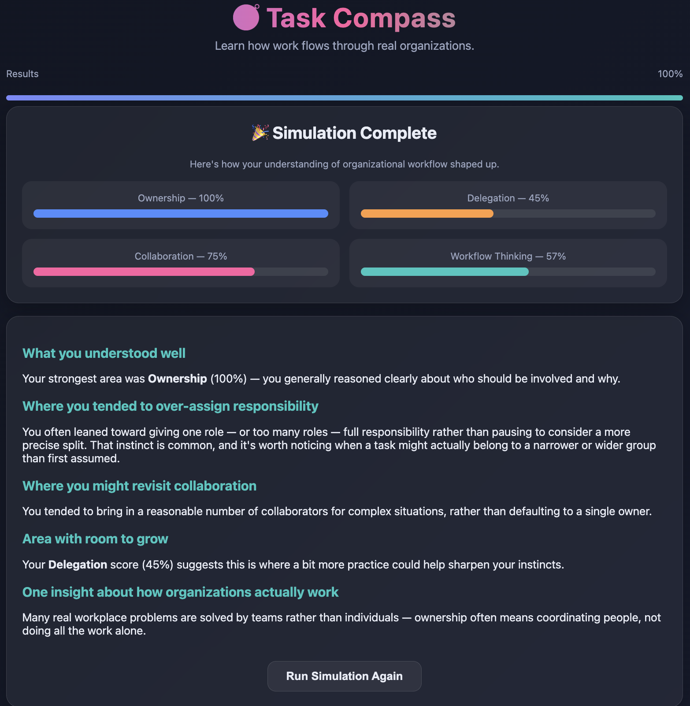

# 🧭 Task Compass – Organizational Workflow Simulation

> **Day 37 – AB Talks 60 Days Challenge**

Task Compass is an interactive, single-file HTML simulation designed to teach how work flows through real organizations. Instead of testing technical knowledge, the application helps users understand **ownership, delegation, collaboration, escalation, and workflow thinking** through realistic workplace scenarios.

Built entirely using **HTML, CSS, and Vanilla JavaScript**, the application works completely **offline** with no external libraries or dependencies.

---

# 🎯 Project Objective

Modern workplaces rarely solve problems through one individual. Every issue passes through different teams, owners, and decision-makers.

Task Compass simulates these real organizational workflows by allowing users to:

- Identify the correct owner of a workplace task.
- Build realistic task-routing workflows.
- Practice cross-functional collaboration.
- Learn why certain roles take ownership while others provide support.
- Reflect on decision-making instead of receiving simple right/wrong answers.

The experience focuses on **learning organizational thinking** rather than memorization.

---

# ✨ Features

## Stage 1 — Who Owns This?

Players are presented with realistic workplace tickets.

Example:

> "A customer reports that payments fail only on iPhones."

Users must drag the role that should **own** the task.

After submission the simulator explains:

- ✅ Primary Owner
- ✅ Why they own it
- ✅ Supporting roles
- ✅ Organizational reasoning

---

## Stage 2 — Task Routing

Instead of selecting one owner, users build the workflow.

Example:

Customer Support

↓

QA Engineer

↓

Backend Developer

↓

Frontend Developer

↓

Customer Support

The application then:

- Animates the workflow
- Explains why this order is commonly used
- Encourages understanding of delegation

---

## Stage 3 — Collaboration Challenge

Large organizational situations require teamwork.

Examples:

- Customer satisfaction drops
- Sales increase rapidly
- Negative reviews appear
- Major feature delays

Users can select up to **four departments** to collaborate.

The simulator explains:

- Primary owner
- Supporting teams
- Communication flow
- Collaboration reasoning

---

# 📊 Final Reflection Dashboard

Instead of assigning a traditional score, Task Compass measures organizational understanding.

Metrics include:

- Ownership
- Delegation
- Collaboration
- Workflow Thinking

The dashboard also provides personalized reflections, including:

- What you understood well
- Areas for improvement
- Delegation habits
- Collaboration insights
- Real-world organizational lessons

---

# 🎨 UI / UX Highlights

- 🌙 Premium Dark Mode
- 🪟 Glassmorphism Design
- 🎴 Interactive Role Cards
- 🧲 Drag & Drop Gameplay
- ✨ Smooth Animations
- 📈 Progress Tracking
- 🎉 Completion Celebration
- 📱 Responsive Layout
- 🎯 Modern Ticket-Based Interface

---

# 🛠️ Technologies Used

- HTML5
- CSS3
- Vanilla JavaScript

No frameworks or libraries were used.

Everything runs completely offline.

---
# 📸 Application Screenshots

## 🧭 Stage 1 – Who Owns This?

Identify the primary owner responsible for handling realistic workplace tasks and understand why they own the issue.

---

## 🔄 Stage 2 – Task Routing

Build the correct workflow by arranging departments in the order a task typically moves through an organization.

---

## 🤝 Stage 3 – Collaboration Challenge

Solve organization-wide problems by selecting multiple teams and understanding cross-functional collaboration.

---

## 📊 Final Results Dashboard

Review your organizational thinking through personalized insights and performance metrics.

---

# 🧠 Key Learnings

During this project, I learned that:

- Ownership and execution are not always the same.
- Many workplace problems require collaboration across multiple teams.
- Delegation is about sending work to the right owner—not simply assigning more people.
- Product development depends heavily on communication between departments.
- Organizational workflows are structured processes rather than isolated tasks.
- Real-world decision-making involves reasoning, coordination, and accountability.

---

# 🚀 Challenges Faced

- Designing intuitive drag-and-drop interactions.
- Creating reusable UI components using only Vanilla JavaScript.
- Building an engaging simulation without external libraries.
- Maintaining responsive layouts across screen sizes.
- Designing realistic organizational scenarios.
- Generating meaningful feedback instead of simple "Correct" or "Wrong" responses.

---

# 💡 Future Improvements

Possible future enhancements include:

- Multiple workplace environments (Healthcare, Retail, Manufacturing, Education, etc.)
- Difficulty levels
- Timer and challenge mode
- Sound effects
- Achievement badges
- Leaderboard
- Scenario randomization
- Save progress using Local Storage
- Accessibility improvements
- Keyboard-only gameplay

---

# 🎯 Challenge Requirements Completed

- ✔ Single HTML file
- ✔ Offline application
- ✔ No external libraries
- ✔ HTML + CSS + Vanilla JavaScript only
- ✔ Drag & Drop interactions
- ✔ Three learning stages
- ✔ Organizational reasoning
- ✔ Responsive UI
- ✔ Progress tracking
- ✔ Final reflection dashboard
- ✔ Animated user experience

---

# 📚 Prompt Engineering

This project was generated using a carefully designed prompt that instructed the AI to create:

- an educational simulation,
- a management learning experience,
- reusable JavaScript architecture,
- realistic workplace scenarios,
- and a premium interactive UI.

The prompt emphasized **learning organizational thinking** over traditional quiz mechanics.

---

# 🙌 Acknowledgements

This project was completed as part of the **AB Talks – 60 Days Challenge (Day 37)** to strengthen prompt engineering, frontend development, UI/UX design, and organizational workflow understanding through AI-assisted application development.

---

# ⭐ Final Takeaway

> **"Many real workplace problems are solved by teams rather than individuals. Effective ownership is not about doing everything yourself—it is about coordinating the right people at the right time."**
