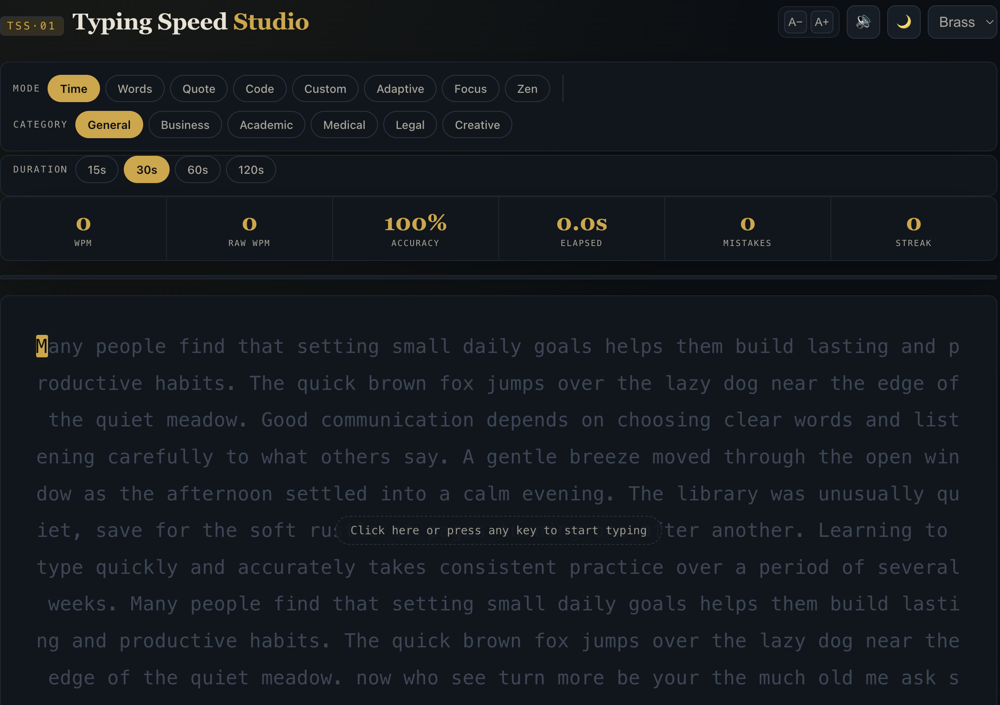
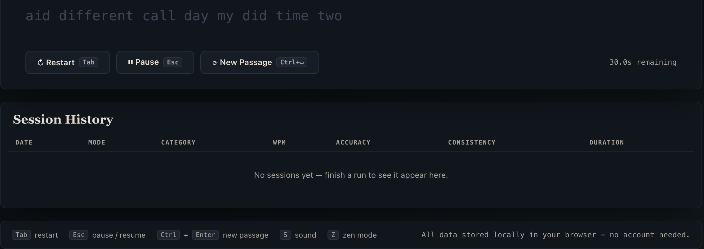

# ⌨️ Typing Speed Studio

> **Day 38 — 60 Days Development Challenge**

Typing Speed Studio is a **premium, interactive typing practice application** built entirely with **HTML, CSS, and Vanilla JavaScript**. Inspired by modern typing platforms like **Monkeytype**, it offers multiple typing modes, real-time performance tracking, adaptive difficulty, and a beautiful analytics dashboard—all without using any external libraries or frameworks.

---

# 📸 Preview

## 🖥 Home Screen

---

## 📊 Analytics Dashboard

---

# ✨ Features

## 🎯 Multiple Typing Modes

✔ Time Mode (15s, 30s, 60s, 120s)

✔ Word Count Mode

✔ Quote Mode

✔ Programming Mode

✔ Custom Text Mode

✔ Adaptive Mode

✔ Focus Mode

✔ Zen Mode

---

## 📚 Practice Categories

Practice with dynamically generated content across multiple domains.

| Category | Description |
|-----------|-------------|
| 📝 General | Daily English Practice |
| 💼 Business | Professional Communication |
| 🎓 Academic | Educational Text |
| 🏥 Medical | Medical Terminology |
| ⚖ Legal | Legal Documents |
| ✍ Creative | Story & Literature |

Programming Mode supports:

- HTML
- CSS
- JavaScript
- Python
- Java
- C++
- SQL

---

# 📊 Live Typing Metrics

During every session the application calculates in real-time:

- 🚀 Words Per Minute (WPM)
- ⚡ Raw WPM
- 🔠 Characters Per Minute (CPM)
- 🎯 Accuracy
- ⏱ Elapsed Time
- ⏳ Remaining Time
- ❌ Mistakes Count
- 🔥 Current Streak
- 📈 Progress Indicator
- ✅ Completion Percentage

---

# 📈 Advanced Analytics Dashboard

Every completed session generates a detailed performance report including:

### Performance

- WPM
- Raw WPM
- Accuracy
- Consistency
- Completion Percentage

### Character Analysis

- Correct Characters
- Incorrect Characters
- Extra Characters
- Missed Characters

### Graphs & Insights

- 📈 WPM Progress Graph
- 📊 Accuracy Graph
- 🔥 Error Heatmap
- 🎖 Achievement Badges
- 🏆 Personal Best Records
- 📍 Percentile Estimate
- 📖 Performance Summary
- 💡 Personalized Suggestions

---

# 💾 Local Storage Support

The application stores all typing sessions directly in the browser.

Users can:

- View previous sessions
- Compare performance
- Track improvement
- Maintain typing streaks
- Store personal best scores

**No account or backend required.**

---

# 🎨 UI / UX Highlights

- 🌙 Dark Mode
- 🎨 Accent Color Themes
- 🔠 Adjustable Font Size
- 📱 Fully Responsive
- ⚡ Smooth Animations
- 🔊 Sound Effects
- ⏸ Pause / Resume
- 🔄 Restart Session
- ♿ Accessibility Support
- ⌨ Keyboard Shortcuts

---

# 🛠 Technology Stack

| Technology | Purpose |
|------------|---------|
| HTML5 | Structure |
| CSS3 | Styling & Responsive Design |
| JavaScript (ES6) | Application Logic |
| Local Storage API | Session History |
| Canvas API | Graph Rendering |
| Web Audio API | Typing Sound Effects |

> **No frameworks, no libraries, no dependencies.**

---

# ⌨ Keyboard Shortcuts

| Shortcut | Function |
|-----------|----------|
| **Tab** | Restart Session |
| **Esc** | Pause / Resume |
| **Ctrl + Enter** | Generate New Passage |
| **S** | Toggle Sound |
| **Z** | Zen Mode |

---

# 🎓 Key Learnings

Building this project strengthened my understanding of:

- DOM Manipulation
- JavaScript Event Handling
- State Management
- Dynamic UI Rendering
- Timer Functions
- Local Storage API
- Canvas API
- Web Audio API
- Performance Optimization
- Accessibility
- Responsive Design
- User Experience Design
- Real-Time Data Visualization

---

# 🚧 Challenges Faced

Developing this project involved solving several interesting problems:

- Designing a premium UI without any framework
- Implementing accurate WPM calculations
- Managing multiple typing modes
- Building adaptive difficulty
- Dynamic passage generation
- Rendering analytics graphs
- Maintaining responsiveness
- Optimizing real-time updates

---

# 🚀 Future Roadmap

Planned improvements include:

- 👤 User Authentication
- ☁ Cloud Sync
- 🏆 Online Leaderboards
- 🤝 Multiplayer Typing Battles
- 📅 Daily Challenges
- 🤖 AI Generated Practice
- 📄 PDF Report Export
- 🌎 Global Rankings
- 🎨 More Themes
- 💻 More Programming Languages

---

# 🌟 Project Highlights

- Premium Commercial UI
- Monkeytype Inspired Experience
- Fully Responsive
- Real-Time Analytics
- Adaptive Difficulty
- Dynamic Passage Generation
- Local Storage Support
- Programming Practice Mode
- Theme Customization
- Accessibility Friendly
- Zero Dependencies
- Pure HTML • CSS • JavaScript

---

# 📌 Why This Project?

The goal of this project was to build a **feature-rich typing platform** without relying on any external frameworks or libraries.

This project demonstrates:

- Frontend Development Skills
- JavaScript Problem Solving
- UI/UX Design
- Browser APIs
- Data Visualization
- Performance Optimization
- Clean Code Architecture

---

# ⭐ Support

If you found this project helpful, please consider giving it a **⭐ Star** on GitHub.

It helps motivate future open-source projects and supports my **60 Days Development Challenge**.

---

**Made with ❤️ using HTML, CSS & JavaScript**

**Happy Typing! ⌨🚀**

