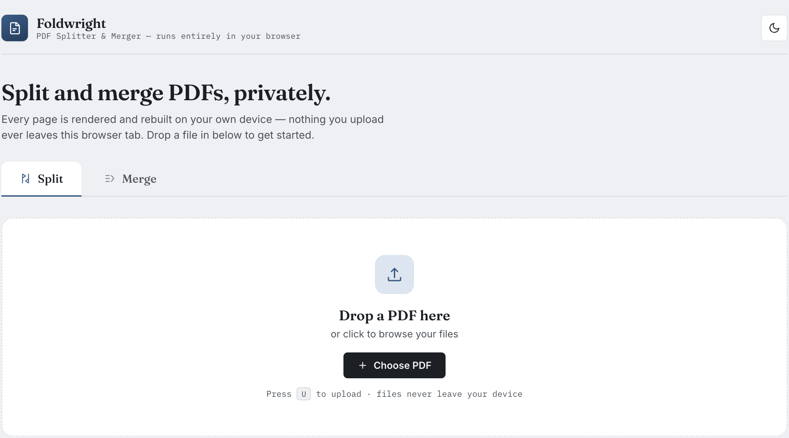
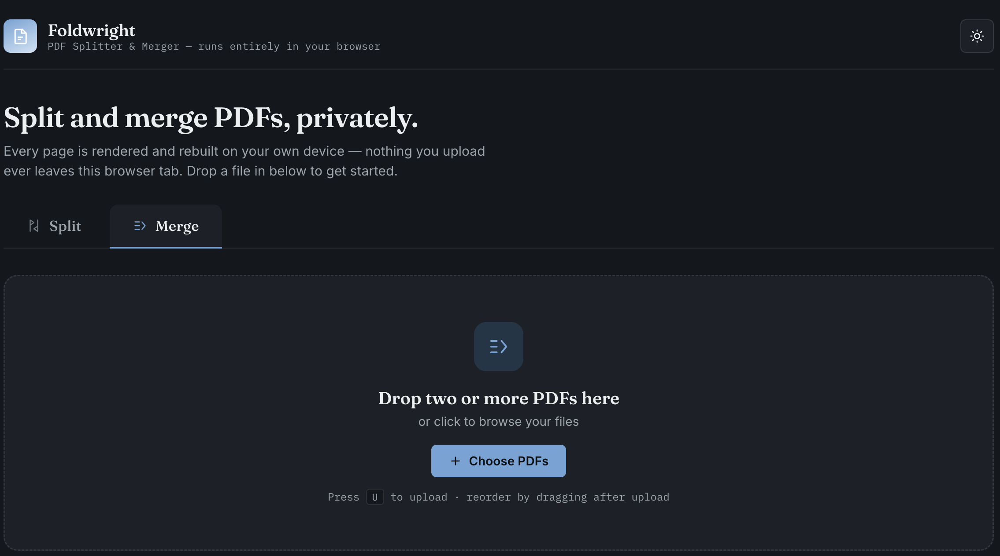
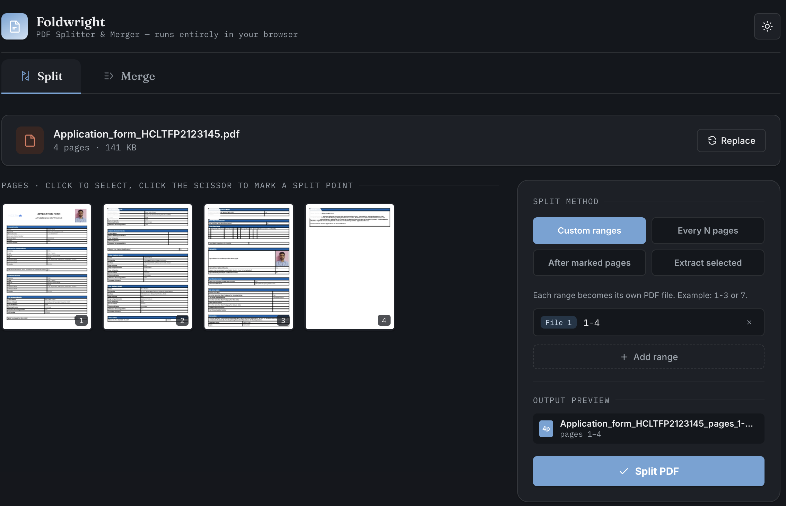
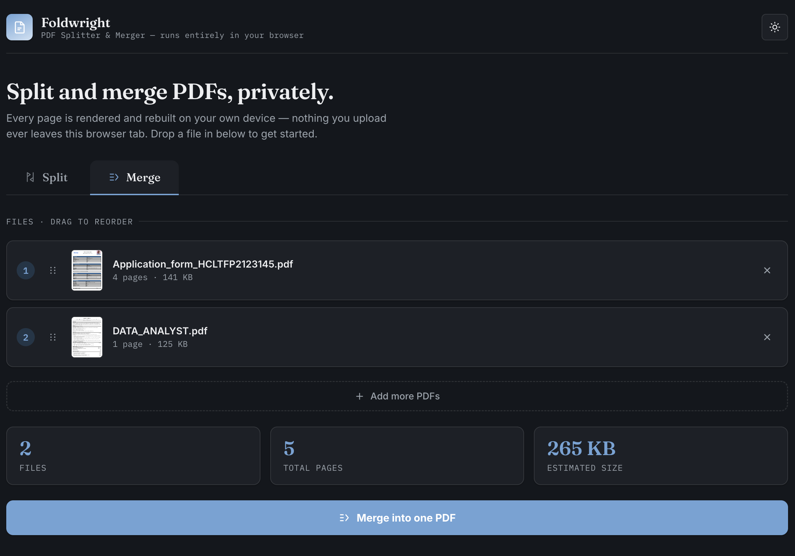

# 📄 Foldwright — PDF Splitter & Merger
 
> A premium, client-side PDF Splitter & Merger built with plain **HTML, CSS, and JavaScript**.
> Split, extract, preview, reorder, and merge PDF files entirely inside your browser — **100% private**, no uploads, no servers, no backend.
 

 
---
 
## 📌 Table of Contents
 
- [Overview](#-overview)
- [Features](#-features)
- [Screenshots](#-screenshots)
- [Tech Stack](#-tech-stack)
- [Keyboard Shortcuts](#-keyboard-shortcuts)
- [How It Works](#-how-it-works)
- [Privacy & Security](#-privacy--security)
- [Browser Compatibility](#-browser-compatibility)
- [Libraries Used](#-libraries-used)
- [Roadmap / Future Improvements](#-roadmap--future-improvements)
- [Learning Outcomes](#-learning-outcomes)
- [Challenge Context](#-challenge-context)
- [Contributing](#-contributing)
- [Support](#-support)
---
 
## 📌 Overview
 
**Foldwright** is a modern, privacy-first PDF utility inspired by tools like iLovePDF, SmallPDF, and Adobe Acrobat — but with one key difference: **nothing ever leaves your device**.
 
The entire application runs as a **single, self-contained HTML file** and executes all PDF processing directly in the browser using client-side JavaScript. There's no installation, no account, no upload step, and no server round-trip — your documents are rendered, split, reordered, and rebuilt locally in the browser tab.
 
It combines a clean, commercial-quality interface with real PDF engineering: page thumbnail rendering, custom split ranges, drag-and-drop merging, dark/light themes, and instant downloads.
 
---
 
## ✨ Features
 
### 📄 PDF Splitter
- Upload a single PDF (via click, drag-and-drop, or keyboard shortcut)
- Automatic page count and file size detection
- Canvas-rendered page thumbnails for every page
- Click-to-select pages, click-the-scissor to mark split points
- Four split methods:
  - **Custom ranges** — e.g. `1-3` or `7`, each range becomes its own file
  - **Every N pages** — auto-chunk the document
  - **After marked pages** — split immediately following chosen pages
  - **Extract selected** — pull out only the pages you pick
- Support for multiple output ranges/files in one pass
- Live **output preview** showing resulting file(s) and page counts before exporting
- Input validation with friendly error messaging
- One-click instant download of the resulting PDF(s)
### 📑 PDF Merger
- Upload multiple PDFs at once
- Drag-and-drop file upload
- Drag-and-drop **reordering** of uploaded files before merging
- Thumbnail preview per file
- Per-file and total page count detection
- Estimated combined output size
- Merge into a single PDF with one click
- Instant download of the merged document
### 🎨 User Experience
- Premium, modern interface with elegant typography
- Fully responsive layout
- **Dark mode** and **light mode** with a one-click toggle
- Smooth loading states and micro-interactions
- Keyboard shortcut support
- Accessibility-conscious markup (keyboard-navigable dropzones, focus states)
- Toast notifications for errors and invalid input
### 🔒 Privacy First
✅ Your files never leave your computer.
 
All processing — rendering, splitting, merging, and rebuilding — happens **inside the browser**, powered by:
- **PDF.js** for rendering
- **PDF-lib** for document manipulation
There is:
- ❌ No backend
- ❌ No cloud processing
- ❌ No external storage
- ❌ No analytics tracking your documents
---
 
## 📸 Screenshots
 
| View | Description |
|---|---|
|  | **Home (Light Mode)** — Split tab, drag-and-drop dropzone |
|  | **Home (Dark Mode)** — Merge tab, dropzone for multiple files |
|  | **PDF Splitter** — page thumbnails, custom range selection, output preview |
|  | **PDF Merger** — reorderable file list with page/size stats |
 
> Place your screenshot files in a `screenshots/` folder at the project root using the filenames above, or update the paths in this table to match your own filenames.
 
---
 
## 🛠 Tech Stack
 
| Technology | Purpose |
|---|---|
| HTML5 | Structure & semantic markup |
| CSS3 | Styling, theming, responsive layout |
| JavaScript (ES6) | Application logic & state management |
| [PDF.js](https://mozilla.github.io/pdf.js/) | PDF rendering & thumbnail generation |
| [PDF-lib](https://pdf-lib.js.org/) | PDF splitting, merging, page extraction |
| Google Fonts | Typography |
 
No frameworks, no bundlers, no build step — just a single portable HTML file.
 
--- 
## ⌨ Keyboard Shortcuts
 
| Key | Action |
|---|---|
| `U` | Upload a PDF (uploads into whichever tab — Split or Merge — is currently active) |
 
> Shortcuts are ignored while typing inside an input or textarea field.
 
---
 

 
## ⚙️ How It Works
 
1. **Upload** — A PDF (or several) is read locally using the browser's File API; nothing is transmitted anywhere.
2. **Render** — PDF.js parses the file and draws each page onto an HTML `<canvas>` to generate thumbnails for preview.
3. **Select / Configure** — You choose split ranges or merge order using the interactive UI, which updates a live in-memory representation of the desired output.
4. **Process** — PDF-lib rebuilds the PDF document(s) in memory based on your selections — extracting pages for splits, or concatenating documents for merges.
5. **Export** — The resulting PDF is converted to a `Blob` and offered as an instant local download via the browser's native download mechanism.
At no point is a document uploaded to a server — every step above happens inside your browser tab.
 
---
 
## 🔒 Privacy & Security
 
- **No network calls for your documents.** PDF.js and PDF-lib run entirely client-side; your uploaded PDFs are never sent over the network.
- **No storage.** Files exist only in browser memory for the duration of your session and are discarded when you close or refresh the tab.
- **No accounts, no tracking of document content.**
- Because everything runs locally, Foldwright is well-suited for sensitive documents (contracts, IDs, forms, financial records) where uploading to a third-party service isn't acceptable.
---
 
## 💻 Browser Compatibility
 
| Browser | Supported |
|---|---|
| Chrome | ✅ |
| Edge | ✅ |
| Firefox | ✅ |
| Brave | ✅ |
| Opera | ✅ |
| Safari | ✅ |
 
A recent, evergreen version of any of the above is recommended, since the app relies on modern JavaScript (ES6), the Canvas API, and browser File APIs.
 
---
 
## 📥 Libraries Used
 
### [PDF.js](https://mozilla.github.io/pdf.js/)
Used for:
- Parsing uploaded PDFs
- Rendering pages to canvas
- Generating page thumbnails for preview
### [PDF-lib](https://pdf-lib.js.org/)
Used for:
- Splitting PDFs into ranges
- Extracting selected pages
- Merging multiple PDFs
- Generating the final downloadable output
Both libraries are loaded client-side and never transmit document data externally.
 
---
 
## 🗺 Roadmap / Future Improvements
 
- [ ] Password-protected PDF support
- [ ] Rotate pages
- [ ] Delete pages
- [ ] Compress PDFs
- [ ] Watermark PDFs
- [ ] PDF → Images export
- [ ] Images → PDF conversion
- [ ] OCR support
- [ ] Batch processing across multiple documents
- [ ] File history (local, in-browser)
- [ ] Progressive Web App (PWA) support for offline installability
Contributions toward any of the above are very welcome — see [Contributing](#-contributing).
 
---
 
## 🎯 Learning Outcomes
 
Building this project involved hands-on practice with:
 
- Client-side PDF processing
- PDF rendering with PDF.js
- PDF manipulation with PDF-lib
- Drag-and-drop APIs
- Dynamic DOM rendering
- Canvas rendering
- Responsive UI design
- Dark mode implementation
- Accessibility best practices
- Input validation
- Browser file APIs
- Blob generation & downloads
- Performance optimization
- UI/UX design principles
- Modern JavaScript architecture (no framework)
---
 
## 🧠 Challenge Context
 
This project was built as part of the **ABTalks 60 Days AI Challenge — Day 39**.
 
> **Challenge brief:** Build a fully functional PDF Splitter & Merger using AI-generated code, with all processing happening client-side.
 
---
 
## 🤝 Contributing
 
Contributions are welcome! To propose a change:
 
1. Fork the repository
2. Create a feature branch (`git checkout -b feature/my-improvement`)
3. Commit your changes (`git commit -m "Add my improvement"`)
4. Push your branch (`git push origin feature/my-improvement`)
5. Open a Pull Request describing what you changed and why
Bug reports and feature requests via Issues are just as welcome as pull requests.
 
---
 

 
## ⭐ Support
 
If you found this project useful, please consider giving it a ⭐ on GitHub.
 
It helps others discover the project and motivates future improvements.
 

