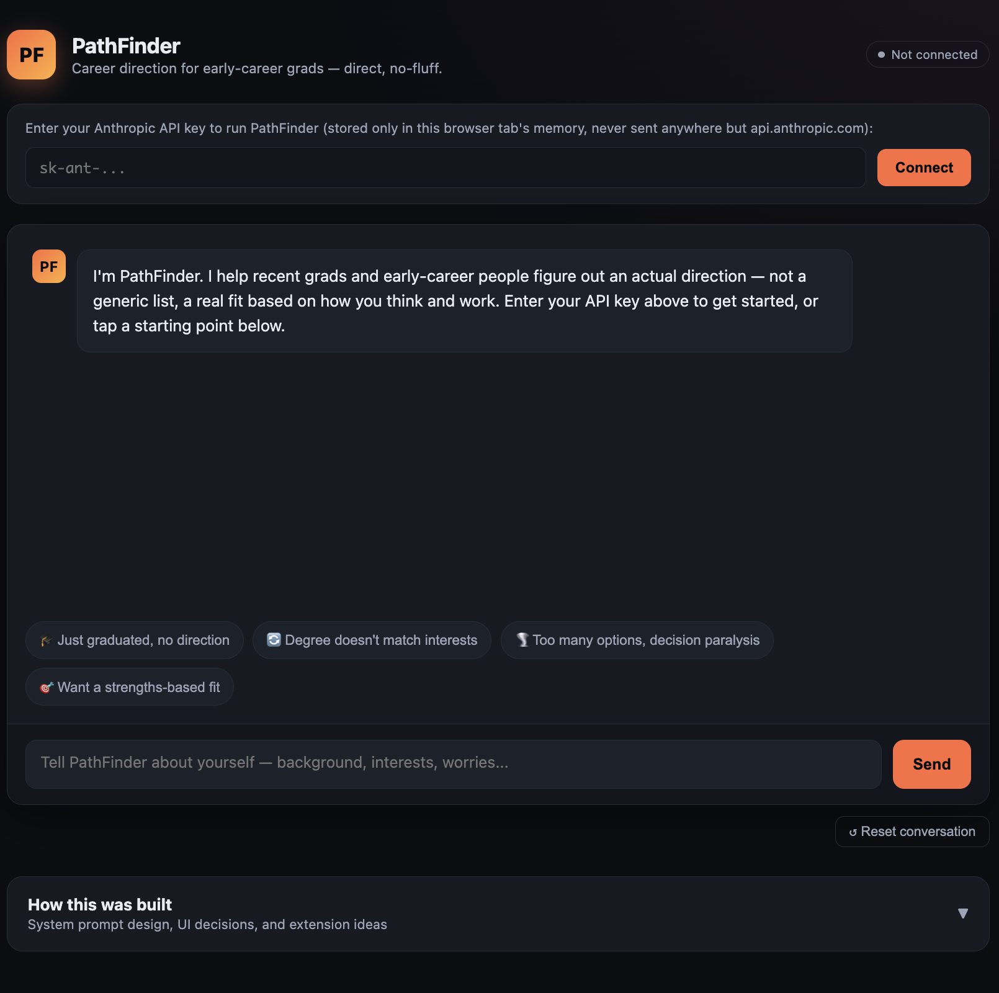

# 🚀 PathFinder – AI Career Direction Assistant

> **An AI-powered career guidance assistant that helps recent graduates and early-career professionals discover career paths based on their interests, strengths, work style, and constraints through an adaptive multi-turn conversation.**


---

# 📌 Overview

PathFinder is a premium AI assistant prototype built entirely in a **single HTML file**.

Instead of asking users to fill out long forms, it conducts a natural conversation, asking **one question at a time** to understand:

- Educational background
- Interests
- Natural strengths
- Work preferences
- Career constraints
- Previous experiences

After gathering enough information, it recommends career directions with clear reasoning and practical next steps.

---

# ✨ Features

## 🧠 AI-Powered Career Coach

- Adaptive multi-turn interview
- One question at a time
- Context-aware follow-up questions
- Personalized recommendations
- Honest trade-offs instead of generic advice

---

## 🎨 Premium UI

- Modern dark theme
- Responsive layout
- Animated chat interface
- Typing indicator
- Smooth transitions
- Professional micro-interactions

---

## ⚡ Claude API Integration

Uses the Anthropic Messages API.

```
POST https://api.anthropic.com/v1/messages
```

Features:

- fetch()
- Loading states
- Error handling
- Client-side API key
- Conversation history

---

## 📚 Built-in Documentation

Includes a collapsible panel explaining:

- System Prompt Design
- UI Decisions
- Extension Ideas
- Future Workflow

---

# 🖼️ Application Screenshot


Then reference it below.



---

# ⚙️ Tech Stack

| Technology | Purpose |
|------------|----------|
| HTML5 | Structure |
| CSS3 | Styling |
| JavaScript (ES6) | Logic |
| Claude API | AI Responses |
| Fetch API | HTTP Requests |

---

# 💻 Running the Project

Simply open the HTML file in your browser.

```
index.html
```

No installation required.

No build tools.

No dependencies.

---

# 🔑 Using the Application

1. Obtain an Anthropic API Key.

2. Open the application.

3. Paste the API key.

4. Click **Connect**.

5. Start chatting.

The API key is:

- Stored only in browser memory
- Never stored in LocalStorage
- Never saved on disk

---

# 🤖 AI Conversation Flow

```text
User Starts
      │
      ▼
Background
      │
      ▼
Interests
      │
      ▼
Strengths
      │
      ▼
Constraints
      │
      ▼
Follow-up Questions
      │
      ▼
Career Analysis
      │
      ▼
2–4 Career Recommendations
      │
      ▼
Actionable Next Steps
```

---

# 🧠 Prompt Engineering

The assistant is driven entirely by a carefully designed **System Prompt**.

The prompt defines:

- Assistant Role
- Scope
- Conversation Strategy
- Output Format
- Tone
- Constraints
- Edge Cases

The AI is instructed to:

- Ask only ONE question at a time
- Build upon previous answers
- Avoid generic career advice
- Tie recommendations directly to user responses
- Explain trade-offs honestly
- Avoid fabricated statistics
- Stay concise


---

# 🧩 Application Components

### Header

- Branding
- Connection Status

---

### API Connection

- API Key Input
- Secure Connection
- Status Indicator

---

### Chat Interface

- Assistant Messages
- User Messages
- Typing Animation
- Conversation History

---

### Quick Start

Example prompts such as:

- Just graduated
- No career direction
- Decision paralysis
- Degree mismatch

---

### Documentation Panel

Explains:

- Prompt design
- Architecture
- UI choices
- Future improvements

---

# 🔄 Claude API Request

```javascript
fetch("https://api.anthropic.com/v1/messages")
```

Request contains:

- Model
- System Prompt
- Conversation History
- Max Tokens

---

# 🎯 Design Principles

The interface follows several UX principles:

- Minimal cognitive load
- Progressive disclosure
- Conversational onboarding
- Clear visual hierarchy
- Fast interaction feedback
- Accessible color contrast

---

# 📈 Future Improvements

## Memory

- Save user profile
- Continue previous sessions

---

## Resume Upload

Allow users to upload:

- Resume
- CV
- LinkedIn Profile

for better recommendations.

---

## Career Roadmap

Generate:

- 30-Day Plan
- 90-Day Plan
- Learning Roadmap

---

## Job Market Integration

Connect APIs for:

- Salary
- Demand
- Job Trends

---

## Export

Export recommendations as:

- PDF
- Markdown
- DOCX

---

## Authentication

Add:

- Google Login
- User Accounts
- Saved Conversations

---

# 📚 Key Learnings

Building this project provided practical experience in:

- Prompt Engineering
- Conversation Design
- UX for AI Products
- API Integration
- Frontend Architecture
- Error Handling
- State Management
- Single-file Application Design
- Human-centered AI Interaction
- Production-ready UI Development

---

# 🧠 Prompt Engineering Learnings

Some important observations while designing the system prompt:

- Asking one question at a time improves response quality.
- AI performs better with clearly defined roles.
- Explicit output formatting reduces hallucinations.
- Defining constraints prevents generic advice.
- Multi-turn conversations create more personalized results.
- Honest trade-offs increase user trust.
- Edge-case instructions significantly improve robustness.

---

# 🔒 Privacy

- API key remains in browser memory only.
- No LocalStorage.
- No cookies.
- No backend.
- No user data collection.

---

# 🙏 Acknowledgements

- Anthropic Claude API
- Prompt Engineering Community
- Modern Conversational UX Principles

---


## ⭐ If you found this project useful, consider giving it a Star!
