# 💰 Personal Financial Command Center

> **An AI-generated interactive financial dashboard designed to help freelancers and independent professionals understand, manage, and improve their financial health.**

<p align="center">


</p>

---

# 📖 Overview

Managing irregular freelance income is challenging.

Traditional expense trackers only record transactions—they don't help users understand **cash flow**, **runway**, **financial health**, **income stability**, or **future planning**.

The **Personal Financial Command Center** transforms financial data into an interactive dashboard that provides meaningful insights, planning tools, simulations, investment tracking, AI recommendations, and financial health analysis.

Instead of simply recording expenses, this application helps users answer:

- 📈 How financially healthy am I?
- 💵 How long can I survive without new income?
- 🎯 Am I saving enough?
- 📊 Is my investment allocation balanced?
- ⚠️ What happens if I lose a client?
- 🤖 What improvements should I make?

---

# ✨ Key Features

## 📊 Financial Overview Dashboard

- Monthly income
- Portfolio value
- Runway
- Active income streams
- Financial Health Score
- Live recalculation

---

## 💼 Income Management

Track multiple income sources:

- Retainers
- Hourly work
- Projects
- Royalties
- Custom streams

Includes:

- Reliability scoring
- Income concentration
- Stable vs Variable income analysis

---

## 💸 Cash Flow Analysis

Calculate:

- Cash on hand
- Monthly burn rate
- Financial runway
- Income waveform visualization

---

## 💳 Expense Tracking

Separate:

- Business expenses
- Personal expenses

Visualized using:

- Interactive donut charts
- Expense distribution
- Budget summaries

---

## 🏦 Tax & Savings Planner

Automatically calculate:

- Monthly tax reserve
- Emergency fund target
- Emergency fund progress
- Savings recommendations

---

## 📈 Investment Dashboard

Track:

- Mutual Funds
- Stocks
- Fixed Deposits
- Gold
- Cash
- Other assets

Visual features:

- Portfolio allocation
- Asset distribution
- Total investment value

---

## 🎯 Goal Tracking

Create savings goals like:

- Emergency fund
- Laptop
- Vacation
- Down payment
- Education

Each goal includes:

- Progress bars
- Funding percentage
- Saved amount
- Target amount

---

## 🔥 What-if Simulator

Simulate real-life financial scenarios:

- Lose a client
- Income reduction
- Increase rates
- Reduce expenses

Automatically recalculates:

- Runway
- Financial stability
- Recommendations

---

## 🧮 Financial Calculators

Includes:

### Freelance Day Rate Calculator

Calculate ideal daily pricing.

### Break-even Calculator

Estimate minimum hourly rate for projects.

---

## 🤖 AI Financial Insights

Generates recommendations such as:

- Income diversification
- Runway improvement
- Spending analysis
- Goal recommendations
- Portfolio suggestions

---

## ✅ Monthly Financial Checklist

Interactive checklist including:

- Invoice reconciliation
- Tax allocation
- Subscription review
- Investment reminders
- Payment follow-ups

---

## 📚 Financial Literacy Resources

Includes:

- AI prompts
- Learning resources
- Planning tips
- Freelancer financial checklist

---

# 🎨 UI Highlights

✔ Premium Dark Theme

✔ Smooth animations

✔ Commercial dashboard aesthetics

✔ Fully Responsive

✔ Interactive Charts

✔ SVG Visualizations

✔ Glassmorphism-inspired cards

✔ Elegant Typography

✔ Local Storage Support

✔ Printable Reports

---
# 🖼️ Application Screenshots

## 🏠 Hero Section

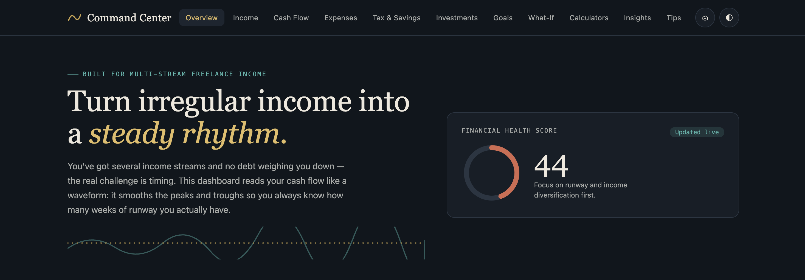

The landing page introduces the **Personal Financial Command Center** with a premium dark UI, financial health score, and navigation to all financial modules.

---

## 📊 Dashboard Overview

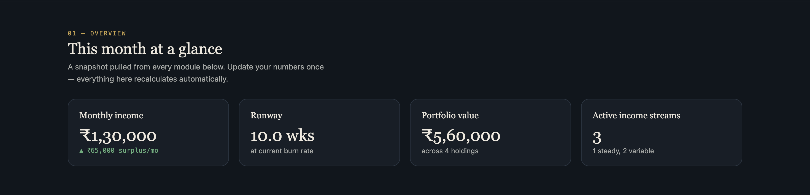

Provides an overall snapshot including:

- Monthly Income
- Financial Runway
- Portfolio Value
- Active Income Streams

---

## 💼 Income Streams

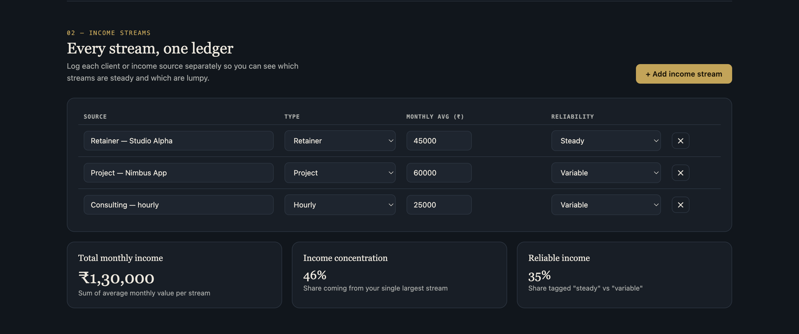

Track and manage multiple income sources.

**Features**

- Add/Edit/Delete income streams
- Income reliability
- Monthly income calculation
- Income concentration analysis

---

## 💰 Cash Flow & Runway

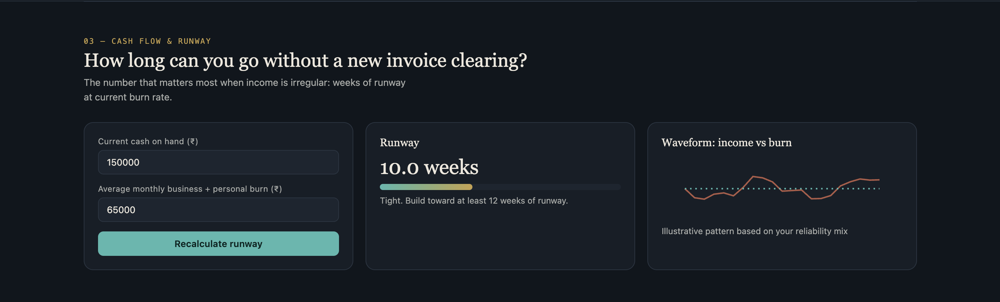

Analyze your financial runway using:

- Cash on hand
- Monthly burn rate
- Runway calculation
- Income vs Burn waveform

---

## 💳 Expenses & Budget

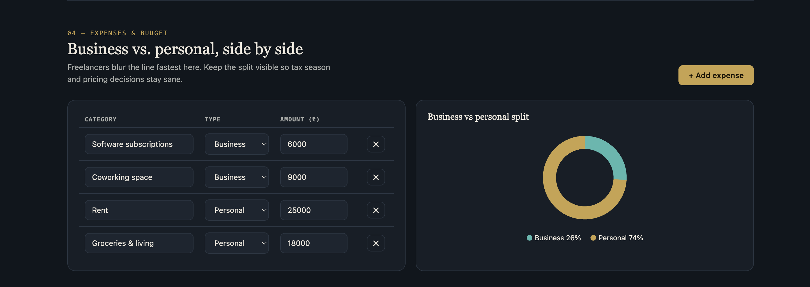

Separate personal and business expenses.

Includes

- Expense categories
- Expense tracking
- Business vs Personal analysis
- Interactive donut chart

---

## 🏦 Tax Reserve & Savings

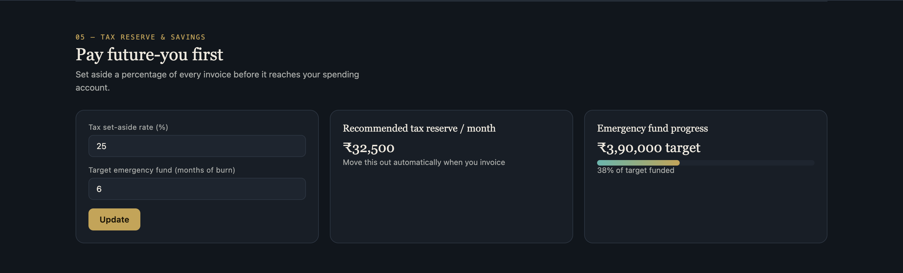

Automatically estimates

- Tax reserve
- Emergency fund target
- Savings progress
- Funding percentage

---

## 📈 Investment Portfolio

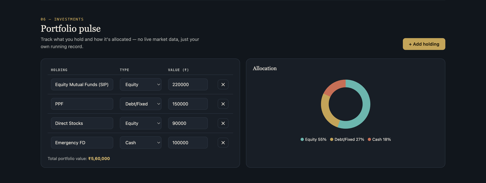

Monitor your investments.

Supports

- Mutual Funds
- Stocks
- Fixed Deposits
- Cash
- Asset Allocation Chart

---

## 🎯 Financial Goals

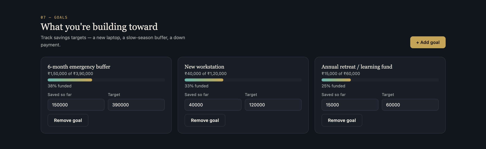

Track financial goals with progress indicators.

Examples

- Emergency Fund
- Laptop
- Learning Fund
- Personal Savings

---

## 🔮 What-If Simulator

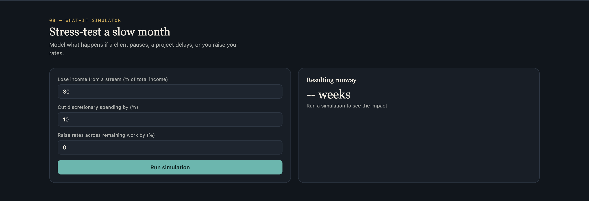

Simulate real-world financial situations.

Examples

- Client loss
- Expense reduction
- Income increase
- New runway estimation

---

## 🧮 Financial Calculators

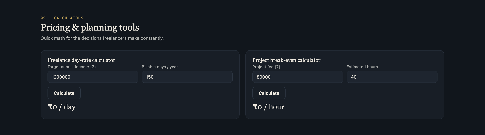

Built-in tools include

- Freelance Day Rate Calculator
- Project Break-even Calculator

---

## 🤖 AI Financial Insights

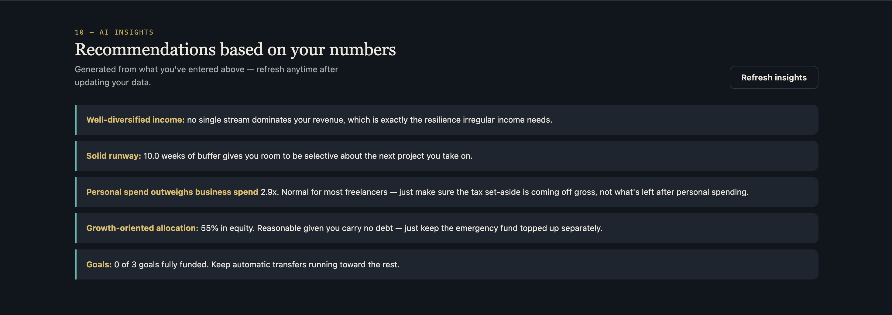

Automatically generates recommendations based on:

- Income
- Investments
- Runway
- Expenses
- Goals

---

## 📚 Financial Tips & Resources

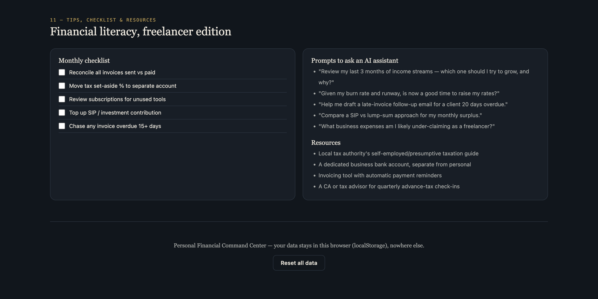

Includes

- Monthly Checklist
- Financial Resources
- AI Prompts
- Financial Literacy Guide


---

# 🛠 Technologies Used

- HTML5
- CSS3
- JavaScript (Vanilla)
- SVG Charts
- Local Storage API

No frameworks or external libraries were used.

Everything is contained inside a **single HTML file**.

---


# 💾 Data Storage

The application stores data locally using:

```
localStorage
```

No backend is required.

No user information leaves the browser.

---

# 🎯 Learning Outcomes

This project helped me learn:

- Prompt Engineering
- AI-assisted application generation
- Financial dashboard design
- UI/UX design principles
- Data visualization
- SVG graphics
- Local Storage implementation
- Financial planning concepts
- Responsive web design
- Interactive dashboard development

---

# 🧠 Prompt Engineering

This project was generated using an advanced AI prompt that instructed the model to:

- Ask personalized financial questions
- Build a premium commercial dashboard
- Generate responsive UI
- Include AI recommendations
- Implement interactive charts
- Build calculators
- Simulate financial scenarios
- Store data locally
- Avoid external libraries
- Produce a complete single-file application

The generated output was further reviewed, tested, and refined.

---

# 📌 Highlights

- ✅ Fully Offline
- ✅ Single HTML File
- ✅ Responsive Design
- ✅ Interactive Charts
- ✅ AI Insights
- ✅ Financial Health Score
- ✅ Local Storage
- ✅ Print Support
- ✅ Dark Mode
- ✅ Commercial UI

---

# 📈 Future Improvements

- Export PDF reports
- CSV import/export
- Authentication
- Cloud synchronization
- Multi-user support
- Budget forecasting
- Recurring transactions
- Real-time market integration
- AI chatbot assistant
- Mobile application

---

# 🤝 Acknowledgements

Special thanks to modern AI tools for assisting with rapid prototyping, prompt engineering, UI generation, and accelerating the development workflow.

---

⭐ If you found this project useful, consider giving it a **Star** on GitHub.
