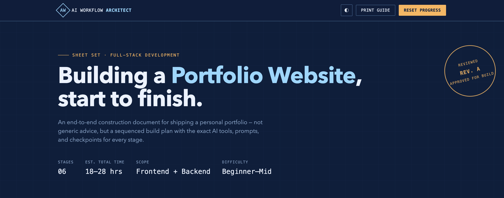
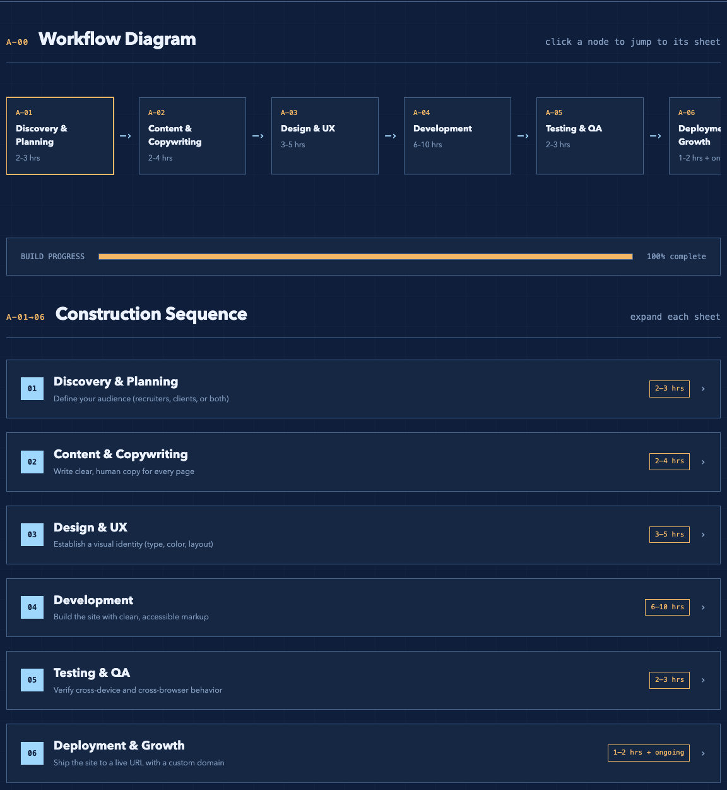
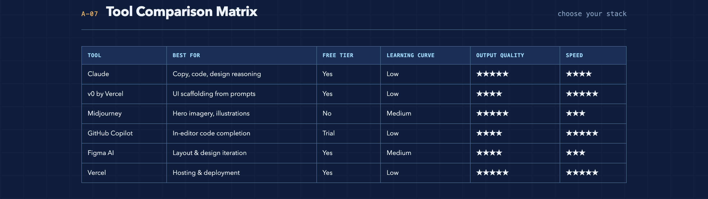
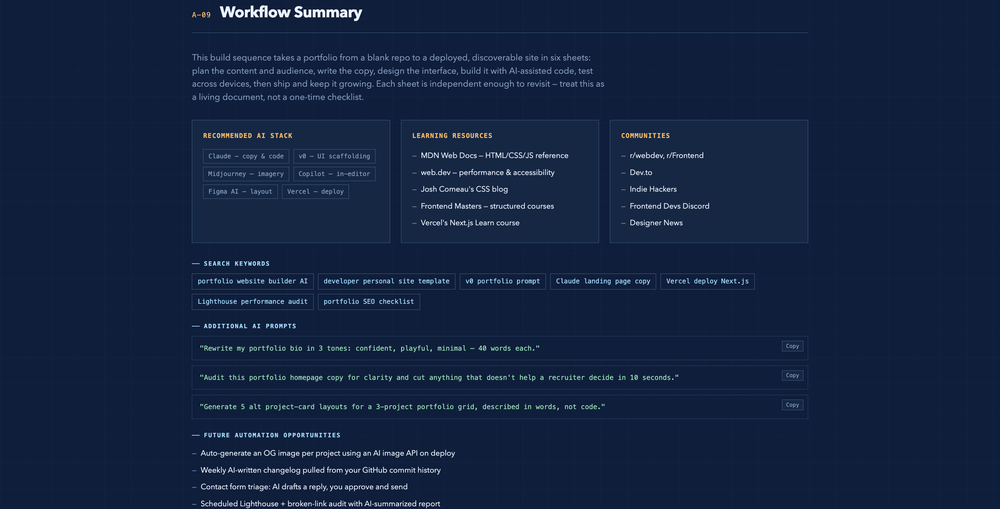
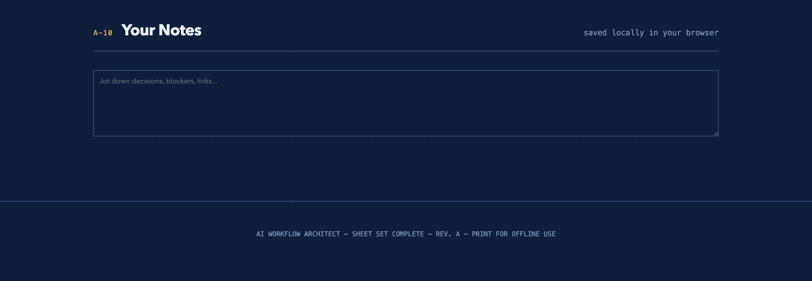

<div align="center">

# 🤖 AI Workflow Architect

### Build complete end-to-end workflows with AI — from planning to execution.

A premium **single-page HTML application** that generates structured workflow blueprints for any industry or process using AI-guided decision making.


</div>

---

# 📖 Overview

**AI Workflow Architect** is an interactive workflow planning platform built entirely with **HTML, CSS, and JavaScript**.

Instead of giving generic advice or simple checklists, the application creates a complete workflow from **start to finish**, including planning, execution, AI tools, prompts, best practices, expected outputs, automation opportunities, and deployment guidance.

This project was developed as part of the **ABTalks 60 Days Challenge (Day 43)**.

---

# ✨ Features

## ✅ Interactive Workflow Builder

Generate complete workflows broken into logical execution stages.

- Discovery & Planning
- Content Strategy
- Design & UX
- Development
- Testing & QA
- Deployment & Growth

---

## 🤖 AI Tool Recommendations

Every workflow stage includes

- Best AI tools
- Why those tools are recommended
- Alternative tools
- Prompt examples
- Expected outputs

---

## 📊 Workflow Visualization

Interactive workflow diagram allowing users to jump directly to any workflow stage.

---

## 🌳 Decision Tree

Smart decision tree for choosing the correct technology stack.

Example:

```
Know React?
      │
 ┌────┴────┐
 Yes      No
 │          │
Next.js   HTML/CSS/JS
```

---

## 📈 Progress Tracking

Users can track their workflow completion with an interactive progress bar.

---

## 📝 Local Notes

Each workflow stage contains personal notes.

Notes are automatically saved using Local Storage.

---

## 📚 Workflow Summary

At the end of the workflow users receive

- Recommended AI Stack
- Learning Resources
- Communities
- Search Keywords
- AI Prompts
- Automation Opportunities

---

## 🖨 Print Friendly

Generate a printable workflow guide with one click.

---

## 🌙 Dark / Light Theme

Supports

- Dark Mode
- Light Mode

with persistent theme storage.

---

## 💾 Local Storage

Automatically stores

- Progress
- Notes
- Bookmarks
- Theme

No backend required.

---

# 🛠 Technologies Used

- HTML5
- CSS3
- JavaScript (Vanilla)
- Local Storage API

No frameworks.

No external libraries.

No build tools.

Everything runs inside a single HTML file.


---

# 📸 Screenshots

## Home



---

## Workflow Diagram



---

## Tool Comparison Matrix



---

## Decision Tree


---

## Workflow Summary



---

## Notes Section




---

# 🎯 Workflow Stages

The generated workflow includes

| Stage | Description |
|---------|-------------|
| Discovery & Planning | Define audience, objectives and scope |
| Content & Copywriting | Generate professional content |
| Design & UX | Layout, branding and wireframes |
| Development | Build the project |
| Testing & QA | Performance, accessibility and quality assurance |
| Deployment & Growth | Launch, SEO and future improvements |

---

# 💡 Key Features Included

- Interactive Workflow Diagram
- Expandable Workflow Sheets
- Tool Comparison Matrix
- Decision Tree
- AI Prompt Library
- Workflow Progress Tracking
- Local Notes
- Bookmark Sections
- Dark Mode
- Light Mode
- Local Storage
- Print Workflow Guide
- Responsive Design
- Smooth Animations

---

# 📌 AI Tools Featured

The workflow recommends modern AI tools including

- Claude
- ChatGPT
- Vercel v0
- GitHub Copilot
- Midjourney
- Figma AI
- Vercel

---

# 🎓 Key Learnings

During this project I learned

✅ Designing large single-page applications

✅ Building interactive UI without frameworks

✅ Creating reusable workflow components

✅ Managing application state using Local Storage

✅ Designing workflow diagrams

✅ Building decision trees

✅ Creating printable web applications

✅ Implementing dark/light theme switching

✅ Structuring AI-generated workflows

✅ Improving UX with animations and progressive disclosure

---

# 🔥 Challenges Faced

- Designing an intuitive workflow visualization
- Managing interactive expandable sections
- Keeping the application responsive
- Creating reusable workflow components
- Organizing large amounts of information without overwhelming users
- Implementing persistent local storage
- Designing a clean blueprint-inspired UI

---

# 📈 Future Improvements

- Export workflows as PDF
- Export Markdown documentation
- JSON workflow import/export
- AI API integration
- Multi-workflow support
- Authentication
- Cloud synchronization
- Search functionality
- Bookmark manager
- Workflow templates
- Team collaboration

---

# 🎯 Challenge Submission

This project was created as part of the

**ABTalks – 60 Days Challenge**

### Deliverables

- ✅ HTML Application
- ✅ Screenshots
- ✅ GitHub Repository
- ✅ Documentation
- ✅ Key Learnings

---

# ⭐ If you found this project helpful

Please consider giving this repository a **Star ⭐**

It helps others discover the project and motivates future development.
