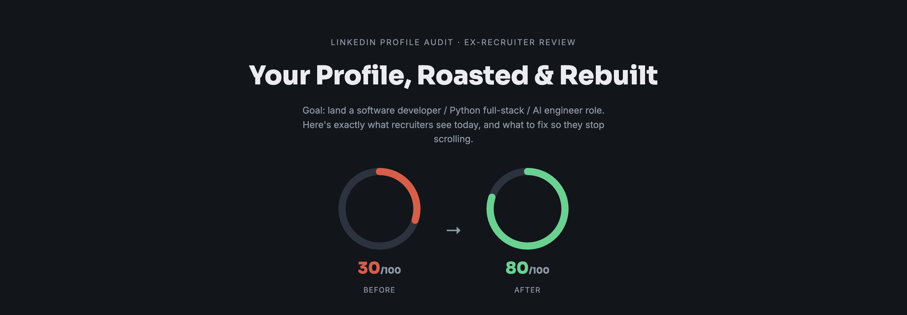
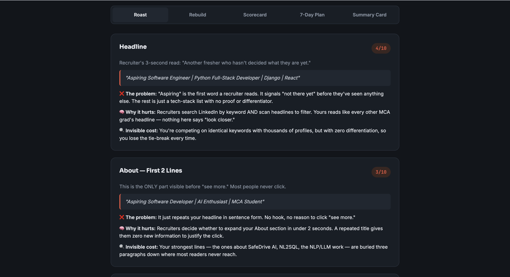
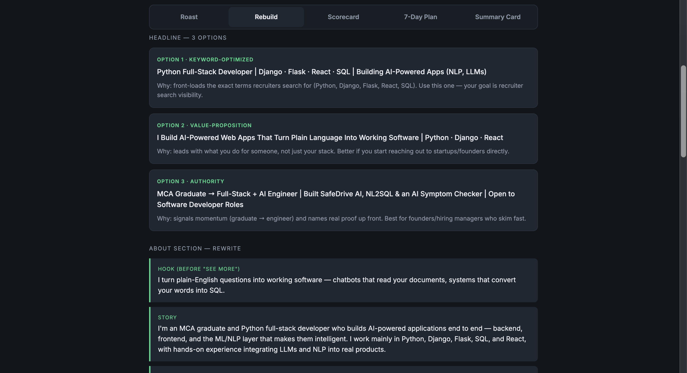
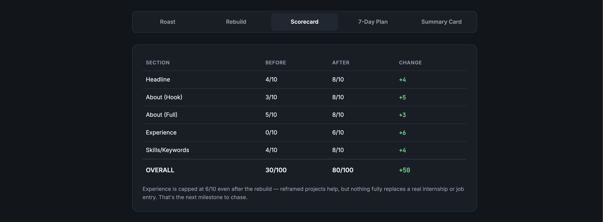
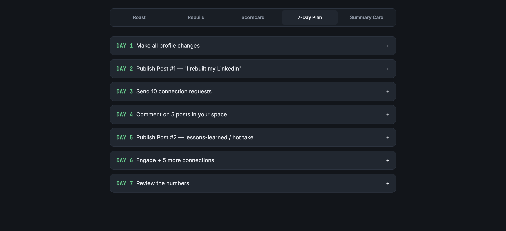
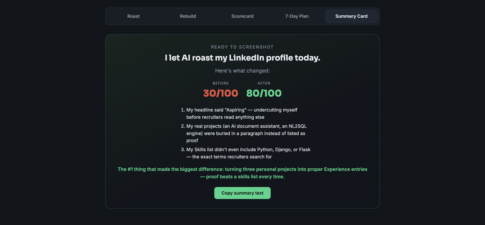

<h1 align="center">🚀 LinkedIn Profile Roast & Rebuild AI</h1>

<h3 align="center">
Interactive HTML Application for LinkedIn Profile Optimization
</h3>

<b>
Transform any LinkedIn profile into a recruiter-friendly profile using AI-powered analysis, personalized recommendations, and a complete 7-day LinkedIn growth roadmap.
</b>

⭐ AI Powered • 🔥 Recruiter Review • 🚀 LinkedIn Optimization • 📈 Personal Branding • 💼 Career Growth

---

# 📑 Table of Contents

- 📌 Project Overview
- 💡 Why This Project?
- 🎯 Objectives
- ✨ Features
- 🌐 Live Demo
- 🖥 User Interface
- 📸 Screenshots
- 🛠 Technologies Used
- 🎯 Prompt Engineering
- 📈 UI Highlights
- 🧠 Skills Demonstrated
- 💡 Key Learnings
- 📊 Project Statistics
- 🚀 Future Improvements
- 📚 Challenge Information
- 🏆 Project Outcome

---

# 📌 Project Overview

LinkedIn is one of the most powerful platforms for career growth, networking, and job opportunities. However, many professionals and students struggle to present their experience in a way that captures a recruiter's attention.

**LinkedIn Profile Roast & Rebuild AI** is an interactive single-page HTML application that simulates an AI-powered LinkedIn consultant.

Instead of providing generic suggestions, the application performs a recruiter-style audit, identifies weaknesses, explains why they matter, and completely rebuilds the profile with optimized content.

The application combines **Prompt Engineering**, **Frontend Development**, and **Personal Branding** into one modern interactive dashboard.

---

# 💡 Why This Project?

Most LinkedIn optimization tools simply assign a score or list generic suggestions.

This project goes much further.

It acts like an experienced recruiter who reviews thousands of LinkedIn profiles every year and provides:

- Honest recruiter feedback
- Complete profile rewrites
- Keyword optimization
- Personal branding improvements
- Actionable growth strategies
- A personalized 7-day roadmap

Instead of telling users **what is wrong**, it teaches them **how to improve** and **why those improvements matter**.

---

# 🎯 Objectives

The primary objectives of this project are:

- Improve LinkedIn search visibility
- Increase recruiter engagement
- Build a stronger personal brand
- Optimize profile keywords
- Rewrite weak profile sections
- Improve storytelling
- Increase profile conversion
- Provide actionable career guidance
- Generate a professional LinkedIn strategy

---

# ✨ Features

## 🔥 Recruiter Profile Roast

The application performs a recruiter-style audit of the profile.

### Includes

- Headline Analysis
- About Section Review
- Experience Review
- Skills Evaluation
- Recruiter's First Impression
- Hidden Opportunity Cost
- Overall Profile Score

---

## 🚀 Complete Profile Rebuild

Instead of only pointing out mistakes, the application completely rewrites the profile.

### Generates

- 3 Optimized Headlines
- Complete About Section
- Experience Rewrite
- Skills Recommendations
- Keyword Optimization
- Professional Call-to-Action

---

## 📊 Before vs After Scorecard

A visual comparison showing measurable improvement.

| Section | Before | After |
|----------|---------|--------|
| Headline | 4/10 | 8/10 |
| About | 3/10 | 8/10 |
| Experience | 0/10 | 6/10 |
| Skills | 4/10 | 8/10 |
| Overall | **30/100** | **80/100** |

---

## 📅 Personalized 7-Day LinkedIn Growth Plan

The application creates a practical action plan including:

- ✅ Profile Optimization Checklist
- ✅ LinkedIn Content Ideas
- ✅ Networking Strategy
- ✅ Recruiter Outreach
- ✅ Connection Templates
- ✅ Comment Strategy
- ✅ Progress Tracking

---

## 📸 Shareable Summary Card

At the end of the report, the application generates a professional summary card that users can:

- Screenshot
- Share on LinkedIn
- Post on Social Media
- Showcase Profile Improvements

---

## 🎨 Modern Interactive Dashboard

The application is designed with a clean and modern interface featuring:

- Interactive Navigation Tabs
- Responsive Layout
- Dark Theme
- Animated Score Gauges
- Collapsible Sections
- Professional Card Components
- Copy-to-Clipboard Support

---

# 🌐 Live Demo

> 🚧 Coming Soon

Future deployment will be available using **GitHub Pages**.

---

# 🖼 User Interface

The application is designed as a modern single-page interactive dashboard with multiple sections, allowing users to navigate seamlessly between profile analysis and improvement recommendations.

### Dashboard Sections

- 🏠 Hero Dashboard
- 🔥 Profile Roast
- 🚀 Profile Rebuild
- 📊 Before vs After Scorecard
- 📅 7-Day LinkedIn Growth Plan
- 📄 Shareable Summary Card

---

# 📸 Screenshots

## 🏠 Home Dashboard

The landing page introduces the application with an overall profile score comparison, modern dark UI, and navigation tabs.

---

## 🔥 Recruiter Roast

An honest recruiter-style review highlighting profile weaknesses, recruiter reactions, hidden opportunity costs, and overall scoring.

---

## 🚀 Profile Rebuild

AI-generated improvements including optimized headlines, About section, experience rewrite, keyword suggestions, and branding enhancements.

---

## 📊 Before vs After Scorecard

Visual comparison of profile improvements across every major LinkedIn section.

---

## 📅 7-Day LinkedIn Growth Plan

Step-by-step personalized roadmap to improve profile visibility, engagement, and recruiter reach.

---

## 📄 Shareable Summary Card

A final summary card highlighting profile improvements that users can easily share on LinkedIn or social media.

---

# 🛠 Technologies Used

| Technology | Purpose |
|------------|---------|
| HTML5 | Application Structure |
| CSS3 | Styling & Layout |
| Vanilla JavaScript | Interactivity |
| Google Fonts | Typography |
| Responsive Design | Mobile Compatibility |
| Prompt Engineering | AI Workflow Design |

---

# 🎯 Prompt Engineering

This application was built using a carefully engineered AI prompt designed to simulate the behavior of an experienced LinkedIn consultant.

The prompt follows a structured workflow:

### Step 1

Collects user information

- Current Headline
- About Section
- Experience
- Skills
- Career Goals

---

### Step 2

Performs a recruiter-style audit by evaluating

- Headline
- About
- Experience
- Skills
- Search Visibility

---

### Step 3

Completely rebuilds the profile

- New Headlines
- New About
- Improved Experience
- Keyword Optimization
- Skills Recommendations

---

### Step 4

Measures improvement using

- Before vs After Score
- Recruiter Perspective
- Opportunity Analysis

---

### Step 5

Generates

- 7-Day LinkedIn Action Plan
- Ready-to-post LinkedIn Content
- Connection Templates
- Summary Card

---

# 📈 UI Highlights

The interface focuses on usability, readability, and recruiter-style presentation.

### Design Highlights

✅ Modern Dark Theme

✅ Responsive Layout

✅ Professional Typography

✅ Animated Score Gauges

✅ Interactive Navigation Tabs

✅ Expandable Sections

✅ Card-based Dashboard

✅ Before vs After Comparison

✅ Copy-to-Clipboard Feature

✅ Mobile Friendly

---

# 🎨 Design Principles

The UI follows modern dashboard principles:

- Minimalistic Layout
- Consistent Color Palette
- Clear Information Hierarchy
- High Readability
- Accessible Typography
- Smooth User Experience

---

# 🧠 Skills Demonstrated

This project demonstrates knowledge in:

### Frontend Development

- HTML5
- CSS3
- JavaScript

### AI & Prompt Engineering

- Prompt Design
- Structured AI Workflows
- User-Centric Prompting
- Context Management

### UI/UX

- Dashboard Design
- Responsive Design
- Component-Based Layout
- Information Architecture

### Career Development

- LinkedIn Optimization
- Personal Branding
- Recruiter Psychology
- Resume Strategy

---

# 💡 Key Learnings

During this project, I learned:

- Writing structured prompts for AI applications
- Designing recruiter-focused user experiences
- Building interactive dashboards without frameworks
- Organizing large HTML projects
- Improving technical documentation
- Creating responsive layouts
- Designing reusable UI components
- Applying modern dashboard design principles
- Understanding LinkedIn optimization strategies
- Combining Prompt Engineering with Frontend Development

---

# 📊 Project Statistics

| Category | Details |
|-----------|----------|
| 💻 Language | HTML5, CSS3, JavaScript |
| 📄 Application Type | Interactive Single-Page HTML |
| 📱 Responsive Design | ✅ Yes |
| 🌙 Dark Theme | ✅ Yes |
| 🧩 UI Components | 25+ |
| 📊 Dashboard Sections | 6 |
| 🖼 Screenshots | 6 |
| 🎯 Challenge | ABTalks 60 Days AI Challenge |
| 📅 Challenge Day | Day 44 |
| 🤖 Prompt Engineering | Advanced |
| 🚀 Deployment | Static HTML |
| 📦 Dependencies | None |

---

# 🚀 Future Improvements

This project serves as the foundation for a complete AI-powered career development platform.

Future improvements include:

## 🤖 AI Integrations

- OpenAI API
- Gemini API
- Claude API
- Grok API
- DeepSeek API

---

## 📄 Resume Features

- ATS Resume Checker
- Resume Score Calculator
- Resume Keyword Optimizer
- Resume Rewriter
- Cover Letter Generator

---

## 💼 LinkedIn Features

- LinkedIn Banner Generator
- Headline Generator
- Featured Section Builder
- Skill Recommendation Engine
- Profile Completeness Checker

---

## 📊 Analytics

- Recruiter Visibility Score
- Keyword Ranking
- Profile Strength History
- Improvement Tracking
- Weekly Progress Report

---

## 📥 Export Options

- Export as PDF
- Export as HTML
- Print Friendly Report
- Shareable Report Link

---

## 🌐 Deployment

- GitHub Pages
- Netlify
- Vercel

---

# 📚 Challenge Information

| Item | Details |
|------|----------|
| Challenge | ABTalks 60 Days AI Challenge |
| Day | 44 |
| Category | Prompt Engineering + Frontend |
| Deliverable | Interactive HTML Application |
| Theme | LinkedIn Optimization |

---

# 🏆 Project Outcome

This project successfully demonstrates the integration of modern frontend development with prompt engineering to solve a real-world problem.

### Achievements

✅ Interactive HTML Dashboard

✅ Recruiter-style LinkedIn Audit

✅ AI-Powered Recommendations

✅ Personal Branding Strategy

✅ Professional Documentation

✅ Modern Responsive UI

✅ Prompt Engineering Workflow

---

# 🌟 What Makes This Project Different?

Unlike traditional LinkedIn profile analyzers, this application:

✔ Thinks like an experienced recruiter.

✔ Explains why improvements matter.

✔ Rewrites the entire profile instead of giving generic suggestions.

✔ Generates a complete career improvement roadmap.

✔ Creates recruiter-focused content instead of AI-generated fluff.

✔ Combines Prompt Engineering, UI Design, and Career Development into one application.

---

# 🎯 Skills Demonstrated

This project showcases practical skills in:

### 💻 Frontend Development

- HTML5
- CSS3
- JavaScript
- Responsive Design

---

### 🤖 Prompt Engineering

- Structured Prompt Design
- AI Workflow Design
- Context Engineering
- User Input Collection
- Output Formatting

---

### 🎨 UI / UX Design

- Dashboard Design
- Card Components
- Dark Theme
- Typography
- User Experience
- Information Hierarchy

---

### 💼 Professional Skills

- Technical Documentation
- Personal Branding
- Product Thinking
- Problem Solving
- Recruiter Psychology

---

# 📈 Key Learnings

Building this project helped strengthen my understanding of:

- Advanced Prompt Engineering
- Interactive Frontend Development
- User Experience Design
- Documentation Best Practices
- Modern GitHub Repository Structure
- Information Architecture
- AI-assisted Product Development
- Personal Branding Concepts
- Career-focused Product Design

---

# ⭐ Support

If you found this project useful:

🌟 Star this repository

🍴 Fork it

💬 Share your feedback

🤝 Contribute to improve it

---

# 🚀 Thank You for Visiting!

### If you like this project, don't forget to ⭐ Star the repository.

**Happy Coding! 🚀**

