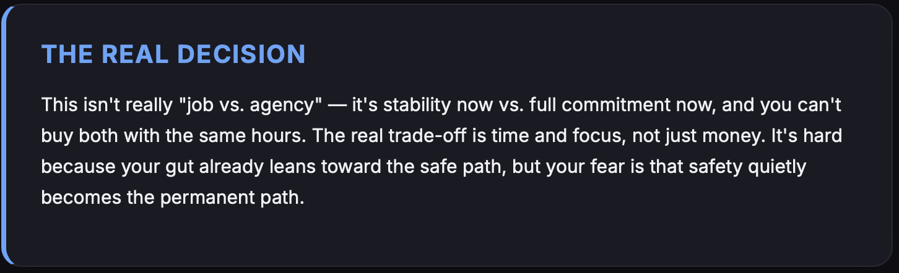
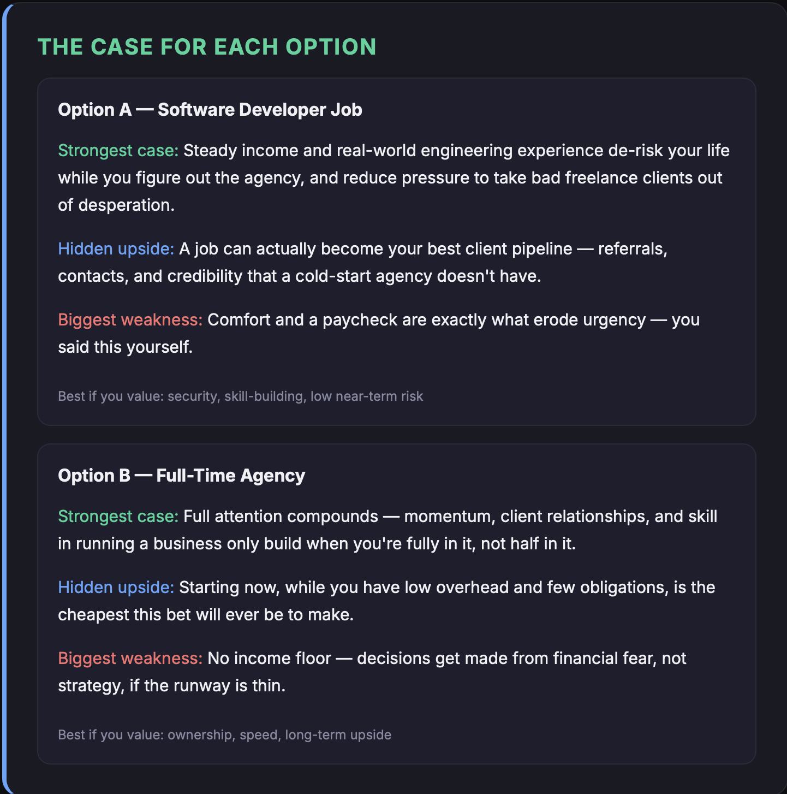
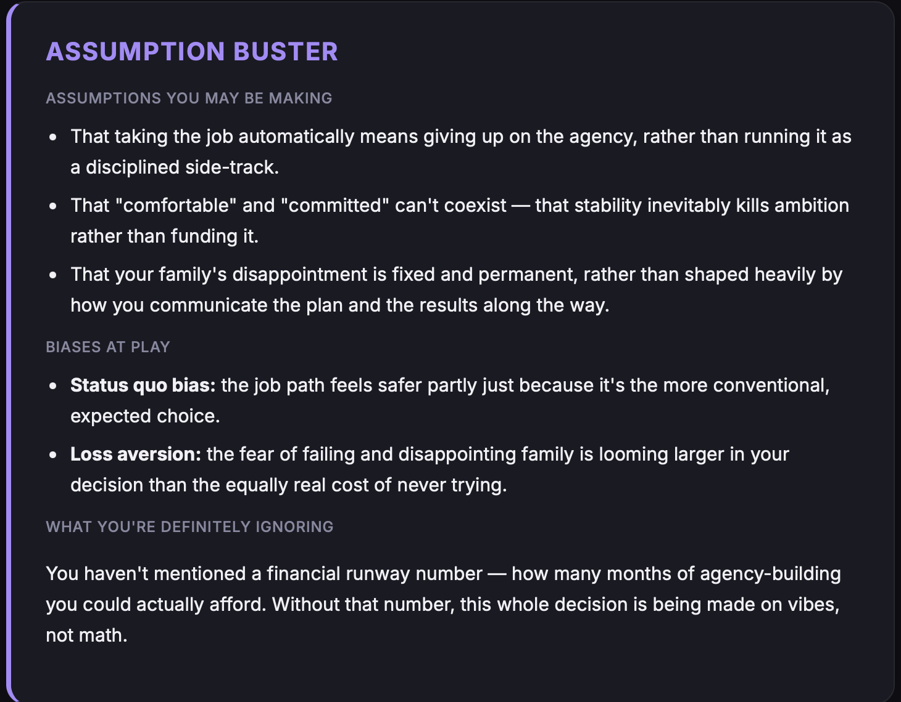
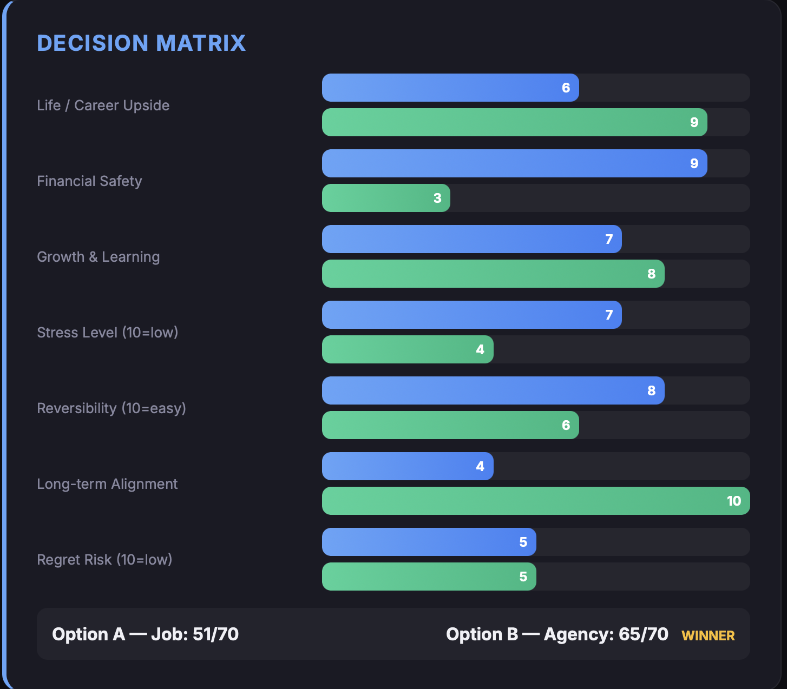
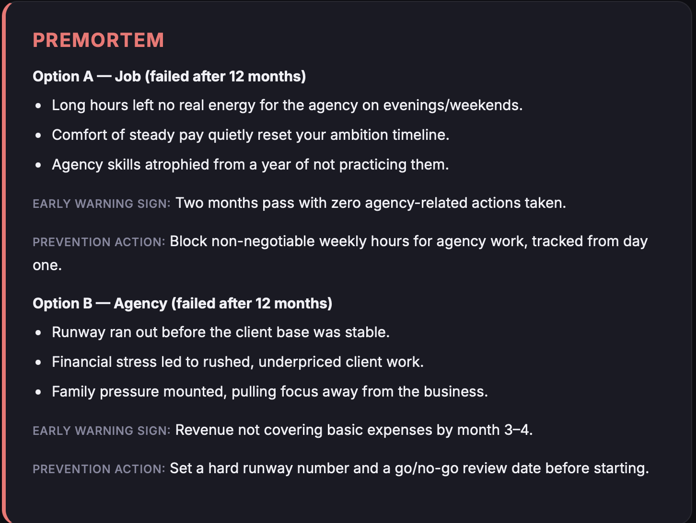
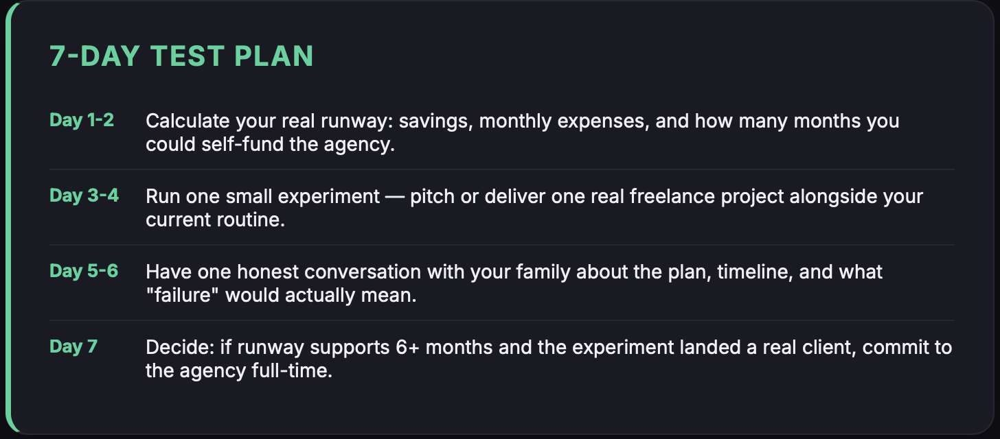
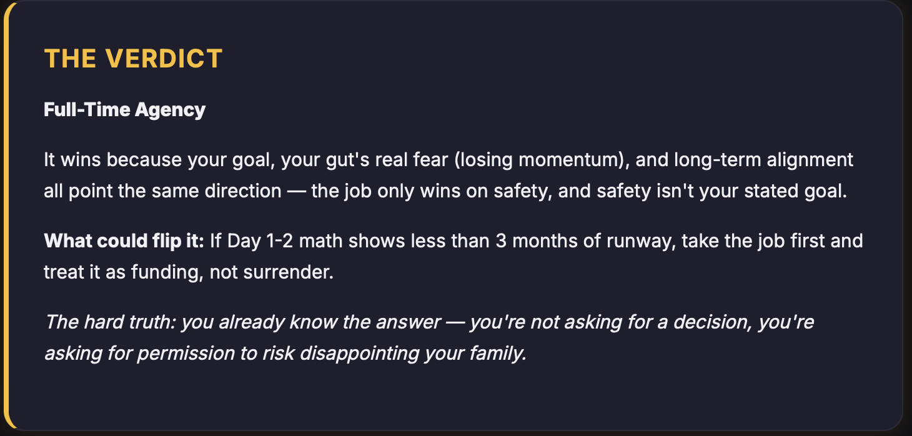
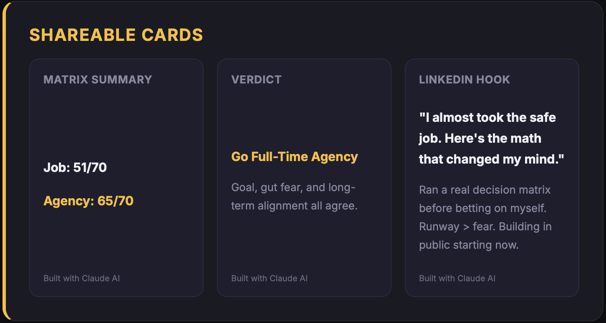

# 🧠 Decision Report Generator
### ABTalks 60-Day Challenge — Day 45

> Build an AI-powered interactive **Decision Report Dashboard** using Claude AI that interviews the user, analyzes their decision objectively, and generates a beautiful HTML report.

---

## 📌 Project Overview

This project demonstrates how Large Language Models (LLMs) can be used as **Decision Strategists** instead of simply providing answers.

The application follows a structured interview process, gathers only the required information, and automatically generates a modern interactive HTML dashboard containing:

- Decision Analysis
- Decision Matrix
- Assumption Analysis
- Premortem
- 7-Day Action Plan
- Final Verdict
- Shareable Cards

The generated report is completely self-contained in a single HTML file with responsive design, animations, and professional UI.

---

# 🎯 Objective

The objective of this challenge was to:

- Build an AI-powered decision assistant.
- Minimize unnecessary conversation.
- Generate a polished interactive HTML report.
- Create an attractive dashboard using only HTML, CSS and JavaScript.
- Practice prompt engineering with Claude AI.

---

# ✨ Features

✅ Interactive 4-question interview

✅ One question at a time conversation

✅ Concise AI responses

✅ Professional Decision Report

✅ Modern Dark UI

✅ Animated Decision Matrix

✅ Assumption Buster

✅ Premortem Analysis

✅ 7-Day Decision Plan

✅ Final AI Verdict

✅ Shareable Summary Cards

✅ Responsive Design

✅ Pure HTML/CSS/JavaScript

---

# 🖥️ Built With

- HTML5
- CSS3
- JavaScript
- Claude AI
- Prompt Engineering

---


# 🚀 How It Works

### Step 1

Claude acts as an impartial Decision Strategist.

↓

### Step 2

Claude asks exactly **4 interview questions**

↓

### Step 3

The user's responses are collected.

↓

### Step 4

Claude generates a complete interactive HTML application.

↓

### Step 5

Open the HTML file in any browser.

↓

### Step 6

Review the generated Decision Report.

---

# 📊 Report Includes

## 1. The Real Decision

- Core decision summary
- Emotional trade-offs
- Real conflict behind the choice

---

## 2. Case For Each Option

Each option contains:

- Strengths
- Hidden Advantages
- Weaknesses
- Best suited for

---

## 3. Assumption Buster

Includes

- Hidden assumptions
- Cognitive biases
- Missing considerations

---

## 4. Decision Matrix

Evaluates every option on:

- Career Upside
- Financial Safety
- Growth
- Stress
- Reversibility
- Long-Term Alignment
- Regret Risk

Animated score bars automatically load when opening the page.

---

## 5. Premortem

Imagine each option failed after 12 months.

Includes:

- Failure reasons
- Early warning signs
- Prevention actions

---

## 6. 7-Day Test Plan

Actionable roadmap to validate the decision before fully committing.

---

## 7. Final Verdict

Claude selects the strongest option and explains:

- Why it wins
- What could change the decision
- Hard truth

---

## 8. Shareable Cards

Includes screenshot-friendly cards for:

- Decision Matrix
- Final Verdict
- LinkedIn Post

---

# 🎨 UI Highlights

- Modern Dark Theme
- Responsive Layout
- Card-based Design
- Gradient Header
- Animated Progress Bars
- Hover Effects
- Mobile Friendly
- Smooth Scrolling
- Professional Typography (Inter Font)

---

# 📸 Project Screenshots

## 🏠 Home Page

Shows the report header with the decision topic, generation date, and modern dashboard design.

<p align="center">
  
</p>

---

## 🎯 The Real Decision

Summarizes the actual decision, emotional conflict, and key trade-off.

<p align="center">
  
</p>

---

## ⚖️ Case for Each Option

Compares every available option with strengths, weaknesses, hidden advantages, and best-fit scenarios.

<p align="center">
  
</p>

---

## 🧠 Assumption Buster

Highlights hidden assumptions, cognitive biases, and overlooked factors affecting the decision.

<p align="center">
  
</p>

---

## 📊 Decision Matrix

Animated score comparison across seven dimensions to objectively evaluate each option.

<p align="center">
  
</p>

---

## 🚨 Premortem Analysis

Predicts why each option might fail after 12 months and suggests prevention strategies.

<p align="center">
  
</p>

---

## 📅 7-Day Test Plan

Provides a practical one-week action plan to validate the decision before committing.

<p align="center">
  
</p>

---

## 🏆 Final Verdict

Claude AI recommends the strongest option with supporting reasoning and a hard truth.

<p align="center">
  
</p>

---

## 📱 Shareable Cards

Screenshot-friendly cards for social media and LinkedIn sharing.

<p align="center">
  
</p>

---

# 📄 Generated HTML

The final report is generated as:

```
decision_report.html
```

Simply open it in any browser.

No installation required.

---

# 📝 Prompt Used

The HTML report was generated using a carefully engineered Claude prompt that:

- Limits conversation to only four questions.
- Forces objective reasoning.
- Produces a single HTML artifact.
- Generates responsive UI.
- Includes animations.
- Creates a structured Decision Report.

Prompt engineering played a major role in the success of this project.

---

# 💡 Key Learnings

Throughout this project I learned:

- Writing effective prompts for Claude AI
- Structuring AI conversations
- Guiding LLM output with strict instructions
- Building interactive HTML dashboards
- Creating responsive UI using pure HTML/CSS
- Improving prompt engineering techniques
- Using AI as a reasoning assistant instead of a chatbot
- Designing clean and user-friendly interfaces
- Converting AI output into production-ready HTML
- Importance of decision frameworks in problem solving

---

# 📈 Challenges Faced

- Designing a prompt that minimizes token usage
- Ensuring Claude asks only one question at a time
- Maintaining structured conversation flow
- Generating complete HTML in a single response
- Creating a visually appealing responsive layout
- Balancing analysis with concise output

---

# 📚 What I Practiced

- Prompt Engineering
- HTML
- CSS
- JavaScript
- Responsive Design
- AI Workflow Design
- Human-AI Interaction
- UI Design Principles

---


# 📌 Challenge Information

**Challenge:**

ABTalks 60-Day Challenge

**Day**

45

**Topic**

Decision Report Generator using Claude AI

---

# 🙌 Acknowledgements

Special thanks to

- ABTalks
- Claude AI
- Anthropic

for inspiring this practical AI learning challenge.

---

# ⭐ If You Like This Project

If you found this project helpful,

⭐ Star this repository

🍴 Fork it

📢 Share it with others

Happy Coding! 🚀
