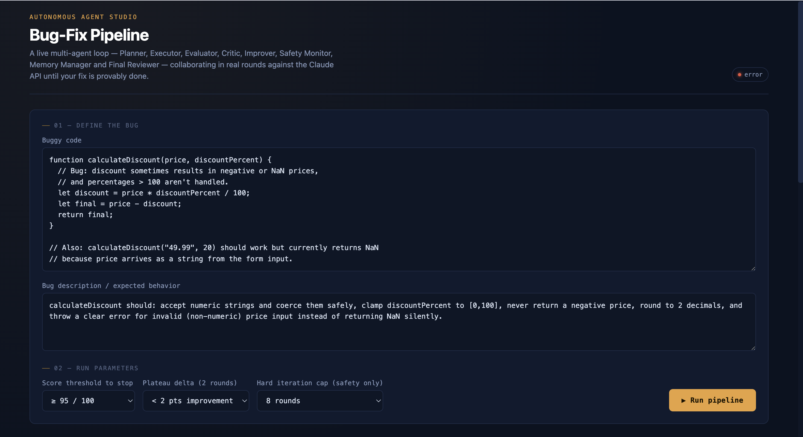

# 🤖 Autonomous Agent Studio

> A production-inspired autonomous multi-agent orchestration system built as a single HTML application using Vanilla HTML, CSS, and JavaScript.


---

# 📌 Overview

**Autonomous Agent Studio** is a browser-based simulation of a production-grade autonomous AI workflow.

Instead of using a single prompt, the application coordinates multiple specialized AI agents that continuously collaborate until a predefined stopping condition is satisfied.

The application demonstrates how autonomous AI systems can:

- Plan tasks
- Execute work
- Evaluate results
- Criticize outputs
- Improve solutions
- Store memory
- Monitor safety
- Review final output

Unlike traditional sequential pipelines, this project implements a real iterative orchestration loop where the system continuously improves its own work until success criteria are achieved.

---

# 🚀 Features

## Multi-Agent Architecture

The application includes eight specialized AI agents:

| Agent | Responsibility |
|--------|----------------|
| Planner | Understands requirements and creates an execution plan |
| Executor | Produces the initial solution |
| Evaluator | Scores the current output |
| Critic | Finds weaknesses in the solution |
| Improver | Enhances the previous solution |
| Memory Manager | Stores important learnings between rounds |
| Safety Monitor | Detects risky or unsafe outputs |
| Final Reviewer | Produces the final report |

---

## Real Autonomous Loop

The project implements an actual iterative orchestration process.

```
Planner
      ↓
Executor
      ↓
Evaluator
      ↓
Critic
      ↓
Improver
      ↓
Memory Manager
      ↺
Evaluator
```

The loop continues until one of the stopping conditions becomes true.

---

# 🛑 Stopping Conditions

The orchestration loop checks three stopping conditions after every iteration.

### 1. Threshold

The evaluation score reaches or exceeds the required quality score.

Example:

```
Target Score = 95
Current Score = 97

Stop
```

---

### 2. Plateau Detection

The score improvement becomes insignificant across consecutive rounds.

Example:

```
Round 4 = 93
Round 5 = 94
Round 6 = 94

Improvement < Delta

Stop
```

---

### 3. Hard Iteration Cap

A maximum iteration limit exists only as a safety fallback.

Example:

```
Maximum Rounds = 8

Reached Round 8

Stop
```

---

# 📊 Dashboard

The application contains a live dashboard displaying:

- Active agent
- Current iteration
- Workflow visualization
- Activity log
- Evaluation history
- Memory updates
- Score trend
- API call count
- Retry count
- Execution statistics
- Final report

---

# 🧠 Agent Workflow

Each iteration follows this sequence:

```
Evaluate Current Draft
        ↓
Generate Critique
        ↓
Check Stop Condition
        ↓
Improve Draft
        ↓
Store Memory
        ↓
Repeat
```

The current draft evolves after every round.

No hardcoded outputs are used.

---

# 🛠 Technologies Used

- HTML5
- CSS3
- Vanilla JavaScript
- Fetch API
- SVG Visualization

No external libraries or frameworks were used.


---

# ▶️ How to Run

1. Download the repository.

2. Open

```
autonomous-agent-studio.html
```

inside any modern browser.

No installation is required.

No dependencies are required.

---

# 🎯 Key Highlights

✔ Single HTML application

✔ Responsive UI

✔ Dark mode interface

✔ Interactive workflow visualization

✔ Real iterative orchestration

✔ Dynamic stopping conditions

✔ Memory management

✔ Activity logs

✔ Score history

✔ Performance statistics

✔ Retry mechanism

✔ Graceful error handling

---
# 📸 Screenshot

## Autonomous Agent Studio Dashboard

The main dashboard of the **Autonomous Agent Studio**, showcasing the live multi-agent orchestration workflow, execution status, iteration history, activity logs, and autonomous decision-making pipeline.

<p align="center">
  
</p>

---

# 📜 Execution Logs

Store execution logs inside

```
logs/
```

Example:

```
Round 1
Planner completed

Round 1
Executor completed

Round 1
Evaluator Score: 81

Round 1
Critic generated feedback

Round 1
Improver updated solution

Round 2
Evaluator Score: 90

Round 3
Evaluator Score: 96

Stop Condition:
Threshold Reached

Final Reviewer Completed
```

---

# 📈 Performance Metrics

The application records:

- Total API Calls
- Retry Count
- Total Iterations
- Best Score
- Final Score
- Stop Reason
- Round History
- Memory Entries

---

# 🔒 Error Handling

The application includes:

- Retry mechanism
- API failure recovery
- Graceful fallback
- JSON repair
- Invalid response handling
- Loading states

---

# 🎨 UI Features

- Modern dark theme
- SVG workflow diagram
- Animated execution loop
- Responsive layout
- Live status updates
- Interactive tabs
- Score visualization

---

# 📚 Learning Outcomes

This project helped me understand:

- Multi-agent AI systems
- Autonomous workflows
- Prompt engineering
- Agent orchestration
- Iterative reasoning
- State management
- Memory-based improvement
- Evaluation-driven execution
- Workflow visualization
- Human-readable AI dashboards

---

# 💡 Future Improvements

- OpenAI API integration
- Claude API authentication
- Persistent memory database
- Vector embeddings
- Multi-user support
- Authentication
- Workflow templates
- Export execution reports
- Parallel agents
- Human approval checkpoints
- WebSocket streaming
- Code execution sandbox

---

# 📝 Challenge Deliverables

✅ Autonomous Agent Studio HTML Application

✅ Multi-Agent Architecture

✅ Workflow Visualization

✅ Execution Dashboard

✅ Iterative Agent Loop

✅ Activity Logs

✅ Execution Statistics

✅ Screenshots

✅ README Documentation

---


# ⭐ If you found this project useful, consider giving it a Star.
