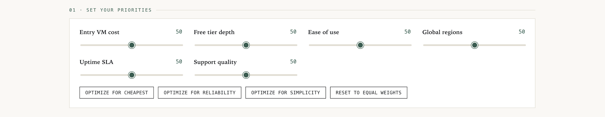
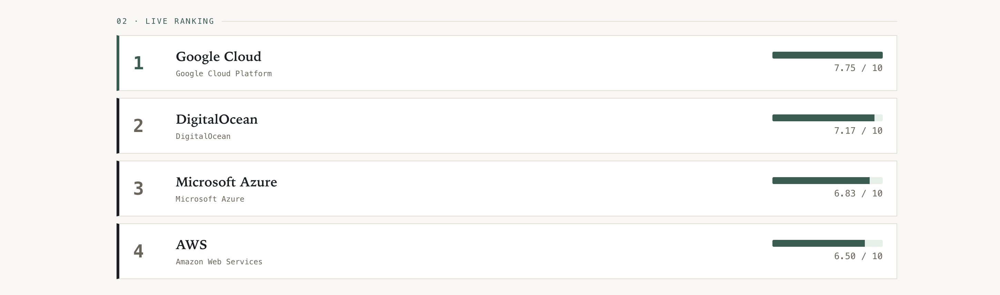
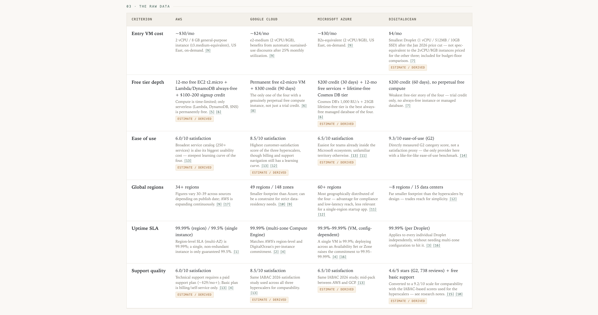
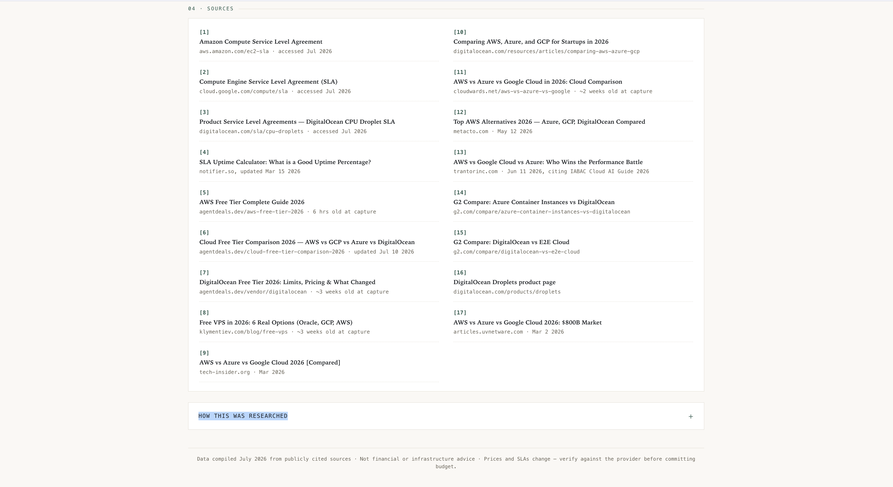

# ☁️ Compare & Decide — Cloud Hosting Decision Builder

> **Field Ledger No. 04**  
> An interactive research-driven decision support application that helps startup founders compare major cloud hosting providers using real-world data, weighted decision analysis, and transparent research methodology.


---

# 📖 Project Overview

Choosing the right cloud hosting provider is one of the most important decisions for any startup.

Every provider advertises different pricing models, free tiers, uptime guarantees, global infrastructure, and support plans, making comparisons difficult.

This project solves that problem by providing an interactive decision engine that allows users to:

- Compare multiple cloud hosting providers
- Assign personalized importance (weights) to evaluation criteria
- Watch rankings update instantly
- Inspect every research source used
- Understand how conflicting information was resolved

Instead of providing a fixed recommendation, this application allows users to discover **the best provider for their own priorities.**

---

# 🎯 Objective

Build a premium single-page decision support application that combines:

- Research
- Data Journalism
- Decision Science
- Interactive UI Design
- Frontend Development

into one transparent comparison platform.

---

# 🌐 Live Decision Flow

```
Research
      ↓
Verified Data
      ↓
Weighted Criteria
      ↓
Score Calculation
      ↓
Live Ranking
      ↓
Decision Support
```

---

# ✨ Features

## Interactive Weight System

Users can assign importance to:

- Entry VM Cost
- Free Tier Depth
- Ease of Use
- Global Regions
- Uptime SLA
- Support Quality

Every slider updates the ranking instantly.

---

## Live Ranking Engine

The application recalculates provider scores in real-time using weighted averages.

Features include:

- Dynamic ranking
- Progress indicators
- Score visualization
- Instant recalculation

---

## Premium Data Table

Displays verified comparison data for every provider including:

- Cost
- Free tier
- Ease of use
- Global presence
- SLA
- Support quality

Estimated values are clearly flagged.

---

## Sources Panel

Every data point can be traced back to publicly available sources.

Examples include:

- AWS Documentation
- Google Cloud Documentation
- Microsoft Azure Documentation
- DigitalOcean Documentation
- Cloudwards
- G2 Reviews
- Industry Research

---

## Research Transparency

Includes a dedicated section explaining:

- Research methodology
- Source conflicts
- Estimated values
- Data normalization
- Why certain decisions were made

---

## Responsive Design

Works across

- Desktop
- Tablet
- Mobile

without external frameworks.

---

# 🛠️ Technologies Used

- HTML5
- CSS3
- Vanilla JavaScript

No external libraries.

No frameworks.

Everything is contained inside a **single HTML file**.

---

# 📸 Application Screenshots

## 🏠 1. Project Overview

The landing page introduces the **Cloud Hosting Decision Builder**, providing a clean interface where users can compare cloud hosting providers based on their own priorities.


---

## 🎯 2. Set Your Priorities

Users can adjust the importance of each evaluation criterion using interactive sliders.

### Available Criteria

- Entry VM Cost
- Free Tier Depth
- Ease of Use
- Global Regions
- Uptime SLA
- Support Quality

Preset buttons are also available for:

- Optimize for Cheapest
- Optimize for Reliability
- Optimize for Simplicity
- Reset to Equal Weights



---

## 📊 3. Live Ranking Engine

As the sliders move, the weighted scoring algorithm recalculates rankings instantly.

### Compared Providers

- Google Cloud
- DigitalOcean
- Microsoft Azure
- Amazon Web Services (AWS)

Each provider displays:

- Current Rank
- Weighted Score
- Progress Indicator



---

## 📑 4. Research Data Comparison

The application presents a transparent comparison table containing verified data collected from publicly available sources.

### Comparison Includes

- Entry VM Cost
- Free Tier Details
- Ease of Use
- Global Regions
- Uptime SLA
- Support Quality

Estimated or normalized values are clearly flagged for transparency.



---

## 📚 5. Sources & Research Methodology

Every data point is backed by publicly available references.

The application also includes a dedicated **"How this was researched"** section explaining:

- Research methodology
- Source verification
- Data normalization
- Conflict resolution
- Estimated values

This ensures complete transparency behind every ranking.




---

# ⚙️ How It Works

### Step 1

The application loads verified provider information.

↓

### Step 2

Users assign weights to evaluation criteria.

↓

### Step 3

Each provider receives a weighted score.

↓

### Step 4

The application recalculates rankings instantly.

↓

### Step 5

Users inspect every supporting source before making a decision.

---

# 🧮 Ranking Algorithm

For every provider,

```
Final Score =

Σ(Criterion Score × User Weight)
---------------------------------
      Total Weight
```

This ensures rankings change dynamically according to the user's priorities.

---

# 📊 Evaluation Criteria

| Criterion | Description |
|------------|-------------|
| Entry VM Cost | Monthly entry-level virtual machine pricing |
| Free Tier Depth | Quality of permanent free resources |
| Ease of Use | Overall usability and learning curve |
| Global Regions | Worldwide infrastructure availability |
| Uptime SLA | Service reliability guarantees |
| Support Quality | Technical support experience |

---

# 📚 Research Sources

Research data was collected from publicly available documentation and trusted industry references.

Examples include:

- AWS EC2 SLA
- Google Cloud Compute SLA
- Azure Documentation
- DigitalOcean Documentation
- Cloudwards
- G2 Reviews
- AgentDeals
- Tech Insider
- Metacto
- Trantor Inc.

Each data point inside the application includes its corresponding citation.

---

# 🔍 Research Methodology

The project follows a transparent research workflow.

1. Identify comparison criteria
2. Collect publicly available information
3. Verify data across multiple sources
4. Resolve conflicting values
5. Normalize comparison metrics
6. Flag estimated values
7. Calculate weighted rankings

---

# ⚠️ Handling Conflicting Data

Cloud providers frequently update:

- Prices
- Free tiers
- SLAs
- Regions

Whenever conflicting information existed:

- Multiple sources were compared
- Latest official documentation was preferred
- Estimated values were clearly labeled
- Conflicts were documented inside the application

---

# 🎓 Key Learnings

Working on this project helped me understand:

- Research-driven software development
- Decision support systems
- Weighted scoring algorithms
- UI/UX for analytical dashboards
- Data normalization
- Frontend architecture without frameworks
- Responsive web design
- Source transparency
- Interactive JavaScript programming

---

# 🚀 Future Improvements

Potential enhancements include:

- Dark Mode
- Export Rankings to PDF
- CSV Download
- Search & Filter Providers
- AI Recommendation Assistant
- Additional Cloud Providers
- Historical Pricing Trends
- User Profiles
- Save Comparison Preferences

---

# ▶️ Running the Project

Simply download the repository and open

```
cloud-hosting-compare.html
```

inside any modern browser.

No installation required.

No dependencies.

No build tools.

---

# 👨‍💻 Author

**Sachin Singh**

MCA Student • Python Developer • Full Stack Developer

Interested in

- Python
- Django
- AI Applications
- Software Engineering
- Cloud Technologies
- Frontend Development


---

# ⭐ If you found this project useful, consider giving it a Star!
