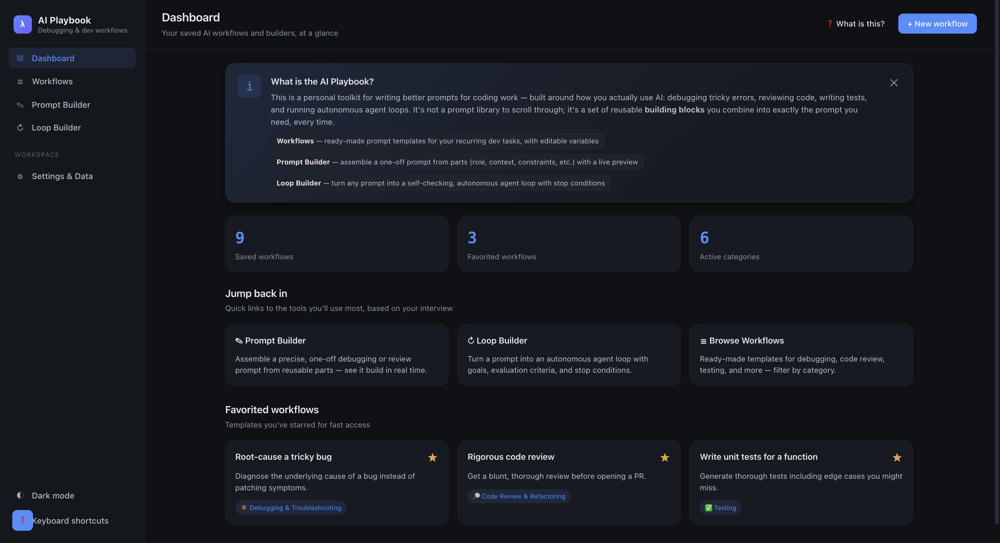
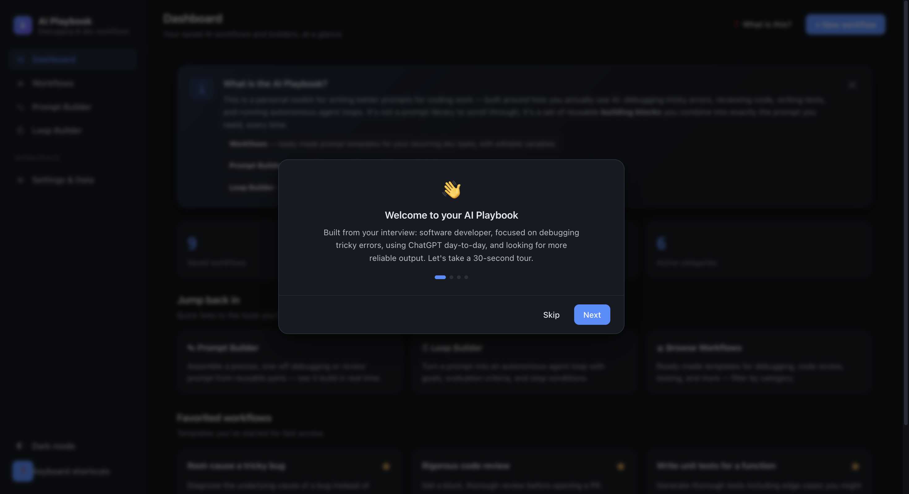

# 🚀 Personal AI Playbook

> **Build reusable AI systems instead of collecting prompts.**
>
> A premium, interactive AI workflow designer that helps developers, engineers, students, and AI power users create **modular prompt systems**, **autonomous AI workflows**, and **reusable prompt architectures** — all inside a single self-contained HTML application.

<p align="center">


</p>

---

# 📖 Overview

Most AI tools give you **individual prompts**.

This project goes a step further.

**Personal AI Playbook** helps users design reusable **AI workflow systems** that can be adapted to different tasks instead of repeatedly writing prompts from scratch.

Rather than maintaining a huge library of prompts, users create modular building blocks that can be combined into thousands of prompt variations.

Everything runs completely inside a **single HTML file** with no installation, backend, or external dependencies.

---

# ✨ Why This Project?

Writing prompts repeatedly is inefficient.

Developers often need to:

- Debug code
- Review pull requests
- Generate documentation
- Create unit tests
- Refactor applications
- Build AI agent loops

Instead of rewriting prompts every day, this project lets users create reusable AI systems that can be customized in seconds.

---

# 🌟 Core Features

| Feature | Description |
|----------|-------------|
| 🎯 Personalized Workflows | AI workflows tailored to user goals and profession |
| 🧩 Prompt Builder | Build prompts using reusable prompt blocks |
| 🔄 Loop Builder | Convert prompts into autonomous AI agent loops |
| 📚 Workflow Library | Create, edit, duplicate, organize and favorite workflows |
| 🔍 Smart Search | Quickly find workflows using search and filters |
| 💾 Local Storage | Automatic browser persistence |
| 🌙 Dark / Light Mode | Beautiful UI with theme switching |
| 📤 Import / Export | Backup workflows as JSON |
| ⌨ Keyboard Shortcuts | Productivity-focused navigation |
| 📱 Responsive Design | Optimized for desktop, tablet and mobile |

---

# 🧩 Prompt Builder

The Prompt Builder introduces modular prompt engineering.

Instead of writing one long prompt, users assemble prompts using reusable blocks such as:

- Role
- Objective
- Context
- Constraints
- Reasoning Strategy
- Output Format
- Tone
- Examples
- Quality Checks

Each block includes:

- ✅ Purpose
- ✅ Explanation
- ✅ Editable values
- ✅ Live preview
- ✅ One-click Copy

---

# 🔄 Loop Builder

Transform ordinary prompts into autonomous AI workflows.

Configure intelligent execution using:

- Goal Definition
- Evaluation Criteria
- Improvement Strategy
- Stop Conditions
- Safety Rules

Perfect for:

- Claude Code
- ChatGPT
- Gemini
- Cursor
- Windsurf
- GitHub Copilot

---

# 📚 Workflow Management

Create your own reusable AI systems.

Supported operations include:

- ➕ Create
- ✏ Edit
- 📑 Duplicate
- ⭐ Favorite
- 🗑 Delete
- 🔍 Search
- 🏷 Category Filtering
- 💾 Auto Save
- 📤 Export JSON
- 📥 Import JSON

---

# 🎨 User Experience

Designed to feel like a premium commercial SaaS product.

### Highlights

- Premium Dashboard
- Interactive Onboarding
- Persistent Help System
- Smooth Animations
- Responsive Layout
- Modern Typography
- Dark & Light Theme
- Keyboard Navigation
- Accessible Components
- Beautiful Cards & UI

---

# 🏗 Technical Architecture

```text
                User
                  │
                  ▼
          Dashboard Interface
                  │
                  ▼
          Workflow Library
                  │
        ┌─────────┴─────────┐
        ▼                   ▼
 Prompt Builder      Loop Builder
        │                   │
        └─────────┬─────────┘
                  ▼
          Live Prompt Preview
                  │
                  ▼
            Local Storage
                  │
                  ▼
        Import / Export JSON
```

---

# 🏗 Tech Stack

| Technology | Purpose |
|------------|---------|
| HTML5 | Application Structure |
| CSS3 | Modern Responsive UI |
| Vanilla JavaScript | Complete Application Logic |
| Local Storage API | Persistent Data Storage |
| JSON | Import & Export |

---

# 📸 Application Preview

## 🏠 Dashboard

<p align="center">
  
</p>

The **Dashboard** serves as the central workspace of the Personal AI Playbook, providing users with an overview of saved workflows, favorite templates, workflow categories, and quick access to the Prompt Builder and Loop Builder. A persistent "What is this?" guide helps first-time users understand the application's purpose instantly.

---

## 👋 Interactive Onboarding

<p align="center">
  
</p>

A guided onboarding experience introduces users to the application through a short interactive tour. It explains the purpose of the AI Playbook, highlights its core features, and helps users get started with reusable AI workflow systems in just a few steps.

---

# ⚡ Performance

- ✅ Zero Dependencies
- ✅ Zero Frameworks
- ✅ No Build Process
- ✅ Offline First
- ✅ Lightweight
- ✅ Single HTML File
- ✅ Fast Loading
- ✅ Browser Native

---

# 💻 Use Cases

This project is useful for:

- 👨‍💻 Software Developers
- 🤖 AI Engineers
- 🎓 Students
- 📚 Researchers
- 📝 Technical Writers
- ✅ QA Engineers
- 🧠 Prompt Engineers
- 📈 Product Managers
- 🚀 AI Enthusiasts

---

# 💡 Key Learnings

Building this project helped me understand:

- Advanced Prompt Engineering
- Modular Prompt Systems
- AI Workflow Design
- Autonomous AI Loops
- Human-Centered UX Design
- Interactive SaaS Interfaces
- Local Storage Architecture
- Responsive Frontend Development
- State Management in Vanilla JavaScript
- Building production-ready applications without frameworks

---

# 🚀 Future Roadmap

## Phase 1

- ☁ Cloud Synchronization
- 🔐 Authentication
- 🤖 AI API Integration
- 👤 User Profiles

## Phase 2

- 🌍 Prompt Marketplace
- 🤝 Workflow Sharing
- 👥 Team Collaboration
- 🏢 Workspace Management

## Phase 3

- 📊 AI Analytics
- 🕒 Version History
- 🧩 Plugin System
- 📱 Mobile Application

---


# ⭐ Support

If you found this project useful:

- ⭐ Star this repository
- 🍴 Fork it
- 💬 Share your feedback
- 🚀 Share it with others

Every star motivates me to build more open-source AI tools.

---


<p align="center">

## ⭐ Build Smarter AI Workflows • Design Better Prompts • Create Reusable AI Systems ⭐

Made with ❤️ by **Sachin Singh**

</p>
