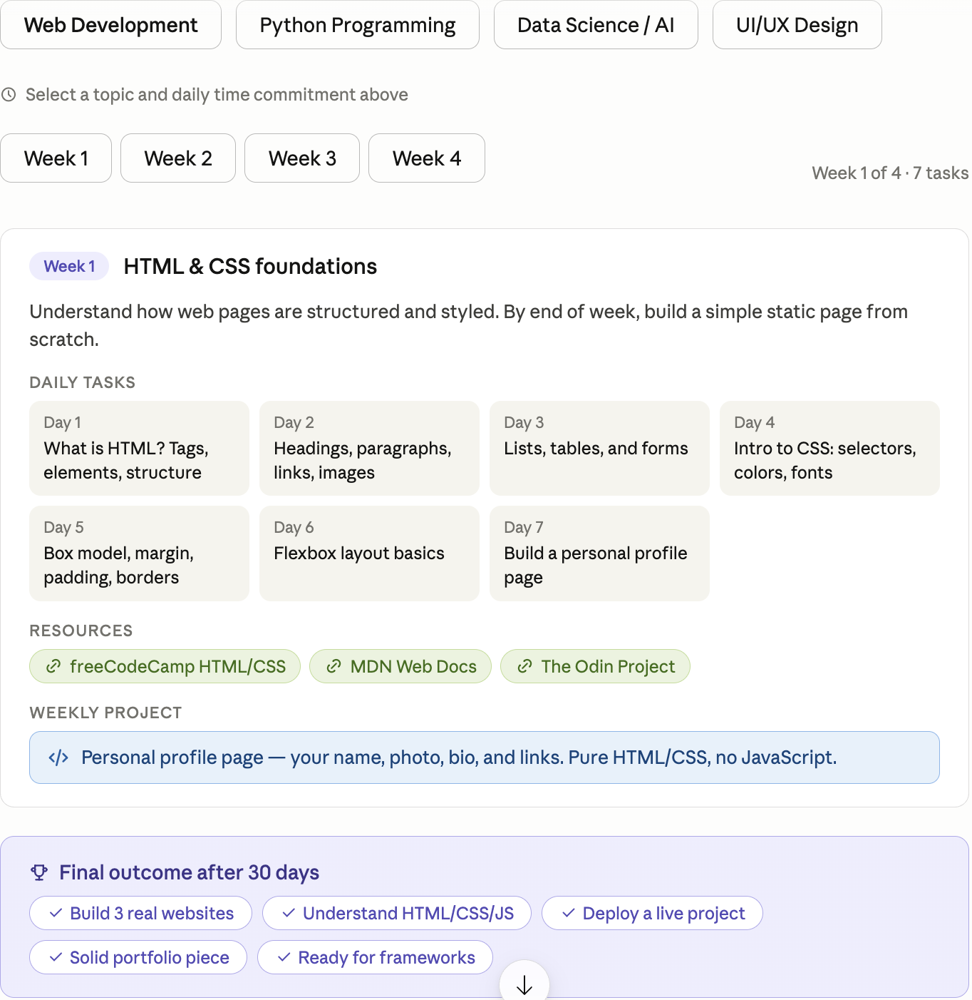
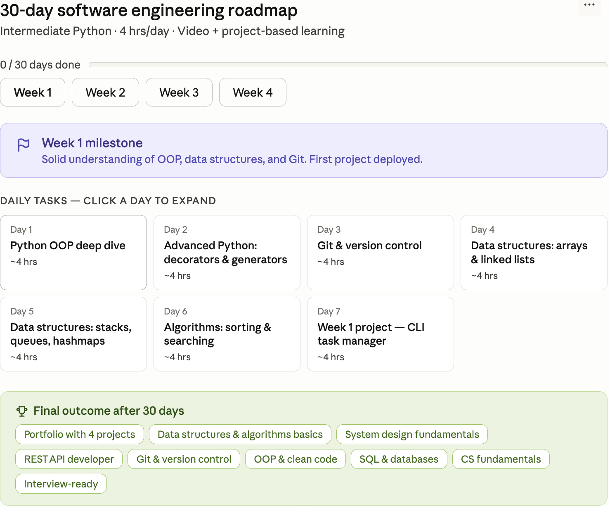

# 🗺️ 30-Day Learning Roadmap — Prompt Engineering Case Study

> A comparative analysis of two AI-generated learning roadmaps, documenting how context and prompt specificity transform output quality.

---

## 📸 Screenshots

| Roadmap 1 — Web Development (Generic) | Roadmap 2 — Python Engineering (Personalized) |
|---|---|
|  |  |
| Topic picker UI, no user context | "Intermediate Python · 4 hrs/day · Video + project-based learning" |

---

## 🔍 Comparison Analysis

### 1. Which Roadmap Feels More Personalized?

**✅ Roadmap 2 (Python / Software Engineering)**

| Feature | Roadmap 1 (Web Dev) | Roadmap 2 (Python) |
|---|---|---|
| **Subtitle / Context** | None | `Intermediate Python · 4 hrs/day · Video + project-based learning` |
| **Progress Tracker** | ❌ Not visible | ✅ `0 / 30 days done` progress bar |
| **Time Estimates** | ❌ None | ✅ `~4 hrs` per task |
| **Milestone Framing** | Week label only | Dedicated milestone card with concrete outcome |
| **Assumed Skill Level** | Absolute beginner | Intermediate (skips basics, dives into OOP/DS) |
| **Outcome Tags** | 5 generic | 8 specific, career-oriented (`Interview-ready`, `REST API developer`) |
| **Learning Style** | Not specified | `Video + project-based` |

**Why it matters:** Roadmap 2 reflects *who the learner is*, not just *what the topic is*. The subtitle alone encodes skill level, time budget, and preferred learning format — three dimensions completely absent from Roadmap 1.

---

### 2. Which Roadmap Would You Actually Follow?

**✅ Roadmap 2 — for three concrete reasons:**

#### 🎯 Accountability is built in
The `0/30 days done` progress bar creates a psychological commitment loop. You can *see* how far you are. Roadmap 1 has no such feedback mechanism — it's a static curriculum with no state.

#### ⏱️ Time estimates remove friction
Every task in Roadmap 2 shows `~4 hrs`. This means you can open your calendar, block time, and know exactly what you're committing to. Roadmap 1 tasks have no duration signal, making scheduling mentally harder.

#### 🏁 The milestone gives meaning to the grind
The Week 1 milestone card says:
> *"Solid understanding of OOP, data structures, and Git. First project deployed."*

That's not just a summary — it's a *contract*. You know what success looks like before you start. Roadmap 1 has no equivalent checkpoint.

---

### 3. What Role Did Context Play in Improving the Result?

This is the core lesson of this case study.

#### The Context Provided to Roadmap 2:
```
Topic: Python Programming (intermediate)
Daily time: 4 hours/day
Learning style: Video + project-based
Goal: Software engineering career readiness
```

#### How Each Piece of Context Shaped the Output:

| Context Input | Output Improvement |
|---|---|
| **Skill level: Intermediate** | Day 1 starts with `OOP deep dive`, not "What is Python?" — no wasted days |
| **4 hrs/day** | Every task card shows `~4 hrs`; progress bar tracks 30 days realistically |
| **Video + project-based** | Day 7 each week is a project (`CLI task manager`, not just an exercise) |
| **Career goal implied** | Outcomes include `Interview-ready`, `REST API developer`, `System design fundamentals` |

#### The Without-Context Problem (Roadmap 1):
- Defaults to absolute beginner content regardless of actual skill
- No time awareness — can't plan your days
- Generic outcomes that apply to anyone (or no one specifically)
- No learning style signal — could be docs, could be videos, you don't know

**Key Insight:** The AI didn't get smarter between these two outputs. The *prompt* got smarter. Context transformed a generic template into a personal plan.

---

## 🧠 Key Learnings

### For Prompt Engineering
1. **Specify your level** — "I know Python basics" vs. "I'm a beginner" produces entirely different content
2. **Add time constraints** — daily hours available changes pacing, depth, and structure
3. **State your goal format** — "project-based" vs. "reading-based" vs. "video-based" changes the weekly projects
4. **Name your end goal** — "interview-ready" vs. "build a hobby project" shapes which outcomes are included

### For Product Design (if building this tool)
1. **Collect context before generating** — Roadmap 1's UI shows a topic picker but no skill level or time input; that's the gap
2. **Progress bars are motivational design** — they don't just track, they *pull you forward*
3. **Time estimates reduce dropout** — ambiguity in effort is a leading cause of abandonment
4. **Milestones > week labels** — "Week 2" is administrative; "Ship your first API" is motivational

### For Learning Plan Adherence
1. **Specificity predicts follow-through** — vague plans get abandoned; concrete ones get done
2. **Projects anchor knowledge** — both roadmaps end weeks with projects, but Roadmap 2's are more concrete (`CLI task manager` vs. `Personal profile page`)
3. **Visible progress is its own reward** — the `0/30` counter in Roadmap 2 is a retention mechanism


---

## 🚀 Reproduce This Experiment

To recreate Roadmap 1 (generic):
```
Create a 30-day learning roadmap for web development.
```

To recreate Roadmap 2 (personalized):
```
Create a 30-day software engineering roadmap for an intermediate Python developer
who can dedicate 4 hours/day and prefers video + project-based learning.
Goal: be interview-ready with a portfolio of real projects.
```

The difference in output quality is entirely explained by the difference in prompt specificity.

---

## 📌 Conclusion

> **Context is the variable that turns a generic template into a personal plan.**

Roadmap 2 wins on personalization, followability, and motivational design — not because the AI was better, but because it was given more to work with. The lesson applies universally: the quality of AI output is bounded by the quality of context you provide.

---

*Case study conducted: June 2026*  
*Tool: Claude (Anthropic)*  
*Purpose: Prompt engineering documentation and learning design analysis*
