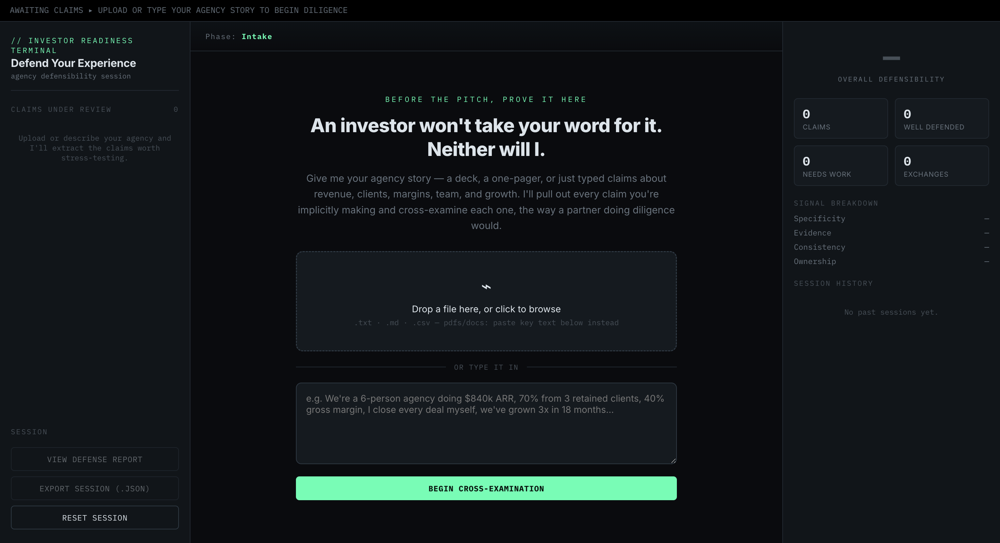

# 🛡️ Defend Your Experience
### AI-Powered Investor Readiness & Experience Defense Simulator

<p align="center">


</p>

---

## 📖 Overview

**Defend Your Experience** is an AI-powered interview simulator designed to help professionals confidently defend every claim they make about themselves.

Instead of simply reviewing a resume, portfolio, startup story, or agency profile, the application automatically extracts meaningful claims and conducts an adaptive cross-examination—similar to how an investor, recruiter, hiring manager, or interviewer would evaluate someone's experience.

The goal is not to improve the document itself.

The goal is to prepare users to confidently defend everything written in it.

---


# ✨ Features

## 📄 Smart Claim Extraction

- Upload Resume
- Portfolio
- Agency Story
- Startup Pitch
- LinkedIn Profile
- Performance Review
- Bio
- Research Paper

The application automatically extracts meaningful claims from the uploaded content.

---

## 🤖 AI Cross Examination

Instead of asking fixed interview questions, AI:

- Generates personalized questions
- Challenges weak statements
- Detects vague claims
- Requests evidence
- Tests consistency
- Simulates investor diligence

Every answer influences the next question.

No two interview sessions are the same.

---

## 📊 Defense Analytics

Real-time metrics include:

- Overall Defensibility Score
- Claims Reviewed
- Well Defended Claims
- Weak Claims
- Signal Breakdown
- Session Progress
- Confidence Tracking

---

## 📈 Defense Report

At the end of every session, users receive an AI-generated report containing:

- Strong Claims
- Weak Claims
- Missing Evidence
- Improvement Suggestions
- Overall Readiness Score
- Key Recommendations

---

## 💾 Local Storage

The application automatically saves:

- Session History
- Progress
- Claims
- Scores

Users can continue later without losing work.

---

## 📤 Export Support

Export complete interview sessions including:

- Claims
- Questions
- Answers
- Scores
- Defense Report

---

## 📱 Responsive Design

Works across

- Desktop
- Laptop
- Tablet
- Mobile

---

## 🏠 Landing Page

The **Landing Page** serves as the entry point to the **Defend Your Experience** application, introducing users to an AI-powered investor readiness and interview simulation platform. It features a clean terminal-inspired interface where users can upload documents or describe their experience manually before beginning the cross-examination.

### ✨ Highlights

- 📂 Drag & Drop document upload
- 📝 Manual text input for agency story or experience
- 🤖 AI-powered claim extraction
- 🎯 Investor-focused onboarding experience
- 📊 Real-time analytics dashboard (initial state)
- 💾 Session management controls
- 🌙 Premium dark terminal-inspired UI
- 📱 Fully responsive layout

<p align="center">
  
</p>

> **Figure 1:** Landing page where users upload their experience, portfolio, or startup story to begin the AI-powered cross-examination process.
---

# ⚙️ Technologies Used

| Technology | Purpose |
|------------|----------|
| HTML5 | Application Structure |
| CSS3 | Premium UI Design |
| Vanilla JavaScript | Application Logic |
| Claude Messages API | AI Interview Engine |
| Local Storage | Session Persistence |
| Responsive Layout | Multi-device Support |

---

# 🧠 How It Works

```text
Upload Document
        │
        ▼
Extract Claims
        │
        ▼
AI Identifies Important Statements
        │
        ▼
Adaptive Cross Examination
        │
        ▼
Confidence Analysis
        │
        ▼
Defense Report
        │
        ▼
Export Results
```

---


# 🎯 Key Highlights

✅ Single HTML Application

✅ Fully Interactive

✅ Adaptive AI Interview

✅ Personalized Question Generation

✅ Drag & Drop Upload

✅ Session Persistence

✅ Local Storage

✅ Export JSON

✅ Defense Analytics

✅ Responsive Design

---

# 🎓 What I Learned

Building this project helped me understand:

- Prompt Engineering for adaptive AI systems
- Designing AI-first user experiences
- Building conversational workflows
- Structuring dynamic interview flows
- Managing application state in Vanilla JavaScript
- Local Storage implementation
- AI response parsing
- Error handling for AI APIs
- Creating responsive single-page applications
- Visualizing interview confidence and analytics

---

# 📌 Challenge Information

**ABTalks – 60 Days Challenge**

**Day 50 Project**

Challenge Objective:

> Build an AI application that helps users defend every claim they make about themselves by simulating an adaptive investor/interviewer style cross-examination.

---


# 🌟 Future Improvements

- PDF Parsing
- DOCX Support
- Voice Interview Mode
- Speech-to-Text
- AI Feedback Timeline
- Multiple Interview Personas
- Recruiter Mode
- HR Mode
- Startup Investor Mode
- Behavioral Interview Mode
- Dark / Light Theme
- Authentication
- Cloud Session Sync

---

# 🙏 Acknowledgements

Special thanks to

- **ABTalks** for the 60 Days Challenge
- **Anthropic Claude** for powering the adaptive interview experience
- The AI developer community for continuous inspiration

---


# ⭐ If you found this project interesting

Give this repository a ⭐ and share your feedback!

---

## 👨‍💻 Developed by

**Sachin Singh**

MCA Student • Python Developer • AI Enthusiast • Full Stack Developer

> *"Confidence comes from being able to defend your experience—not just list it."*
