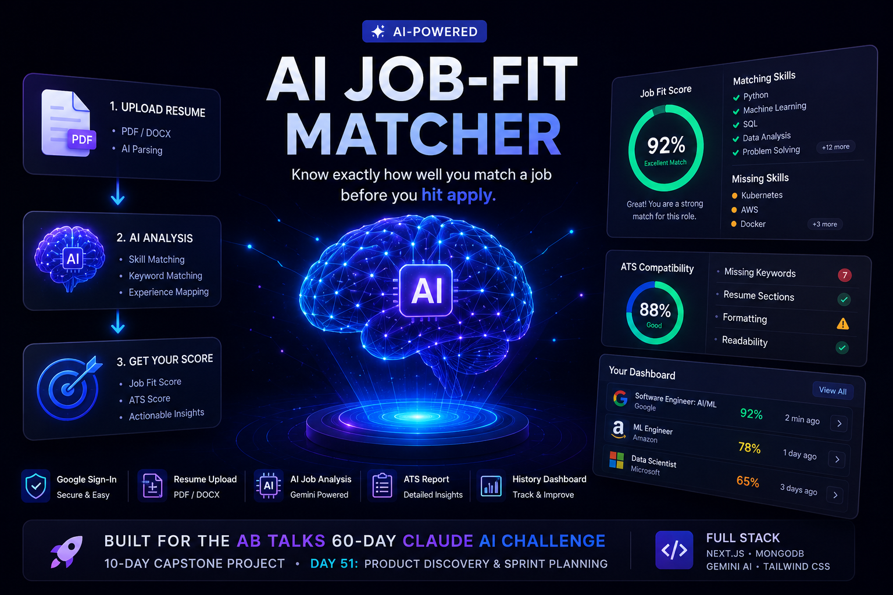
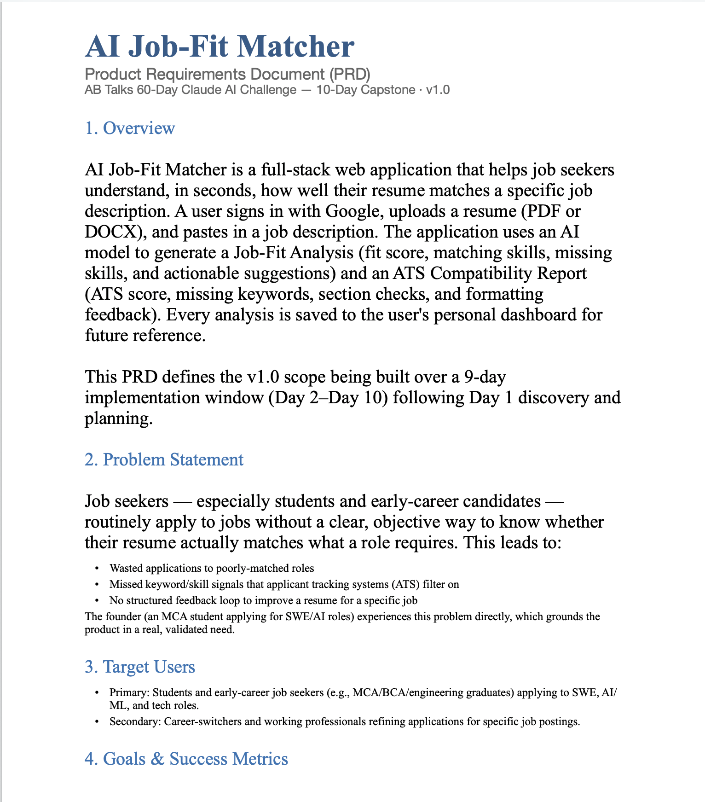
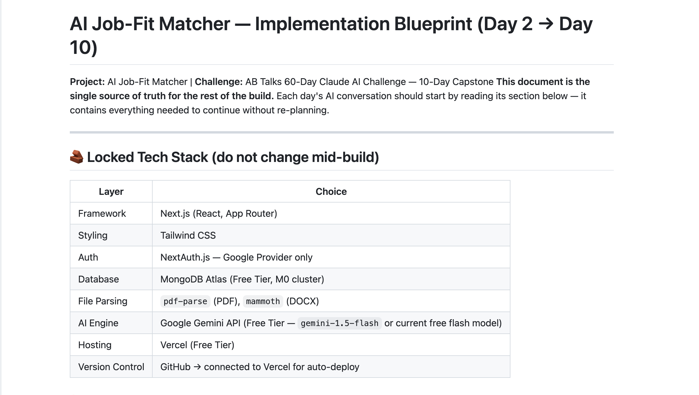
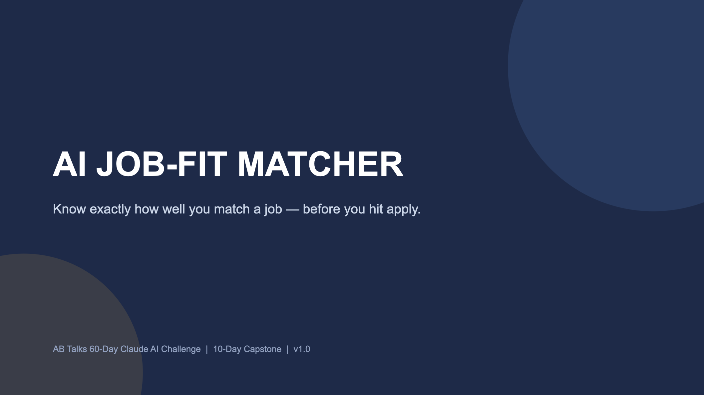

<div align="center">

# 🚀 AI Job-Fit Matcher

### Know exactly how well you match a job — before you hit apply.

<p align="center">
Built for the <b>AB Talks 60-Day Claude AI Challenge</b> • 10-Day Capstone Project
</p>




</div>

---

# 📖 Overview

AI Job-Fit Matcher is an AI-powered web application that helps job seekers determine how well their resume matches a specific job description before applying.

Instead of applying blindly, users receive:

- 🎯 AI Job Match Score
- 📄 ATS Compatibility Report
- ✅ Matching Skills
- ❌ Missing Skills
- 💡 Personalized Suggestions
- 📊 Analysis History Dashboard

The goal is to reduce unnecessary applications and help candidates improve their resumes with actionable insights.

---

# 🌍 The Problem

Every day thousands of candidates submit resumes without knowing

- if they actually match the role
- whether ATS systems will reject them
- which keywords are missing
- what should be improved before applying

Most resume checkers are expensive or provide only keyword matching.

AI Job-Fit Matcher aims to provide a free AI-powered analysis experience.

---

# 💡 Solution

Upload your resume.

Paste a Job Description.

Within seconds the application provides:

- AI Job Fit Score
- ATS Score
- Skill Match Analysis
- Missing Keywords
- Resume Improvement Suggestions
- Analysis History

---

# 🎯 Target Users

- Students
- MCA/BCA/B.Tech Graduates
- Software Engineers
- AI/ML Aspirants
- Career Switchers
- Anyone preparing for Technical Interviews

---

# ✨ Core Features

## 🔐 Authentication

- Google OAuth Login
- Secure Authentication
- Session Management

---

## 📄 Resume Upload

Supports

- PDF
- DOCX

Automatic parsing and text extraction.

---

## 🤖 AI Job Analysis

Generate

- Job Fit Score
- Matching Skills
- Missing Skills
- Resume Suggestions

Powered by Gemini AI.

---

## 📈 ATS Report

Generate

- ATS Compatibility Score
- Missing Keywords
- Resume Section Validation
- Formatting Suggestions

---

## 📂 Dashboard

Users can

- View Previous Reports
- Open Past Analyses
- Track Improvement

---

## 📱 Responsive Design

- Desktop
- Tablet
- Mobile

---

# 🏗 Project Architecture

```
                    User

                      │

          Google Authentication

                      │

                 Next.js App

                      │

          Resume Upload + Job Description

                      │

           Resume Parsing Engine

          PDF Parse / Mammoth

                      │

               Gemini AI API

                      │

        Job Analysis + ATS Report

                      │

              MongoDB Database

                      │

          Dashboard & History
```

---

# 🛠 Planned Tech Stack

| Category | Technology |
|-----------|------------|
| Frontend | Next.js |
| Styling | Tailwind CSS |
| Authentication | NextAuth.js |
| Database | MongoDB Atlas |
| AI | Google Gemini API |
| Resume Parsing | pdf-parse / mammoth |
| Deployment | Vercel |
| Version Control | GitHub |

---


# 🧠 Product Discovery Process

This project was not chosen randomly.

The product idea was refined through an AI-driven Product Discovery interview where requirements, constraints, project scope, risks, future roadmap, and implementation strategy were finalized before writing any code.

Deliverables created during the planning phase include:

- Product Requirements Document (PRD)
- 9-Day Implementation Blueprint
- Investor Pitch Deck

---

# 📂 Project Documents

| Document | Description |
|----------|-------------|
| 📄 PRD | Complete Product Requirements Document |
| 🛠 Implementation Blueprint | Day-by-Day Build Plan |
| 🎤 Pitch Deck | Investor Style Presentation |


---

# 📸 Screenshots

## PRD



---

## Implementation Blueprint



---

## Pitch Deck



---

## Future Application Screens

```
Coming Soon...
```

Landing Page

Dashboard

Upload Resume

Analysis Result

ATS Report

---

# 📚 Key Learnings

Throughout this capstone I learned

- Product Discovery
- Requirement Gathering
- Scope Management
- Product Thinking
- Sprint Planning
- Writing Professional PRDs
- Creating Technical Blueprints
- Presentation Design
- Building an AI Product Roadmap
- AI-assisted Product Planning
- Software Development Lifecycle
- Documentation Best Practices

---

# 📅 Challenge Timeline

| Day | Task |
|------|------|
| Day 51 | Product Discovery |
| Day 52 | Project Setup |
| Day 53 | Authentication |
| Day 54 | Resume Parsing |
| Day 55 | AI Integration |
| Day 56 | Dashboard |
| Day 57 | Deployment |
| Day 58 | UI Polish |
| Day 59 | Testing |
| Day 60 | Final Demo |

---

# 🚀 Roadmap

## Version 1.0

- Resume Upload
- AI Analysis
- ATS Report
- Dashboard

---

## Version 2.0

- Resume Rewriting
- Multiple Job Comparison
- Browser Extension
- LinkedIn Integration
- Recruiter Dashboard
- AI Interview Preparation

---

# 🎯 Success Criteria

By Day 60 the project should

- be fully deployed
- support Google Login
- analyze resumes
- generate ATS reports
- store user history
- have a polished UI
- be portfolio ready

---

# 🤝 Acknowledgements

Special thanks to

- AB Talks
- Claude AI
- Google Gemini
- Vercel
- MongoDB
- Open Source Community

for enabling this learning journey.

---

# ⭐ Repository Support

If you enjoyed this project,

⭐ Star this repository

🍴 Fork it

💡 Share your feedback

---

<div align="center">

## Built with ❤️ during the AB Talks 60-Day Claude AI Challenge

### Day 51 — Product Discovery & Sprint Planning

</div>
