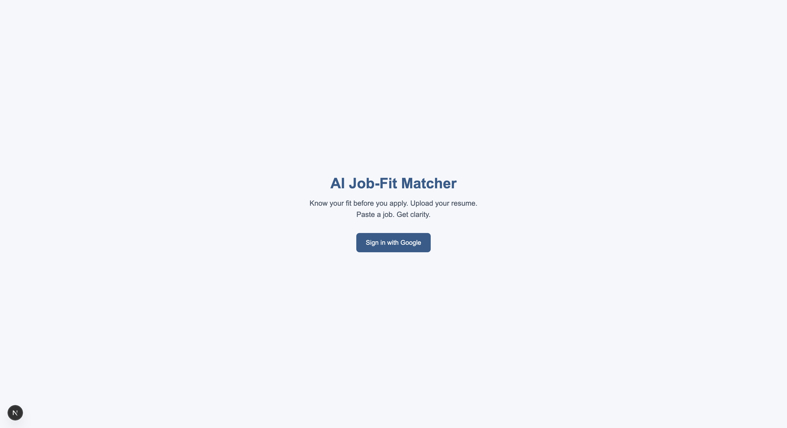
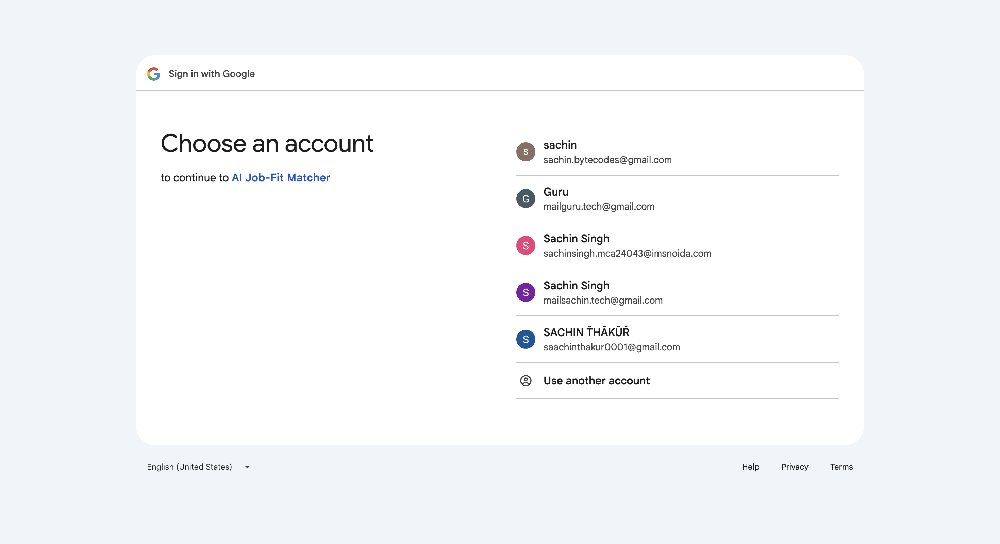
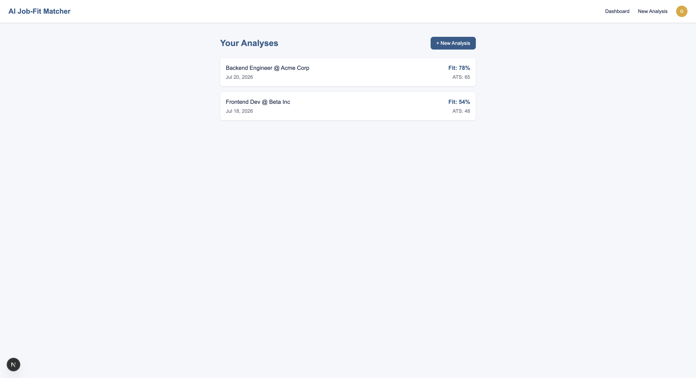

<div align="center">

# 🚀 AI Job-Fit Matcher

### AI-Powered Resume Analysis & ATS Compatibility Platform

<p align="center">
Analyze resumes, compare them with job descriptions, measure ATS compatibility, identify missing skills, and receive AI-powered recommendations to maximize interview success.
</p>

<p align="center">


</p>

</div>

---

# 📖 About

AI Job-Fit Matcher is a modern AI-powered web application that helps job seekers understand how well their resume matches a specific job description.

Instead of manually comparing resumes with job requirements, users can upload their resume, paste a job description, and instantly receive intelligent AI-powered insights including:

- 🎯 Job Match Score
- 📊 ATS Compatibility Score
- ✅ Matching Skills
- ❌ Missing Skills
- 💡 Resume Improvement Suggestions
- 📈 AI Recommendations
- 📂 Analysis History Dashboard

The project follows modern software engineering principles and is built with a scalable full-stack architecture using **Next.js, MongoDB Atlas, Google Gemini AI, NextAuth.js, and Tailwind CSS**.

---

# ✨ Features

## ✅ Completed

- Google OAuth Authentication
- Secure Session Management
- Protected Dashboard
- Responsive Navigation
- Shared Layout
- Next.js App Router
- MongoDB Connection Scaffold
- Mongoose Database Model
- API Foundation
- Production Ready Folder Structure
- Environment Configuration

---

## 🚧 Coming Soon

- Resume Upload
- PDF Resume Parsing
- DOCX Resume Parsing
- AI Resume Analysis
- ATS Score
- Missing Skills Detection
- Resume Improvement Suggestions
- Analysis History
- Dashboard Analytics
- Export Reports

---

# 🏗 Tech Stack

| Category | Technology |
|----------|------------|
| Frontend | Next.js 16 |
| UI | React 19 |
| Styling | Tailwind CSS v4 |
| Backend | Next.js API Routes |
| Authentication | NextAuth.js + Google OAuth |
| Database | MongoDB Atlas |
| ORM | Mongoose |
| AI | Google Gemini API |
| Resume Parser | pdf-parse & Mammoth |
| Deployment | Vercel |

---

# 📑 Documentation

The project contains complete technical documentation.

| Document | Description |
|----------|-------------|
| 📄 PRD | Product Requirement Document |
| 📄 Implementation Blueprint | 10-Day Development Plan |
| 📄 Architecture | System Design |
| 📄 Database Design | MongoDB Schema |
| 📄 API Design | REST API Documentation |
| 📄 UI Wireframes | User Flow & Screens |
| 📄 Project Structure | Folder Organization |
| 📄 SETUP.md | Installation Guide |
| 📄 ENVIRONMENT.md | Environment Configuration |
| 📄 DAY3-SUMMARY.md | Project Setup Summary |

---

# 🚀 Development Progress

## ✅ Day 51 — Project Planning

- Product Requirement Document
- Project Scope
- Pitch Deck
- Implementation Blueprint

---

## ✅ Day 52 — System Design

- Architecture Design
- Database Schema
- REST API Design
- UI Wireframes
- Project Structure

---

## ✅ Day 53 — Project Setup & Foundation

### Environment Setup

- Installed Node.js
- Configured npm
- Configured Git
- Configured VS Code

### Project Initialization

- Next.js 16 Project
- Tailwind CSS v4
- Dependency Installation
- Local Development Environment

### Authentication

- Google OAuth
- NextAuth.js
- Secure Session Management
- Protected Dashboard

### Database

- MongoDB Atlas
- Mongoose Schema
- Database Connection Helper

### Foundation

- Routing
- Shared Layout
- Navigation
- Authentication Provider
- API Structure
- Configuration Files

### Documentation

Generated:

- SETUP.md
- PROJECT-STRUCTURE.md
- ENVIRONMENT.md
- DAY3-SUMMARY.md

---

# 📊 Progress

## Planning

```
████████████████████ 100%
```

## System Design

```
████████████████████ 100%
```

## Project Foundation

```
████████████████████ 100%
```

## Feature Development

```
□□□□□□□□□□□□□□ 0%
```

---

# 🛣 Development Roadmap

### ✅ Completed

- Planning
- System Design
- Environment Setup
- Authentication
- Database Foundation
- Project Structure

### 🚧 Upcoming

- Resume Upload
- Resume Parsing
- AI Integration
- Job Match Engine
- ATS Analysis
- Dashboard
- History
- Deployment

---

# 📸 Project Screenshots

## 🏠 Landing Page

<p align="center">
  
</p>

---

## 🔐 Google Authentication

<p align="center">
  
</p>

---

## 📊 Dashboard

<p align="center">
  
</p>

---

# 🔒 Security

- Google OAuth Authentication
- Protected API Routes
- Secure Session Management
- Environment Variables
- MongoDB Atlas Security
- Server-side Authorization
- File Validation
- Input Validation

---

# 📈 Current Project Status

| Module | Status |
|---------|--------|
| Planning | ✅ Complete |
| System Design | ✅ Complete |
| Project Setup | ✅ Complete |
| Authentication | ✅ Complete |
| Database | ✅ Complete |
| Resume Upload | 🚧 In Progress |
| AI Analysis | ⏳ Upcoming |
| Deployment | ⏳ Upcoming |

---

# 🚀 Getting Started

## Clone Repository

```bash
git clone https://github.com/sachinbytecodes-lab/ai-job-fit-matcher.git
```

## Navigate

```bash
cd ai-job-fit-matcher
```

## Install Dependencies

```bash
npm install
```

## Start Development Server

```bash
npm run dev
```

Visit:

```
http://localhost:3000
```

---

# 🤝 Contributing

Contributions, issues, and feature requests are welcome.

1. Fork the repository
2. Create your feature branch
3. Commit your changes
4. Push to the branch
5. Open a Pull Request

---

# ⭐ Support

If you found this project helpful, consider giving it a ⭐ Star.

It motivates me to continue building and improving this project.

---

<div align="center">


**Next.js • MongoDB • Google Gemini AI • NextAuth • Tailwind CSS**

### 🚀 Foundation Complete — Ready for AI Feature Development

</div>
