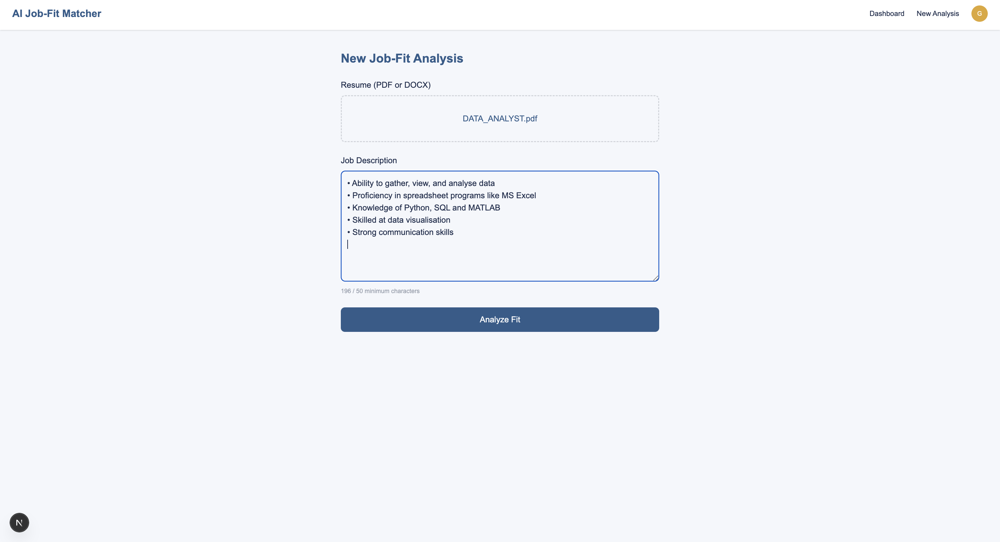

<div align="center">

# 🚀 AI Job-Fit Matcher

### AI-Powered Resume Analysis & ATS Compatibility Platform

<p align="center">
Analyze resumes, compare them with job descriptions, measure ATS compatibility, identify missing skills, and receive AI-powered recommendations to maximize interview success.
</p>

<p align="center">


</p>

**🚀 Day 4 Completed • Resume Upload Pipeline Fully Working • Ready for AI Integration**

</div>

---

# 📖 About

AI Job-Fit Matcher is an AI-powered web application that helps job seekers understand how well their resume matches a job description.

Instead of manually comparing resumes with job requirements, users simply upload a resume, paste a Job Description, and receive an AI-generated report containing:

- 🎯 Job Match Score
- 📊 ATS Compatibility Score
- ✅ Matching Skills
- ❌ Missing Skills
- 💡 Resume Improvement Suggestions
- 📈 AI Recommendations
- 📂 Previous Analysis History

Built using modern Full Stack technologies with production-ready architecture.

---

# ✨ Features

## ✅ Completed

### Authentication

- Google OAuth
- NextAuth.js
- Secure Session Management
- Protected Routes

### Resume Upload

- PDF Upload
- DOCX Upload
- Drag & Select Upload
- File Type Validation
- 5MB File Size Validation
- Client-side Validation
- Server-side Validation

### Resume Processing

- PDF Text Extraction
- DOCX Text Extraction
- Clean Text Processing
- Resume Parsing API

### UI

- Responsive Landing Page
- Dashboard
- Shared Layout
- Upload Form
- Loading States
- Error Messages

### Backend

- REST API
- Protected API Routes
- MongoDB Atlas Connection
- Mongoose Models

---

## 🚧 Coming Next

- Google Gemini Integration
- ATS Compatibility Report
- Job Match Score
- Missing Skills Analysis
- Resume Suggestions
- Dashboard Analytics
- Export Report
- Resume History

---

# 🏗 Tech Stack

| Category | Technology |
|----------|------------|
| Frontend | Next.js 16 |
| UI | React 19 |
| Styling | Tailwind CSS v4 |
| Backend | Next.js Route Handlers |
| Authentication | NextAuth.js |
| Database | MongoDB Atlas |
| ORM | Mongoose |
| Resume Parser | pdf-parse + Mammoth |
| AI | Google Gemini API |
| Deployment | Vercel |


---

# 📈 Development Progress

## ✅ Day 51 — Planning

- PRD
- Project Scope
- Blueprint

---

## ✅ Day 52 — System Design

- Database Design
- Architecture
- API Design
- UI Wireframes

---

## ✅ Day 53 — Project Foundation

- Next.js Setup
- Tailwind CSS
- MongoDB Atlas
- Google Authentication
- NextAuth
- Protected Dashboard
- Shared Layout
- API Foundation

---

## ✅ Day 54 — Core Feature Implementation

### Resume Upload

- Upload Form
- PDF Validation
- DOCX Validation
- File Size Validation
- Live Job Description Counter

### Resume Parsing

- PDF Parser
- DOCX Parser
- Server-side Text Extraction
- Clean Resume Processing

### Backend

- Analyze API
- Authentication Validation
- File Validation
- Error Handling

### Testing

- Real PDF Tested
- Real DOCX Tested
- Validation Tested
- End-to-End Pipeline Verified
  

---

# 📊 Progress

## Planning

████████████████████ 100%

## System Design

████████████████████ 100%

## Project Foundation

████████████████████ 100%

## Core Feature Development

█████████░░░░░░░░░░░ 45%

## AI Integration

░░░░░░░░░░░░░░░░░░░░ 0%


---

# 🚀 Project Milestones

| Milestone | Status |
|-----------|--------|
| ✅ Planning | Complete |
| ✅ System Design | Complete |
| ✅ Project Foundation | Complete |
| ✅ Resume Upload Pipeline | Complete |
| 🚧 AI Integration | In Progress |
| ⏳ ATS Analysis | Pending |
| ⏳ Dashboard Analytics | Pending |
| ⏳ Deployment | Pending |

### Overall Progress

**Day 4 / Day 10** ████████░░░░░░░░░░ **40% Complete**

---

# 🛣 Roadmap

## ✅ Completed

- Planning
- System Design
- Authentication
- Dashboard
- Resume Upload
- Resume Parsing
- API Foundation
- Route Protection

## 🚧 Next

- Gemini Integration
- AI Analysis
- ATS Report
- Resume Score
- Skill Gap Detection
- Recommendations
- Dashboard Analytics
- Deployment

---

# 📸 Project Screenshots

<div align="center">

## 🏠 Landing Page


---

## 🔐 Google Authentication


---

## 📊 User Dashboard


---

## 📤 Resume Upload



---

## 📄 PDF Resume Parsing


</div>

---

# 🔒 Security

- Google OAuth
- Protected Routes
- Protected APIs
- Server-side Authentication
- Environment Variables
- MongoDB Atlas Security
- File Validation
- Input Validation

---

# 🧪 Testing

Successfully Tested

- ✅ PDF Resume Upload
- ✅ DOCX Resume Upload
- ✅ File Validation
- ✅ API Endpoint
- ✅ Authentication
- ✅ Protected Routes
- ✅ Resume Text Extraction
- ✅ Error Handling

---

# 💡 Key Learnings

During Day 4, I gained practical experience in:

- Building secure file upload systems
- Parsing PDF resumes using **pdf-parse**
- Parsing DOCX resumes using **Mammoth**
- Designing authenticated API endpoints
- Handling multipart form data
- Implementing robust client-side and server-side validation
- Debugging third-party package compatibility issues
- Migrating from **middleware.js** to **proxy.js** for Next.js 16
- Building production-ready upload workflows

---

# 🚀 Getting Started

```bash
git clone https://github.com/sachinbytecodes-lab/ai-job-fit-matcher.git
```

```bash
cd ai-job-fit-matcher
```

```bash
npm install
```

Create `.env.local`

```env
MONGODB_URI=
AUTH_GOOGLE_ID=
AUTH_GOOGLE_SECRET=
NEXTAUTH_SECRET=
```

Run

```bash
npm run dev
```

Visit

```
http://localhost:3000
```

---

# 📅 Current Status

| Module | Status |
|---------|--------|
| Planning | ✅ |
| System Design | ✅ |
| Authentication | ✅ |
| Database | ✅ |
| Resume Upload | ✅ |
| Resume Parsing | ✅ |
| Analyze API | ✅ |
| AI Integration | 🚧 |
| ATS Report | ⏳ |
| Deployment | ⏳ |

---

# 🤝 Contributing

Contributions are welcome.

1. Fork the repository
2. Create your feature branch
3. Commit your changes
4. Push to GitHub
5. Open a Pull Request

---

# ⭐ Support

If you found this project useful,

⭐ Star this repository

🍴 Fork it

💻 Share feedback

It motivates me to continue building production-quality AI applications.

---

<div align="center">

## 🚀 Day 4 Completed Successfully

**Next.js 16 • MongoDB Atlas • Google Authentication • Resume Upload • PDF Parsing • DOCX Parsing • AI Integration Coming Next**

### 🎯 Day 5 Goal: Google Gemini Integration + AI Job Match Analysis


</div>
