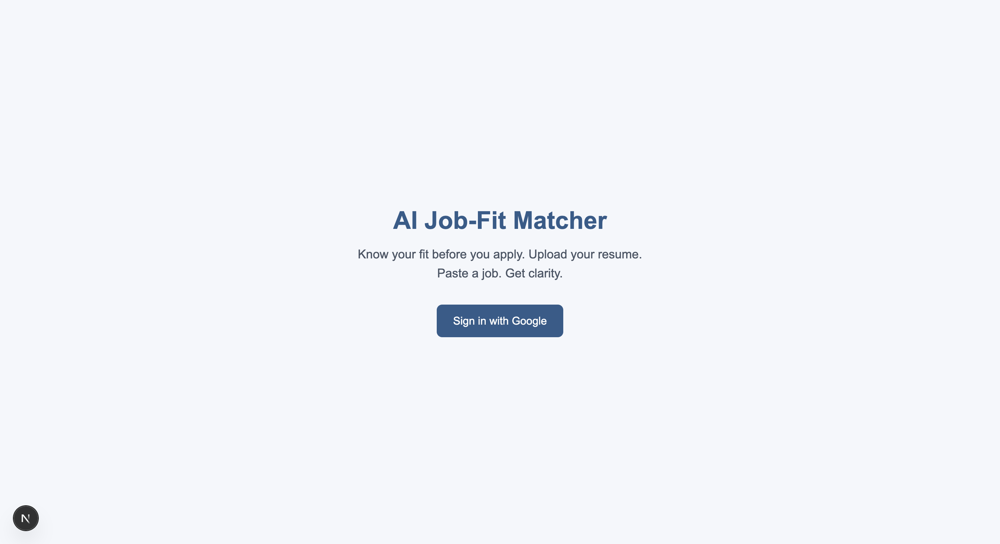
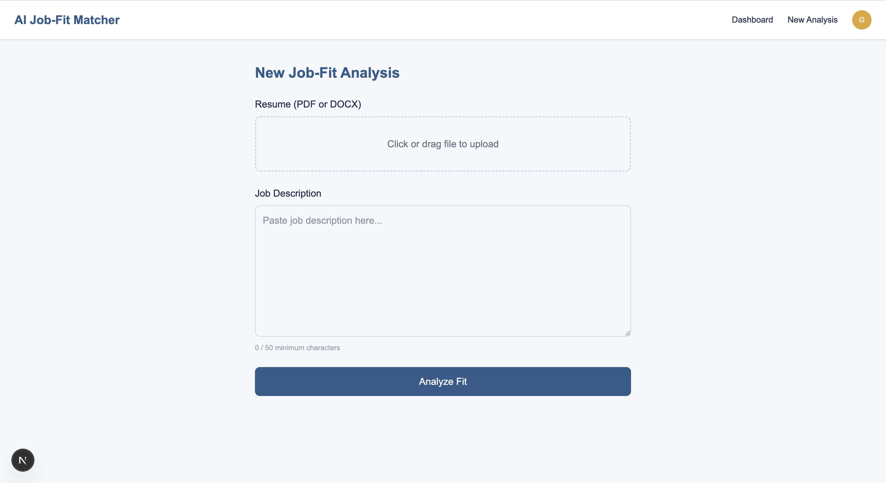
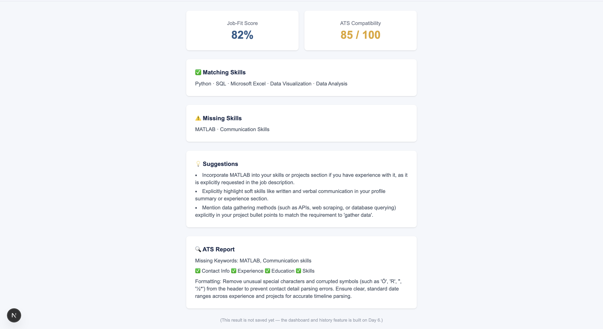

<div align="center">

# 🚀 AI Job-Fit Matcher 

### AI-Powered Resume Analysis & ATS Compatibility Platform

<p align="center">
Analyze resumes, compare them with job descriptions, measure ATS compatibility, identify missing skills, receive ATS feedback, and generate AI-powered recommendations to improve interview success.
</p>

<p align="center">


</p>

**🚀 Day 5 Completed • AI Integration Successfully Implemented • ATS Analysis Fully Functional**

</div>

---

# 📖 About

AI Job-Fit Matcher is an AI-powered web application that helps job seekers evaluate how well their resume matches a specific job description.

Users simply upload their resume, paste a job description, and receive a complete AI-generated report including:

- 🎯 Job Fit Score
- 📊 ATS Compatibility Score
- ✅ Matching Skills
- ❌ Missing Skills
- 💡 Resume Improvement Suggestions
- 📄 ATS Formatting Feedback
- 🤖 AI Recommendations
- 📂 Analysis History *(Coming Soon)*

Built with a modern full-stack architecture using only **free-tier developer tools**.

---

# ✨ Features

## ✅ Completed

### Authentication

- Google OAuth
- NextAuth.js
- Protected Routes
- Secure Sessions

---

### Resume Upload

- PDF Upload
- DOCX Upload
- Drag & Drop Upload
- File Size Validation
- File Type Validation
- Client-side Validation
- Server-side Validation

---

### Resume Processing

- PDF Parsing
- DOCX Parsing
- Clean Text Extraction
- Resume Parsing API

---

### AI Analysis (NEW)

- Google Gemini Integration
- AI Job Fit Analysis
- ATS Compatibility Analysis
- Matching Skills Detection
- Missing Skills Detection
- Resume Suggestions
- ATS Formatting Feedback
- Structured JSON AI Responses
- Intelligent Response Validation

---

### User Interface

- Responsive Landing Page
- Protected Dashboard
- Resume Upload Form
- AI Results Dashboard
- Loading States
- Error Handling

---

### Backend

- REST APIs
- Authentication Middleware
- MongoDB Atlas
- Mongoose Models
- Gemini API Integration

---

# 🏗 Tech Stack

| Category | Technology |
|----------|------------|
| Frontend | Next.js 16 |
| UI | React 19 |
| Styling | Tailwind CSS v4 |
| Backend | Next.js Route Handlers |
| Authentication | NextAuth.js |
| Database | MongoDB Atlas |
| ORM | Mongoose |
| Resume Parser | pdf-parse + Mammoth |
| AI | Google Gemini API (Free Tier) |
| Deployment | Vercel |

---

# 📈 Development Progress

## ✅ Day 51 — Planning

- PRD
- Blueprint
- Feature Planning

---

## ✅ Day 52 — System Design

- Database Schema
- API Design
- UI Wireframes
- Architecture

---

## ✅ Day 53 — Project Foundation

- Next.js Setup
- Tailwind CSS
- MongoDB Atlas
- Google Authentication
- Protected Dashboard
- Shared Layout

---

## ✅ Day 54 — Resume Upload Pipeline

### Resume Upload

- PDF Upload
- DOCX Upload
- Validation
- Resume Parsing

### Backend

- Protected API
- Authentication
- Error Handling

### Testing

- End-to-End Resume Pipeline

---

## ✅ Day 55 — AI Integration

### Google Gemini Integration

- AI Resume Analysis
- Job Description Comparison
- Structured Prompt Engineering
- JSON Response Parsing

### ATS Analysis

- ATS Compatibility Score
- Section Validation
- Formatting Feedback
- Keyword Analysis

### Job Fit Analysis

- Match Score
- Matching Skills
- Missing Skills
- Personalized Suggestions

### Result Interface

- AI Result Dashboard
- Organized Report Layout
- Score Cards
- Skill Sections
- ATS Report

### Testing

- Tested with Multiple Real Resumes
- Verified AI Differentiates Different Resumes
- Production-ready AI Pipeline

---

# 📊 Progress

## Planning

████████████████████ 100%

## System Design

████████████████████ 100%

## Project Foundation

████████████████████ 100%

## Core Feature Development

████████████████████ 100%

## AI Integration

████████████████████ 100%

## Dashboard History

░░░░░░░░░░░░░░░░░░░░ 0%

---

# 🚀 Project Milestones

| Milestone | Status |
|-----------|--------|
| ✅ Planning | Complete |
| ✅ System Design | Complete |
| ✅ Authentication | Complete |
| ✅ Resume Upload Pipeline | Complete |
| ✅ AI Integration | Complete |
| ✅ ATS Compatibility Report | Complete |
| 🚧 Analysis History | In Progress |
| ⏳ Dashboard Analytics | Pending |
| ⏳ Deployment | Pending |

## Overall Progress

**Day 5 / Day 10** ██████████░░░░░░░░ **50% Complete**

---

# 🛣 Roadmap

## ✅ Completed

- Planning
- Architecture
- Authentication
- Dashboard
- Resume Upload
- Resume Parsing
- Protected APIs
- Google Gemini Integration
- AI Job Match Analysis
- ATS Compatibility Analysis
- Resume Suggestions

---

## 🚧 Next

- Save Analysis to MongoDB
- Analysis History
- Dashboard Analytics
- Saved Reports
- Export PDF
- Deployment

---

# 📸 Project Screenshots

<div align="center">

## 🏠 Landing Page



---

## 📤 Resume Upload



---

## 📊 ATS Compatibility Report



---
</div>


# 🔒 Security

- Google OAuth
- Protected Routes
- Protected APIs
- Secure Sessions
- Environment Variables
- MongoDB Atlas Security
- Resume Validation
- Input Validation

---

# 🧪 Testing

Successfully Tested

- ✅ PDF Upload
- ✅ DOCX Upload
- ✅ Resume Parsing
- ✅ Google Authentication
- ✅ Gemini AI
- ✅ ATS Analysis
- ✅ Job Match Analysis
- ✅ Multiple Resume Comparison
- ✅ JSON Validation
- ✅ Error Handling

---

# 💡 Key Learnings

During Day 5, I learned:

- Prompt Engineering for LLMs
- Building structured AI responses
- Parsing AI-generated JSON safely
- Designing reliable AI APIs
- Implementing fallback validation
- Building ATS scoring systems
- Comparing resumes against job descriptions
- Debugging Google Gemini API
- Understanding free-tier AI limitations
- Creating production-ready AI workflows

---

# 🚀 Getting Started

```bash
git clone https://github.com/sachinbytecodes-lab/ai-job-fit-matcher.git
```

```bash
cd ai-job-fit-matcher
```

```bash
npm install
```

Create `.env.local`

```env
MONGODB_URI=

AUTH_GOOGLE_ID=

AUTH_GOOGLE_SECRET=

NEXTAUTH_SECRET=

GEMINI_API_KEY=
```

Run the development server

```bash
npm run dev
```

Visit

```
http://localhost:3000
```

---

# 📅 Current Status

| Module | Status |
|---------|--------|
| Planning | ✅ |
| Authentication | ✅ |
| Database | ✅ |
| Resume Upload | ✅ |
| Resume Parsing | ✅ |
| AI Integration | ✅ |
| ATS Report | ✅ |
| Dashboard History | 🚧 |
| Deployment | ⏳ |

---

# 🤝 Contributing

Contributions are welcome!

1. Fork the repository
2. Create a new branch
3. Commit your changes
4. Push to GitHub
5. Open a Pull Request

---

# ⭐ Support

If you found this project useful:

⭐ Star this repository

🍴 Fork it

💻 Share your feedback

Your support motivates me to continue building production-ready AI applications.

---

<div align="center">

# 🚀 Day 5 Successfully Completed

### ✅ Google Gemini Integration
### ✅ AI Job Fit Analysis
### ✅ ATS Compatibility Report
### ✅ Resume Suggestions
### ✅ Production-Ready AI Pipeline

### 🎯 Next Goal

**Day 6 — Save AI Analysis to MongoDB & Build User Dashboard History**

</div>
