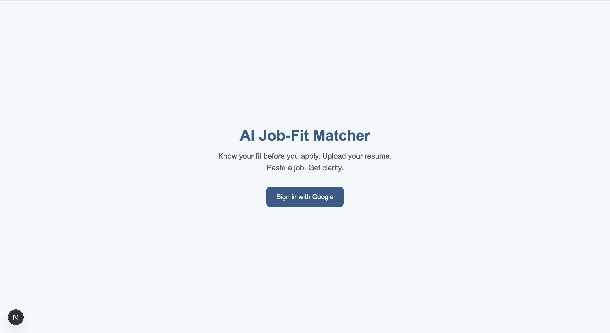
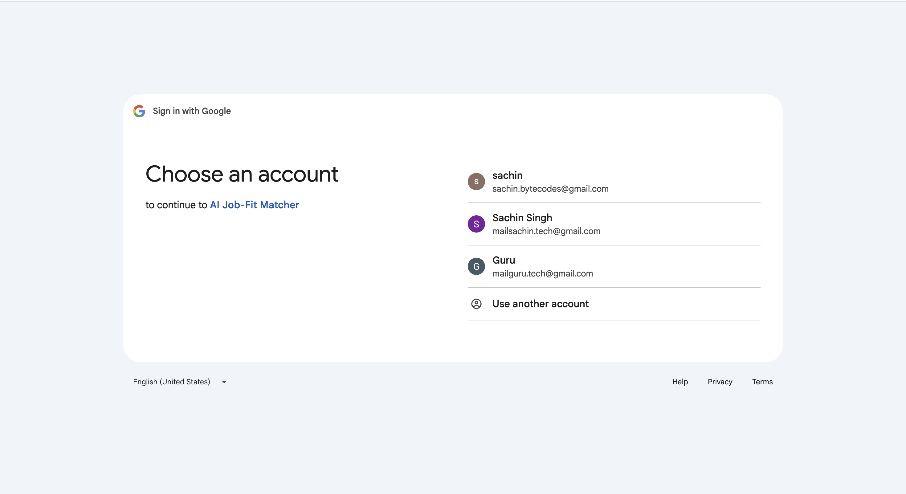
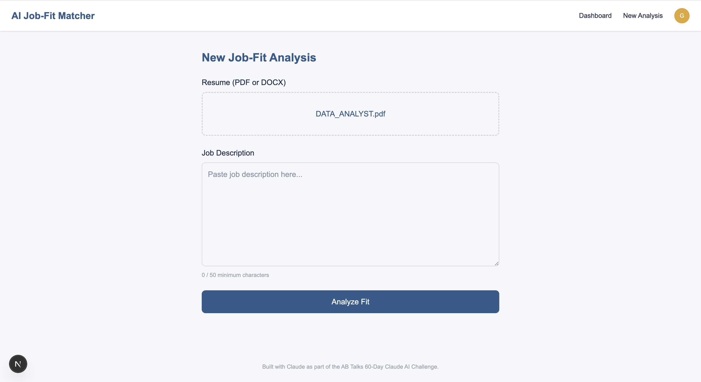
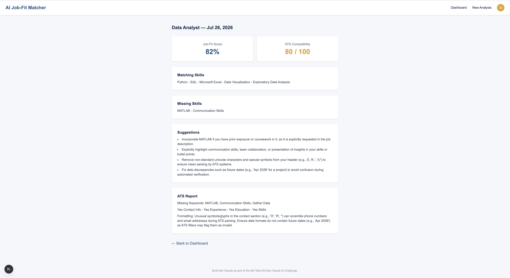
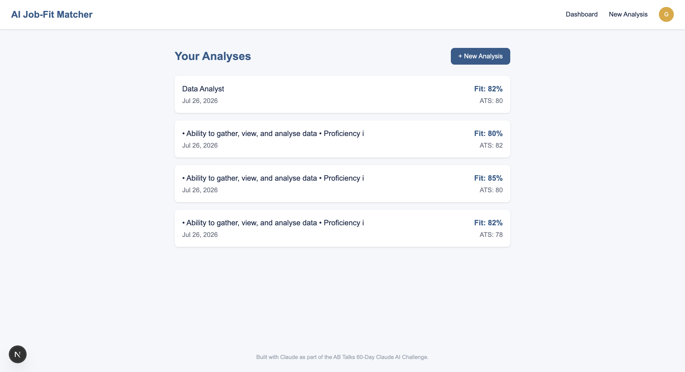

<div align="center"> 
  
# 🚀 AI Job-Fit Matcher
<p align="center">

</p>

### AI-Powered Resume Analysis & ATS Compatibility Platform

<p align="center">
Analyze resumes, compare them with job descriptions, measure ATS compatibility, identify missing skills, receive AI-powered recommendations, track previous analyses, and improve your chances of landing interviews.
</p>

<p align="center">


</p>

### 🚀 Day 6 Completed • MVP Successfully Delivered • Dashboard & History Fully Functional

</div>

---

# 📖 About

AI Job-Fit Matcher is a modern AI-powered web application that helps job seekers understand how well their resume matches a specific job description.

Simply upload your resume, paste a job description, and the application generates a complete AI-powered report using Google's Gemini AI.

The application now provides a complete end-to-end workflow, from authentication to persistent analysis history.

Users receive:

- 🎯 Job Fit Score
- 📊 ATS Compatibility Score
- ✅ Matching Skills
- ❌ Missing Skills
- 💡 Resume Improvement Suggestions
- 📄 ATS Formatting Feedback
- 🤖 AI Recommendations
- 📂 Saved Analysis History
- 📈 Personal Dashboard
- 🔍 Individual Result Pages

Built entirely using free-tier developer tools.

---

# ✨ Features

## ✅ Authentication

- Google OAuth Sign-In
- NextAuth.js Authentication
- Protected Routes
- Secure User Sessions

---

## ✅ Resume Upload

- PDF Upload
- DOCX Upload
- Drag & Drop Support
- File Validation
- Client-side Validation
- Server-side Validation

---

## ✅ Resume Processing

- PDF Parsing
- DOCX Parsing
- Clean Text Extraction
- Resume Parsing API

---

## ✅ AI Analysis

Powered by Google Gemini API

Features include:

- AI Job Fit Analysis
- ATS Compatibility Analysis
- Match Score Generation
- Matching Skills Detection
- Missing Skills Detection
- Resume Suggestions
- ATS Formatting Feedback
- Structured JSON Responses
- Intelligent AI Validation

---

## ✅ Dashboard

- Saved Analysis History
- Previous Reports
- User-specific Dashboard
- Loading States
- Empty States
- Error Handling

---

## ✅ Results

- Dedicated Results Page
- Fit Score Gauge
- ATS Report Panel
- Resume Suggestions
- Shareable Analysis URL

---

## ✅ Database

MongoDB Atlas stores:

- User Email
- Analysis Results
- ATS Reports
- Job Titles
- Fit Scores
- Creation Date
- Resume Analysis History

---

## ✅ User Interface

- Responsive Landing Page
- Dashboard
- Resume Upload Form
- Results Dashboard
- Modern Components
- Reusable UI
- Loading Indicators
- Error Handling

---

## ✅ Backend

- Next.js API Routes
- REST APIs
- MongoDB Atlas
- Mongoose
- Gemini AI Integration
- Protected APIs
- User Authorization
- Analysis Persistence

---

# 🏗 Tech Stack

| Category | Technology |
|------------|------------|
| Frontend | Next.js 16 |
| UI | React 19 |
| Styling | Tailwind CSS v4 |
| Backend | Next.js Route Handlers |
| Authentication | NextAuth.js |
| Database | MongoDB Atlas |
| ORM | Mongoose |
| Resume Parser | pdf-parse + Mammoth |
| AI | Google Gemini API (Free Tier) |
| Hosting | Vercel |

---


# 📈 Development Progress

## ✅ Day 51 — Planning

- Product Requirements
- Blueprint
- Sprint Planning

---

## ✅ Day 52 — System Design

- Database Schema
- API Design
- Authentication Flow
- UI Wireframes
- Project Architecture

---

## ✅ Day 53 — Project Foundation

- Next.js Setup
- Tailwind CSS
- MongoDB Atlas
- Google Authentication
- Protected Dashboard
- Shared Layout
- Routing

---

## ✅ Day 54 — Resume Upload Pipeline

### Resume Upload

- PDF Upload
- DOCX Upload
- Validation
- Resume Parsing

### Backend

- Authentication
- Resume API
- Error Handling

### Testing

- End-to-End Resume Upload Pipeline

---

## ✅ Day 55 — AI Integration

### Gemini AI

- AI Resume Analysis
- Job Description Comparison
- Prompt Engineering
- JSON Parsing

### ATS Analysis

- ATS Compatibility
- Keyword Analysis
- Formatting Feedback

### Results

- AI Result Dashboard
- Score Cards
- Skills Analysis
- Suggestions

### Testing

- Multiple Resume Validation
- AI Pipeline Verification

---

## ✅ Day 56 — MVP Completion

### Dashboard

- Saved Analysis History
- Dashboard List
- Loading States
- Empty States

### Backend

- MongoDB Persistence
- Analysis APIs
- User Authorization
- Protected History Routes

### Components

- Fit Score Gauge
- ATS Report Panel
- Dashboard List
- Result Card

### Application

- Auto-save Analysis
- Redirect to Results
- Dashboard History
- Site-wide Footer
- Complete MVP Workflow

---

# 📊 Development Progress

## Planning

████████████████████ 100%

## System Design

████████████████████ 100%

## Project Foundation

████████████████████ 100%

## Resume Pipeline

████████████████████ 100%

## AI Integration

████████████████████ 100%

## Dashboard History

████████████████████ 100%

## MVP Completion

████████████████████ 100%


---

# 🚀 Project Milestones

| Milestone | Status |
|-----------|--------|
| ✅ Planning | Complete |
| ✅ System Design | Complete |
| ✅ Authentication | Complete |
| ✅ Resume Upload Pipeline | Complete |
| ✅ AI Integration | Complete |
| ✅ ATS Compatibility Report | Complete |
| ✅ MongoDB Persistence | Complete |
| ✅ Dashboard History | Complete |
| ✅ Results Dashboard | Complete |
| ✅ MVP Completed | Complete |
| 🚧 Live Deployment | Pending |
| ⏳ UI/UX Enhancements | Planned |

---

# 📊 Overall Progress

**Day 6 / Day 10**

████████████░░░░░░░░

**60% Complete**

---

# 🛣 Roadmap

## ✅ Completed

- Product Planning
- System Architecture
- Google Authentication
- Protected Dashboard
- Resume Upload
- Resume Parsing
- PDF Support
- DOCX Support
- Google Gemini Integration
- AI Job Match Analysis
- ATS Compatibility Analysis
- Resume Suggestions
- MongoDB Integration
- Save Analysis
- Dashboard History
- Results Page
- Reusable Components
- Complete MVP

---

## 🚧 Coming Next

- Live Deployment (Vercel)
- Dashboard Analytics
- Export Report as PDF
- Dark Mode
- Resume Version Comparison
- AI Cover Letter Generator
- Interview Question Generator
- UI/UX Improvements

---


# 🔄 Complete User Flow

```
                    User

                      │

              Google Sign In

                      │

               Protected Dashboard

                      │

              Upload Resume (PDF/DOCX)

                      │

          Paste Job Description

                      │

             Resume Parsing API

                      │

            Google Gemini AI Analysis

                      │

          Generate ATS Compatibility Report

                      │

          Save Analysis to MongoDB Atlas

                      │

         Redirect to Results Page

                      │

      View AI Report & Recommendations

                      │

          Dashboard History

                      │

      Open Previous Saved Analyses
```

---

### 📂 GitHub Repository

> https://github.com/sachinbytecodes-lab/ai-job-fit-matcher.git

---

# 📸 Project Screenshots

<div align="center">

## 🏠 Landing Page



---

## 🔐 Google Sign In



---

## 📤 Resume Upload



---

## 📊 ATS Compatibility Report



---

## 📑 Saved Analysis



</div>

---

# 🚀 Getting Started

Clone the repository

```bash
git clone https://github.com/sachinbytecodes-lab/ai-job-fit-matcher.git
```

Move into the project

```bash
cd ai-job-fit-matcher
```

Install dependencies

```bash
npm install
```

Create a `.env.local` file

```env
MONGODB_URI=

AUTH_GOOGLE_ID=

AUTH_GOOGLE_SECRET=

NEXTAUTH_SECRET=

NEXTAUTH_URL=http://localhost:3000

GEMINI_API_KEY=
```

Run the development server

```bash
npm run dev
```

Visit

```
http://localhost:3000
```
---

# 🔒 Security

The application follows secure development practices to protect user data and ensure safe AI interactions.

### Authentication

- Google OAuth Authentication
- Secure User Sessions
- Protected Routes
- Protected API Routes

---

### Backend Security

- Server-side Validation
- Authentication Middleware
- User Authorization
- Secure MongoDB Queries

---

### File Validation

- PDF Validation
- DOCX Validation
- File Size Validation
- File Type Validation

---

### Environment Security

Sensitive information is stored securely using environment variables.

- Google OAuth Credentials
- MongoDB Connection URI
- Gemini API Key
- NextAuth Secret

---

### Database

- MongoDB Atlas
- User-specific Data Isolation
- Protected Analysis History
- Secure CRUD Operations

---

# 🧪 Testing

The application has been tested across the complete user workflow.

## Authentication

- ✅ Google Sign-In
- ✅ Protected Dashboard
- ✅ Session Management

---

## Resume Upload

- ✅ PDF Upload
- ✅ DOCX Upload
- ✅ Drag & Drop
- ✅ File Validation
- ✅ Resume Parsing

---

## AI Analysis

- ✅ Gemini API Integration
- ✅ Job Fit Analysis
- ✅ ATS Compatibility Analysis
- ✅ Missing Skills Detection
- ✅ Resume Suggestions
- ✅ Structured JSON Responses

---

## Database

- ✅ Save Analysis
- ✅ Fetch Analysis History
- ✅ View Individual Results
- ✅ User Authorization
- ✅ MongoDB Persistence

---

## User Interface

- ✅ Loading States
- ✅ Error Handling
- ✅ Responsive Layout
- ✅ Dashboard Navigation

---

## End-to-End Flow

- ✅ Google Login
- ✅ Upload Resume
- ✅ Paste Job Description
- ✅ Generate AI Analysis
- ✅ Save to MongoDB
- ✅ Redirect to Results
- ✅ View Dashboard History
- ✅ Reopen Previous Analysis

---

# 💡 Key Learnings

Day 6 focused on transforming the project from an AI prototype into a complete MVP.

Throughout today's implementation, I learned:

- Designing reusable React components
- Building scalable dashboard architecture
- Creating protected REST APIs with Next.js
- Persisting AI-generated reports in MongoDB Atlas
- Implementing user-specific authorization
- Working with dynamic routes in the App Router
- Handling loading, empty, and error states
- Structuring reusable UI components
- Debugging schema and API issues
- Building a production-ready full-stack AI application

---

# 🚧 Challenges Faced

- Parsing different resume formats
- Designing reliable AI prompts
- Maintaining structured JSON responses
- Handling authentication securely
- Building user-specific history
- Debugging MongoDB schema mismatches

---

# 🎯 What's Next

The project is now feature-complete as an MVP.

The next development phase will focus on:

- 🚀 Deploying to Vercel
- 🌐 Production Environment Configuration
- 📈 Dashboard Analytics
- 📄 Export Reports as PDF
- 🌙 Dark Mode
- 📊 Resume Comparison
- 🤖 AI Cover Letter Generator
- 🎤 Interview Question Generator
- 🎨 UI/UX Enhancements

---

# 🤝 Contributing

Contributions are welcome!

If you'd like to improve this project:

1. Fork the repository
2. Create a feature branch

```bash
git checkout -b feature/your-feature
```

3. Commit your changes

```bash
git commit -m "Add your feature"
```

4. Push your branch

```bash
git push origin feature/your-feature
```

5. Open a Pull Request

---

# ⭐ Support

If you found this project useful, please consider supporting it.

⭐ Star the repository

🍴 Fork the repository

💬 Share your feedback

📢 Recommend it to others

Your support motivates me to continue building production-ready AI applications.

---

# 🙏 Acknowledgements

This project wouldn't have been possible without the amazing open-source ecosystem.

Special thanks to:

- Google Gemini AI
- Next.js
- React
- MongoDB Atlas
- NextAuth.js
- Tailwind CSS
- Vercel
- Mammoth
- pdf-parse
- Mongoose

---


# 🚀 Day 6 Highlights

## ✅ Today's Accomplishments

- Implemented persistent MongoDB storage for AI analyses
- Built secure analysis history APIs
- Added user-specific authorization for saved reports
- Developed reusable Result Card component
- Developed ATS Report Panel component
- Developed Fit Score Gauge component
- Built Dashboard History page
- Created dynamic Result Details page
- Connected AI analysis directly to database persistence
- Implemented automatic redirection after analysis
- Added a global application footer
- Verified the complete end-to-end MVP workflow

---

## 📊 MVP Status

| Feature | Status |
|---------|--------|
| Google Authentication | ✅ |
| Resume Upload | ✅ |
| Resume Parsing | ✅ |
| AI Job Match Analysis | ✅ |
| ATS Compatibility Report | ✅ |
| MongoDB Persistence | ✅ |
| Dashboard History | ✅ |
| Results Page | ✅ |
| Responsive Interface | ✅ |
| Production-Ready MVP | ✅ |

---

## 🎯 Day 7 Goal

The focus for the next sprint is to move from a local MVP to a publicly accessible application.

### Planned Work

- Deploy the application on Vercel
- Configure production environment variables
- Update Google OAuth production settings
- Verify the complete production workflow
- Perform final bug fixing
- Publish a live shareable demo

---


# 🚀 Day 6 Successfully Completed

### ✅ MongoDB Persistence

### ✅ Dashboard History

### ✅ Results Dashboard

### ✅ Secure User Authorization

### ✅ Reusable Components

### ✅ Production-Ready MVP

---


<div align="center">

Made with ❤️ using

Next.js • React • MongoDB • Gemini AI

---

Built with Claude as part of the

## AB Talks 60-Day Claude AI Challenge

⭐ Star this repository if you found it useful!

</div>

</div>
