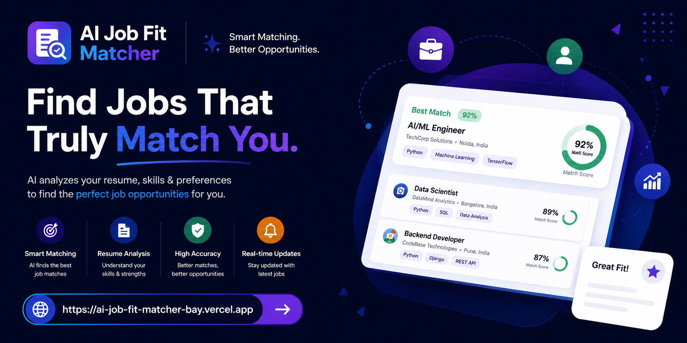
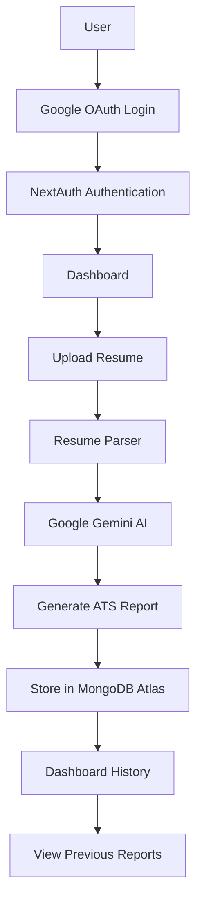
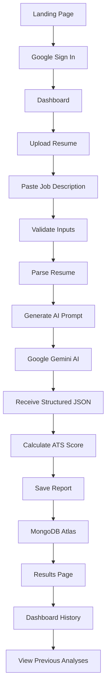
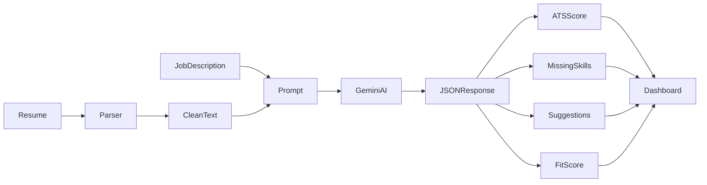
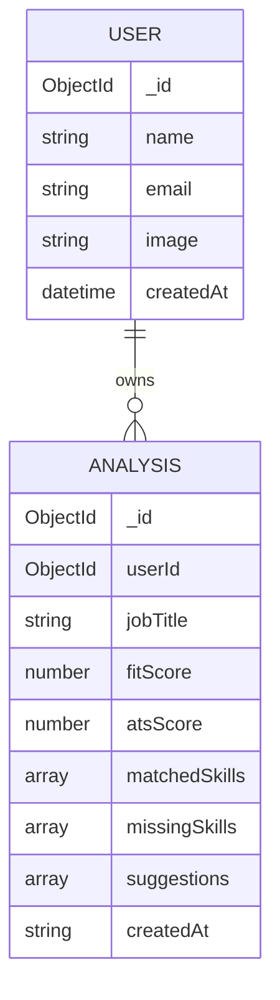
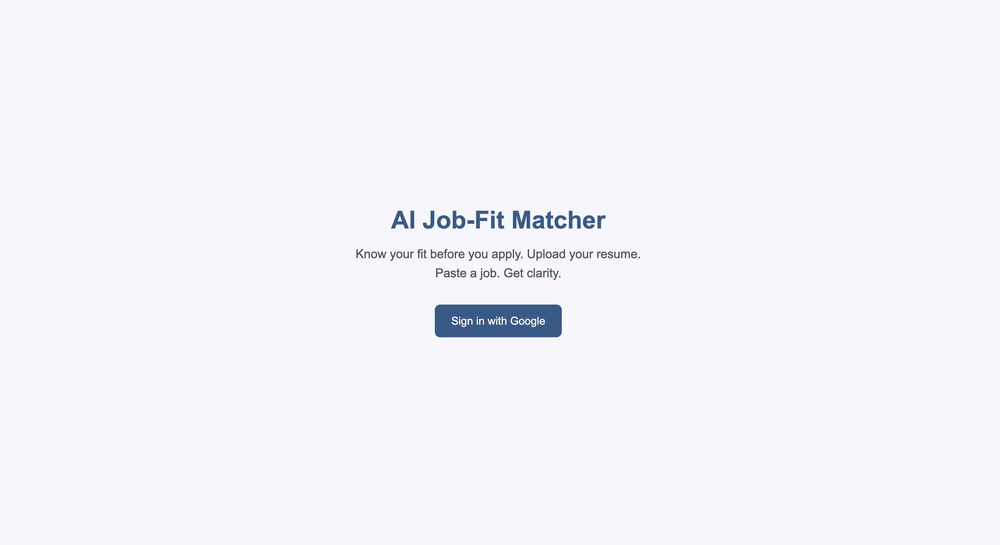
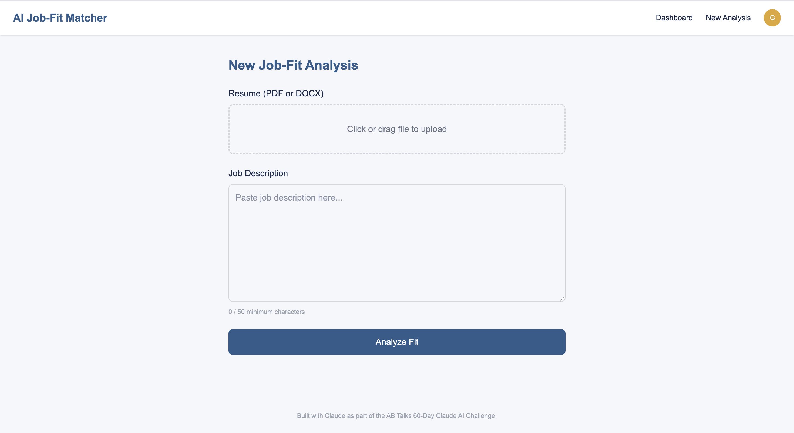
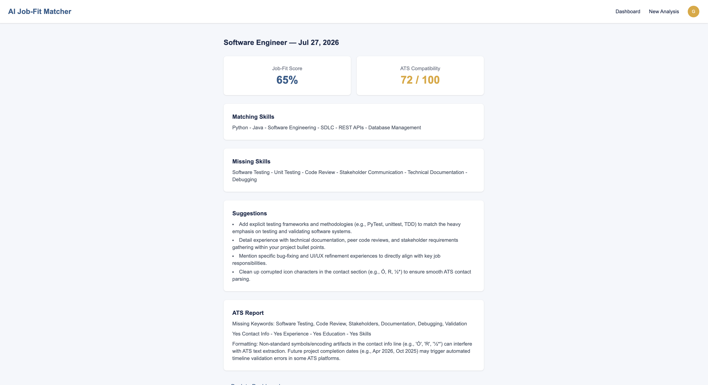
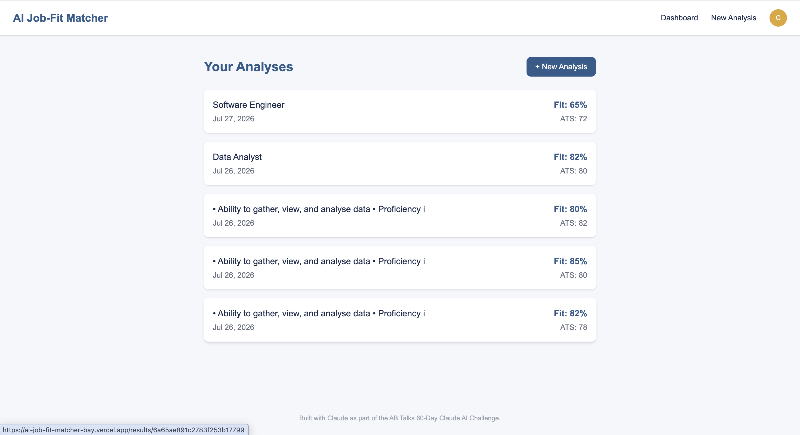

<div align="center">

# 🚀 AI Job-Fit Matcher

<p align="center">

</p>

<h2>
🤖 AI-Powered Resume Analysis, ATS Score & Job Matching Platform
</h2>

<p>
Analyze resumes against job descriptions, calculate ATS compatibility, identify missing skills, receive AI-powered recommendations, and track previous analyses — all using Google's Gemini AI.
</p>

<p>

<a href="https://ai-job-fit-matcher-bay.vercel.app">

</a>

<a href="https://github.com/sachinbytecodes-lab/ai-job-fit-matcher">

</a>

</p>

<p>


</p>

---

## 🎉 Project Status

### ✅ Day 7 Completed

**Production Deployment Successfully Completed**

✅ Live on Vercel

✅ Google OAuth Production Ready

✅ Gemini AI Integrated

✅ MongoDB Atlas Connected

✅ Fully Tested

✅ Portfolio Ready

</div>

---

# 📖 About the Project

AI Job-Fit Matcher is a full-stack AI-powered web application that helps job seekers evaluate how well their resume aligns with a target job description.

Instead of relying on generic resume checkers, the application uses **Google Gemini AI** to perform contextual analysis and provide personalised feedback, making it more useful than simple keyword-based ATS tools.

The platform securely stores every analysis, allowing users to revisit previous reports, compare improvements, and continuously optimise their resumes.

Built entirely using **free-tier technologies**, the project demonstrates modern full-stack development, AI integration, secure authentication, cloud deployment, and production-ready architecture.

---

# 🎯 Problem Statement

Every year, millions of resumes are rejected before reaching a recruiter because they fail Applicant Tracking System (ATS) screening.

Common challenges include:

- ATS-incompatible formatting
- Missing technical skills
- Poor keyword optimisation
- Weak resume content
- Low job-role alignment
- Lack of personalised feedback

Most online tools either provide generic suggestions or require expensive subscriptions.

---

# 💡 Solution

AI Job-Fit Matcher bridges this gap by combining AI-powered resume understanding with ATS analysis.

Users simply:

1. Sign in securely
2. Upload a resume
3. Paste a job description
4. Receive an intelligent report including:
   - Job Match Score
   - ATS Compatibility Score
   - Matching Skills
   - Missing Skills
   - Resume Improvement Suggestions
   - AI Feedback
5. Save every report for future reference

The result is a practical tool that helps users improve their resumes before applying for jobs.

---

# ✨ Key Features

## 🔐 Authentication

- Google OAuth Sign-In
- NextAuth.js Authentication
- Secure Session Management
- Protected Routes
- User-specific Dashboard

---

## 📄 Resume Upload

- PDF Support
- DOCX Support
- Drag & Drop Upload
- File Validation
- Resume Parsing

---

## 🤖 AI Resume Analysis

Powered by Google Gemini AI:

- Resume Understanding
- Job Description Analysis
- ATS Compatibility
- Job Match Score
- Missing Skills
- Resume Strengths
- Resume Weaknesses
- Resume Suggestions
- JSON Structured Responses

---

## 📊 Dashboard

- Previous Analyses
- Saved Reports
- Individual Result Pages
- Analysis History
- User Dashboard

---

## 🗄 Database

MongoDB Atlas stores:

- User Profile
- Resume Reports
- ATS Results
- Fit Scores
- Job Titles
- Creation Date
- Analysis History

---

## 🚀 Production Ready

- Hosted on Vercel
- HTTPS Enabled
- Production OAuth
- Environment Variables
- Production Database
- Build Optimisation

---

# 🛠 Technology Stack

| Layer | Technology |
|---------|------------|
| Framework | Next.js 15 |
| Frontend | React 19 |
| Language | TypeScript |
| Styling | Tailwind CSS v4 |
| Authentication | NextAuth.js |
| Database | MongoDB Atlas |
| ORM | Mongoose |
| Resume Parsing | pdf-parse, Mammoth |
| Artificial Intelligence | Google Gemini API |
| Backend | Next.js Route Handlers |
| Deployment | Vercel |

---

# 🏗 System Architecture



---

# 🌟 Why This Project?

Unlike traditional ATS checkers, this application provides contextual AI-driven resume evaluation instead of relying solely on keyword matching.

It demonstrates expertise in:

- Full-Stack Development
- Authentication & Security
- Cloud Deployment
- AI Integration
- REST API Design
- MongoDB Database Design
- Production Engineering
- Responsive UI Development

making it an excellent portfolio project for software engineering and AI-focused roles.

---

# 🔄 Application Workflow

The following diagram illustrates the complete user journey from authentication to viewing AI-generated insights.



---

# 🤖 AI Workflow

Google Gemini AI is responsible for understanding both the resume and job description, comparing them contextually, and generating a structured report.



---

# 🗄 Database Design

The application stores authenticated users and their AI-generated reports securely in MongoDB Atlas.



---


# 🚀 Getting Started

## 1. Clone Repository

```bash
git clone https://github.com/sachinbytecodes-lab/ai-job-fit-matcher.git
```

---

## 2. Navigate into Project

```bash
cd ai-job-fit-matcher
```

---

## 3. Install Dependencies

```bash
npm install
```

---

## 4. Configure Environment Variables

Create a file named:

```text
.env.local
```

Copy the following variables:

```env
GOOGLE_CLIENT_ID=

GOOGLE_CLIENT_SECRET=

NEXTAUTH_SECRET=

NEXTAUTH_URL=http://localhost:3000

MONGODB_URI=

GEMINI_API_KEY=
```

---

## 5. Start Development Server

```bash
npm run dev
```

Visit:

```
http://localhost:3000
```

---

# 🔑 Environment Variables

| Variable | Description |
|-----------|-------------|
| GOOGLE_CLIENT_ID | Google OAuth Client ID |
| GOOGLE_CLIENT_SECRET | Google OAuth Secret |
| NEXTAUTH_SECRET | Secret used to sign authentication tokens |
| NEXTAUTH_URL | Base URL of the application |
| MONGODB_URI | MongoDB Atlas connection string |
| GEMINI_API_KEY | Google Gemini API key |

> **Important:** Never commit your `.env.local` file or expose API keys publicly.

---

# 🌐 Live Deployment

The application is deployed on **Vercel** and is fully production-ready.

### 🔗 Live Demo

https://ai-job-fit-matcher-bay.vercel.app

### 💻 GitHub Repository

https://github.com/sachinbytecodes-lab/ai-job-fit-matcher

---

## Production Stack

| Service | Purpose |
|----------|---------|
| Vercel | Frontend & Backend Hosting |
| MongoDB Atlas | Cloud Database |
| Google OAuth | User Authentication |
| Google Gemini AI | Resume Analysis |
| NextAuth | Session Management |

---

# 🚀 Day 7 Deployment Highlights

Day 7 focused on taking the project from a locally working MVP to a fully deployed production application.

### ✅ Successfully Completed

- Live deployment on Vercel
- Configured production environment variables
- Connected MongoDB Atlas production database
- Updated Google OAuth redirect URIs
- Enabled HTTPS authentication
- Verified Google Sign-In in production
- Verified Gemini AI responses in production
- Verified MongoDB persistence
- Fixed production middleware/proxy build issue
- Completed end-to-end production testing

---

# 📸 Screenshots

<p align="center">
  <b>Explore the application through its key interfaces.</b>
</p>

---

## 🏠 Landing Page

<p align="center">
  
</p>

---

## 🔐 Google Authentication

<p align="center">
  
</p>

---

## 📤 Resume Upload

<p align="center">
  
</p>

---

## 🤖 AI Analysis Report

<p align="center">
  
</p>


---

## 📝 Analysis History

<p align="center">
  
</p>

---

# 📦 Production Build

Run a production build locally.

```bash
npm run build
```

Start the production server.

```bash
npm start
```

---

# ⚡ Performance

The project is optimised for production.

- ⚡ Fast page loads with Next.js App Router
- 🔒 Secure authentication using NextAuth
- ☁️ Cloud-hosted MongoDB Atlas
- 🤖 Efficient AI inference with Gemini
- 📱 Fully responsive layout
- 🚀 Deployed on Vercel with HTTPS
- 📦 Optimised production build

---

# 🧪 Testing & Verification

The application has been thoroughly tested across the complete user journey to ensure reliability, security, and production readiness.

## 🔐 Authentication

| Test | Status |
|------|--------|
| Google OAuth Login | ✅ |
| Protected Routes | ✅ |
| Session Persistence | ✅ |
| Logout Functionality | ✅ |
| Unauthorized Access Prevention | ✅ |

---

## 📄 Resume Upload

| Test | Status |
|------|--------|
| PDF Upload | ✅ |
| DOCX Upload | ✅ |
| Drag & Drop Support | ✅ |
| File Validation | ✅ |
| Resume Parsing | ✅ |
| Invalid File Handling | ✅ |

---

## 🤖 AI Resume Analysis

| Test | Status |
|------|--------|
| Gemini API Connection | ✅ |
| Resume Parsing | ✅ |
| Job Description Processing | ✅ |
| ATS Score Generation | ✅ |
| Missing Skills Detection | ✅ |
| Resume Suggestions | ✅ |
| Structured JSON Response | ✅ |

---

## 🗄 Database

| Test | Status |
|------|--------|
| MongoDB Connection | ✅ |
| Save Analysis | ✅ |
| Retrieve Analysis | ✅ |
| User Isolation | ✅ |
| Dashboard History | ✅ |

---

## 🚀 Production Deployment

| Test | Status |
|------|--------|
| Vercel Deployment | ✅ |
| HTTPS | ✅ |
| Google OAuth Production | ✅ |
| MongoDB Atlas | ✅ |
| Gemini API | ✅ |
| Environment Variables | ✅ |
| Production Build | ✅ |

---

## 🌐 End-to-End Testing

Complete workflow verified successfully.

```text
Google Login
      ↓
Dashboard
      ↓
Upload Resume
      ↓
Paste Job Description
      ↓
AI Analysis
      ↓
Generate ATS Report
      ↓
Save to MongoDB
      ↓
View Results
      ↓
Dashboard History
```

---

# 📅 Development Journey

The project was developed following a structured sprint-based workflow.

| Day | Milestone | Status |
|------|-----------|--------|
| Day 1 | Project Planning & Blueprint | ✅ |
| Day 2 | System Architecture & UI Design | ✅ |
| Day 3 | Authentication & Project Setup | ✅ |
| Day 4 | Resume Upload & Parsing | ✅ |
| Day 5 | Gemini AI Integration | ✅ |
| Day 6 | Dashboard, MongoDB & History | ✅ |
| **Day 7** | **Production Deployment & Verification** | **✅** |

---

# 🚀 Day 7 Highlights

Day 7 focused on transforming the project from a local MVP into a fully deployed, production-ready application.

## ✅ Production Deployment

- Successfully deployed the application on **Vercel**
- Connected the production deployment to **MongoDB Atlas**
- Configured all required environment variables
- Enabled secure HTTPS hosting

---

## 🔐 Authentication

- Updated Google OAuth production credentials
- Added production redirect URIs
- Verified Google Sign-In on the live application
- Confirmed secure session management

---

## 🤖 AI Integration

- Verified Gemini AI responses in production
- Confirmed structured JSON output
- Tested multiple resume analyses successfully

---

## 🗄 Database

- Connected the live application to MongoDB Atlas
- Verified analysis persistence
- Confirmed dashboard history updates correctly
- Ensured user-specific data isolation

---

## 🐞 Production Bug Fix

### Issue

The first production deployment failed because `proxy.js` exported a re-exported middleware function that passed local development but failed Next.js production build validation.

### Solution

Replaced the re-export with an explicit middleware wrapper using `withAuth()`.

This resolved the production build issue and allowed successful deployment.

---

## ✅ Final Verification

The following production workflow was verified successfully:

- Google Sign-In
- Resume Upload
- Resume Parsing
- Gemini AI Analysis
- ATS Report Generation
- MongoDB Storage
- Dashboard History
- Previous Report Retrieval

---

# 🐛 Challenges & Solutions

| Challenge | Solution |
|------------|----------|
| Google OAuth configuration | Updated production redirect URIs |
| Gemini API prompt engineering | Refined prompts for consistent JSON output |
| Resume parsing | Added support for both PDF and DOCX |
| MongoDB schema issues | Optimised database models |
| Protected routes | Implemented NextAuth middleware |
| Production deployment | Configured Vercel environment variables |
| Middleware build error | Replaced re-export with explicit proxy function |

---

# 💡 Key Learnings

Building this project strengthened my understanding of modern full-stack AI application development.

## Frontend

- Next.js App Router
- React Component Architecture
- TypeScript
- Tailwind CSS
- Responsive Design

---

## Backend

- API Route Design
- Authentication
- Middleware
- File Upload Handling
- Error Handling

---

## Artificial Intelligence

- Prompt Engineering
- Gemini AI Integration
- JSON Validation
- Resume Analysis
- ATS Compatibility

---

## Database

- MongoDB Atlas
- Mongoose
- Database Modelling
- User-Specific Data
- CRUD Operations

---

## Deployment

- Vercel Deployment
- Production Debugging
- Environment Variables
- OAuth Configuration
- Build Optimisation

---

## Software Engineering

- Project Planning
- System Design
- Debugging
- Production Readiness
- Secure Development Practices
- Documentation
- Version Control
- Incremental Feature Development

---

# 📊 Project Statistics

| Metric | Value |
|---------|-------|
| Sprint Progress | 7 / 10 Days |
| Development Status | Production Ready |
| Authentication | Google OAuth |
| AI Model | Google Gemini |
| Database | MongoDB Atlas |
| Hosting | Vercel |
| Resume Formats | PDF & DOCX |
| Responsive Design | Yes |
| Protected Routes | Yes |
| Dashboard History | Yes |
| ATS Analysis | Yes |
| Production Deployment | Completed |

---

# 🎯 Current Project Status

```text
Planning                ████████████████████ 100%

Architecture            ████████████████████ 100%

Authentication          ████████████████████ 100%

Resume Upload           ████████████████████ 100%

AI Analysis             ████████████████████ 100%

Dashboard               ████████████████████ 100%

Deployment              ████████████████████ 100%

UI/UX Polish            ███████████████░░░░ 75%

Portfolio Optimisation  ███████████████░░░░ 75%
```

---

# 🏆 Achievements

- ✅ Fully functional AI-powered web application
- ✅ Production deployment completed
- ✅ End-to-end workflow verified
- ✅ Secure authentication implemented
- ✅ Cloud database integration
- ✅ Real-time AI analysis
- ✅ Portfolio-ready project
- ✅ Built entirely using free-tier services

---

# 🛣️ Roadmap

Although the MVP is now live and fully functional, several exciting features are planned to further enhance the platform.

## 🚀 Upcoming Features

### 🎨 User Experience

- [ ] Complete UI/UX redesign
- [ ] Dark Mode
- [ ] Light/Dark Theme Toggle
- [ ] Improved Mobile Experience
- [ ] Better Accessibility (WCAG)
- [ ] Advanced Animations
- [ ] Skeleton Loading Screens
- [ ] Toast Notifications

---

### 🤖 AI Features

- [ ] AI Cover Letter Generator
- [ ] Resume Rewrite Assistant
- [ ] Resume Version Comparison
- [ ] AI Career Coach
- [ ] Interview Question Generator
- [ ] Job Recommendation Engine
- [ ] AI Skill Gap Analysis
- [ ] Resume Optimisation Suggestions

---

### 📄 Resume Features

- [ ] Export Analysis as PDF
- [ ] Download ATS Report
- [ ] Resume Templates
- [ ] Resume Version History
- [ ] Resume Sharing
- [ ] Resume Rating Trends

---

### 📊 Dashboard

- [ ] Analytics Dashboard
- [ ] Resume Performance Graphs
- [ ] Weekly Insights
- [ ] Profile Completion Score
- [ ] Usage Statistics

---

### 🔧 Engineering

- [ ] Unit Testing
- [ ] Integration Testing
- [ ] CI/CD Pipeline
- [ ] Docker Support
- [ ] Automated Deployment
- [ ] Monitoring & Logging
- [ ] Performance Optimisation

---

# 📅 Development Timeline

| Sprint | Focus | Status |
|----------|-------------------------------|-----------|
| Day 1 | Planning & Requirements | ✅ |
| Day 2 | System Design | ✅ |
| Day 3 | Authentication & Foundation | ✅ |
| Day 4 | Resume Upload Pipeline | ✅ |
| Day 5 | AI Integration | ✅ |
| Day 6 | Dashboard & Database | ✅ |
| **Day 7** | **Production Deployment** | ✅ |
| Day 8 | UI/UX Polish | 🔄 |
| Day 9 | Final Optimisation | ⏳ |
| Day 10 | Portfolio & Documentation | ⏳ |

---

# 🤝 Contributing

Contributions are always welcome!

If you'd like to improve this project:

### 1️⃣ Fork the repository

Click the **Fork** button on GitHub.

---

### 2️⃣ Clone your fork

```bash
git clone https://github.com/your-username/ai-job-fit-matcher.git
```

---

### 3️⃣ Create a new branch

```bash
git checkout -b feature/amazing-feature
```

---

### 4️⃣ Make your changes

Follow the existing coding style and ensure your code is well documented.

---

### 5️⃣ Commit your work

```bash
git commit -m "Add amazing feature"
```

---

### 6️⃣ Push your branch

```bash
git push origin feature/amazing-feature
```

---

### 7️⃣ Open a Pull Request

Describe your changes clearly and link any related issues if applicable.

---

# 👨‍💻 Author

<div align="center">

## Sachin Singh

**AI Engineer • Full-Stack Developer • MCA Student**

Passionate about building scalable AI-powered web applications using modern technologies.

</div>

### Connect with Me

- 🌐 Portfolio: *Coming Soon*
- 💼 LinkedIn: https://www.linkedin.com/in/sachin--singh--0001-
- 🐙 GitHub: https://github.com/sachinbytecodes-lab
- 📧 Email: mailsachin.tech@gmail.com

---

# 🌟 Support the Project

If you found this project useful or learned something from it, please consider supporting it.

### ⭐ Star this repository

A GitHub star helps increase the project's visibility and motivates further development.

### 🍴 Fork the project

Experiment, improve, and build upon it.

### 🐞 Report Issues

Found a bug? Open an issue with reproduction steps.

### 💡 Suggest Features

Have an idea? Feature requests are always welcome.

---

# 🙏 Acknowledgements

This project was built using amazing open-source technologies and services.

Special thanks to:

- 💙 Next.js
- ⚛️ React
- 🎨 Tailwind CSS
- 🔐 NextAuth.js
- 🍃 MongoDB Atlas
- 🤖 Google Gemini AI
- ☁️ Vercel
- 📄 pdf-parse
- 📑 Mammoth
- 🧩 Mongoose
- ❤️ Open Source Community

---

# 🏅 Project Highlights

✅ AI-Powered Resume Analysis

✅ ATS Compatibility Checker

✅ Google OAuth Authentication

✅ Google Gemini AI Integration

✅ MongoDB Atlas Cloud Database

✅ Secure Dashboard

✅ Resume Analysis History

✅ Production Deployment on Vercel

✅ Fully Responsive Design

✅ End-to-End Tested

✅ Built with Free-Tier Technologies

---

# 📈 Repository Status

| Category | Status |
|----------|--------|
| Project Completion | 🟢 70% |
| MVP | ✅ Complete |
| Production Deployment | ✅ Complete |
| Documentation | ✅ Complete |
| Testing | ✅ Complete |
| UI/UX Polish | 🔄 In Progress |
| Portfolio Ready | ✅ Yes |

---

# 🎯 What's Next?

The next sprint (Day 8) will focus on transforming the application from **production-ready** to **portfolio-quality**.

Key objectives include:

- 🎨 UI/UX refinement
- 📱 Mobile responsiveness improvements
- ✨ Micro-interactions & animations
- ♿ Accessibility improvements
- 🧩 Better loading & empty states
- 📊 Dashboard polish
- 🚀 Performance optimisation

---

<div align="center">

# ⭐ If you enjoyed this project, please consider giving it a Star ⭐

It helps others discover the project and motivates future development.

---

### Built with ❤️ by Sachin Singh

### Powered by Next.js • React • Gemini AI • MongoDB • Vercel

### 🚀 From Idea → MVP → Production

</div>
