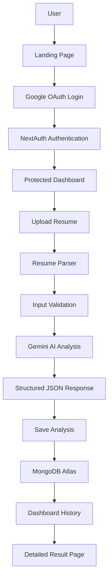
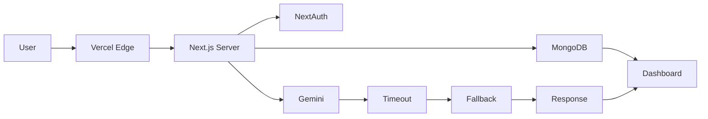
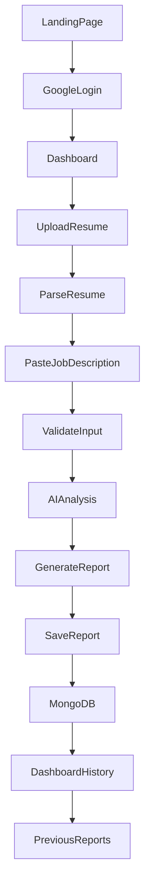
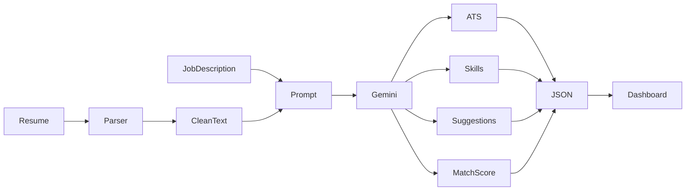
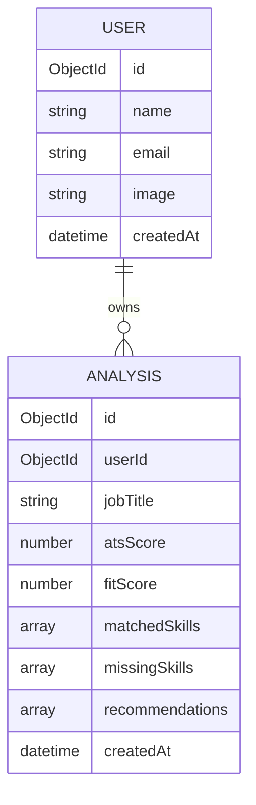
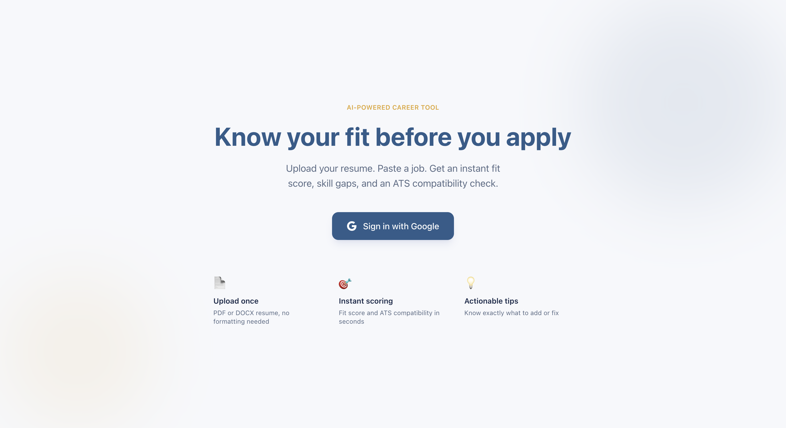
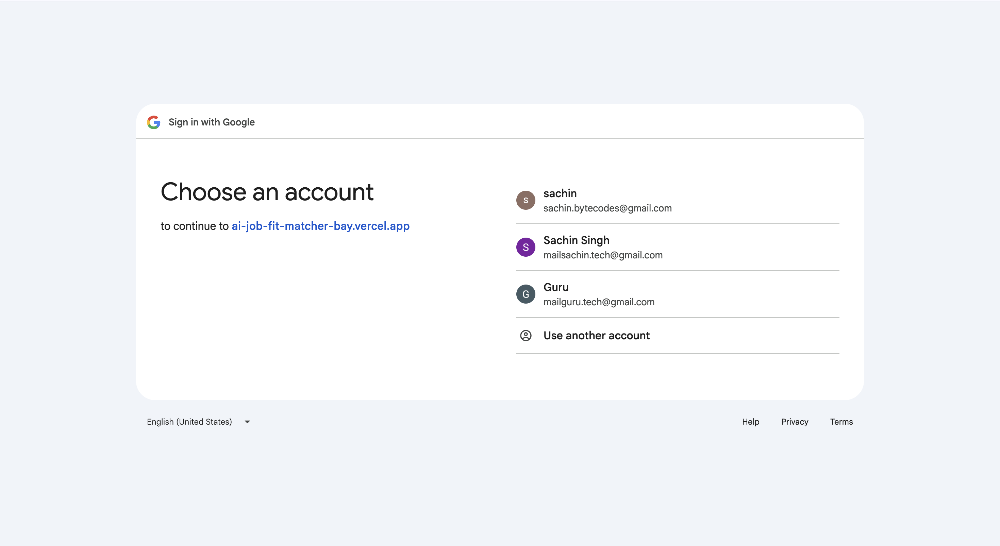
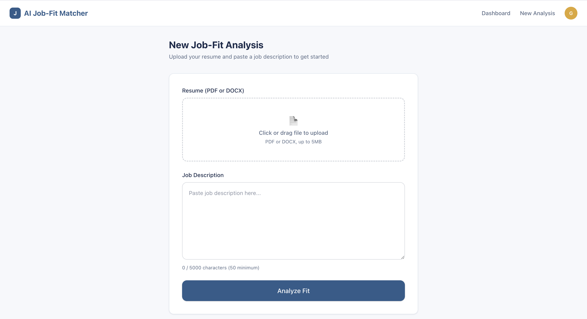
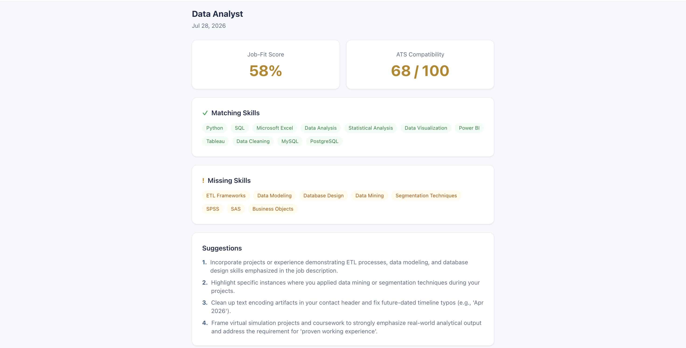
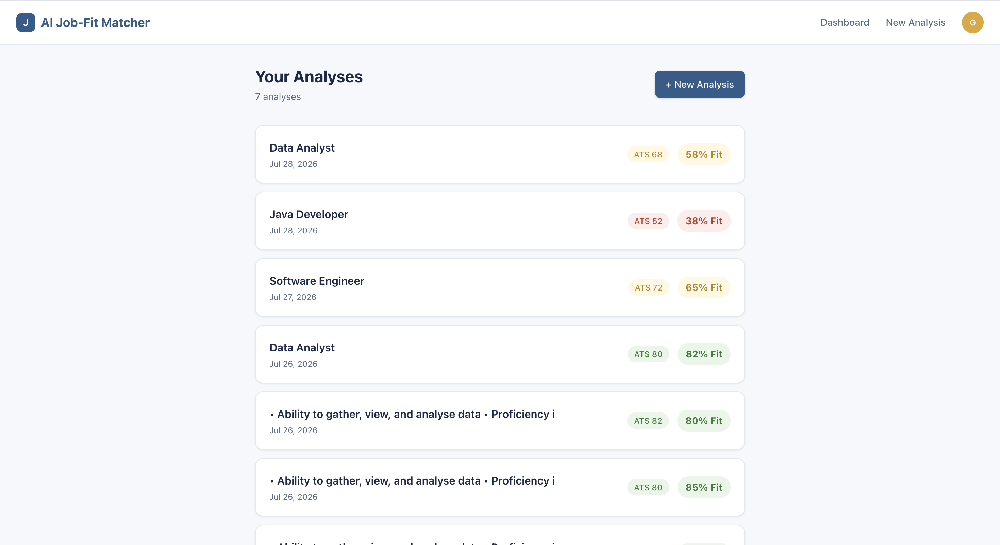

<div align="center">

# 🚀 AI Job-Fit Matcher


<h2>
🤖 AI-Powered Resume Analysis, ATS Score & Intelligent Job Matching Platform
</h2>

<p>
An AI-powered web application that analyzes resumes against job descriptions using Google Gemini AI to generate ATS compatibility scores, identify skill gaps, provide personalized improvement recommendations, and securely store analysis history for future reference.
</p>

<p>

<a href="https://ai-job-fit-matcher-bay.vercel.app">

</a>

<a href="https://github.com/sachinbytecodes-lab/ai-job-fit-matcher">

</a>

</p>

<p>


</p>

</div>

---

# 🎉 Project Status

## ✅ Day 8 Completed — Testing, Debugging & Production Optimization

The application has successfully completed a comprehensive release-readiness review.

Instead of introducing new features, Day 8 focused on making the platform stable, reliable, secure, accessible, and production-ready through extensive testing, debugging, and optimization.

### Current Progress

| Sprint | Status |
|---------|--------|
| Planning | ✅ |
| Authentication | ✅ |
| Resume Upload | ✅ |
| AI Integration | ✅ |
| Dashboard | ✅ |
| Database | ✅ |
| Production Deployment | ✅ |
| Testing & Debugging | ✅ |
| Performance Optimization | ✅ |
| Security Review | ✅ |

---

# 📖 About the Project

AI Job-Fit Matcher is a modern full-stack AI application that helps job seekers evaluate how well their resume aligns with a target job description.

Unlike traditional ATS keyword scanners, this platform leverages Google's Gemini AI to perform contextual analysis, enabling users to receive personalized recommendations rather than generic keyword suggestions.

The application allows users to:

- Upload resumes (PDF/DOCX)
- Paste job descriptions
- Receive AI-powered ATS analysis
- Discover missing skills
- View resume strengths and weaknesses
- Improve resumes with actionable suggestions
- Store previous analyses securely
- Review historical reports through a personalized dashboard

The project demonstrates modern software engineering practices including authentication, cloud deployment, AI integration, secure APIs, responsive UI design, accessibility improvements, and production-ready architecture.

---

# 🎯 Problem Statement

Many qualified candidates fail to pass Applicant Tracking Systems (ATS) before their resumes ever reach recruiters.

Common issues include:

- Missing role-specific keywords
- Weak technical skills presentation
- Poor resume formatting
- Low job-role alignment
- Generic resume content
- Lack of personalized feedback

Most online ATS tools rely only on keyword matching and often require expensive subscriptions, limiting their usefulness for students and job seekers.

---

# 💡 Solution

AI Job-Fit Matcher bridges this gap by combining contextual AI analysis with ATS evaluation.

### User Workflow

1. Securely authenticate using Google Sign-In
2. Upload a resume in PDF or DOCX format
3. Paste the target job description
4. Generate an AI-powered compatibility report
5. Review ATS score, fit score, strengths, weaknesses, and missing skills
6. Save reports automatically for future comparison

The platform enables candidates to continuously improve their resumes before submitting job applications.

---

# ✨ Core Features

## 🔐 Authentication

- Google OAuth Authentication
- NextAuth.js Session Management
- Protected Routes
- Secure User Sessions
- User-specific Dashboard

---

## 📄 Resume Upload

- PDF Support
- DOCX Support
- Resume Parsing
- File Validation
- Server-side Upload Verification

---

## 🤖 AI Resume Analysis

Powered by Google Gemini AI

- ATS Compatibility Score
- Job Match Score
- Resume Strengths
- Resume Weaknesses
- Missing Skills
- Matching Skills
- Resume Improvement Suggestions
- Structured JSON Response
- Intelligent Contextual Analysis

---

## 📊 Dashboard

- Analysis History
- Previous Reports
- Detailed Result Pages
- User-specific Data
- MongoDB Persistence

---

## ⚙ Production Features

- Global Error Boundary
- Custom 404 Page
- Route Loading UI
- Timeout Protection
- Multi-model Gemini Fallback
- MongoDB Connection Timeout
- Responsive Design
- Accessibility Improvements
- Secure API Validation
- Production Error Handling

---

# 🚀 Day 8 Highlights

Day 8 focused entirely on improving software quality rather than introducing additional features.

The application underwent a complete production readiness review from multiple engineering perspectives:

- Senior QA Engineer
- Senior Software Engineer
- Performance Engineer
- Security Reviewer

### Completed Improvements

✅ Production Error Handling

- Global Error Boundary
- Custom 404 Page
- Global Loading Screen

---

✅ Performance Optimization

- MongoDB timeout protection
- Gemini request timeout handling
- Multi-model AI fallback
- Faster loading states
- Reduced indefinite loading

---

✅ Accessibility Improvements

- Better color contrast
- Improved ARIA labels
- Accessible forms
- Screen reader compatibility
- Improved validation messaging

---

✅ Security Review

- Protected API routes
- Authentication verification
- Secure environment variables
- File upload validation
- User data isolation

---

✅ Reliability Improvements

- Resume size validation
- Job description length validation
- API timeout recovery
- Better network error handling
- Improved recovery from runtime failures

---

# 🛠 Technology Stack

The project is built using a modern full-stack architecture with AI integration, cloud services, and production-ready deployment.

| Layer | Technology |
|---------|------------|
| Framework | Next.js 15 (App Router) |
| Frontend | React 19 |
| Language | TypeScript |
| Styling | Tailwind CSS v4 |
| Authentication | NextAuth.js + Google OAuth |
| Database | MongoDB Atlas |
| ORM | Mongoose |
| AI | Google Gemini API |
| Resume Parsing | pdf-parse, Mammoth |
| Backend | Next.js Route Handlers |
| Hosting | Vercel |
| Version Control | Git & GitHub |

---

# 🏗 System Architecture

The following architecture illustrates the complete production workflow.



---

# ⚙ Production Architecture

The production deployment includes multiple reliability and security layers introduced during Day 8.



---

# 🔄 Complete Application Workflow



---

# 🤖 AI Processing Workflow

Google Gemini AI performs contextual resume analysis rather than relying only on keyword matching.



---

# 🗄 Database Design

The application securely stores every AI analysis for authenticated users.



---


# 🚀 Getting Started

## 1️⃣ Clone the Repository

```bash
git clone https://github.com/sachinbytecodes-lab/ai-job-fit-matcher.git
```

---

## 2️⃣ Navigate into the Project

```bash
cd ai-job-fit-matcher
```

---

## 3️⃣ Install Dependencies

```bash
npm install
```

---

## 4️⃣ Configure Environment Variables

Create a file named

```text
.env.local
```

Add the following variables:

```env
GOOGLE_CLIENT_ID=

GOOGLE_CLIENT_SECRET=

NEXTAUTH_SECRET=

NEXTAUTH_URL=http://localhost:3000

MONGODB_URI=

GEMINI_API_KEY=
```

---

## 5️⃣ Run Development Server

```bash
npm run dev
```

Visit

```
http://localhost:3000
```

---

# 🔐 Environment Variables

| Variable | Purpose |
|-----------|---------|
| GOOGLE_CLIENT_ID | Google OAuth Client ID |
| GOOGLE_CLIENT_SECRET | Google OAuth Secret |
| NEXTAUTH_SECRET | Session Encryption |
| NEXTAUTH_URL | Application Base URL |
| MONGODB_URI | MongoDB Atlas Connection |
| GEMINI_API_KEY | Google Gemini AI API |

> **Security Note**
>
> Never commit `.env.local` to GitHub. All sensitive credentials must remain server-side and be configured using environment variables.

---

# 🌍 Live Deployment

The project is deployed using modern cloud infrastructure.

### 🌐 Live Website

https://ai-job-fit-matcher-bay.vercel.app

### 💻 GitHub Repository

https://github.com/sachinbytecodes-lab/ai-job-fit-matcher

---

## ☁ Production Stack

| Service | Purpose |
|----------|---------|
| Vercel | Frontend & Backend Hosting |
| MongoDB Atlas | Cloud Database |
| Google OAuth | Authentication |
| Google Gemini AI | Resume Intelligence |
| NextAuth.js | Session Management |

---


# 📸 Application Walkthrough

The following screenshots demonstrate the complete user journey through the application.

---

## 🏠 Landing Page

The landing page introduces the platform, highlights its AI capabilities, and provides secure Google authentication.

<p align="center">

</p>

---

## 🔐 Google Authentication

Secure authentication powered by Google OAuth and NextAuth.js.

<p align="center">

</p>

---

## 📄 Resume Upload

Upload PDF or DOCX resumes with built-in client-side and server-side validation.

<p align="center">

</p>

---

## 🤖 AI Resume Analysis

Google Gemini AI compares the uploaded resume with the provided job description and generates a structured ATS report.

<p align="center">

</p>

---

## 📊 Dashboard

View all previous analyses securely with user-specific history stored in MongoDB Atlas.

<p align="center">

</p>

---

# ⚡ Performance Optimizations (Day 8)

Day 8 focused on transforming the application from a working MVP into a production-ready application.

The objective was to improve stability, reliability, accessibility, and user experience while preparing the project for public release.

---

## 🚀 Production Reliability

The following production improvements were implemented:

### Global Error Boundary

Instead of displaying the default Next.js error page, the application now shows a friendly recovery page that allows users to retry failed actions.

**Benefits**

- Better user experience
- Improved recovery from runtime errors
- Consistent application design

---

### Global Loading UI

Added a global loading interface for route transitions.

Benefits:

- Better perceived performance
- Smoother navigation
- Improved user feedback

---

### Custom 404 Page

A fully branded 404 page replaces the default Next.js screen.

Benefits:

- Better navigation
- Consistent branding
- Improved user experience

---

### MongoDB Timeout Protection

Database connections now fail gracefully instead of hanging indefinitely.

Benefits:

- Faster error reporting
- Better reliability
- Improved production stability

---

### Gemini AI Timeout Protection

AI requests now include timeout handling.

Benefits:

- Prevents infinite loading
- Better API reliability
- Improved user experience

---

### Multi-Model AI Fallback

If the primary Gemini model becomes unavailable, the application automatically switches to another supported model.

Benefits:

- Higher availability
- Increased reliability
- Better production resilience

---

### Request Timeout Handling

Dashboard and Results pages automatically recover from unusually slow requests.

Benefits:

- Better network resilience
- Improved user trust
- Reduced abandoned sessions

---

### Input Validation Improvements

Validation is now performed on both the client and server.

Includes:

- Resume length validation
- Job description character limits
- File validation
- Better error messages

---

# 🔒 Security Review

A comprehensive security review was completed during Day 8.

The following security checks were verified successfully.

| Security Check | Status |
|----------------|--------|
| Protected API Routes | ✅ |
| Authentication Required | ✅ |
| Server-side Validation | ✅ |
| Secure Environment Variables | ✅ |
| User Data Isolation | ✅ |
| MongoDB Injection Protection | ✅ |
| Secure Session Management | ✅ |
| File Upload Validation | ✅ |
| Sensitive Error Messages Hidden | ✅ |

---

# ♿ Accessibility Improvements

Improving accessibility ensures the application can be used by a wider range of users.

### Improvements

- Better text contrast
- Improved keyboard navigation
- ARIA labels for important controls
- Accessible form validation
- Screen reader-friendly error messages
- Improved semantic HTML
- Better focus visibility

---

# 🧪 Testing & Quality Assurance

The project underwent a comprehensive release-readiness review from the perspectives of:

- Senior QA Engineer
- Senior Software Engineer
- Performance Engineer
- Security Reviewer

---

## Authentication Testing

| Test | Status |
|------|--------|
| Google OAuth Login | ✅ |
| Session Persistence | ✅ |
| Protected Routes | ✅ |
| Logout | ✅ |
| Unauthorized Access Prevention | ✅ |

---

## Resume Upload Testing

| Test | Status |
|------|--------|
| PDF Upload | ✅ |
| DOCX Upload | ✅ |
| Invalid File Handling | ✅ |
| Resume Parsing | ✅ |
| Input Validation | ✅ |
| Large File Protection | ✅ |

---

## AI Analysis Testing

| Test | Status |
|------|--------|
| Gemini Connection | ✅ |
| Prompt Generation | ✅ |
| ATS Score | ✅ |
| Skill Detection | ✅ |
| Missing Skills | ✅ |
| JSON Response Validation | ✅ |
| Model Fallback | ✅ |
| Timeout Recovery | ✅ |

---

## Database Testing

| Test | Status |
|------|--------|
| MongoDB Connection | ✅ |
| Save Analysis | ✅ |
| Retrieve Analysis | ✅ |
| Dashboard History | ✅ |
| User Isolation | ✅ |

---

## User Interface Testing

| Test | Status |
|------|--------|
| Responsive Layout | ✅ |
| Loading States | ✅ |
| Error States | ✅ |
| Empty States | ✅ |
| Custom 404 Page | ✅ |
| Error Boundary | ✅ |

---

## Performance Testing

| Test | Status |
|------|--------|
| Build Success | ✅ |
| Route Loading | ✅ |
| API Timeout Handling | ✅ |
| MongoDB Timeout | ✅ |
| Gemini Timeout | ✅ |
| Production Deployment | ✅ |

---

# ✅ Release Readiness Checklist

The following checklist was completed before approving the application for production.

- [x] Application deployed successfully
- [x] Google Authentication verified
- [x] Resume upload verified
- [x] Resume parsing verified
- [x] AI analysis verified
- [x] MongoDB persistence verified
- [x] Dashboard verified
- [x] Previous reports verified
- [x] Loading states verified
- [x] Error handling verified
- [x] Accessibility improvements completed
- [x] Performance optimized
- [x] Security review completed
- [x] Production testing completed

---

# 🌐 End-to-End Walkthrough

The complete production workflow has been tested successfully.

```text
Landing Page
      │
      ▼
Google Authentication
      │
      ▼
Dashboard
      │
      ▼
Upload Resume
      │
      ▼
Paste Job Description
      │
      ▼
Resume Validation
      │
      ▼
Google Gemini AI
      │
      ▼
ATS Report Generation
      │
      ▼
Save Analysis
      │
      ▼
MongoDB Atlas
      │
      ▼
Dashboard History
      │
      ▼
View Previous Reports
```

The entire workflow has been validated in the deployed production environment with no critical issues remaining.

---

# 🐞 Challenges & Solutions

Building a production-ready AI application involved solving several real-world engineering challenges. Each issue provided valuable insights into debugging, deployment, security, and system reliability.

| Challenge | Root Cause | Solution |
|------------|------------|----------|
| Google OAuth production authentication | Incorrect production redirect URIs | Updated Google Cloud OAuth configuration and verified authentication flow |
| Gemini AI response inconsistency | LLM responses varied depending on prompt structure | Refined prompt engineering and enforced structured JSON output |
| Resume parsing for multiple formats | PDF and DOCX required different parsing strategies | Implemented dedicated parsers using `pdf-parse` and `mammoth` |
| Secure API access | Prevent unauthorized data access | Protected all API routes with NextAuth session validation |
| MongoDB connection reliability | Slow network connections could hang requests | Added connection timeout protection |
| AI request reliability | External AI service latency | Implemented request timeout and automatic Gemini fallback models |
| Runtime failures | Unhandled client-side exceptions | Added global Error Boundary for graceful recovery |
| Invalid routes | Default Next.js 404 page | Implemented branded custom 404 page |
| Long-running page requests | Slow API responses caused endless loading | Added fetch timeout handling with user-friendly recovery messages |
| Accessibility improvements | Missing ARIA attributes and insufficient contrast | Added semantic labels, ARIA support, and improved contrast ratios |

---

# 📅 Development Journey

The project was developed following a structured 10-day sprint methodology.

| Day | Focus | Status |
|------|-------------------------------|--------|
| ✅ Day 1 | Project Planning & Requirements | Complete |
| ✅ Day 2 | System Design & UI Architecture | Complete |
| ✅ Day 3 | Authentication & Foundation Setup | Complete |
| ✅ Day 4 | Resume Upload & Parsing Pipeline | Complete |
| ✅ Day 5 | Google Gemini AI Integration | Complete |
| ✅ Day 6 | Dashboard, MongoDB & History | Complete |
| ✅ Day 7 | Production Deployment & Verification | Complete |
| ✅ Day 8 | Testing, Debugging & Production Optimization | Complete |
| ⏳ Day 9 | Comprehensive End-to-End Testing | Upcoming |
| ⏳ Day 10 | Documentation, Portfolio & Final Release | Upcoming |

---

# 🚀 Day 8 Accomplishments

Unlike previous sprints that focused on adding functionality, Day 8 focused on ensuring the application was ready for public deployment.

## 🧪 Quality Assurance

- Complete release-readiness review
- Functional testing
- UI testing
- Responsive testing
- Accessibility review
- Security validation
- Production verification

---

## ⚡ Performance Improvements

- MongoDB timeout protection
- Gemini AI timeout handling
- Automatic fallback model selection
- Optimized loading experience
- Better network recovery

---

## 🛡 Security Improvements

- Protected API endpoints
- Server-side authentication validation
- Secure environment variable management
- User-specific database isolation
- Improved file validation

---

## ♿ Accessibility

- Improved colour contrast
- Screen reader compatibility
- Better semantic HTML
- Accessible form validation
- Keyboard-friendly interactions

---

## 🎨 User Experience

- Global loading screen
- Friendly error recovery
- Custom 404 page
- Better validation messages
- Improved application feedback

---

# 📊 Project Statistics

| Category | Value |
|-----------|-------|
| Sprint Progress | **8 / 10 Days** |
| Development Status | **Production Ready** |
| Framework | Next.js 15 |
| Frontend | React 19 |
| Language | TypeScript |
| Styling | Tailwind CSS v4 |
| Authentication | NextAuth.js + Google OAuth |
| AI Model | Google Gemini |
| Database | MongoDB Atlas |
| Hosting | Vercel |
| Resume Formats | PDF & DOCX |
| Protected Routes | ✅ |
| Dashboard History | ✅ |
| AI Analysis | ✅ |
| Production Deployment | ✅ |
| Accessibility Review | ✅ |
| Security Review | ✅ |
| Performance Optimization | ✅ |

---

# 🏆 Project Achievements

This project demonstrates the complete lifecycle of a modern AI-powered web application.

### Engineering

- ✅ Full-Stack Application
- ✅ RESTful API Design
- ✅ Authentication & Authorization
- ✅ Cloud Database Integration
- ✅ Secure Backend Development
- ✅ Responsive User Interface

---

### Artificial Intelligence

- ✅ Google Gemini Integration
- ✅ Prompt Engineering
- ✅ Contextual Resume Analysis
- ✅ ATS Compatibility Scoring
- ✅ Skill Gap Identification
- ✅ AI-Powered Recommendations

---

### Production Engineering

- ✅ Live Deployment
- ✅ Production Debugging
- ✅ Error Handling
- ✅ Timeout Protection
- ✅ Multi-model AI Fallback
- ✅ Accessibility Improvements
- ✅ Performance Optimization
- ✅ End-to-End Testing

---

# 💡 Key Learnings

Developing AI Job-Fit Matcher strengthened my understanding of both software engineering principles and production-ready AI application development.

## Frontend

- Next.js App Router
- React Component Architecture
- TypeScript
- Tailwind CSS
- Responsive Design
- Accessibility Best Practices

---

## Backend

- API Route Design
- Session Management
- Authentication & Authorization
- Middleware
- Error Handling
- Input Validation
- Secure File Processing

---

## Artificial Intelligence

- Prompt Engineering
- Gemini AI Integration
- Structured JSON Responses
- Fallback Model Strategy
- AI Reliability
- Contextual Resume Evaluation

---

## Database

- MongoDB Atlas
- Mongoose
- Schema Design
- User Data Isolation
- CRUD Operations

---

## Cloud & Deployment

- Vercel Deployment
- Environment Variable Management
- Production Debugging
- OAuth Configuration
- Release Verification

---

## Software Engineering

- Sprint-Based Development
- QA Testing
- Performance Optimization
- Accessibility Improvements
- Secure Coding Practices
- Release Readiness Review
- Technical Documentation
- Git & GitHub Workflow

---

# 🛣 Roadmap

The MVP is now production-ready, but several enhancements are planned for future iterations.

## 🎯 Day 9

- Broader resume and job description testing
- Validate AI consistency across industries
- Fix any newly discovered edge cases
- Final UI refinements
- Production monitoring

---

## 🎯 Day 10

- Final documentation
- Portfolio showcase
- Project presentation
- Demo recording
- Repository polish
- Release tagging

---

# 🔮 Future Enhancements

### AI Features

- AI Resume Builder
- AI Resume Rewriter
- AI Cover Letter Generator
- Interview Question Generator
- Career Coach
- Job Recommendation Engine

---

### Resume Features

- Export Analysis as PDF
- Resume Version History
- Resume Comparison
- Resume Sharing
- ATS Trend Tracking

---

### Dashboard

- Analytics Charts
- Skill Progress Tracking
- Weekly Insights
- Personalized Recommendations

---

### Engineering

- Unit Testing
- Integration Testing
- CI/CD Pipeline
- Docker Support
- Monitoring & Logging
- Performance Analytics
- Rate Limiting

---

# 🤝 Contributing

Contributions are welcome and greatly appreciated!

Whether you're fixing bugs, improving documentation, enhancing accessibility, or adding new features, your support helps make this project even better.

## How to Contribute

### 1. Fork the Repository

Click the **Fork** button at the top-right of this repository.

---

### 2. Clone Your Fork

```bash
git clone https://github.com/your-username/ai-job-fit-matcher.git
```

---

### 3. Create a Feature Branch

```bash
git checkout -b feature/your-feature-name
```

---

### 4. Install Dependencies

```bash
npm install
```

---

### 5. Start the Development Server

```bash
npm run dev
```

---

### 6. Make Your Changes

Please ensure that your changes:

- Follow the existing project structure
- Include meaningful commit messages
- Maintain responsive design
- Preserve accessibility standards
- Do not introduce lint or build errors

---

### 7. Commit Your Changes

```bash
git add .

git commit -m "feat: add your feature description"
```

---

### 8. Push to GitHub

```bash
git push origin feature/your-feature-name
```

---

### 9. Open a Pull Request

Create a Pull Request describing:

- What changed
- Why the change was made
- Screenshots (if UI changes)
- Testing performed

---

# 📚 Repository Highlights

## Features

- 🤖 AI Resume Analysis
- 📊 ATS Compatibility Checker
- 🎯 Job Match Scoring
- 🧠 Skill Gap Analysis
- 📄 Resume Parsing (PDF & DOCX)
- 🔐 Google Authentication
- 📈 Dashboard & Analysis History
- ☁️ Cloud Database
- 🚀 Production Deployment

---

## Engineering Highlights

- Next.js 15 App Router
- React 19
- TypeScript
- Tailwind CSS v4
- MongoDB Atlas
- NextAuth.js
- Google Gemini AI
- Mongoose
- Vercel Deployment

---

## Production Highlights

- Global Error Boundary
- Custom 404 Page
- Loading UI
- Timeout Protection
- Multi-model Gemini Fallback
- Secure API Routes
- Input Validation
- Accessibility Improvements
- Performance Optimizations
- End-to-End Testing

---

# 🏅 Why This Project Stands Out

Unlike many portfolio projects that stop after implementing core features, **AI Job-Fit Matcher** was developed using a structured engineering approach focused on real-world software quality.

The project demonstrates:

- Full-stack application architecture
- AI integration with production-grade prompt engineering
- Secure authentication and authorization
- Cloud-native deployment
- Robust error handling
- Accessibility-first design
- Performance optimization
- Release-readiness review
- Comprehensive documentation
- Sprint-based development methodology

It reflects not only the ability to build software, but also the ability to prepare software for real users and production environments.

---


# 👨‍💻 About the Developer

<div align="center">

## Sachin Singh

### AI Engineer • Full-Stack Developer • MCA Student

Passionate about building intelligent, scalable, and production-ready web applications using modern technologies and artificial intelligence.

</div>

---

## Connect with Me

💼 **LinkedIn**

https://www.linkedin.com/in/sachin--singh--0001-

🐙 **GitHub**

https://github.com/sachinbytecodes-lab

📧 **Email**

mailsachin.tech@gmail.com

🌐 **Portfolio**

Coming Soon...

---

# 🙏 Acknowledgements

This project would not have been possible without the incredible open-source ecosystem.

Special thanks to:

- Next.js
- React
- TypeScript
- Tailwind CSS
- NextAuth.js
- MongoDB Atlas
- Mongoose
- Google Gemini AI
- Vercel
- pdf-parse
- Mammoth
- GitHub
- Open Source Community

---

# ⭐ Support the Project

If you found this project useful or interesting, consider supporting it.

### ⭐ Star the Repository

It helps increase visibility and motivates future improvements.

---

### 🍴 Fork the Repository

Experiment with the project, add your own ideas, and contribute back.

---

### 🐞 Report Issues

Found a bug?

Open an issue with:

- Steps to reproduce
- Expected behaviour
- Actual behaviour
- Screenshots (if applicable)

---

### 💡 Feature Requests

Ideas and suggestions are always welcome.

Open a GitHub Issue describing your proposal.

---


# 🚀 Final Project Summary

**AI Job-Fit Matcher** is a production-ready, AI-powered web application that enables job seekers to evaluate and improve their resumes using Google Gemini AI.

Over an 8-day sprint, the project evolved from an initial concept into a fully deployed application featuring secure authentication, AI-driven resume analysis, MongoDB-backed persistence, comprehensive testing, accessibility improvements, and production optimizations.

By combining modern full-stack technologies with structured software engineering practices, the project demonstrates practical experience in building reliable, scalable, and user-focused AI applications suitable for real-world deployment.

---

<div align="center">

## ⭐ Thank You for Visiting!

If you enjoyed this project, please consider giving it a **Star** on GitHub.

It helps others discover the project and supports future development.

---

### Built with ❤️ by **Sachin Singh**

**Next.js • React • TypeScript • MongoDB • Google Gemini AI • Vercel**

### From Idea → MVP → Production → Release Ready 🚀

</div>
