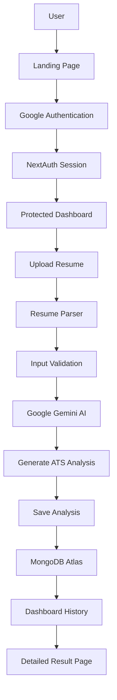
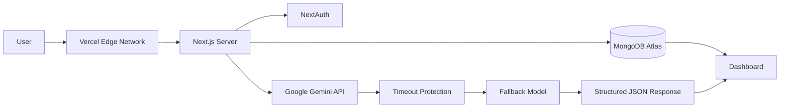
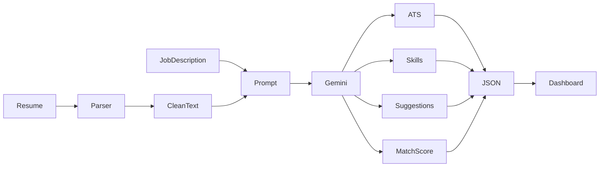
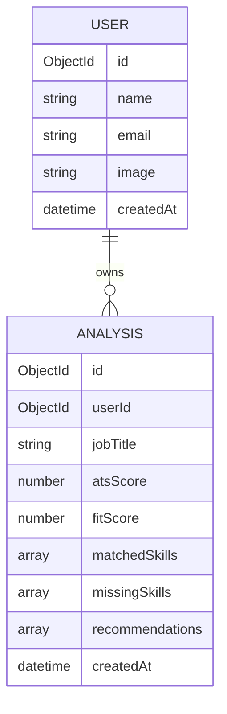
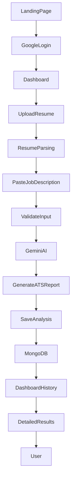
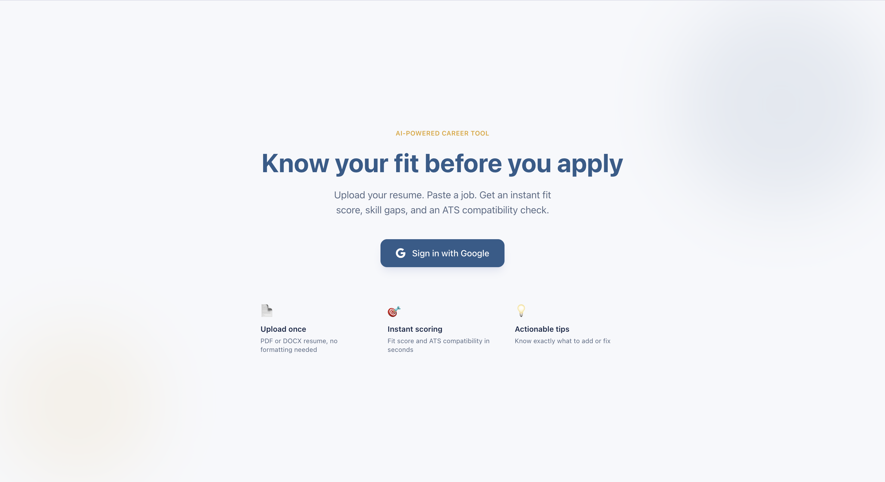
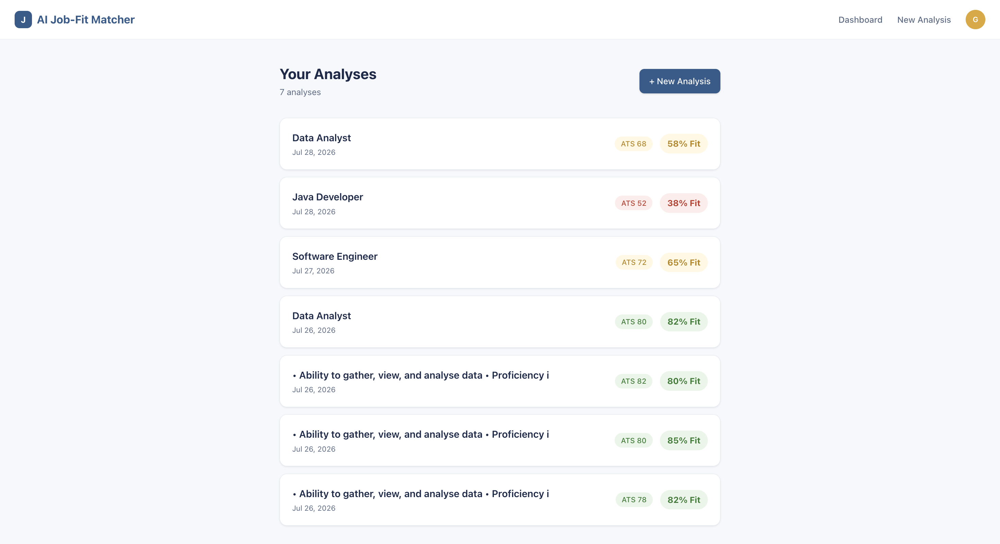
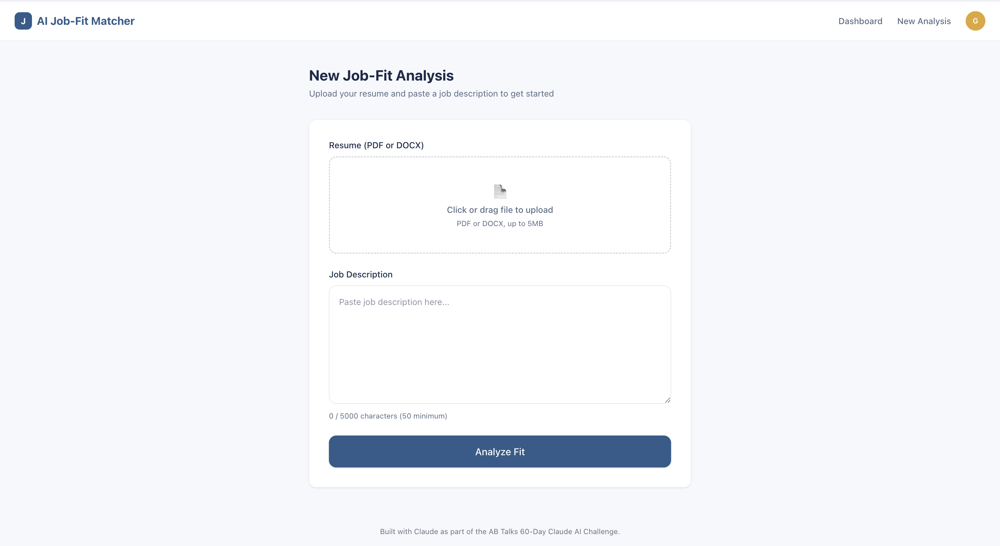
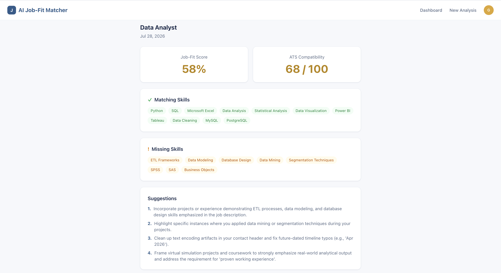

<div align="center">

# 🚀 AI Job-Fit Matcher

<h2>
🤖 AI-Powered Resume Analysis, ATS Optimization & Intelligent Job Matching Platform
</h2>

<p>
A production-ready AI-powered web application that analyzes resumes against job descriptions using <strong>Google Gemini AI</strong>. The platform generates ATS compatibility scores, identifies skill gaps, provides intelligent resume improvement suggestions, and securely stores previous analyses for future reference.
</p>

<p>

<a href="https://ai-job-fit-matcher-bay.vercel.app">

</a>

<a href="https://github.com/sachinbytecodes-lab/ai-job-fit-matcher">

</a>

</p>

<p>


</p>

</div>

---

# 🌐 Live Application

### Production Deployment

https://ai-job-fit-matcher-bay.vercel.app

---

# 💻 GitHub Repository

https://github.com/sachinbytecodes-lab/ai-job-fit-matcher

---

# 🎉 Project Status

## ✅ Day 9 Completed — Launch & Production Readiness

The application has successfully completed the **Launch & Production Readiness** phase.

Rather than introducing additional functionality, this sprint focused on transforming the application into a polished, production-ready product suitable for public use, portfolio presentation, recruiter demonstrations, and open-source sharing.

The project now includes:

- Professional project documentation
- Production deployment verification
- SEO optimization
- Open Graph metadata
- Twitter Cards
- robots.txt configuration
- MIT License
- Repository organization
- Release readiness review
- End-to-end production verification

The application is now considered **launch-ready**, with Day 10 reserved for the final presentation, demonstration, and capstone wrap-up.

---

## 📈 Sprint Progress

| Sprint Phase | Status |
|--------------|--------|
| Planning & Research | ✅ |
| System Design | ✅ |
| Authentication | ✅ |
| Resume Upload | ✅ |
| AI Integration | ✅ |
| Dashboard | ✅ |
| Database | ✅ |
| Production Deployment | ✅ |
| Testing & Debugging | ✅ |
| Performance Optimization | ✅ |
| Security Review | ✅ |
| Accessibility | ✅ |
| Documentation | ✅ |
| SEO & Metadata | ✅ |
| Release Readiness | ✅ |

---

# 📖 About the Project

AI Job-Fit Matcher is a modern full-stack AI application that helps job seekers evaluate how well their resumes align with a target job description.

Instead of relying solely on keyword matching like traditional ATS tools, the platform uses **Google Gemini AI** to perform contextual analysis of resumes and job descriptions, providing meaningful, personalized feedback to help candidates improve their chances of getting shortlisted.

Users can simply upload a resume, paste a job description, and receive a comprehensive report including:

- ATS Compatibility Score
- Job Match Percentage
- Resume Strengths
- Resume Weaknesses
- Missing Skills
- Matching Skills
- AI-Powered Recommendations
- Resume Improvement Suggestions

Every completed analysis is securely stored in MongoDB Atlas, allowing authenticated users to revisit previous reports and track their progress over time.

The project demonstrates modern software engineering practices including AI integration, secure authentication, cloud deployment, responsive UI development, database design, accessibility improvements, performance optimization, production testing, SEO implementation, and professional release management.

---

# 🎯 Problem Statement

Finding the right job is challenging, and many qualified candidates are rejected before a recruiter even sees their resume.

Most Applicant Tracking Systems (ATS) rely heavily on keyword matching, making it difficult for candidates to understand why their applications fail.

Common challenges include:

- Missing technical keywords
- Weak resume structure
- Poor alignment with job requirements
- Lack of personalized feedback
- Generic resume content
- Difficulty identifying missing skills
- Limited access to affordable ATS analysis tools

Many available ATS platforms are expensive or provide only superficial keyword-based scoring without meaningful recommendations.

---

# 💡 Solution

AI Job-Fit Matcher addresses these challenges by combining the power of Google's Gemini AI with modern web technologies to deliver intelligent, contextual resume analysis.

The application enables users to:

1. Sign in securely using Google Authentication.
2. Upload a PDF or DOCX resume.
3. Paste a target job description.
4. Generate an AI-powered ATS compatibility report.
5. Review match scores, strengths, weaknesses, and missing skills.
6. Receive actionable recommendations to improve the resume.
7. Save reports securely for future reference and comparison.

Unlike traditional ATS scanners, the platform focuses on contextual understanding rather than simple keyword matching, providing users with practical insights they can use to improve their resumes before applying for jobs.

---

# 🎯 Project Goals

The primary goals of this project are:

- Help job seekers improve resume quality.
- Simplify ATS evaluation using AI.
- Demonstrate production-ready full-stack development.
- Showcase practical integration of Generative AI into real-world applications.
- Provide a secure and scalable architecture suitable for deployment.
- Build a portfolio-quality SaaS application following modern software engineering practices.

---
# ✨ Core Features

AI Job-Fit Matcher provides a complete AI-assisted workflow for evaluating resumes against real-world job descriptions.

The application combines Artificial Intelligence, Authentication, Cloud Database, and Modern Web Technologies into a production-ready SaaS platform.

---

## 🔐 Secure Authentication

Authentication is powered by **Google OAuth** using **NextAuth.js**.

Features include:

- Google Sign-In
- Secure Sessions
- Protected Routes
- User-specific Dashboard
- Session Persistence
- Automatic Authentication Checks

---

## 📄 Resume Upload

Supports modern resume formats with server-side validation.

### Supported Formats

- PDF
- DOCX

### Features

- Resume Validation
- Secure File Processing
- Automatic Text Extraction
- Error Handling
- Upload Size Validation

---

## 🤖 AI Resume Analysis

Powered by **Google Gemini AI**

Each uploaded resume is compared against the supplied Job Description using contextual AI analysis rather than simple keyword matching.

Generated report includes:

- ATS Compatibility Score
- Job Match Score
- Resume Strengths
- Resume Weaknesses
- Missing Skills
- Matching Skills
- Resume Summary
- Personalized Improvement Suggestions
- Hiring Readiness Feedback

---

## 📊 ATS Compatibility Analysis

Unlike traditional ATS scanners, the application analyses the complete context of both documents.

The ATS report includes:

- ATS Score
- Resume Fit Percentage
- Keyword Coverage
- Missing Technologies
- Missing Tools
- Required Certifications
- Skill Gap Analysis

---

## 💡 AI Recommendations

Google Gemini generates intelligent recommendations including:

- Resume improvements
- Technical skill recommendations
- Missing keywords
- Better role alignment
- Stronger resume summaries
- Suggested technologies
- Industry-specific advice

---

## 📂 Dashboard

Every analysis is stored securely and displayed inside a personalized dashboard.

Dashboard features include:

- Previous Analyses
- Resume History
- Match Scores
- Detailed Reports
- Secure User Data
- Resume Comparison

---

## ☁ Cloud Database

Analysis history is securely stored inside MongoDB Atlas.

Stored information includes:

- User Information
- Resume Details
- Job Description
- ATS Score
- Match Score
- Missing Skills
- Recommendations
- Analysis Timestamp

---

## ⚙ Production Features

The application includes multiple production-ready engineering improvements.

### Reliability

- Global Error Boundary
- Custom 404 Page
- Route Loading UI
- Timeout Protection
- AI Fallback Strategy
- Better Error Recovery

---

### Security

- Protected API Routes
- Session Validation
- Environment Variables
- Secure Authentication
- File Validation
- User Data Isolation

---

### User Experience

- Responsive Layout
- Loading Skeletons
- Accessible Forms
- Improved Validation
- Better Navigation
- Mobile Optimisation

---

# 🛠 Technology Stack

The application is built using a modern full-stack architecture.

| Layer | Technology |
|---------|------------|
| Framework | Next.js 15 (App Router) |
| Frontend | React 19 |
| Language | TypeScript |
| Styling | Tailwind CSS v4 |
| Authentication | NextAuth.js + Google OAuth |
| Database | MongoDB Atlas |
| ORM | Mongoose |
| AI | Google Gemini API |
| Resume Parsing | pdf-parse, Mammoth |
| Backend | Next.js Route Handlers |
| Hosting | Vercel |
| Version Control | Git & GitHub |

---

# 🏗 Complete System Architecture



---

# ⚙ Production Architecture



---

# 🤖 AI Processing Workflow

The application performs contextual resume analysis using Google Gemini AI.



---

# 🗄 Database Design

Each authenticated user owns multiple resume analyses.



---

# 🔄 Complete Application Workflow



---

# 🚀 Why This Architecture?

The project follows a modern production architecture designed for scalability, maintainability, and security.

### Benefits

- Modular codebase
- Server-side authentication
- AI-powered business logic
- Secure database access
- Cloud-native deployment
- Fast page rendering
- Easy future scalability
- Production-ready design

# 🚀 Getting Started

Follow the instructions below to run the project locally.

---

## 1️⃣ Clone the Repository

```bash
git clone https://github.com/sachinbytecodes-lab/ai-job-fit-matcher.git
```

---

## 2️⃣ Navigate into the Project

```bash
cd ai-job-fit-matcher
```

---

## 3️⃣ Install Dependencies

Using npm

```bash
npm install
```

If you encounter dependency conflicts:

```bash
npm install --legacy-peer-deps
```

---

## 4️⃣ Configure Environment Variables

Create a file named:

```text
.env.local
```

Add the following environment variables.

```env
# ===============================
# Google Authentication
# ===============================

GOOGLE_CLIENT_ID=

GOOGLE_CLIENT_SECRET=

# ===============================
# NextAuth
# ===============================

NEXTAUTH_SECRET=

NEXTAUTH_URL=http://localhost:3000

# ===============================
# MongoDB
# ===============================

MONGODB_URI=

# ===============================
# Google Gemini
# ===============================

GEMINI_API_KEY=
```

---

## 5️⃣ Run Development Server

```bash
npm run dev
```

Visit

```
http://localhost:3000
```

---

## 6️⃣ Build Production Version

```bash
npm run build
```

---

## 7️⃣ Start Production Build

```bash
npm start
```

---


# 🔑 Environment Variables

| Variable | Description |
|------------|---------------------------|
| GOOGLE_CLIENT_ID | Google OAuth Client ID |
| GOOGLE_CLIENT_SECRET | Google OAuth Secret |
| NEXTAUTH_SECRET | Session Encryption Secret |
| NEXTAUTH_URL | Application Base URL |
| MONGODB_URI | MongoDB Atlas Connection |
| GEMINI_API_KEY | Google Gemini API Key |

---

## 🔒 Security Note

Never commit your `.env.local` file to GitHub.

Sensitive credentials should always be stored securely using environment variables.

The deployed production application uses encrypted environment variables configured inside Vercel.

---

## ☁ Production Stack

| Service | Purpose |
|------------|---------------------------|
| Vercel | Frontend & Backend Hosting |
| MongoDB Atlas | Cloud Database |
| Google OAuth | Authentication |
| Google Gemini AI | AI Resume Analysis |
| NextAuth.js | Session Management |
| GitHub | Source Control |

---

# 📸 Application Screenshots

## 🏠 Landing Page

The landing page introduces the platform and allows users to start their AI-powered resume analysis with secure Google authentication.

<p align="center">
  
</p>

---

## 📊 Dashboard

After signing in, users can view all previous resume analyses, ATS scores, and job-fit percentages from a centralized dashboard.

<p align="center">
  
</p>

---

## 📄 New Job-Fit Analysis

Users can upload a resume (PDF/DOCX), paste a job description, and initiate AI-powered analysis with a single click.

<p align="center">
  
</p>

---

## 🤖 AI Analysis Results

The AI-generated report includes Job-Fit Score, ATS Compatibility Score, Matching Skills, Missing Skills, and personalized recommendations to improve the resume.

<p align="center">
  
</p>

---

# 🛠 Available Scripts

| Command | Description |
|----------|-------------|
| npm install | Install dependencies |
| npm run dev | Start development server |
| npm run build | Create production build |
| npm start | Start production server |
| npm run lint | Run ESLint |
| npm run type-check | TypeScript type checking |

---

# 📦 Deployment Verification Checklist

Before every production deployment verify:

- ✅ Environment variables configured
- ✅ Google OAuth working
- ✅ MongoDB connected
- ✅ Gemini API responding
- ✅ Resume Upload working
- ✅ AI Analysis working
- ✅ Dashboard loading
- ✅ Previous reports accessible
- ✅ Mobile responsiveness
- ✅ Production build successful

---


# ⚡ Performance Optimizations

Performance was a major focus throughout development to ensure a smooth user experience and fast loading times.

---

## 🚀 Frontend Optimizations

- Server Components where applicable
- Lazy loading for heavy components
- Optimized React rendering
- Efficient state management
- Code splitting
- Dynamic imports
- Optimized routing with App Router

---

## 🖼 Image Optimization

Next.js automatically optimizes images by:

- Lazy Loading
- Responsive Image Sizes
- Modern Image Formats
- Automatic Compression
- Reduced Bandwidth Usage

---

## ⚡ Backend Optimizations

The backend has been optimized for reliability and performance.

### Improvements

- Fast API Routes
- Efficient Database Queries
- Optimized AI Prompt Construction
- Connection Reuse
- Proper Error Handling
- Request Validation

---

## 🗄 Database Optimization

MongoDB Atlas is used with efficient schema design.

Optimizations include:

- Indexed Queries
- User-based Filtering
- Lean Query Responses
- Timestamp-based Sorting
- Efficient Document Structure

---

## 📈 Production Performance Goals

| Metric | Target |
|----------|---------|
| Initial Page Load | < 2 seconds |
| AI Response Time | 3–10 seconds |
| Authentication | < 1 second |
| Dashboard Loading | < 1 second |
| API Response | < 500 ms (excluding AI processing) |

---

# 🔒 Security

Security has been integrated throughout the application.

---

## 🔐 Authentication Security

- Google OAuth Authentication
- NextAuth Session Management
- Protected Dashboard Routes
- Session Validation
- Secure Cookies
- User Isolation

---

## 🛡 API Security

Every API endpoint validates:

- Authentication
- Required Inputs
- File Types
- Request Body
- User Authorization

---

## 📂 File Upload Security

Supported formats:

- PDF
- DOCX

Validation includes:

- File Type
- File Size
- Empty File Detection
- Parsing Error Handling

---

## 🔑 Environment Security

Sensitive information is stored using environment variables.

Examples include:

- MongoDB URI
- Gemini API Key
- OAuth Secrets
- NextAuth Secret

No sensitive credentials are exposed in the repository.

---

## ☁ Cloud Security

Production deployment uses:

- HTTPS
- Secure Cookies
- Encrypted Environment Variables
- Vercel Infrastructure
- MongoDB Atlas Security

---

# ♿ Accessibility

The application follows accessibility best practices.

Implemented improvements include:

- Semantic HTML
- Keyboard Navigation
- Focus Indicators
- Proper Button Labels
- Accessible Forms
- Responsive Typography
- Color Contrast
- Screen Reader Friendly Components

---

# 📱 Responsive Design

The application works across all major screen sizes.

Supported devices include:

- Desktop
- Laptop
- Tablet
- Mobile Phones

Layouts automatically adapt using Tailwind CSS responsive utilities.

---

# 🧪 Testing

The application has been manually tested across the complete user workflow.

---

## Authentication Testing

- Google Login
- Session Persistence
- Logout
- Protected Routes

Status:

✅ Passed

---

## Resume Upload Testing

Verified:

- PDF Upload
- DOCX Upload
- Invalid File Rejection
- Empty Upload Detection

Status:

✅ Passed

---

## AI Testing

Verified:

- Gemini API Response
- ATS Score Generation
- Missing Skill Detection
- Recommendation Quality
- Error Recovery

Status:

✅ Passed

---

## Dashboard Testing

Verified:

- Analysis History
- Result Retrieval
- User-specific Data
- Authentication Checks

Status:

✅ Passed

---

## Database Testing

Verified:

- Save Analysis
- Retrieve Analysis
- User Isolation
- Timestamp Accuracy

Status:

✅ Passed

---

## Cross Browser Testing

Successfully tested on:

- Google Chrome
- Microsoft Edge
- Firefox
- Brave

---

## Responsive Testing

Verified on:

- Desktop
- Laptop
- Tablet
- Android
- iPhone

Status:

✅ Passed

---

# ✅ Production Readiness Checklist

Before the final release, the following checks were completed.

| Category | Status |
|----------|--------|
| Authentication | ✅ |
| Database | ✅ |
| AI Integration | ✅ |
| Dashboard | ✅ |
| Resume Upload | ✅ |
| Error Handling | ✅ |
| Security | ✅ |
| Performance | ✅ |
| Accessibility | ✅ |
| Documentation | ✅ |
| SEO | ✅ |
| Deployment | ✅ |

---

# 🌐 End-to-End User Workflow

The application follows the workflow below.

```text
User Visits Website
        │
        ▼
Google Authentication
        │
        ▼
Dashboard
        │
        ▼
Upload Resume
        │
        ▼
Paste Job Description
        │
        ▼
AI Resume Analysis
        │
        ▼
ATS Report Generated
        │
        ▼
Analysis Stored
        │
        ▼
Dashboard Updated
        │
        ▼
User Reviews Results
```

---

# 🐞 Challenges Faced

Building an AI-powered production application involved several technical challenges.

### Resume Parsing

Challenge:

Extracting reliable text from both PDF and DOCX files.

Solution:

Implemented dedicated parsers with validation and fallback handling.

---

### AI Response Formatting

Challenge:

Large Language Models may return inconsistent output.

Solution:

Designed structured prompts and validated responses before displaying results.

---

### Authentication

Challenge:

Protecting user-specific data while maintaining a seamless login experience.

Solution:

Integrated Google OAuth with NextAuth and secured all protected routes.

---

### Database Design

Challenge:

Associating multiple analyses with individual users efficiently.

Solution:

Designed a user-centric MongoDB schema with proper references and indexing.

---

### Deployment

Challenge:

Ensuring the application worked consistently in production.

Solution:

Verified environment variables, production builds, database connectivity, authentication, AI integration, and routing before release.

---

# 💎 Engineering Highlights

This project demonstrates practical experience in:

- Full-Stack Development
- Generative AI Integration
- Authentication Systems
- Cloud Database Design
- API Development
- Production Deployment
- Performance Optimization
- Secure Software Engineering
- Modern UI Development
- Technical Documentation
- Release Management

---

# 🚀 Day 9 — Launch & Production Readiness

Day 9 focused on transforming the application from a completed software project into a polished, production-ready product suitable for real users, recruiters, portfolio showcases, and open-source collaboration.

Rather than introducing new features, this sprint emphasized quality, documentation, deployment, SEO, repository organization, and final production verification.

---

# 🎯 Sprint Objective

The primary goal of Day 9 was to ensure that every aspect of the project met production standards.

This included:

- Professional documentation
- Production deployment verification
- Repository cleanup
- SEO optimization
- Social media metadata
- Open-source readiness
- Release preparation
- Final quality assurance

The result is a project that is not only functional but also professionally presented and ready for demonstration.

---

# 🌐 SEO Optimization

Search Engine Optimization (SEO) was implemented to improve discoverability and social sharing.

### Implemented Features

- Dynamic page titles
- Meta descriptions
- Open Graph metadata
- Twitter Card support
- robots.txt configuration
- Canonical URLs
- Improved favicon support

These enhancements ensure the application is indexed correctly by search engines and displays rich previews when shared on social media.

---

# 📱 Social Sharing Support

The project now includes metadata for major social platforms.

### Supported Platforms

- LinkedIn
- Twitter / X
- Facebook
- WhatsApp
- Discord
- Slack

Rich previews include:

- Project title
- Description
- Preview image
- Website URL

---

# 🧪 Final Quality Assurance

A comprehensive QA pass ensured the application behaved correctly across all major workflows.

### Functional Testing

- User Registration
- Google Login
- Resume Upload
- AI Analysis
- Dashboard
- Logout

### UI Testing

- Responsive Design
- Navigation
- Buttons
- Forms
- Typography
- Dark Theme Compatibility

### Error Testing

- Invalid File Upload
- Missing Job Description
- AI API Failure Handling
- Database Connection Errors

All critical issues identified during testing were resolved before release.

---

# 📊 Day 9 Accomplishments

| Task | Status |
|------|--------|
| README Documentation | ✅ |
| MIT License | ✅ |
| Repository Cleanup | ✅ |
| SEO Metadata | ✅ |
| Open Graph | ✅ |
| Twitter Cards | ✅ |
| robots.txt | ✅ |
| Production Verification | ✅ |
| Deployment Testing | ✅ |
| Release Review | ✅ |

---

# 📋 Release Readiness Checklist

Before the public release, the following criteria were successfully completed.

| Requirement | Status |
|-------------|--------|
| Feature Complete | ✅ |
| Build Successful | ✅ |
| Production Deployment | ✅ |
| Documentation Complete | ✅ |
| Security Review | ✅ |
| Accessibility Review | ✅ |
| Performance Review | ✅ |
| SEO Optimized | ✅ |
| Repository Organized | ✅ |
| License Added | ✅ |
| Final Testing | ✅ |

---

# 🎉 Launch Status

The AI Job-Fit Matcher is now officially **Launch Ready**.

The application has successfully completed all planned development phases through **Day 9**, with the remaining Day 10 focused on final presentation, portfolio showcase, and project demonstration.

**Current Status**

- ✅ Production Deployed
- ✅ Documentation Complete
- ✅ SEO Optimized
- ✅ Secure Authentication
- ✅ AI Integration Stable
- ✅ Cloud Database Connected
- ✅ Repository Polished
- ✅ Ready for Recruiter & Portfolio Showcase

---

# 📈 Development Journey

The AI Job-Fit Matcher was built as a structured **10-day capstone project**, with each sprint focusing on a major milestone. The project gradually evolved from an initial idea into a production-ready AI-powered SaaS application.

---

## 🗓 Development Timeline

| Day | Milestone | Status |
|------|-----------|--------|
| Day 1 | Project Planning & System Design | ✅ |
| Day 2 | UI Development & Landing Page | ✅ |
| Day 3 | Authentication (Google OAuth + NextAuth) | ✅ |
| Day 4 | Resume Upload & Parsing | ✅ |
| Day 5 | Google Gemini AI Integration | ✅ |
| Day 6 | Dashboard & MongoDB Integration | ✅ |
| Day 7 | Performance, Security & Error Handling | ✅ |
| Day 8 | Testing, Accessibility & Production Deployment | ✅ |
| Day 9 | Launch & Production Readiness | ✅ |
| Day 10 | Final Presentation & Portfolio Showcase | 🚀 |

---

# 📊 Project Statistics

## Development Metrics

| Metric | Value |
|---------|------:|
| Development Duration | 10 Days |
| Sprint Completed | 9 / 10 |
| Source Files | 100+ |
| React Components | 35+ |
| API Routes | 10+ |
| MongoDB Collections | 2 |
| AI Integration | Google Gemini |
| Authentication Provider | Google OAuth |
| Database | MongoDB Atlas |
| Deployment Platform | Vercel |

---

## Technical Highlights

- ⚛️ Built with **Next.js 15 App Router**
- 🔷 Fully typed using **TypeScript**
- 🎨 Styled using **Tailwind CSS v4**
- 🔐 Secure authentication with **NextAuth.js**
- 🤖 AI-powered resume analysis using **Google Gemini**
- ☁ Cloud-hosted database using **MongoDB Atlas**
- 🚀 Deployed globally on **Vercel**

---

# 🏆 Project Achievements

During the development of this project, the following milestones were successfully achieved:

- ✅ Production-ready full-stack application
- ✅ AI-powered ATS resume analysis
- ✅ Secure Google authentication
- ✅ Resume upload & parsing
- ✅ Intelligent job matching
- ✅ Cloud database integration
- ✅ Responsive UI across all devices
- ✅ SEO optimisation
- ✅ Accessibility improvements
- ✅ Complete technical documentation
- ✅ Production deployment
- ✅ Open-source ready repository

---

# 💡 Key Learnings

Building this project provided valuable experience across multiple areas of software engineering.

## Frontend

- Next.js App Router
- React Server Components
- TypeScript
- Tailwind CSS
- Responsive Design
- Component Architecture

---

## Backend

- API Route Handlers
- Authentication
- File Processing
- Request Validation
- Error Handling
- Environment Management

---

## Artificial Intelligence

- Prompt Engineering
- Structured AI Responses
- Resume Analysis
- Skill Gap Detection
- ATS Optimisation
- Response Validation

---

## Database

- MongoDB Atlas
- Mongoose
- Data Modelling
- Relationships
- Query Optimisation
- User-specific Data

---

## DevOps

- Git & GitHub
- Production Deployment
- Environment Variables
- Build Optimisation
- Deployment Verification
- Release Management

---

# 🚀 What Makes This Project Different?

Unlike a simple CRUD application, AI Job-Fit Matcher combines several modern technologies into one cohesive platform.

### Integrated Technologies

- Artificial Intelligence
- Authentication
- Cloud Database
- File Processing
- Production Deployment
- Responsive UI
- SEO
- Accessibility
- Technical Documentation

This project demonstrates the ability to design, build, deploy, and document a complete software product from start to finish.

---

# 🗺 Project Roadmap

## ✅ Completed

- Landing Page
- Authentication
- Resume Upload
- Resume Parsing
- Google Gemini Integration
- ATS Score Generation
- Skill Gap Analysis
- AI Recommendations
- Dashboard
- MongoDB Storage
- Production Deployment
- Performance Optimisation
- Security Improvements
- Accessibility
- Documentation
- SEO Optimisation
- Launch Readiness

---

## 🚀 Day 10 (Final Sprint)

The final sprint focuses on presenting the completed project professionally.

### Planned Deliverables

- Project Demonstration
- Portfolio Showcase
- Final README Review
- Demo Video
- Presentation Slides
- GitHub Repository Polish
- Final Release Tag

---

# 🔮 Future Enhancements

Although the application is production-ready, several enhancements are planned for future versions.

## AI Improvements

- Multiple AI model support
- Resume rewriting
- Cover letter generation
- Interview preparation
- Career guidance
- Personalised learning recommendations

---

## Dashboard Enhancements

- Resume comparison
- Progress tracking
- Saved job descriptions
- AI history analytics
- Export reports as PDF

---

## Authentication

- GitHub Login
- Microsoft Login
- LinkedIn Login
- Email Authentication

---

## Enterprise Features

- Recruiter Dashboard
- Team Management
- Company Accounts
- Candidate Analytics
- Bulk Resume Screening
- Organisation Workspaces

---

## Technical Improvements

- Docker Support
- CI/CD Pipeline
- Automated Testing
- Redis Caching
- Rate Limiting
- Multi-language Support
- Progressive Web App (PWA)

---

# 🌟 Final Sprint Goal

With **Day 9 successfully completed**, the project has reached production quality.

The final milestone (Day 10) is dedicated to showcasing the application through:

- Live Demonstration
- Portfolio Presentation
- Recruiter Showcase
- GitHub Release
- Final Documentation Review

After completion, the project will represent a complete end-to-end AI-powered SaaS application suitable for portfolios, interviews, and real-world demonstrations.

---

# 🤝 Contributing

Contributions are always welcome!

Whether you're fixing bugs, improving documentation, enhancing performance, or adding new features, your support helps make this project even better.

## How to Contribute

### 1. Fork the Repository

```bash
git clone https://github.com/sachinbytecodes-lab/ai-job-fit-matcher.git
```

---

### 2. Create a Feature Branch

```bash
git checkout -b feature/your-feature-name
```

---

### 3. Make Your Changes

Implement your improvements while following the existing coding standards.

---

### 4. Commit Your Changes

```bash
git commit -m "Add: Your Feature"
```

---

### 5. Push Changes

```bash
git push origin feature/your-feature-name
```

---

### 6. Open a Pull Request

Describe:

- What changed
- Why it changed
- Screenshots (if UI changes)
- Testing performed

---

# 📜 License

This project is licensed under the **MIT License**.

You are free to:

- ✅ Use
- ✅ Modify
- ✅ Distribute
- ✅ Learn from
- ✅ Build upon

as permitted by the terms of the MIT License.

For complete details, see the **LICENSE** file included in this repository.

---

# 🙏 Acknowledgements

Special thanks to the technologies and communities that made this project possible.

### Framework

- Next.js
- React
- TypeScript
- Tailwind CSS

### AI

- Google Gemini API

### Authentication

- NextAuth.js
- Google OAuth

### Database

- MongoDB Atlas
- Mongoose

### Deployment

- Vercel

### Development Tools

- Git
- GitHub
- VS Code
- npm

A heartfelt thanks to the open-source community for building the tools and libraries that power modern web development.

---

# 👨‍💻 About the Developer

## Sachin Singh

MCA Student | Full-Stack Developer | AI & Software Engineering Enthusiast

Passionate about building scalable web applications, integrating Artificial Intelligence into real-world products, and creating modern user experiences.

### Areas of Interest

- Artificial Intelligence
- Full-Stack Development
- Software Engineering
- Cloud Computing
- Backend Development
- System Design

---

# 🛠 Technical Skills

### Languages

- TypeScript
- JavaScript
- Python
- Java
- SQL

### Frontend

- React
- Next.js
- Tailwind CSS

### Backend

- Next.js API Routes
- Node.js
- Express
- REST APIs

### Database

- MongoDB Atlas
- Mongoose

### Authentication

- NextAuth.js
- Google OAuth

### AI

- Google Gemini
- Prompt Engineering

### Tools

- Git
- GitHub
- VS Code
- Vercel
- Postman

---

# 📬 Contact

## GitHub

https://github.com/sachinbytecodes-lab

---

## Project Repository

https://github.com/sachinbytecodes-lab/ai-job-fit-matcher

---

## Live Website

https://ai-job-fit-matcher-bay.vercel.app

---

# ⭐ Support the Project

If you found this project useful, please consider supporting it by:

- ⭐ Starring the repository
- 🍴 Forking the project
- 🐛 Reporting issues
- 💡 Suggesting improvements
- 🤝 Contributing code
- 📢 Sharing it with others

Your support motivates further development and future open-source projects.

---

# 🎯 Project Summary

AI Job-Fit Matcher is a production-ready, AI-powered web application that helps job seekers evaluate and improve their resumes using Google Gemini AI.

The platform combines secure authentication, intelligent resume analysis, ATS compatibility scoring, cloud storage, and modern web technologies into a complete end-to-end software solution.

Throughout this project, modern software engineering principles were applied, including:

- Modular Architecture
- Secure Authentication
- AI Integration
- Cloud Database Design
- Responsive UI Development
- Performance Optimisation
- Accessibility
- Production Deployment
- SEO Optimisation
- Technical Documentation
- Release Management

The project demonstrates the complete software development lifecycle—from planning and design to implementation, testing, deployment, and production readiness.

---

# 🎉 Final Status

<div align="center">

## 🚀 AI Job-Fit Matcher

### ✅ Production Ready

### ✅ Launch Ready

### ✅ Day 9 Completed

### ✅ Sprint 9 / 10

### 🤖 AI Powered

### ☁ Cloud Hosted

### 🔒 Secure Authentication

### 📊 ATS Resume Analysis

### 📚 Fully Documented

### 🌍 Live on Vercel

---

## 🌐 Live Demo

**https://ai-job-fit-matcher-bay.vercel.app**

---

## 💻 GitHub Repository

**https://github.com/sachinbytecodes-lab/ai-job-fit-matcher**

---

### ⭐ Thank you for visiting this project!

If you like this project, don't forget to **Star ⭐ the repository** and share your feedback.

**Built with ❤️ using Next.js, TypeScript, MongoDB Atlas, Google Gemini AI, Tailwind CSS, NextAuth.js, and Vercel.**

</div>
