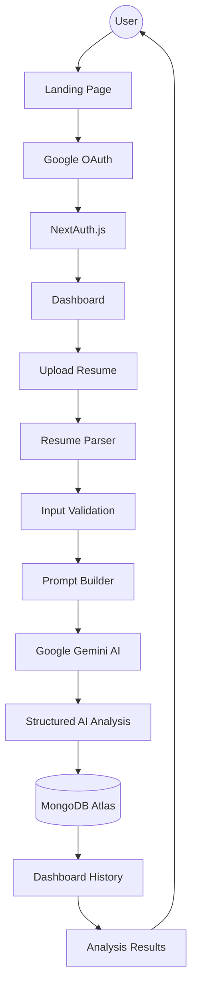
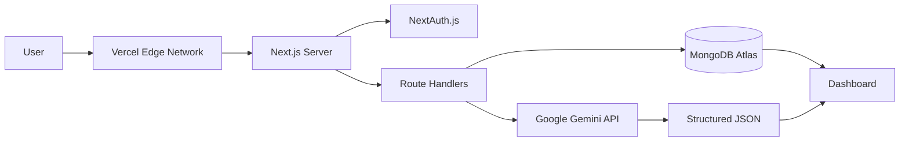
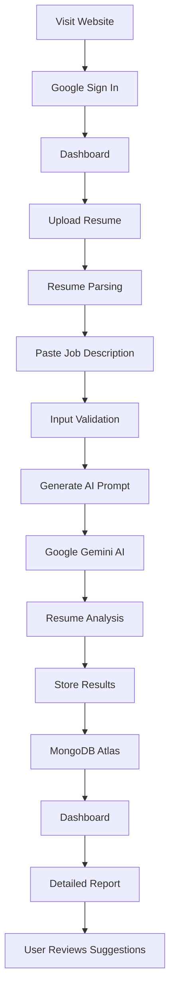
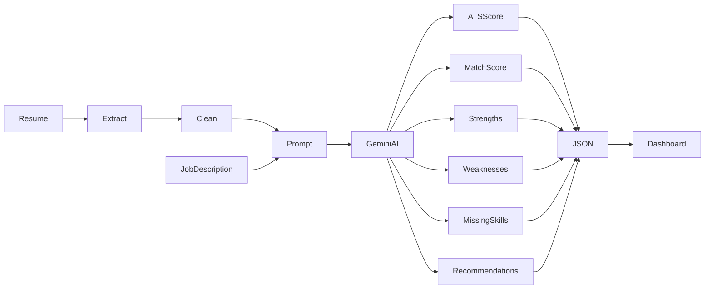
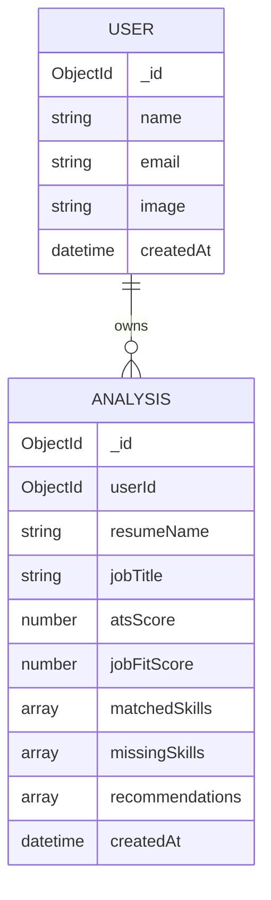

<div align="center">

# 🚀 AI Job-Fit Matcher

### 🤖 AI-Powered Resume Analysis, ATS Optimization & Intelligent Job Matching Platform

<p align="center">

A production-ready AI-powered SaaS application that analyzes resumes against job descriptions using **Google Gemini AI**. The platform generates ATS compatibility scores, identifies skill gaps, provides personalized resume improvement suggestions, and securely stores previous analyses for future reference.

Built as the **final capstone project** for the **AB Talks 60-Day Claude AI Challenge**, demonstrating the complete software development lifecycle—from planning and architecture to AI integration, deployment, documentation, and release management.

</p>

<br>

<a href="https://ai-job-fit-matcher-bay.vercel.app">

</a>

<a href="https://github.com/sachinbytecodes-lab/ai-job-fit-matcher">

</a>
<br><br>


</div>

---

# 🌐 Live Demo

> **Production Deployment**

🔗 https://ai-job-fit-matcher-bay.vercel.app

---

# 💻 GitHub Repository

🔗 https://github.com/sachinbytecodes-lab/ai-job-fit-matcher

---

# 🎉 Project Status

## ✅ Version 1.0.0 — Capstone Successfully Completed

AI Job-Fit Matcher has successfully completed the **AB Talks 10-Day Capstone Sprint**, marking the culmination of the **AB Talks 60-Day Claude AI Challenge**.

The project evolved from an initial concept into a production-ready AI-powered SaaS application through ten structured development sprints. Beyond implementing core functionality, the final milestone focused on engineering excellence through documentation, deployment verification, release management, and long-term maintainability.

### Current Status

- ✅ Production Ready
- ✅ Version **v1.0.0** Released
- ✅ Live on Vercel
- ✅ Recruiter Ready
- ✅ Portfolio Ready
- ✅ Fully Documented
- ✅ Open Source Ready
- ✅ Capstone Completed
- ✅ Graduation Artifacts Included
- ✅ Future Roadmap Defined

---

## 📈 Sprint Completion

| Sprint | Milestone | Status |
|---------|-----------|--------|
| Day 1 | Planning & Architecture | ✅ |
| Day 2 | UI Development | ✅ |
| Day 3 | Authentication | ✅ |
| Day 4 | Resume Upload | ✅ |
| Day 5 | AI Integration | ✅ |
| Day 6 | Dashboard & Database | ✅ |
| Day 7 | Security & Performance | ✅ |
| Day 8 | Testing & Deployment | ✅ |
| Day 9 | Launch Preparation | ✅ |
| Day 10 | Graduation & Capstone | ✅ |

---

# 📖 About the Project

**AI Job-Fit Matcher** is a production-ready, AI-powered SaaS application designed to help job seekers evaluate how effectively their resumes align with specific job descriptions.

Traditional Applicant Tracking Systems (ATS) often rely on simple keyword matching, making it difficult for candidates to understand why their applications are rejected. AI Job-Fit Matcher addresses this challenge by leveraging **Google Gemini AI** to perform contextual analysis instead of relying solely on keywords.

Users can securely sign in with Google, upload a PDF or DOCX resume, paste a target job description, and receive a comprehensive AI-generated report that evaluates both technical and semantic alignment between the resume and the job requirements.

The generated report includes ATS compatibility, job-fit score, matched skills, missing skills, resume strengths, weaknesses, personalized recommendations, and actionable improvements. Every completed analysis is securely stored in MongoDB Atlas, allowing users to revisit previous reports through their personal dashboard.

Built with **Next.js 15**, **React 19**, **TypeScript**, **Tailwind CSS v4**, **MongoDB Atlas**, **NextAuth.js**, and **Google Gemini AI**, the application demonstrates modern full-stack engineering practices including secure authentication, cloud-native deployment, scalable architecture, AI integration, performance optimization, accessibility, SEO, and professional documentation.

This repository represents the final deliverable of the **AB Talks 10-Day Capstone Sprint**, successfully concluding the **AB Talks 60-Day Claude AI Challenge**. Beyond shipping a functional application, the project showcases the complete software development lifecycle—from planning and architecture to implementation, deployment, release management, and long-term roadmap planning.

---

# 🎯 Problem Statement

Applying for jobs has become increasingly competitive, with many organizations relying on Applicant Tracking Systems (ATS) to filter resumes before they reach recruiters.

Although ATS platforms streamline recruitment, they introduce several challenges for candidates:

- Resumes are frequently rejected due to missing keywords rather than actual qualifications.
- Candidates receive little or no explanation for unsuccessful applications.
- Most available ATS evaluation tools provide only generic scores with limited actionable feedback.
- Premium resume analysis platforms are often expensive and inaccessible to students or early-career professionals.
- Applicants struggle to identify missing technical skills, resume weaknesses, and role-specific improvements.

As a result, many qualified candidates are eliminated before a recruiter has an opportunity to review their profile.

---

# 💡 Solution

AI Job-Fit Matcher combines the capabilities of **Google Gemini AI** with a modern full-stack architecture to provide intelligent, contextual resume analysis.

Instead of focusing only on keyword frequency, the application evaluates how well a candidate's experience, skills, and qualifications align with the target job description.

The complete workflow is simple:

1. Authenticate securely using Google OAuth.
2. Upload a resume (PDF or DOCX).
3. Paste the target job description.
4. Generate an AI-powered analysis.
5. Review ATS compatibility and job-fit score.
6. Explore matched and missing skills.
7. Receive personalized recommendations.
8. Save the analysis for future comparison.

The result is a practical career-assistance platform that provides meaningful insights while demonstrating real-world AI integration and modern software engineering practices.

---

# 🎯 Project Objectives

The primary objectives of this project were:

- Build a production-ready AI-powered SaaS application.
- Demonstrate practical integration of Generative AI into a real-world workflow.
- Help job seekers improve resume quality before applying for jobs.
- Simplify ATS evaluation using contextual AI analysis.
- Design a scalable and secure full-stack architecture.
- Implement authentication, cloud storage, and AI services within a unified application.
- Follow modern software engineering best practices throughout development.
- Produce a portfolio-quality project suitable for recruiters and technical interviews.
- Complete the AB Talks 10-Day Capstone Sprint with production-level documentation.
- Showcase the complete software development lifecycle—from planning to release.

---

# 🌟 Key Highlights

This project demonstrates expertise in multiple engineering domains:

### 🤖 Artificial Intelligence

- Google Gemini API Integration
- Prompt Engineering
- Contextual Resume Analysis
- Structured AI Responses
- ATS Optimization

### 💻 Full-Stack Development

- Next.js App Router
- React 19
- TypeScript
- Tailwind CSS
- REST API Development

### 🔐 Authentication & Security

- Google OAuth
- NextAuth.js
- Protected Routes
- Session Management
- Secure API Validation

### ☁️ Cloud Technologies

- MongoDB Atlas
- Vercel Deployment
- Environment Variables
- Cloud Database Design

### 🏗️ Software Engineering

- Modular Architecture
- Performance Optimization
- Error Handling
- Accessibility
- SEO
- Technical Documentation
- Release Management

---

# 🚀 Why This Project?

Unlike many resume analysis tools that rely solely on keyword matching, AI Job-Fit Matcher uses Large Language Models to understand the context behind both resumes and job descriptions.

This approach enables the application to generate richer insights, identify genuine skill gaps, and provide recommendations that are more useful to job seekers.

From an engineering perspective, the project serves as a complete demonstration of modern software development—combining AI, authentication, databases, cloud deployment, responsive design, and production-ready practices into a single cohesive product.

The repository not only contains the application source code but also comprehensive technical documentation, future roadmaps, retrospective analyses, and graduation artifacts created during the final capstone sprint.

---

# ✨ Core Features

AI Job-Fit Matcher provides an end-to-end AI-assisted workflow that helps job seekers analyze resumes, improve ATS compatibility, and optimize applications for specific job roles.

The platform combines **Artificial Intelligence**, **Cloud Computing**, **Authentication**, **Resume Parsing**, and **Modern Web Technologies** into a production-ready SaaS application.

---

## 🔐 Secure Authentication

Authentication is powered by **NextAuth.js** with **Google OAuth**, ensuring a secure and seamless sign-in experience.

### Features

- Google Sign-In
- Secure OAuth Authentication
- Session Persistence
- Protected Dashboard
- Route Protection
- User-specific Analysis History
- Automatic Session Validation

---

## 📄 Resume Upload & Parsing

Supports modern resume formats with secure server-side validation and automatic text extraction.

### Supported Formats

- PDF
- DOCX

### Capabilities

- Secure File Upload
- Resume Validation
- Automatic Text Extraction
- Error Recovery
- File Size Validation
- Unsupported Format Detection

---

## 🤖 AI-Powered Resume Analysis

Powered by **Google Gemini AI**, the application performs contextual analysis rather than relying solely on keyword matching.

Each uploaded resume is compared against the provided job description to generate an intelligent evaluation.

### Generated Insights

- ATS Compatibility Score
- Job Match Percentage
- Resume Summary
- Matching Skills
- Missing Skills
- Resume Strengths
- Resume Weaknesses
- Personalized Recommendations
- Hiring Readiness Feedback

---

## 📊 ATS Compatibility Analysis

Unlike traditional ATS scanners, AI Job-Fit Matcher evaluates semantic alignment between resumes and job descriptions.

### Analysis Includes

- ATS Score
- Resume Fit Percentage
- Keyword Coverage
- Missing Technologies
- Required Skills
- Required Tools
- Certifications
- Skill Gap Analysis

---

## 💡 AI Recommendations

Google Gemini generates personalized recommendations to improve resume quality.

Recommendations include:

- Resume Improvements
- Missing Technical Skills
- Better Keyword Usage
- Resume Structure Suggestions
- Industry-specific Advice
- Career Improvement Tips

---

## 📂 Personalized Dashboard

Every completed analysis is securely stored and displayed inside an authenticated dashboard.

Dashboard Features

- Previous Resume Analyses
- Saved Reports
- Match History
- ATS Scores
- Resume Comparison (Future)
- Detailed AI Reports

---

## ☁ Cloud Database

All analysis results are securely stored inside **MongoDB Atlas**.

Stored Information

- User Profile
- Resume Metadata
- Job Description
- ATS Score
- Match Score
- AI Recommendations
- Missing Skills
- Analysis Timestamp

---

## ⚙ Production Engineering

The application follows production-ready engineering practices.

### Reliability

- Global Error Boundary
- Loading Skeletons
- Route Loading UI
- AI Timeout Protection
- Graceful Error Recovery
- Retry Mechanisms

### Security

- Protected API Routes
- Session Validation
- Environment Variables
- File Validation
- User Data Isolation
- Server-side Authorization

### User Experience

- Fully Responsive Design
- Accessible Forms
- Optimized Navigation
- Loading Indicators
- Mobile-first Layout
- Dark Theme Support

---

# 🛠 Technology Stack

The application is built using a modern, scalable, and production-ready full-stack architecture.

| Layer | Technology |
|---------|------------|
| **Framework** | Next.js 15 (App Router) |
| **Frontend** | React 19 |
| **Language** | TypeScript |
| **Styling** | Tailwind CSS v4 |
| **Authentication** | NextAuth.js + Google OAuth |
| **Artificial Intelligence** | Google Gemini API |
| **Database** | MongoDB Atlas |
| **ODM** | Mongoose |
| **Resume Parsing** | pdf-parse, Mammoth |
| **Backend** | Next.js Route Handlers |
| **Hosting** | Vercel |
| **Version Control** | Git & GitHub |

---

# 🏆 Engineering Highlights

This project demonstrates practical experience across multiple areas of modern software engineering.

### 🤖 Artificial Intelligence

- Google Gemini Integration
- Prompt Engineering
- Contextual Resume Analysis
- Structured AI Responses
- ATS Optimization

---

### 💻 Full-Stack Development

- Next.js App Router
- React Server Components
- REST API Development
- TypeScript
- Component-based Architecture

---

### 🔐 Authentication

- Google OAuth
- NextAuth.js
- Session Management
- Protected Routes
- Authorization

---

### 🗄 Database Engineering

- MongoDB Atlas
- Mongoose ODM
- Data Modeling
- User-specific Data Isolation
- Optimized Queries

---

### ☁ Cloud & DevOps

- Vercel Deployment
- Environment Variables
- Production Builds
- GitHub Version Control
- Release Management

---

### 📚 Software Engineering

- Modular Codebase
- Error Handling
- Performance Optimization
- Accessibility
- SEO Optimization
- Technical Documentation
- Production Readiness

---

# 🎯 What Makes This Project Different?

Most resume scanners simply compare keywords and assign a generic score.

AI Job-Fit Matcher goes beyond keyword matching by using **Google Gemini AI** to understand the context of both the resume and the job description.

Instead of asking:

> "Does this resume contain the right keywords?"

the application asks:

> "How well does this candidate actually fit this role?"

This contextual approach enables more accurate ATS evaluations, identifies meaningful skill gaps, and generates personalized recommendations that help candidates improve their resumes before applying.

By combining AI, authentication, cloud infrastructure, and modern software engineering practices, the project demonstrates the development of a complete, production-ready SaaS application rather than a simple CRUD project.

---

# 🏗️ System Architecture

AI Job-Fit Matcher follows a modern full-stack architecture built around **Next.js App Router**, **Google Gemini AI**, **MongoDB Atlas**, and **NextAuth.js**.

The application separates presentation, business logic, authentication, AI processing, and data persistence into independent layers, making the project scalable, maintainable, and production-ready.

---

## 🏛 High-Level Architecture



---

# ⚙ Production Infrastructure

The production deployment is hosted on **Vercel**, with cloud-native services responsible for authentication, AI processing, and persistent storage.



---

# 🔄 Complete User Workflow

The application follows a simple but intelligent workflow.



---

# 🤖 AI Processing Pipeline

One of the core engineering components of this project is the AI workflow.

Rather than performing simple keyword matching, Google Gemini evaluates the semantic relationship between the uploaded resume and the target job description.



---

# 🗄 Database Design

The database follows a user-centric design where every authenticated user owns multiple resume analyses.



---

# 📂 Application Modules

The project is divided into independent modules that improve maintainability and scalability.

| Module | Responsibility |
|---------|----------------|
| Landing Page | Marketing website and project introduction |
| Authentication | Google OAuth login using NextAuth.js |
| Resume Upload | Upload and validate PDF/DOCX resumes |
| Resume Parser | Extract readable text from uploaded files |
| AI Engine | Generate ATS and Job-Fit analysis using Gemini |
| Dashboard | Display previous analyses and reports |
| Database | Store users and analysis history |
| API Layer | Handle business logic and communication |
| Deployment | Production hosting on Vercel |

---

# 🔐 Security Architecture

Security has been integrated throughout every layer of the application.

### Authentication

- Google OAuth
- NextAuth.js
- Protected Routes
- Secure Sessions

### API Protection

- Session Validation
- Server-side Authorization
- Input Validation
- Error Handling

### File Upload

- File Type Validation
- Size Validation
- Parsing Validation
- Unsupported Format Detection

### Database

- User Data Isolation
- Secure MongoDB Connection
- Environment Variables
- Protected Queries

---

# ⚡ Performance Architecture

The application has been optimized for speed and scalability.

### Frontend

- React Server Components
- Code Splitting
- Lazy Loading
- Dynamic Imports

### Backend

- Optimized Route Handlers
- Connection Reuse
- Efficient Prompt Construction
- Cached Database Connections

### Deployment

- Vercel Edge Network
- Automatic Compression
- Static Optimization
- Global CDN

---

# 🎯 Why This Architecture?

The architecture was intentionally designed to reflect modern software engineering practices.

### Benefits

- Modular and scalable design
- Secure authentication layer
- Cloud-native deployment
- AI-first workflow
- Separation of concerns
- Easy future expansion
- Production-ready structure
- Recruiter-friendly engineering practices

This architecture allows the project to evolve beyond a portfolio application into a scalable AI-powered SaaS platform while maintaining readability, maintainability, and performance.

---

# ⚙️ Local Development Setup

Follow these steps to run the project locally.

---

## 1️⃣ Clone the Repository

```bash
git clone https://github.com/sachinbytecodes-lab/ai-job-fit-matcher.git
```

---

## 2️⃣ Navigate to the Project

```bash
cd ai-job-fit-matcher
```

---

## 3️⃣ Install Dependencies

Using npm

```bash
npm install
```

If dependency conflicts occur:

```bash
npm install --legacy-peer-deps
```

---

## 4️⃣ Configure Environment Variables

Create a file named

```text
.env.local
```

Add the following variables:

```env
# ==============================
# Google OAuth
# ==============================

GOOGLE_CLIENT_ID=

GOOGLE_CLIENT_SECRET=

# ==============================
# NextAuth
# ==============================

NEXTAUTH_URL=http://localhost:3000

NEXTAUTH_SECRET=

# ==============================
# MongoDB Atlas
# ==============================

MONGODB_URI=

# ==============================
# Google Gemini AI
# ==============================

GEMINI_API_KEY=
```

---

## 5️⃣ Start Development Server

```bash
npm run dev
```

Visit

```
http://localhost:3000
```

---

## 6️⃣ Create Production Build

```bash
npm run build
```

---

## 7️⃣ Start Production Server

```bash
npm start
```

---

# 🔑 Environment Variables

| Variable | Description |
|------------|-------------|
| GOOGLE_CLIENT_ID | Google OAuth Client ID |
| GOOGLE_CLIENT_SECRET | Google OAuth Client Secret |
| NEXTAUTH_URL | Base URL of the application |
| NEXTAUTH_SECRET | Session encryption secret |
| MONGODB_URI | MongoDB Atlas connection string |
| GEMINI_API_KEY | Google Gemini API key |

---

# ☁️ Production Deployment

The application is deployed using **Vercel**, with MongoDB Atlas providing cloud database services and Google Gemini powering AI analysis.

### Production Stack

| Service | Purpose |
|---------|---------|
| **Vercel** | Frontend & Backend Hosting |
| **MongoDB Atlas** | Cloud Database |
| **Google OAuth** | Secure Authentication |
| **Google Gemini API** | AI Resume Analysis |
| **NextAuth.js** | Session Management |
| **GitHub** | Source Code & Version Control |

---

## 🚀 Deployment Workflow

```text
Developer
      │
      ▼
Push to GitHub
      │
      ▼
GitHub Repository
      │
      ▼
Vercel Automatic Build
      │
      ▼
Install Dependencies
      │
      ▼
Environment Variables
      │
      ▼
Production Build
      │
      ▼
Deploy
      │
      ▼
Live Website
```

---

# 📦 Available Scripts

| Command | Description |
|---------|-------------|
| `npm install` | Install project dependencies |
| `npm run dev` | Start development server |
| `npm run build` | Generate production build |
| `npm start` | Run production server |
| `npm run lint` | Run ESLint |
| `npm run type-check` | Perform TypeScript type checking |

---

# 📋 Production Checklist

Before every deployment, the following checks are performed.

## Authentication

- ✅ Google OAuth Working
- ✅ Session Persistence
- ✅ Protected Routes

---

## AI Services

- ✅ Gemini API Connected
- ✅ Resume Analysis Working
- ✅ Structured JSON Response

---

## Database

- ✅ MongoDB Connected
- ✅ User Data Stored
- ✅ Dashboard History Available

---

## Resume Upload

- ✅ PDF Upload
- ✅ DOCX Upload
- ✅ File Validation
- ✅ Text Extraction

---

## Production

- ✅ Environment Variables Configured
- ✅ Build Successful
- ✅ Mobile Responsive
- ✅ HTTPS Enabled
- ✅ Live Deployment Verified

---

# 🐳 Future DevOps Roadmap

Although Version **v1.0.0** is production-ready, future releases will introduce a more advanced deployment pipeline.

### Planned Improvements

- Docker Containerization
- GitHub Actions CI/CD
- Automated Unit Testing
- End-to-End Testing
- Automated Releases
- Performance Monitoring
- Error Tracking
- API Rate Limiting
- Redis Caching
- Multi-Environment Deployments

---

# 📈 Version Information

| Item | Value |
|------|-------|
| Current Version | **v1.0.0** |
| Release Type | Stable |
| Deployment | Production |
| Platform | Vercel |
| License | MIT |
| Status | Production Ready |
| Documentation | Complete |
| Capstone | Completed |

---

# ⚡ Performance Optimization

Performance was a key consideration throughout the development lifecycle to ensure a fast, reliable, and responsive user experience.

---

## 🚀 Frontend Optimizations

The frontend leverages modern React and Next.js capabilities to improve rendering performance and reduce load times.

### Implemented Optimizations

- React Server Components
- App Router Optimizations
- Code Splitting
- Lazy Loading
- Dynamic Imports
- Optimized State Management
- Reduced Client-side JavaScript
- Component Reusability

---

## 🖼 Image Optimization

Images are automatically optimized by Next.js using its built-in image optimization pipeline.

### Benefits

- Lazy Loading
- Automatic Compression
- Responsive Image Sizes
- Modern Image Formats
- Faster Loading Times
- Reduced Bandwidth Usage

---

## ⚙ Backend Optimizations

Backend APIs are designed to minimize latency and improve reliability.

### Improvements

- Efficient API Route Handlers
- Optimized Resume Parsing
- Prompt Construction Optimization
- Reusable Database Connections
- Input Validation
- Structured Error Handling
- Response Standardization

---

## 🗄 Database Optimization

MongoDB Atlas is configured using an efficient schema design.

Optimizations include:

- Indexed Queries
- User-specific Filtering
- Efficient Document Structure
- Timestamp-based Sorting
- Connection Reuse
- Lean Query Responses

---

## 📈 Performance Targets

| Metric | Target |
|---------|--------|
| Initial Page Load | < 2 seconds |
| Authentication | < 1 second |
| Dashboard Loading | < 1 second |
| API Response | < 500 ms (excluding AI processing) |
| AI Analysis | 3–10 seconds |
| Lighthouse Performance | 90+ |

---

# 🔒 Security

Security has been integrated into every layer of the application.

---

## 🔐 Authentication Security

Authentication is implemented using **Google OAuth** and **NextAuth.js**.

### Features

- Google Sign-In
- Secure Sessions
- Protected Dashboard
- Automatic Session Validation
- Secure Cookies
- User-specific Access Control

---

## 🛡 API Security

Every API endpoint validates requests before processing.

### Validation Includes

- Authentication Verification
- Required Input Validation
- Request Body Validation
- File Validation
- Authorization Checks
- Error Handling

---

## 📂 File Upload Security

Supported Resume Formats

- PDF
- DOCX

Validation includes:

- File Type Validation
- File Size Validation
- Empty File Detection
- Parsing Error Handling
- Invalid File Rejection

---

## 🔑 Environment Security

Sensitive information is never committed to the repository.

Examples include:

- MongoDB URI
- Google OAuth Credentials
- Gemini API Key
- NextAuth Secret

All secrets are managed through environment variables.

---

## ☁ Cloud Security

Production deployment benefits from cloud-native security.

### Features

- HTTPS
- Secure Cookies
- Environment Variable Encryption
- MongoDB Atlas Security
- Vercel Infrastructure
- Automatic SSL

---

# ♿ Accessibility

Accessibility has been considered throughout the project to ensure an inclusive user experience.

Implemented improvements include:

- Semantic HTML
- Keyboard Navigation
- Proper Heading Hierarchy
- Accessible Forms
- ARIA Labels
- Focus Indicators
- Responsive Typography
- High Contrast UI
- Screen Reader Friendly Components

---

# 📱 Responsive Design

The application is fully responsive across modern devices.

Supported screen sizes:

- Desktop
- Laptop
- Tablet
- Android
- iPhone

Responsive features include:

- Flexible Grid Layouts
- Mobile-first Design
- Adaptive Navigation
- Responsive Typography
- Optimized Touch Targets

---

# 🧪 Testing

A complete end-to-end testing process was carried out before the Version **v1.0.0** release.

---

## Authentication Testing

Verified:

- Google Login
- Session Persistence
- Protected Routes
- Logout
- Unauthorized Access

**Status:** ✅ Passed

---

## Resume Upload Testing

Verified:

- PDF Upload
- DOCX Upload
- Invalid File Detection
- Empty Upload Handling
- Parsing Errors

**Status:** ✅ Passed

---

## AI Integration Testing

Verified:

- Gemini API Response
- Prompt Validation
- ATS Score Generation
- Skill Gap Detection
- Recommendation Quality
- JSON Parsing
- Error Recovery

**Status:** ✅ Passed

---

## Dashboard Testing

Verified:

- Analysis History
- Saved Reports
- Result Retrieval
- User Isolation
- Protected Dashboard

**Status:** ✅ Passed

---

## Database Testing

Verified:

- Save Analysis
- Retrieve Analysis
- User Data Isolation
- Timestamp Accuracy
- Query Performance

**Status:** ✅ Passed

---

## Cross Browser Testing

Successfully tested on:

- Google Chrome
- Microsoft Edge
- Mozilla Firefox
- Brave

---

## Responsive Testing

Verified on:

- Desktop
- Laptop
- Tablet
- Android
- iPhone

**Status:** ✅ Passed

---

# 📊 Quality Assurance

Before the final release, every major workflow was manually verified.

| Category | Status |
|----------|--------|
| Authentication | ✅ |
| Resume Upload | ✅ |
| Resume Parsing | ✅ |
| AI Analysis | ✅ |
| Dashboard | ✅ |
| MongoDB Integration | ✅ |
| Security Review | ✅ |
| Performance Review | ✅ |
| Accessibility | ✅ |
| Documentation | ✅ |
| Production Deployment | ✅ |

---

# 🚀 Production Readiness Checklist

The application successfully completed the final production review before the **Version v1.0.0** release.

| Requirement | Status |
|-------------|--------|
| Feature Complete | ✅ |
| Build Successful | ✅ |
| Production Deployment | ✅ |
| Authentication Verified | ✅ |
| AI Integration Stable | ✅ |
| Database Connected | ✅ |
| Environment Variables Configured | ✅ |
| Security Review | ✅ |
| Performance Optimized | ✅ |
| Accessibility Review | ✅ |
| Documentation Complete | ✅ |
| Open Source Ready | ✅ |

---

# 🏆 Engineering Best Practices

The project follows several modern software engineering principles.

### Architecture

- Modular Code Structure
- Separation of Concerns
- Reusable Components
- Scalable Folder Organization

### Development

- TypeScript for Type Safety
- Component-driven Development
- Git Version Control
- Clean Code Principles

### Reliability

- Error Boundaries
- Loading States
- Validation
- Graceful Error Recovery

### Deployment

- Continuous Deployment with Vercel
- Cloud Database
- Secure Secrets Management
- Production Build Verification

---

# 📈 Project Metrics

| Metric | Value |
|---------|------:|
| Development Duration | 10 Days |
| Project Version | v1.0.0 |
| Framework | Next.js 15 |
| Language | TypeScript |
| AI Provider | Google Gemini |
| Authentication | Google OAuth |
| Database | MongoDB Atlas |
| Deployment | Vercel |
| Documentation | Complete |
| Production Status | Live |
| Capstone | Completed |
| Challenge | AB Talks 60-Day Claude AI Challenge |

---
# 🎓 AB Talks 10-Day Capstone Sprint

## 🏆 Final Milestone Achieved

The successful completion of **AI Job-Fit Matcher** marks the culmination of the **AB Talks 10-Day Capstone Sprint**, concluding the **AB Talks 60-Day Claude AI Challenge**.

Over ten focused development sprints, the project evolved from an initial concept into a fully functional, production-ready SaaS application. The final sprint shifted the focus from feature development to engineering maturity—emphasizing documentation, maintainability, release management, future planning, and portfolio readiness.

Rather than simply finishing the project, the goal was to prepare it as a real-world software product suitable for recruiters, technical interviews, GitHub showcases, and future open-source collaboration.

---

# 🚀 Version 1.0.0 Release

The project has officially reached its first stable production release.

### Release Highlights

- ✅ Production Ready
- ✅ Stable Version (v1.0.0)
- ✅ Cloud Deployed
- ✅ Fully Documented
- ✅ Recruiter Ready
- ✅ Portfolio Ready
- ✅ Open Source Ready
- ✅ SEO Optimized
- ✅ Release Tagged
- ✅ Graduation Completed

---

# 📖 Challenge Retrospective

Throughout the challenge, every sprint introduced new engineering concepts and practical problem-solving opportunities.

Key areas of growth included:

### Artificial Intelligence

- Prompt Engineering
- Structured Outputs
- LLM Integration
- AI Workflow Design

---

### Full Stack Development

- Next.js App Router
- TypeScript
- REST APIs
- Authentication
- MongoDB Integration

---

### Software Engineering

- Modular Architecture
- Error Handling
- Debugging
- Release Management
- Technical Documentation

---

### Cloud Development

- MongoDB Atlas
- Vercel Deployment
- Environment Management
- Production Debugging

---

# 📚 Lessons Learned

Building this project reinforced several important engineering principles.

## Technical Lessons

- Build features incrementally.
- Design reusable components.
- Validate user input.
- Optimize before deploying.
- Document everything.

---

## Product Lessons

- Solve real user problems.
- Prioritize usability.
- Iterate based on feedback.
- Plan future releases early.

---

## Professional Lessons

- Write clean code.
- Maintain proper documentation.
- Think beyond implementation.
- Build projects suitable for production.
- Treat GitHub as a professional portfolio.

---

# 💼 Resume Highlights

This project demonstrates practical experience in:

- Full Stack Development
- Artificial Intelligence
- Prompt Engineering
- Authentication
- REST APIs
- Cloud Databases
- Production Deployment
- System Design
- Technical Documentation
- Software Engineering

---

# 🎤 Interview Talking Points

This project provides strong examples for technical interviews.

Topics you can confidently discuss include:

- Why Google Gemini was selected.
- Designing AI prompts.
- Secure authentication using NextAuth.
- Resume parsing workflow.
- MongoDB schema design.
- Production deployment with Vercel.
- Performance optimization.
- Error handling strategies.
- Future scalability considerations.
- Engineering trade-offs.

---

# 🌟 What This Project Represents

AI Job-Fit Matcher is more than just another portfolio project.

It represents:

- A complete software engineering lifecycle.
- Practical integration of Artificial Intelligence.
- Modern SaaS architecture.
- Production-ready engineering practices.
- Professional technical documentation.
- Continuous learning through AI-assisted development.

Most importantly, it reflects the successful completion of the **AB Talks 60-Day Claude AI Challenge**, demonstrating not only technical skills but also consistency, discipline, documentation, and long-term product thinking.

---


# 📅 Development Timeline

The project evolved through structured milestones, progressing from planning to a production-ready release.

| Phase | Milestone | Status |
|--------|-----------|--------|
| Phase 1 | Project Planning & Research | ✅ |
| Phase 2 | UI/UX Design | ✅ |
| Phase 3 | Next.js App Setup | ✅ |
| Phase 4 | Google OAuth Integration | ✅ |
| Phase 5 | Resume Upload & Parsing | ✅ |
| Phase 6 | Google Gemini AI Integration | ✅ |
| Phase 7 | Dashboard & Analysis History | ✅ |
| Phase 8 | Testing & Debugging | ✅ |
| Phase 9 | Deployment to Vercel | ✅ |
| Phase 10 | Documentation & Graduation | ✅ |

---

# 📊 Project Statistics

| Category | Details |
|----------|---------|
| Project Name | AI Job-Fit Matcher |
| Version | **v1.0.0** |
| Status | Production Ready |
| Framework | Next.js 15 |
| Language | TypeScript |
| AI Provider | Google Gemini |
| Database | MongoDB Atlas |
| Authentication | NextAuth.js + Google OAuth |
| Hosting | Vercel |
| Architecture | Full-Stack SaaS |
| License | MIT |
| Documentation | Complete |
| Challenge | AB Talks 60-Day Claude AI Challenge |

---

# 🏅 Key Achievements

Throughout this project, several engineering milestones were successfully completed.

- ✅ Designed and developed a production-ready SaaS application.
- ✅ Integrated Google Gemini AI for intelligent resume analysis.
- ✅ Implemented secure authentication using Google OAuth.
- ✅ Built a responsive dashboard with persistent analysis history.
- ✅ Deployed the application to the cloud using Vercel.
- ✅ Produced comprehensive technical documentation.
- ✅ Completed the AB Talks 10-Day Capstone Sprint.
- ✅ Successfully concluded the AB Talks 60-Day Claude AI Challenge.

---

# 🤝 Contributing

Contributions are welcome and appreciated.

If you'd like to improve the project:

1. Fork the repository.
2. Create a feature branch.
3. Commit your changes.
4. Push the branch.
5. Open a Pull Request with a clear description.

Please ensure that your contributions follow the existing coding style and include appropriate documentation.

---

# 📝 License

This project is licensed under the **MIT License**.

You are free to:

- Use
- Modify
- Distribute
- Contribute

while retaining the original license notice.

---

# 🙏 Acknowledgements

Special thanks to everyone and every technology that contributed to the success of this project.

### Technologies

- Next.js
- React
- TypeScript
- Tailwind CSS
- MongoDB Atlas
- NextAuth.js
- Google Gemini AI
- Vercel

### Learning Journey

A heartfelt thank you to **AB Talks** for designing the **60-Day Claude AI Challenge**, which encouraged consistent learning, disciplined development, and the practical application of AI-assisted software engineering.

---

# 👨‍💻 About the Developer

Hi, I'm **Sachin Singh**, a passionate software developer focused on building intelligent, scalable, and user-centric applications.

### Areas of Interest

- Artificial Intelligence
- Full-Stack Web Development
- Software Engineering
- Cloud Technologies
- Backend Development
- System Design

### Currently Exploring

- Advanced AI Applications
- Large Language Models (LLMs)
- Agentic AI
- Scalable Backend Systems
- DevOps & CI/CD
- Microservices Architecture

---

## Connect with Me

💼 **LinkedIn**

https://www.linkedin.com/in/sachin--singh--0001-

🐙 **GitHub**

https://github.com/sachinbytecodes-lab

📧 **Email**

mailsachin.tech@gmail.com

🌐 **Portfolio**

Coming Soon...

---

# ⭐ Support the Project

If you found this project useful:

- ⭐ Star the repository
- 🍴 Fork the repository
- 🐛 Report issues
- 💡 Suggest new features
- 🤝 Contribute improvements

Your support helps the project grow and motivates future development.

---

# 🔮 What's Next?

Version **v1.0.0** is just the beginning.

Future releases will focus on:

- AI Resume Rewriter
- Cover Letter Generator
- Resume Comparison
- Interview Preparation
- Recruiter Dashboard
- Job Board Integration
- Browser Extension
- Enterprise Features

The goal is to evolve AI Job-Fit Matcher into a comprehensive AI-powered career platform.

---

# 🎯 Final Summary

AI Job-Fit Matcher demonstrates the complete lifecycle of modern software development—from ideation and system design to AI integration, deployment, testing, documentation, and release management.

This project showcases practical experience in:

- Full-Stack Development
- Artificial Intelligence Integration
- Prompt Engineering
- Authentication & Security
- Cloud Databases
- API Development
- Performance Optimization
- Technical Documentation
- Software Engineering Best Practices

Beyond technical implementation, it reflects consistent learning, disciplined execution, and the ability to deliver a polished, production-ready application.

---

# 🗺️ Roadmap

- [x] Google Authentication
- [x] Resume Upload
- [x] PDF & DOCX Parsing
- [x] Google Gemini Integration
- [x] ATS Compatibility Analysis
- [x] AI Recommendations
- [x] Dashboard
- [x] MongoDB Integration
- [x] Deployment on Vercel
- [x] Technical Documentation
- [ ] Resume Version Comparison
- [ ] AI Resume Rewriter
- [ ] Cover Letter Generator
- [ ] Interview Preparation
- [ ] Recruiter Dashboard
- [ ] Job Board Integration

---

# ⭐ Repository Stats

If this project helped or inspired you:

- ⭐ Star this repository
- 🍴 Fork it
- 🐛 Report Issues
- 💡 Suggest Features

---

# ❤️ Built With

- Next.js
- React
- TypeScript
- Tailwind CSS
- Google Gemini AI
- MongoDB Atlas
- NextAuth.js
- Vercel

---

# 🌟 Why AI Job-Fit Matcher?

Finding the right job is more than matching keywords—it's about understanding skills, experience, and role requirements.

Traditional ATS checkers often rely on static keyword matching, leading to inaccurate evaluations and generic feedback.

**AI Job-Fit Matcher** uses **Google Gemini AI** to perform contextual resume analysis, helping candidates understand how well they fit a specific job and providing actionable suggestions for improvement.

### Core Benefits

- 🤖 AI-powered contextual analysis
- 📊 ATS compatibility scoring
- 🎯 Job-fit percentage
- 💡 Personalized recommendations
- 🔍 Skill gap identification
- 📂 Resume history tracking
- 🔐 Secure authentication
- ☁️ Cloud-native architecture

---

# 🎯 Use Cases

AI Job-Fit Matcher is designed for a wide range of users.

| User | Benefit |
|------|---------|
| Students | Improve resumes before placements |
| Freshers | Increase ATS compatibility |
| Professionals | Tailor resumes for new opportunities |
| Recruiters | Evaluate resume quality |
| Career Coaches | Identify improvement areas |
| Universities | Career guidance workshops |

---

# 🏆 Highlights

## Artificial Intelligence

- Google Gemini Integration
- Prompt Engineering
- Semantic Resume Analysis
- Intelligent Recommendations

---

## Software Engineering

- Clean Architecture
- Modular Components
- Type Safety
- Error Handling
- Validation
- Production Deployment

---

## Cloud

- MongoDB Atlas
- Vercel
- Google OAuth
- Environment Management

---

# 📚 Learning Outcomes

Building this project strengthened practical knowledge in:

- Next.js App Router
- React
- TypeScript
- MongoDB
- Authentication
- AI Integration
- REST APIs
- Cloud Deployment
- Prompt Engineering
- Technical Documentation

---

# 🧠 Engineering Challenges

Some of the interesting engineering challenges solved during development include:

### Resume Parsing

Extracting structured text consistently from PDF and DOCX files while handling formatting differences.

---

### Prompt Design

Creating prompts that return structured, recruiter-friendly AI responses instead of generic summaries.

---

### Authentication

Managing secure sessions with Google OAuth while protecting user-specific analysis history.

---

### Database Design

Designing a schema that supports scalable storage and retrieval of resume analyses.

---

### Error Handling

Gracefully handling AI timeouts, invalid uploads, parsing failures, and authentication errors.

---

# 🚧 Known Limitations

Current Version (**v1.0.0**) has the following limitations:

- English resumes only
- Single resume analysis at a time
- Manual job description input
- Internet connection required
- Google account required for authentication

These areas are planned for future releases.

---

# 🔄 Release History

| Version | Date | Notes |
|---------|------|------|
| v0.1.0 | Initial Prototype | Resume upload and parsing |
| v0.5.0 | AI Integration | Google Gemini support |
| v0.8.0 | Authentication | Google OAuth added |
| v0.9.0 | Dashboard | History and reports |
| **v1.0.0** | Stable Release | Production-ready SaaS |

---

# 💬 Frequently Asked Questions (FAQ)

### Which AI model powers the application?

Google Gemini AI.

---

### Does it support ATS optimization?

Yes. It generates an ATS compatibility score along with detailed improvement suggestions.

---

### Which resume formats are supported?

- PDF
- DOCX

---

### Is user data stored securely?

Yes. Authentication is handled using NextAuth.js, and analysis data is stored securely in MongoDB Atlas.

---

### Can I contribute?

Absolutely! Contributions, suggestions, and pull requests are always welcome.

---

# 📢 Final Note

AI Job-Fit Matcher is not just a portfolio project—it's a demonstration of applying modern software engineering principles to solve a real-world problem using Artificial Intelligence.

The project showcases the complete development lifecycle, including planning, implementation, testing, deployment, documentation, and continuous improvement.

It stands as both a learning milestone and a strong foundation for future enhancements.

---

<div align="center">

# 🚀 AI Job-Fit Matcher

### Production Ready • Version v1.0.0

🎓 **AB Talks 10-Day Capstone Completed**

🏆 **AB Talks 60-Day Claude AI Challenge Completed**

🤖 **Powered by Google Gemini AI**

☁️ **Deployed on Vercel**

📚 **Fully Documented**

💼 **Portfolio Ready**

🌍 **Open Source Ready**

⭐ **Thank you for visiting this repository!**

If you enjoyed exploring this project, don't forget to **Star ⭐ the repository**.

**Happy Coding! 🚀**

</div>

---
<div align="center">

## ⭐ If you found this project helpful, consider giving it a Star!

**Thank you for visiting!**

Made with ❤️ by **Sachin Singh**

</div>

