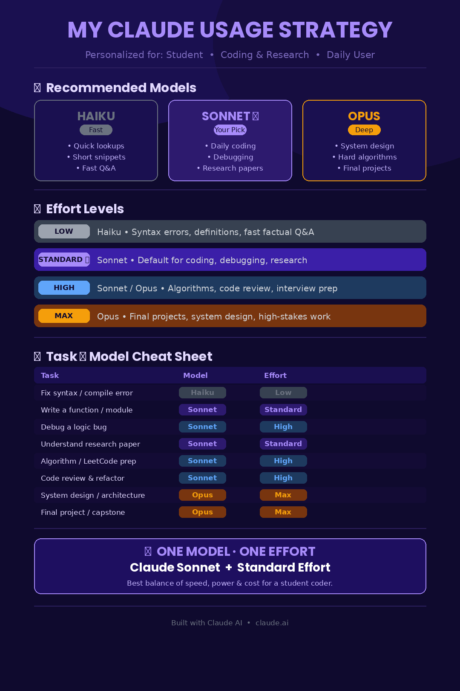

# 🤖 My Claude AI Usage Strategy
### Personalized for: Student · Coding & Technical Work · Daily User

> A complete guide to using Claude AI models (Haiku, Sonnet, Opus) effectively —  
> with the right effort settings for every task, built using a structured AI workflow framework.

---



---

## 📌 Table of Contents

- [Profile](#-my-profile)
- [Why This Strategy Exists](#-why-this-strategy-exists)
- [Model Overview](#-model-overview)
- [Effort Level Guide](#-effort-level-guide)
- [Task → Model Cheat Sheet](#-task--model-cheat-sheet)
- [My Daily Workflow](#-my-daily-workflow)
- [Key Learnings](#-key-learnings)
- [Biggest Mistakes to Avoid](#-biggest-mistakes-to-avoid)
- [Final Recommendation](#-final-recommendation)
- [How This Was Built](#-how-this-was-built)

---

## 👤 My Profile

| Field | Detail |
|---|---|
| **Role** | Student |
| **Primary Activities** | Coding & Technical Work |
| **Usage Frequency** | Daily |
| **Primary Output Needs** | Coding Help & Deep Research |

---

## 💡 Why This Strategy Exists

Most people use Claude (or any AI) the same way for every task — either always picking the most powerful model, or always defaulting to the fastest one. Both approaches waste time or money.

This strategy was built to answer three questions:
1. **Which model** should I use for this specific task?
2. **How much effort** (reasoning depth) should Claude apply?
3. **What workflow** gets me the best results daily?

The result: a personalized, task-aware Claude usage system for a student focused on coding and research.

---

## 🧠 Model Overview

### ⚡ Haiku — The Speed Runner
- Best for: Quick lookups, syntax questions, short code snippets, definitions
- Effort: Low
- When to use: You know roughly what you need — you just want it fast
- Example prompts:
  - *"What does `async/await` do in Python?"*
  - *"Fix this syntax error: ..."*
  - *"What is Big O notation?"*

---

### ⭐ Sonnet — Your Daily Driver *(Primary Recommendation)*
- Best for: Writing functions, debugging, research paper summaries, concept explanations
- Effort: Standard (default) → High (harder problems)
- When to use: 80%+ of your daily work lives here
- Example prompts:
  - *"Write a binary search function in Python with explanation"*
  - *"Explain how transformers work like I'm a CS student"*
  - *"Summarize this research paper and highlight key contributions"*
  - *"My merge sort is giving wrong output — here's the code..."*

---

### 🔬 Opus — The Deep Thinker
- Best for: System design, complex algorithms, final projects, high-stakes outputs
- Effort: High → Max
- When to use: The problem is genuinely hard and quality really matters
- Example prompts:
  - *"Design a scalable URL shortener — walk me through architecture decisions"*
  - *"Review my entire capstone project codebase and suggest improvements"*
  - *"Explain the trade-offs between SQL vs NoSQL for a real-time chat app"*

---

## 🎯 Effort Level Guide

Claude's effort setting controls how deeply it reasons before responding. Think of it like asking a friend vs. asking them to really think it through.

| Effort | When to Use | Best Model |
|---|---|---|
| **Low** | Fast factual answers, syntax fixes, quick definitions | Haiku |
| **Standard ⭐** | Default for coding, debugging, research summaries | Sonnet |
| **High** | Complex bugs, algorithm problems, code reviews, interview prep | Sonnet / Opus |
| **Max** | System design, final projects, dissertation-quality research | Opus |

> **Rule of thumb:** Start at Standard. If the answer feels shallow or misses edge cases, bump to High.

---

## 📋 Task → Model Cheat Sheet

| Task | Model | Effort | Why |
|---|---|---|---|
| Fix a syntax / compile error | Haiku | Low | Simple pattern match — no deep reasoning needed |
| Write a function or module | Sonnet | Standard | Balanced speed + quality for everyday coding |
| Debug a logic bug | Sonnet | High | Needs multi-step reasoning to trace root cause |
| Understand a research paper | Sonnet | Standard | Great at summarizing & simplifying technical text |
| Algorithm / LeetCode prep | Sonnet | High | Complex patterns benefit from extended thinking |
| Code review & refactoring | Sonnet | High | Catches edge cases and explains best practices |
| Quick concept definition | Haiku | Low | Fast factual recall — Haiku is perfect |
| System design / architecture | Opus | Max | Requires deep reasoning & trade-off analysis |
| Final project / capstone | Opus | Max | High-stakes output deserves max reasoning power |
| Interview prep (DSA) | Sonnet | High | Step-by-step problem solving with explanations |
| Learning new framework | Sonnet | Standard | Concept explanations + working code examples |
| Writing documentation | Sonnet | Standard | Clear, structured technical writing |

---

## 🔄 My Daily Workflow

```
Morning Study Session
├── Open new chat
├── State context: language, framework, what you're building
├── Task 1: Quick concept check → Haiku (Low effort)
├── Task 2: Write / debug code → Sonnet (Standard)
└── Task 3: Understand research → Sonnet (Standard)

Deep Work Session (Assignments / Projects)
├── Sonnet with High effort for complex bugs
├── Ask Claude to explain its reasoning, not just give answers
├── Iterate: paste output back, ask "what edge cases did you miss?"
└── Upgrade to Opus only if Sonnet gives shallow answers

Weekly Review / Project Work
├── Opus + Max effort for architecture decisions
├── "Review my entire approach and find weaknesses"
└── Use for final-year project, capstone, or research submissions
```

---

## 📚 Key Learnings

### 1. Model ≠ Intelligence, it's about fit
Haiku is not "dumb" — it's optimized for speed. Using Opus for a syntax fix is like using a calculator to count on your fingers. Match the tool to the task.

### 2. Effort level changes everything
The same model at Standard vs High effort can give dramatically different answers for algorithmic problems. Always increase effort before switching to a more powerful model.

### 3. Context is your superpower
Claude performs significantly better when you give it:
- The programming language and version
- What you expected to happen
- What actually happened
- Any relevant error messages

Bad prompt: *"Fix my code"*  
Good prompt: *"I'm writing a Python 3.11 Flask API. This function should return a list of users from SQLite but it returns an empty list. Here's the code: ..."*

### 4. Ask for explanations, not just answers
As a student, the goal is learning, not just shipping. Always follow up with:
- *"Why did you structure it this way?"*
- *"What are the trade-offs here?"*
- *"What would break if the input was very large?"*

### 5. Iterate in the same chat
Claude retains context within a conversation. Build on previous answers instead of starting fresh each time. Your debugging session should feel like pair programming.

### 6. Use Claude for research, not just code
Claude excels at:
- Summarizing dense academic papers
- Connecting concepts across topics
- Explaining algorithms with visual analogies
- Creating study guides from lecture notes

---

## ❌ Biggest Mistakes to Avoid

1. **Using Opus for everything** — slow, overkill for routine tasks, burns through usage limits
2. **Using Low effort on hard bugs** — leads to shallow, incorrect fixes
3. **Pasting code without context** — always include language, framework, expected vs actual behavior
4. **Accepting the first answer blindly** — ask Claude to explain its reasoning
5. **Not using Claude for research** — it's excellent at simplifying papers and linking concepts
6. **Starting a new chat for every question** — lose context, lose quality; iterate in the same session
7. **Asking vague questions** — *"help me with arrays"* gets a generic answer; be specific

---

## 🏆 Final Recommendation

> If you could only use **ONE model** and **ONE effort level** for most of your work:

## ✨ Claude Sonnet + Standard Effort

**Why:**
- Handles 80%+ of student coding and research tasks
- Fast enough for daily iterative use
- Smart enough for multi-file debugging and paper comprehension
- Best cost-to-power ratio for a student
- Upgrade to High effort or Opus only when a problem is genuinely complex

---

## 🛠 How This Was Built

This strategy was generated using a structured AI Workflow Architecture prompt inside Claude, which:

1. Collected user profile data (role, activities, usage frequency, output needs)
2. Analyzed the profile against model capabilities
3. Generated task-specific model + effort recommendations
4. Produced a visual infographic (1080×1620px PNG) for LinkedIn
5. Documented everything in this README

**Tools used:**
- [Claude.ai](https://claude.ai) — Strategy generation + workflow design
- Python + Pillow — LinkedIn infographic generation
- ImageMagick — Image processing
- Poppins + DejaVu fonts — Typography

**Prompt Engineering Techniques Applied:**
- Role assignment (*"You are a Claude AI Expert and Productivity Consultant"*)
- Structured output format (defined sections, tables)
- Step-by-step reasoning instruction (*"Think step by step"*)
- Profile-first elicitation before recommendation


---

## 🔗 Resources

- [Claude Models Overview](https://www.anthropic.com/claude)
- [Claude.ai](https://claude.ai)
- [Prompt Engineering Guide](https://docs.claude.com/en/docs/build-with-claude/prompt-engineering/overview)
- [Anthropic Documentation](https://docs.anthropic.com)

---

<p align="center">
  <sub>Built with ❤️ using Claude AI · claude.ai</sub>
</p>
