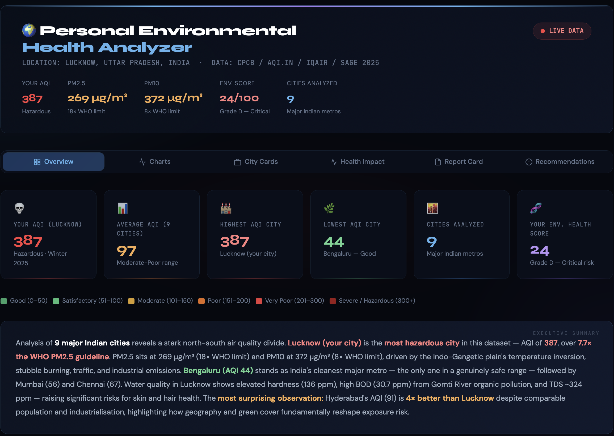
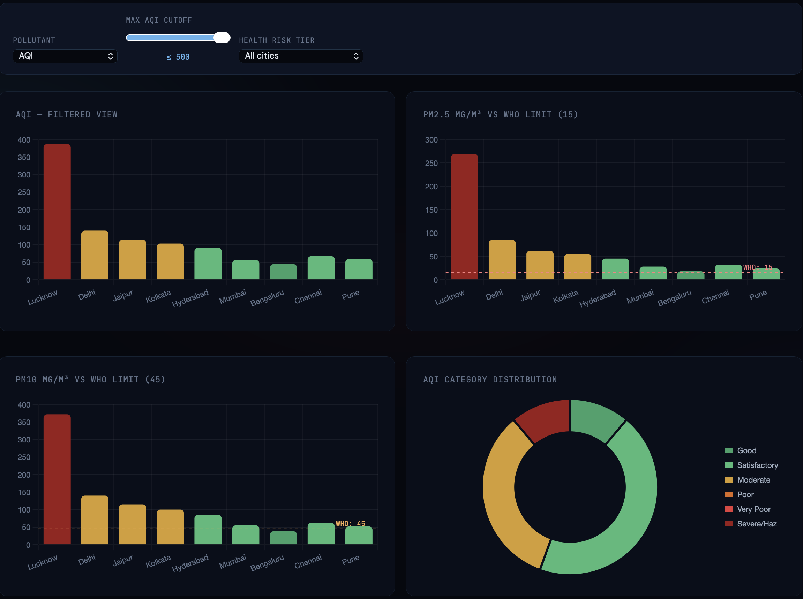
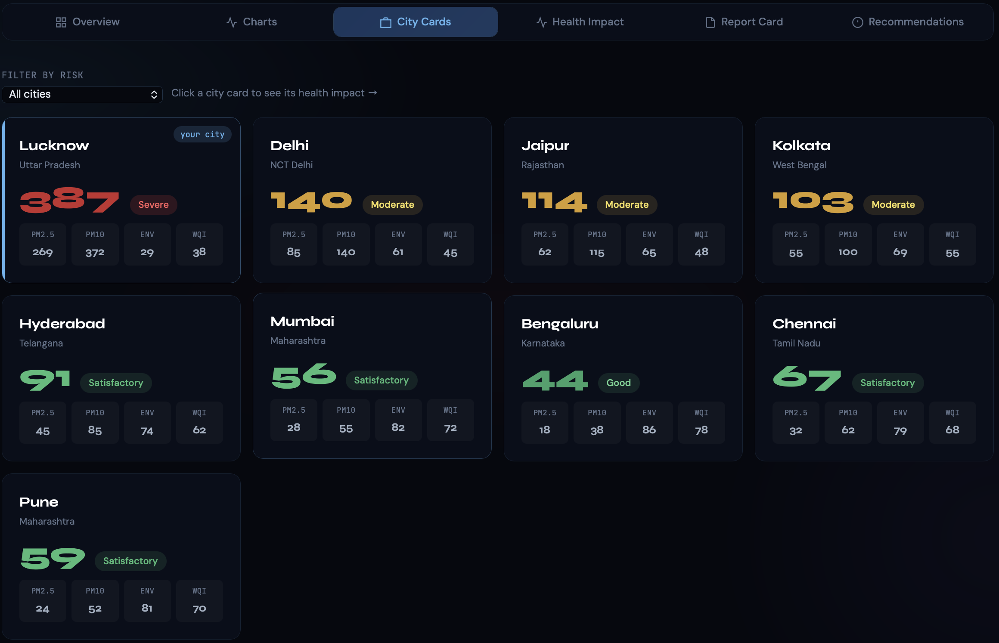
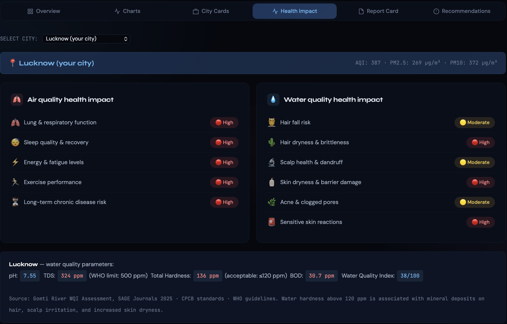
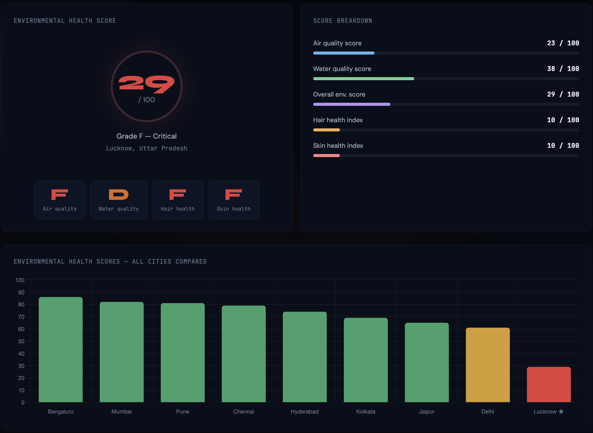
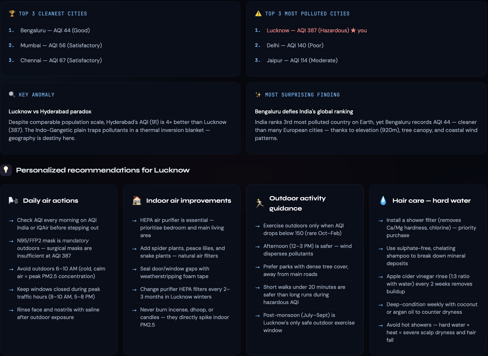

# Day 8: Personal Environmental Health Analyzer

## 📊 Overview
This project presents an interactive **Personal Environmental Health Analyzer** dashboard that evaluates real-time environmental risk metrics across major Indian metropolitan areas, with a highly localized focus on **Lucknow, Uttar Pradesh**. 

The dashboard tracks multi-pollutant air quality parameters (AQI, PM2.5, PM10) alongside critical water quality indices (pH, TDS, Hardness, BOD) to generate an ecosystem-to-biometric health impact matrix.

---

## 🖼️ Dashboard Interface Screenshots

| | |
|---|---|
| **Overview Dashboard**    | **Pollutant Filtered Charts**    |
| **All Cities Metrics**    | **Lucknow Health Impact Matrix**    |
| **Environmental Score Breakdown**    | **Personalized Recommendations**    |

---

## 📈 Key Metrics & Data Analysis

### 1. Air Quality Disparity (The North-South Divide)
* **Lucknow (Your City):** Sits at a critical **AQI of 387 (Hazardous/Severe)**. 
    * **PM2.5:** $269\ \mu\text{g/m}^3$ (An alarming **18×** over the recommended WHO limit).
    * **PM10:** $372\ \mu\text{g/m}^3$ (**8×** over the WHO limit).
    * *Underlying Drivers:* Temperature inversions across the Indo-Gangetic plain, stubble burning, high traffic density, and industrial emissions.
* **Bengaluru:** Stands out as India's cleanest major metro dataset with a **Good AQI of 44**, driven by its higher elevation (920m), extensive tree canopy, and favorable coastal wind patterns.

### 2. The Lucknow-Hyderabad Paradox
* Despite having highly comparable population scales and industrial footprints, **Hyderabad’s AQI (91 - Satisfactory) is 4× better than Lucknow’s**. This underlines how geographic positioning and regional topography fundamentally dictate pollutant dispersion.

### 3. Water Quality Assessment (Lucknow)
* **Water Quality Index (WQI):** 38 / 100
* **TDS:** $324\ \text{ppm}$ (Exceeds ideal thresholds; WHO limit reference: $500\ \text{ppm}$).
* **Total Hardness:** $136\ \text{ppm}$ (Classified as hard water, exceeding the acceptable standard of $\le 120\ \text{ppm}$).
* **BOD (Biochemical Oxygen Demand):** $30.7\ \text{ppm}$, indicating severe organic pollution loads within local aquatic sources like the Gomti River.

---

## 🛑 Health Impacts Identified

### Air Quality Matrix
* **High Risk:** Degradation of lung and respiratory functions, compromised sleep quality/recovery cycles, spike in systemic fatigue levels, and long-term chronic respiratory disease risks.

### Water Quality Matrix
* **High Risk:** Severe skin dryness, epidermal barrier damage, acute sensitive skin reactions, and heightened hair dryness/brittleness.
* **Moderate Risk:** Accelerated hair fall, dandruff formulation, and clogged pores leading to acne.

---

## 💡 Personalized Action Plan for Lucknow

### 🧼 Hair & Skin Care (Hard Water Mitigation)
1. **Shower Filtration:** Install an ion-exchange or carbon shower filter to actively trap $\text{Ca}^{2+}$ and $\text{Mg}^{2+}$ hardness minerals.
2. **Targeted Washing:** Switch to sulfate-free, chelating shampoos to break down mineral buildup on the scalp.
3. **Natural Rinses:** Use an Apple Cider Vinegar (ACV) rinse (1:3 ratio with clean water) every 2 weeks to rebalance scalp pH.

### 🏠 Indoor & Outdoor Environmental Actions
* **Masking:** N95/FFP2 masks are strictly mandatory for any outdoor exposure; standard surgical masks are highly ineffective at an AQI of 387.
* **Air Purification:** Deploy a heavy-duty HEPA air purifier in primary living zones and replace filters every 2–3 months during high-pollution seasons. Avoid burning indoor irritants like incense, dhoop, or candles.
* **Activity Timing:** Restrict outdoor tasks between 6:00 AM – 10:00 AM (peak PM2.5 concentrations). Prefer late afternoons (12:00 PM – 3:00 PM) when atmospheric mixing distributes pollutants more safely.

---

## 🛠️ Key Learnings
* **Comprehensive Risk Mapping:** True personal health metrics must pair internal household metrics with macroscopic atmospheric data.
* **Environmental Inequity:** Regional geography and natural wind pathways often alter air quality far more radically than localized emission controls alone.
* **Biometric Correlation:** Hard water signatures ($>120\ \text{ppm}$) have a direct cascading effect on skin barrier resilience and follicular health.
