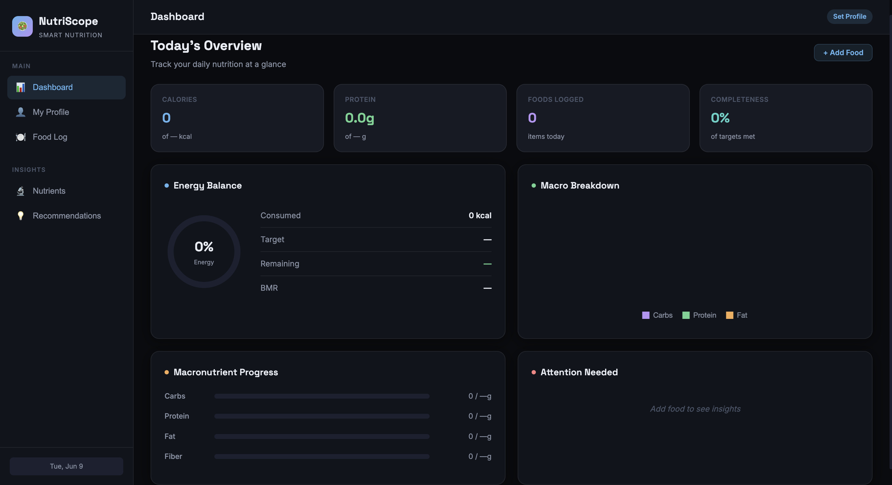
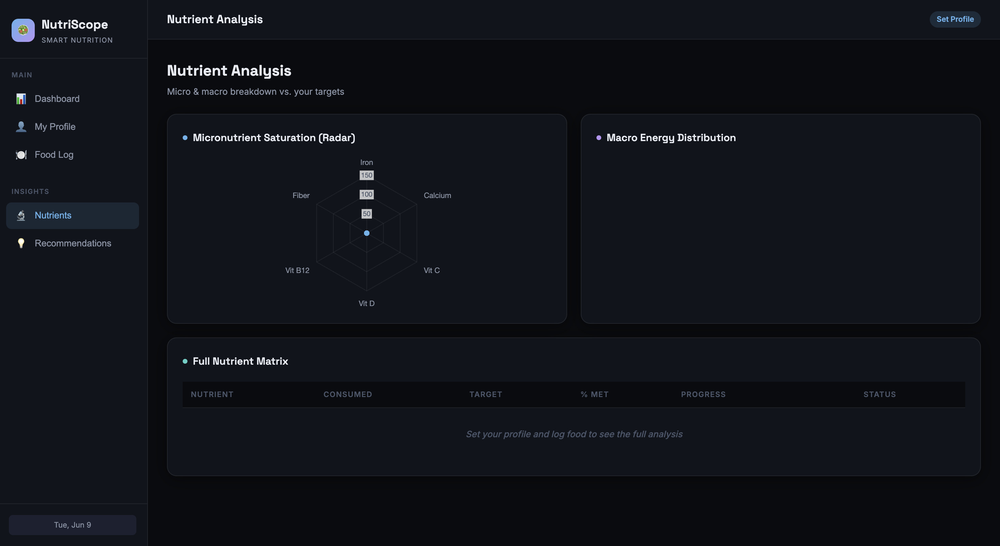
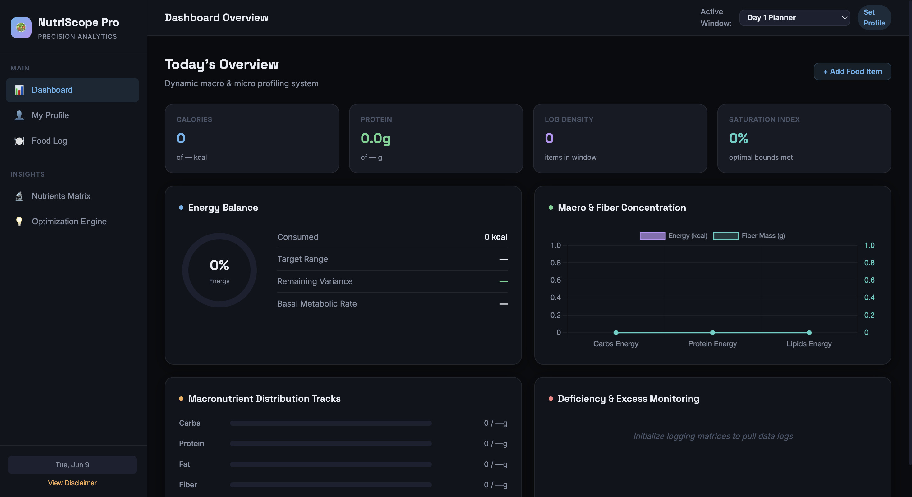
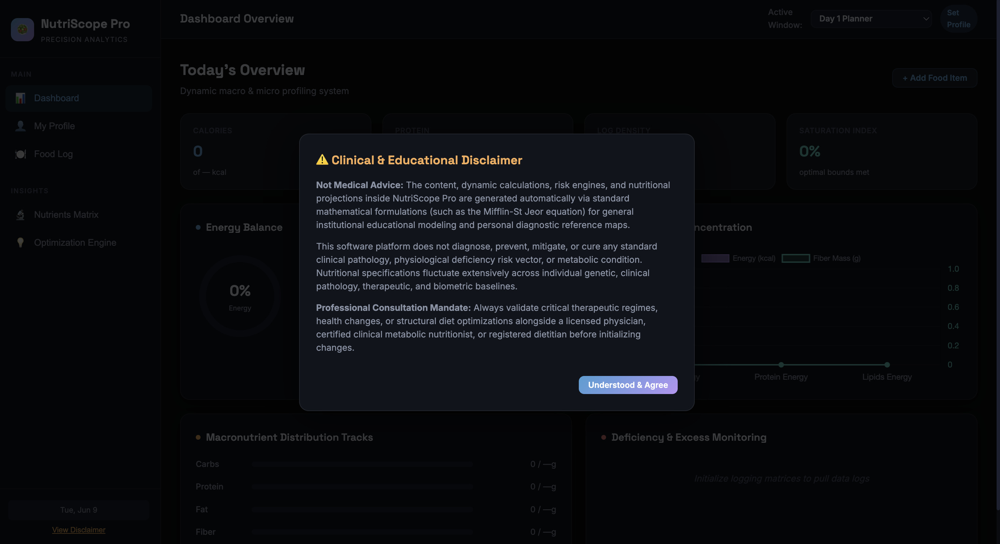
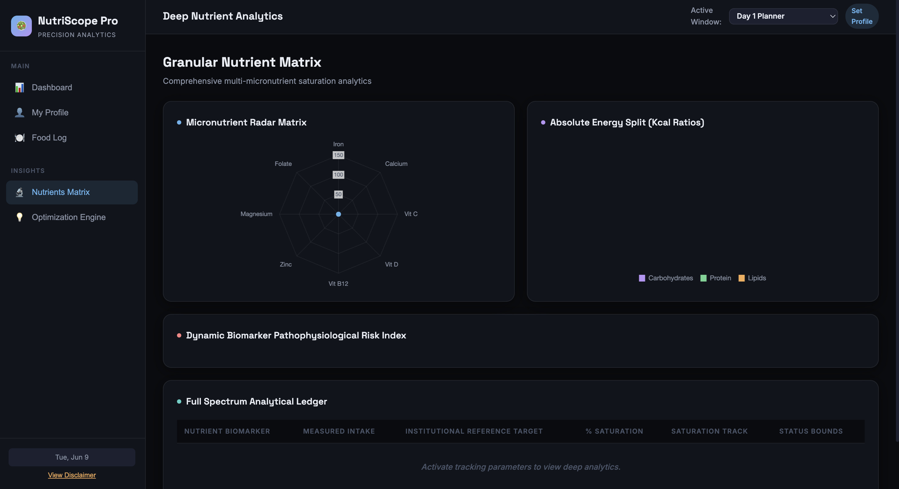

# Day 9 – NutriScope: AI-Powered Nutrition Analytics Dashboard

## Project Overview

Today I explored how AI can progressively enhance an application through iterative prompting.

The goal was to build a nutrition analytics dashboard called **NutriScope** and then improve it using a second prompt to create a more advanced version called **NutriScope Pro**.

This exercise demonstrated how context and prompt refinement can transform a basic MVP into a significantly more sophisticated application.

---

## Resources Used

- Challenge resources provided by ABTalks
- Claude AI
- HTML, CSS, JavaScript
- Browser testing tools

---

## Before vs After Comparison

| Feature | NutriScope (MVP) | NutriScope Pro |
|----------|----------------|----------------|
| Dashboard | Basic nutrition tracking | Advanced analytics dashboard |
| Metrics | Calories, Protein, Macros | Advanced macro & micro profiling |
| Analytics | Standard charts | Deep nutrient analytics |
| Nutrient Tracking | Basic nutrient overview | Full nutrient matrix |
| Insights | Recommendations | Optimization engine |
| Health Analysis | General tracking | Dynamic risk analysis |
| Interface | Simple dashboard | Professional analytics platform |
| Educational Safety | Not included | Clinical disclaimer added |

---

## Key Improvements Observed

### 1. Better Information Architecture
The enhanced version organizes nutrition data into structured analytical modules instead of simple tracking widgets.

### 2. Advanced Nutrient Analytics
NutriScope Pro introduced:

- Micronutrient radar matrix
- Energy distribution analysis
- Deficiency monitoring
- Nutrient saturation tracking

### 3. Professional User Experience
The upgraded interface feels closer to a commercial health analytics platform.

### 4. Context-Aware Enhancements
Claude automatically expanded the scope from a nutrition logger to a nutrition intelligence system.

---

## Screenshots

### MVP Dashboard

### MVP Nutrient Analysis

### Pro Dashboard

### Clinical Disclaimer

### Pro Nutrient Analytics

---

## What I Learned

### Learning #1
Prompt refinement produces significantly better outputs than a single prompt.

### Learning #2
Context allows AI to build upon existing work rather than starting from scratch.

### Learning #3
AI can improve not only code quality but also product design and feature planning.

### Learning #4
Comparing outputs side-by-side helps identify how additional context influences results.

---

## Biggest Observation

The MVP focused on **tracking nutrition data**.

The enhanced version focused on **analyzing and interpreting nutrition data**.

That shift from data collection to data intelligence was the most noticeable improvement.

---

## Conclusion

This exercise showed how iterative prompting can dramatically improve software quality.

Instead of generating a completely new application, Claude used context from the first version to evolve NutriScope into a more advanced analytics platform with deeper insights, stronger structure, and a more professional user experience.

---
